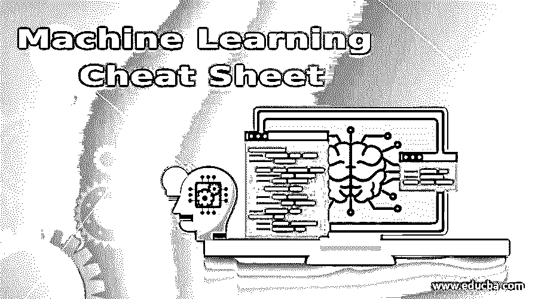

# 机器学习备忘单

> 原文：<https://www.educba.com/machine-learning-cheat-sheet/>

## 机器学习简介备忘单

机器学习是人工智能的艺术。机器学习的主要目的是让 peeps 了解当前的机器学习趋势，并允许他们理解原始数据。随着对原始数据和各种数据结构的更好理解，他们将把这些数据用于机器学习模型，这些模型可以被人和组织利用。

### 什么是机器学习？

在经典计算中，算法是以计算机可以理解和解决问题的方式编写的编程指令的基础。另一方面，机器学习算法使计算机对废弃的可用数据进行训练，并使用它们提供指定范围内的深度统计和分析报告。通过机器学习算法，计算机将倾向于根据它接受训练的数据输入做出自动决策。

<small>Hadoop、数据科学、统计学&其他</small>

在人工智能和机器学习领域有很多创新和增长的现代技术世界中，更多的创新发明主要造福于社会。当前的技术有更有效的人脸识别技术，画外音助手，有效的聊天机器人，推荐引擎，最重大的成就是理解和导航乘客到目的地的自动驾驶汽车。

机器学习是一个快速增长和不断发展的领域。本文将涵盖人工智能行业广泛使用的常见机器学习算法和技术，如(监督和非监督学习、随机森林、k-最近邻和深度学习基础)。我们还将深入研究机器学习中广泛使用的编程语言列表，并探索哪种语言更适合手头的给定任务。

### 机器学习备忘单的重要性

*   机器学习是一种模型构建策略，它将使组织以有效的方式获取信息并做出数据驱动的决策。它是一种建模框架，从非结构化数据中提取原始信息，并提供见解，使组织做出有效的决策。
*   机器学习将在经济中开花结果，因为它可以从数据中导出许多模式，帮助组织预测将要做出的商业决策。
*   许多处理大量信息组织和企业已经进入机器学习领域。这将帮助他们揭示其非结构化数据，并从模型发现中获取知识。通过数据发现，它将帮助组织更有效地工作，并在市场竞争中处于有利地位。

### 机器学习类型和方法

在机器学习中，任务大致分为三种范式。最广泛使用和采用的机器学习方法是监督学习和非监督学习。

#### 监督学习

**1。**在监督学习中，模型根据被标记的训练输入和输出数据来训练算法。这些算法的主要目的是通过将其输出与训练数据进行比较来进行学习。它将发现错误，并相应地用它用来预测标签值的模式更新模型。

**2。**监督学习最常见的情况是使用历史数据来预测未来事件。它使用历史信息来提供对市场信息及其趋势的洞察。监督学习的一个经典例子是找出客户流失率，确定垃圾邮件分类器。

**3。**监督机器学习算法可以分为两大类。它可以分为回归和分类问题。

*   **分类:**可以用这样一种方式来定义，它将解决将标记的类别作为输出变量的问题。一个例子可以是在垃圾邮件和非垃圾邮件之间分类。
*   **回归:**它代表输出变量是连续的。一个合适的例子是预测房子的价格。

**4。**下面列出了最常见的监督算法:

*   决策树
*   朴素贝叶斯分类
*   分类问题的支持向量机
*   分类和回归问题的随机森林
*   回归问题的线性回归
*   普通最小二乘回归
*   逻辑回归
*   集成方法

#### 无监督学习

**1。**在无监督学习中，数据没有标签，因此学习将基于其输入数据中的共同特征。它没有任何特定的标签作为模型的输出。机器学习方法对于无监督算法更有价值。

**2。**无监督算法是对底层结构进行建模，它将使模型学习更多关于数据的信息。

**3。**无监督学习算法中没有正确答案。这些算法被留下来发现和识别数据中重要和有趣的见解。

**4。**无监督学习问题可以进一步分为聚类和关联问题。

*   **聚类:**聚类算法将帮助您发现数据中的分组和结合，一个例子将是客户的网上购物购买行为。
*   **关联:**关联规则是发现新规则的地方，新规则将描述数据的聚集部分。

**5。**列举了一些经典的无监督学习算法:

*   聚类算法:层次聚类，K-均值聚类
*   神经网络
*   深度学习

### 机器学习算法的好处

**1。**机器学习已经涉足许多领域和所有类型的行业，如零售、企业、医疗保健、旅游和酒店、金融服务、能源和公用事业。

**2。**机器学习可以审查大量数据，并发现人类不明显的特定趋势和模式。机器学习算法擅长处理多维度、多品种的数据，它们可以在动态或不确定的环境中做到这一点。

**3。**下面提到的是机器学习用例解决行业问题的领域:

*   **制造**:预测性维护和监控。
*   **零售**:渠道营销。
*   **医疗保健和生命科学:**疾病检测。
*   **旅游和酒店:**趋势和服务定价。
*   **金融服务:**风险分析和欺诈检测。
*   **能源:**能源需求与供给优化。

### 结论-机器学习备忘单

机器学习将对经济和生活产生巨大影响。整个工作任务和行业都可以自动化，就业市场将永远改变。机器学习是下一个将在行业中有更多增长并改善经济的大事情。整个人工工作将自动化，并将由机器学习应用程序接管。如果你想涉足机器学习，这是一个合适的时机，因为国家急需机器学习工程师。由于机器学习和人工智能，我们的未来将在经济和技术上增长。

### 推荐文章

这是一个指导机器学习的小抄。在这里，我们讨论机器学习备忘单的介绍及其不同的类型和方法，以及重要性和好处。您也可以浏览我们推荐的文章，了解更多信息——

1.  [十大数据库类型](https://www.educba.com/types-of-database/)
2.  [带功能的运行数据库](https://www.educba.com/operational-database/)
3.  [NoSQL 数据库的类型|前 7 名](https://www.educba.com/types-of-nosql-databases/)
4.  [AWS 数据库简介](https://www.educba.com/aws-databases/)

