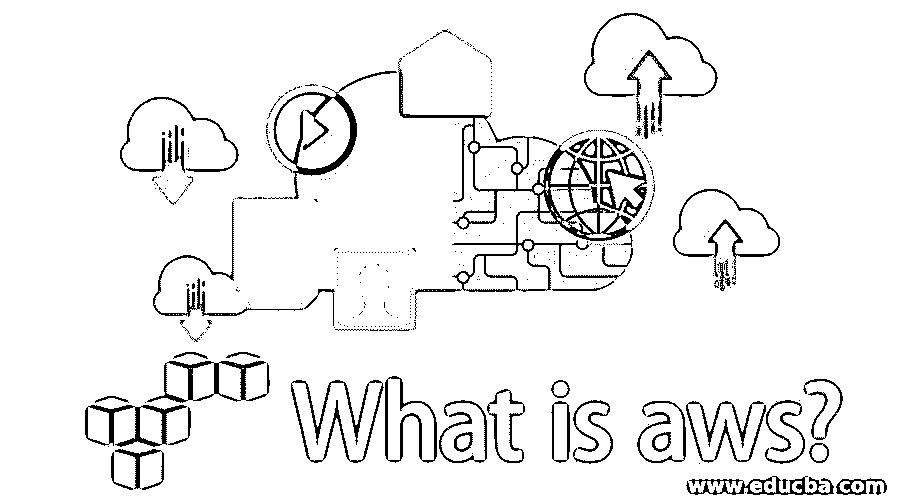

# 什么是 AWS？

> 原文：<https://www.educba.com/what-is-aws/>

## AWS 简介

AWS 或亚马逊网络服务是亚马逊的云平台，提供计算能力、数据库存储、内容交付和基本云平台提供的任何其他功能。它使用不同的数据库(如 SQL、MySQL、Oracle 和 SQL servers)来存储信息，从而帮助企业发展。服务器是出租的，因此亚马逊负责服务器的安全和维护，并帮助企业。它还为其客户提供迁移、联网、开发工具和管理。很多公司都用它，它的收入比其他任何大公司都高。

### 什么是云计算？

云计算是指一种托管在互联网上的服务，你可以使用互联网远程访问该服务。数据存储、服务器或任何计算资源等服务在互联网上的可用性就是云计算。你不亲自管理，更像是租用一种资源。简单地说，云计算是使用远程计算资源来存储、管理和处理数据，而不是本地服务器或个人电脑。

<small>Hadoop、数据科学、统计学&其他</small>

由于云计算的巨大成功，许多人开始尝试亲自动手。

有许多提供云服务的公司，如下所示:

*   谷歌云平台
*   亚马逊网络服务
*   微软 azure
*   数字海洋
*   IBM 云
*   VMWARE
*   Rackspace
*   陆地标记
*   Joyent

### 什么是 AWS？

这是一个亚马逊提供云服务的平台，如数据库、服务器、计算机器、文件存储等。，您可以在那里租赁它们，并根据您的使用情况付费。根据各种消息来源，Amazon Web Services 是一个安全的云服务平台，提供计算能力、数据库存储、内容交付和其他功能来帮助企业扩展和增长。

### AWS 如何让工作变得如此简单？

在过去，如果你想部署一个应用程序，你必须购买一台服务器，而服务器可不是便宜的伙伴。你需要投入大量的资金和时间来建立它。你还需要建立一个基础设施来维护你的服务器。如果它出现故障，那么您需要对其进行故障排除，并且您的业务将在这段时间内停止。

由于网站有不同的流量高峰时间，我们需要购买更多的服务器来扩大或缩小规模。我们必须手动管理一切。但是有了 AWS，就不需要买服务器了；您只需租赁和部署，并为您使用的内容付费。没有更贵的服务器。亚马逊会帮你管理。如果服务器宕机，Amazon 将为您的应用程序生成一个新实例。有了它，你不需要为你的服务器维护一个基础设施；你需要做的就是专注于你的商业目标。

### 顶级 AWS 公司

以下是排名靠前的 AWS 公司:

*   **网飞:**一家在线视频流媒体公司。
*   美国宇航局:航空航天研究机构。
*   **Expedia:** 在线旅游公司。
*   **Slack:** 一个专业的消息平台。
*   **三星:**作为一家移动公司，三星开发的应用程序是使用 AWS 部署的。
*   **诺基亚:**一家移动公司。
*   **Adobe:** 多媒体软件公司。
*   **Airbnb:** 当地住宿的租赁服务。

### AWS 的优势

下面是提到的优点:

*   亚马逊网络服务
*   微软 azure
*   谷歌云平台

### 为什么 AWS 在另外两个之上？

*   AWS 成功的最大因素是，与 Azure 和谷歌云相比，它提供了更多的服务。它继续呈指数级增长，并支持最新的技术。在 AWS 上可以完成的操作范围是巨大的。比另外两个更成熟。亚马逊最大的软肋是成本结构；对于企业来说很困惑。亚马逊支持所有级别的企业(从小到大)。
*   谷歌云和微软 Azure 比 AWS 上市晚，而且它们提供的服务也比 AWS 少。Azure 成功的最大因素之一是 Windows 操作系统被广泛使用。因此，将 Azure 用于基于 Windows 的应用服务器是有意义的。谷歌的成本结构管理得非常好。谷歌云比其他两个更容易上手。

### 你能用 AWS 做什么？

AWS 不是单一的服务；它提供了一系列基于云的产品。

提供的服务列表:

*   计算
*   储存；储备
*   数据库
*   分析学
*   网络和内容交付
*   移动的
*   安全性、身份和合规性
*   移民
*   开发者工具
*   管理工具

#### 1.计算

您可以在计算中部署您的应用程序。Compute 指的是计算能力。

一些流行的计算服务是亚马逊。

*   虚拟机的 EC2。
*   用于自动部署的弹性 Beanstalk。
*   Lambda 在没有服务器的情况下运行函数。
*   弹性负载平衡来平衡请求处理能力。
*   自动缩放，根据实时要求放大或缩小。

#### 2.储存；储备

Amazon 提供文件系统作为服务。借助存储，您可以根据需要存储和访问互联网上的数据。它存储在云计算机上。这使您可以随时随地访问您的文件。存储通常保存应用程序使用的信息。这是作为数据库、仓库、备份的主要组件之一；服务基于某种形式的存储。

一些受欢迎的服务有:

*   简单的存储服务(S3)就像一个文件系统来存储文件，文件夹，文档，图像，歌曲等。
*   EC2 实例的弹性文件系统。
*   低成本长期保存文件的冰川(主要用于档案服务)。

#### 3.数据库

AWS 提供广泛的数据库服务，从关系数据库到 NoSQL 数据库。通过使用数据库迁移服务，我们还可以轻松地将数据迁移到 AWS。

*   关系数据库服务(RDBS)支持常用的数据库，如 MySQL、 [Oracle 数据库](https://www.educba.com/what-is-oracle-database/)、MS SQL Server、PostgreSQL SQL 和 Amazon Aurora。
*   红移相对于 PGSQL 比较接近。
*   Elasticache 支持内存中的缓存服务，如 Memcached 和 Redis。
*   DynamoDB 是一个高度可伸缩的 NoSQL 数据库，具有非常低的延迟。

**注:**请理解数据库和存储的区别。存储是一种基于文件系统的服务，您可以在其中存储可执行文件。但是数据库不能包含可执行文件。

#### 4.分析学

你可以洞察你所拥有的数据。您还可以根据您分析的数据创建可视化效果。

一些服务，如:

*   Athena 用于在 S3 存储桶上运行 SQL 查询。
*   快速洞察业务和数据可视化。
*   粘附以创建提取转换加载(ETL)系统。
*   用于对流式内容进行实时分析的 Kinesis。
*   弹性搜索和云搜索，用于创建托管搜索引擎。

#### 5.网络和内容交付

AWS 上主要的基于网络的服务是[虚拟私有云](https://www.educba.com/virtual-private-cloud/)，它使您能够在隔离的网络中启动资源，direct connect 使您能够建立一个专用连接来连接 AWS，Route 53 使您能够使用高度可扩展的域名系统。对于内容交付，我们使用 CloudFront，这是一种限制服务，允许我们将内容限制在用户附近的位置。因此，我们减少了交付内容的延迟。

#### 6.移动的

允许您开发移动应用程序或帮助开发移动应用程序的一组服务。您可以使用这些服务对用户数据进行分析。

*   用于添加、配置和设计移动应用功能的移动中心。
*   有了设备农场，你可以在数百台设备上测试你的移动应用。
*   Cognito 实现了与移动应用的单点登录集成。
*   移动数据分析的移动分析。

#### 7.安全性、身份和合规性

对于管理权限、访问限制、安全管理、威胁检测，我们可以在这个域中使用不同的服务。

*   身份和访问管理(IAM)允许您创建、管理和授予不同用户不同的访问权限。
*   检查员搜索我们的虚拟机上的漏洞。
*   Web 应用程序防火墙(WAF)可防止常见攻击，如 XSS、SQL 注入等。
*   用于管理加密密钥的密钥管理服务(KMS)。您可以创建和控制用于加密数据的密钥。
*   智能检测威胁以保护 AWS 帐户的守卫职责。

#### 8.移民

您不需要担心在 AWS 上迁移数据。您可以使用 AWS 的迁移服务获取数据或将数据放在 AWS 上。此外，您可以将数据从一个数据库迁移到另一个数据库。

*   数据库迁移服务(DMS)，用于将数据从一个数据库迁移到另一个数据库。
*   用于快速迁移现场服务器的服务器迁移服务(SMS)。
*   雪球可以把你的数据上传到 S3，打包并把硬盘送到 AWS。

#### 9.开发者工具

开发人员工具用于管理软件开发生命周期。您可以使用这些服务集来创建、构建和部署软件应用程序。

*   用于创建、管理和使用软件项目的 Code-Star 服务。
*   Code-Commit 是类似 git 的版本控制软件。
*   代码构建是为了构建你的代码库。
*   自动部署应用程序的代码部署。
*   代码管道允许您专注于应用程序的构建、测试和部署。

#### 10.管理工具

*   Cloud-Watch 可用于监控资源利用率。
*   Cloud-Trail 记录所有对 Amazon web 服务的更改和 API 调用。
*   云形成用于将基础设施转换为云，因此它就像一个模板。您可以在几分钟内创建一个生产就绪环境。
*   值得信赖的顾问会就如何优化成本和保护环境为您提供建议。

### 为什么要用？

使用 AWS 的好处是:

*   灵活性
*   易于使用
*   安全的
*   可靠的
*   性价比高

对云计算的需求是了解任何云提供商的基础。云计算的主要需求是节约成本**。**是的，有了云计算，你可以降低[硬件和软件成本](https://www.educba.com/hardware-vs-software/)。你不需要维护服务器。如果公司发展得更快，服务器的日常问题可能会很繁忙。所有许可证或续订都由云提供商负责。借助云计算，您可以随时随地访问您的数据和服务器。您不需要特别注意保护客户的数据。也会由云提供商来打理；您的数据将永远得到妥善保管。

### 谁是学习这项技术的合适受众？

这纯粹是基于你的背景，AWS 技能有三个特别的角色。

*   AWS Sysops
*   AWS 架构师
*   AWS 开发

如果你是管理出身，你可以选择学习一些技能来成为一名 AWS 系统操作员。这就像管理部署、管道和构建过程一样。您可能需要 IAM、VPC、53 号公路、ELB 等方面的专业知识。如果你有开发背景，你可以拥有一套支持基于 SaaS 的应用程序的技能。你可能需要区块链、人工智能、VR 或 AR、自动缩放、负载平衡等方面的专业知识。对于 AWS 架构师，您需要更多在 AWS 平台上工作的经验。这就像为一个可能需要满足特定需求的应用程序构建一个良好的基础架构。如果你对 AWS 平台有很好的了解，你也可以成为初级云架构师。

### 这项技术将如何帮助你的职业发展？

亚马逊、谷歌、微软、IBM、甲骨文、阿里巴巴等所有科技公司都投身云计算，这并非巧合。他们看到了云服务市场的巨大需求和范围。在未来几年，大多数应用和网站将部署在基于云的服务上，并将使用基于云的服务进行内部运营。如果你从现在开始学习云技术，它将帮助你在职业生涯中更上一层楼。

现在，为什么是 AWS？虽然不同的云提供商之间正在进行一场战争，但亚马逊国王凭借其在公共云领域 47.1%的份额保持领先地位。另一方面，Azure 在企业应用程序中占据主导地位。根据你的要求明智地选择。

### 结论

一切都变成了浮云；我们同步联系人、照片、文档等。，到一朵云。我们不会将电影或视频存储在本地存储器或个人电脑上；我们今天在亚马逊或 YouTube 上播放这些视频。我们已经开始使用云产品，而没有意识到它们。云产品在我们的日常生活中，AWS 帮助我们创建、部署和管理我们的应用程序。如今，大多数公司都开始使用云服务。因此，为了在这条路上保持领先，我们需要获得这些技能。

### 推荐文章

这是什么是 AWS 的指南？在这里，我们与实施这项技术的顶级公司讨论了 AWS 的工作、技能、职业发展和优势。您也可以浏览我们推荐的其他文章，了解更多信息——

1.  [AWS 替代品](https://www.educba.com/aws-alternatives/)
2.  [AWS 中的职业](https://www.educba.com/careers-in-aws/)
3.  [Python 是什么](https://www.educba.com/what-is-python/)
4.  [什么是 Minitab？](https://www.educba.com/what-is-minitab/)

