# AWS 层

> 原文：<https://www.educba.com/aws-lambda-layers/>

## 什么是 AWS Lambda 层？

AWS Lambda layer 允许您编写 Lambda 函数，该函数可以以层的形式提取额外的代码和内容，这些层只不过是包含自定义运行时、库和其他依赖项的 ZIP 存档，您可以在函数中使用这些库，而无需将它们包含在您的部署中，这使得您的部署包更小、更容易，并允许您避免代码中的包配置和安装错误。

### AWS 层

AWS Lambda Partners 为 AWS 客户提供了自己的安全、监控和应用程序管理层。

<small>Hadoop、数据科学、统计学&其他</small>

#### 1.安全层

云安全是 AWS 的重中之重。作为云的安全和云中的安全，这是您和 AWS 之间的共同责任。

*   **云的安全性:** AWS 负责 AWS 服务基础设施，并确保服务得到安全使用。
*   **云中的安全性:**您使用的 AWS 服务决定了您的责任。您负责的因素包括您的数据的敏感性、您公司的要求以及其他适用的法规和法律。

APN 合作伙伴的安全层示例如下:

*   Protego 提供 Protego 功能自我保护(FSP)模块。
*   PureSec 有助于管理和实施无服务器安全最佳实践。
*   Twistlock 通过其 Defender 层提供安全控制。

#### 2.监控层

AWS Lambda 自动监控所有的 Lambda 函数，指标通过 CloudWatch 报告。Lambda 自动跟踪请求数量、导致错误的请求数量以及每个请求的执行持续时间。AWS Lambda 控制台、CloudWatch 控制台和其他 AWS 资源显示 Lambda 函数的请求率和错误率。

APN 合作伙伴的监控层示例如下:

*   Datadog 为 Python 提供了一个工具层
*   Epsagon 提供了一个支持 Epsagon 分布式追踪的层。
*   IOpipe 提供可配置的多维警报。
*   NodeSource 为 Node.js 提供了低影响的监控。

#### 3.应用管理层

AWS 控制台帮助您监控和管理 Lambda 应用程序。AWS CloudFormation 堆栈与 Lambda 函数一起列在应用程序菜单中。

将显示关于您的应用程序的以下信息:

*   **SAM 模板或 AWS CLoudFormation 模板:**它是定义您的应用程序的模板。
*   **资源:**应用程序模板中定义的 AWS 资源。从列表中选择一个函数名来管理应用程序的 Lambda 函数。

APN 合作伙伴的应用管理层示例如下:

*   无服务器框架允许开发者部署无服务器应用。
*   Stackery 向您显示帐户中可应用于您的功能的所有层的列表。

### AWS Lambda 运行时 API 合作伙伴

使用 Lambda 运行时 API 创建或更新函数时，可以选择一个自定义运行时。您可以发布自己的运行时，也可以使用他人提供的运行时。

为新运行时提供支持的 APN 合作伙伴包括:

*   警报逻辑为 Erlang 提供了运行时库。
*   BluAge 为提供支持。
*   Stackery 提供了一个 PHP 运行时层。

### 配置

在功能创建期间或之后，您最多可以向功能配置添加 5 层。图层版本可在函数配置中指定并可更新。

#### 1.向函数添加层

*   **命令:**

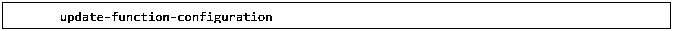

*   **例子**

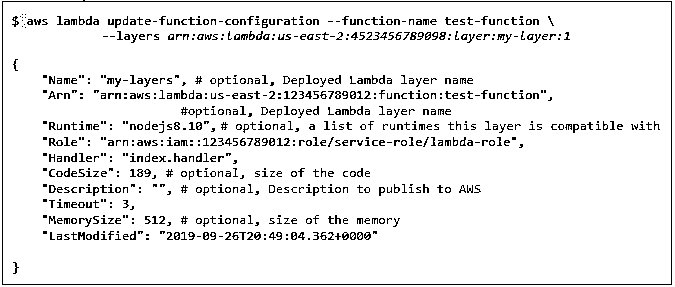

*   通过指定路径，可以从与函数相同的帐户或不同的帐户添加多个图层。
*   通过提供图层版本的完整 ARN，可以指定每个图层的版本。
*   向同一功能添加新层时，以前的层将被覆盖。
*   指定一个空列表来删除所有层。

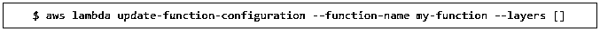

*   函数将在/opt 中执行期间访问层。
*   如果同一文件出现在多个层中，则使用最后应用的层中的版本。
*   如果其创建者删除了一个层，则只要该层的版本存在，该函数就会继续运行。

#### 2.层的创建

*   **命令:**

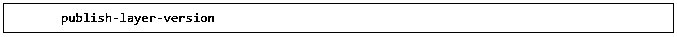

*   除了命令之外，还会使用名称、描述、ZIP 存档和与图层兼容的可选运行时列表。
*   **例子**

*   每次调用发布层版本时，都会创建一个新版本。
*   查找与函数运行时兼容的层的命令是:

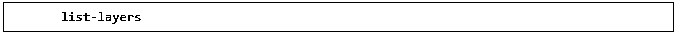

*   查看层的所有版本的命令是:

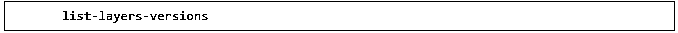

*   获取版本更多详细信息的命令是:

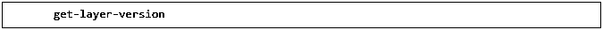

*   删除图层版本的命令是:

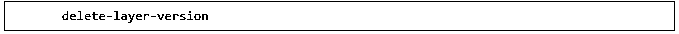

*   一旦删除了图层版本，就无法将函数配置为使用图层版本。

#### 3.在层中包含库

将库放在运行时支持的文件夹中，以将它们包含在图层中。

*   **Java:**

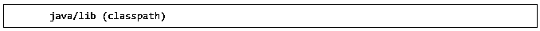

*   **Python:**

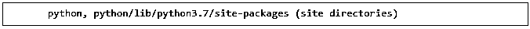

*   **红宝石:**

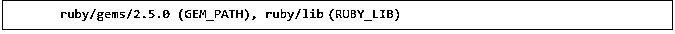

*   **全部:**

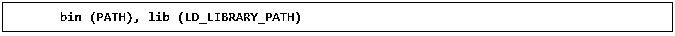

#### 4.层权限

*   要在图层中配置功能或在另一个帐户中使用图层，需要所有者的用户策略权限。
*   添加此类权限的命令是:

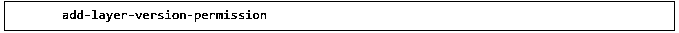

*   权限适用于单个版本的层。
*   每次创建新的图层版本时都应授予权限。

### 结论

AWS Lambda 为短期运行、无状态计算、事件驱动的应用程序提供了一个云原生平台。AWS Lambda 层使您的部署包保持较小，并使开发更容易。此外，它还有助于构建基于规则的自我管理基础架构，减少错误和时间消耗。

### 推荐文章

这是 AWS Lambda 层的指南。这里我们讨论 AWS lambda 的不同层，包括安全层、监控层和应用管理层及其配置。您也可以阅读以下文章，了解更多信息——

1.  [什么是 AWS 红移？](https://www.educba.com/what-is-aws-redshift/)
2.  [AWS Kinesis](https://www.educba.com/aws-kinesis/)
3.  [AWS 服务](https://www.educba.com/aws-services/)
4.  [什么是 AWS CloudFront](https://www.educba.com/what-is-aws-cloudfront/)

