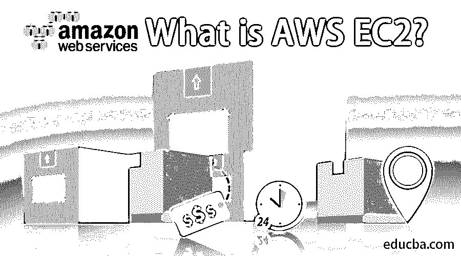
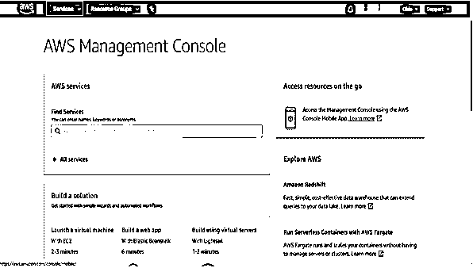
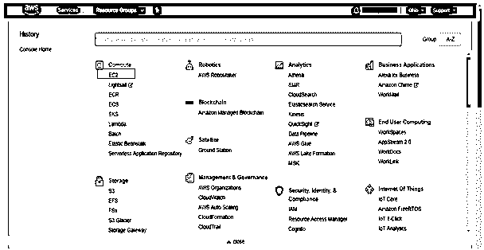
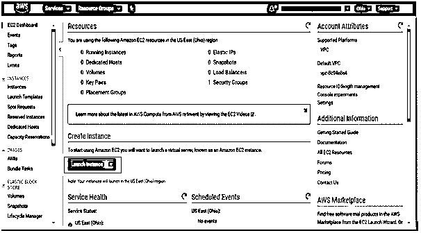
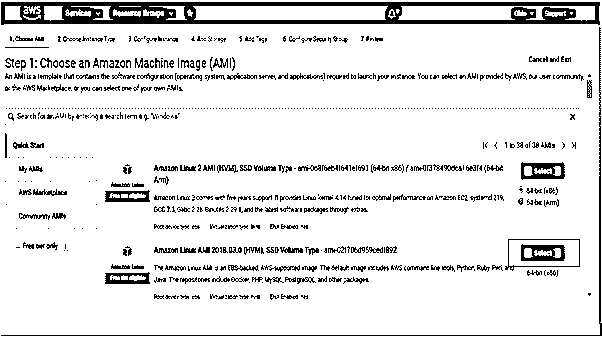
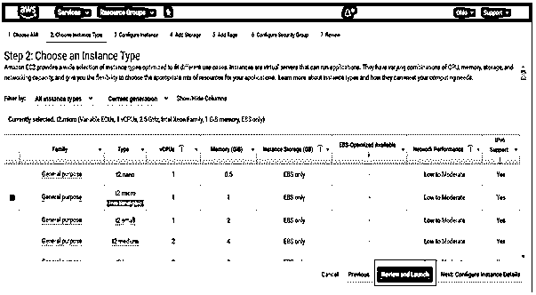
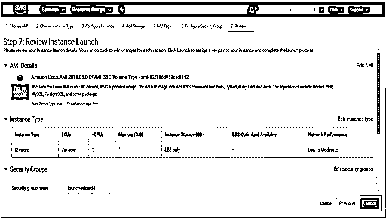
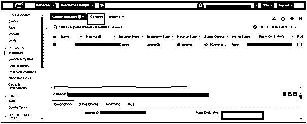

# 什么是 AWS EC2？

> 原文：<https://www.educba.com/what-is-aws-ec2/>

## AWS EC2 介绍？

AWS EC2 或 elastic compute cloud 是 Amazon web services 的主要产品，可用于在云上创建具有多种操作系统和配置选项的虚拟机。EC2 实例易于设置和提供使用。此外，AWS EC2 是安全的和可伸缩的。基于业务需求和成本计划，AWS 支持各种类型的 EC2 实例。AWS 帐户用户可以完全控制启动、访问、停止或耗尽 EC2 实例。EC2 实例与 IP 相关联，以便远程访问 EC2 实例；该 IP 被称为弹性 IP 地址。此外，AWS EC2 还与 EBS 等存储选项相关联，用于卷数据存储。

### AWS EC2 如何让工作变得如此简单？

Amazon EC2 包含几个机制来使它的 web 服务更加用户友好。下面介绍一些主要的机制。

<small>Hadoop、数据科学、统计学&其他</small>

#### 1.英国文学学士（bachelor of english literature）

ELB，也称为弹性负载均衡，自动将收到的应用流量分配给几个 Amazon EC2 实例。为了在用户应用中获得更高的容错能力，ELB 提供了所需的负载平衡能力。如果存在任何不健康的实例，ELB 会将流量定向到健康的实例，直到这些不健康的实例得到修复。为了应用程序的可靠性能，通常在一个或多个可用区域中启用 ELB。

#### 2.弹性 IP 地址

弹性互联网协议地址是用于动态云计算的静态地址。这些地址与用户帐户相关联，而不是与特定实例相关联。控制这些地址，直到用户释放他/她的帐户。可以将 EIP 重新映射到用户帐户中的实例，这有助于屏蔽可用区域中的故障。如果实例或实例中的软件出现任何故障，EC2 会立即将 EIP 重新映射到替换实例，而无需等待 DNS 向所有用户广播，也无需等待技术人员替换或重新配置您的主机。

#### 3.亚马逊弹性街区商店(EBS)

EBS 为持久的实例提供存储。EBS 卷链接到网络，而不是依赖于实例的生命周期。它具有高度的可靠性和可用性。它可以用作引导分区，也可以作为普通的块设备附加到正在运行的实例。在定价的情况下，用户只需为保持实例状态所消耗的资源付费。

### AWS EC2 如何入门？

1.在 Amazon Web 上设置帐户

2.使用您的凭证登录 AWS 控制台，并从顶部选择**服务**

3.从服务中选择 EC2。

4.从仪表板中，单击启动实例

**

** 

5。选择一个 AMI

Amazon 机器映像，也称为 AMI，充当实例的模板。从页面上可用的 AMI 列表中，选择 Amazon Linux AMI。

6.在“选择实例”页面中，

选择免费提供的实例。

在这里，您可以选择 t2.micro 实例并选择 Review and Launch **。**

7 .**。**在审核实例启动中单击启动

8.从下拉框中选择创建新的密钥对。为密钥提供一个新名称，然后选择下载密钥。确保密钥已下载并保存

9.将显示一个页面，确认您的实例正在启动。选择查看实例以关闭页面并返回控制台。

### 如何访问 AWS EC2？

可以通过连接上面创建的实例来访问 EC2。要连接实例，请执行以下步骤。

1.选择创建的实例并单击 connect。

2.将出现一个显示 3 个选项的对话框。直接从我的浏览器中选择一个 Java SSH 客户端。确保您的计算机上安装了 Java。

3.选择保存的路径

4.选择**启动 SSH 客户端**。

5.如果您想要终止实例，从

### 为什么我们需要 AWS EC2？

除了其他服务，Amazon EC2 web 服务确保了 Amazon Web Services (AWS)云中的可伸缩计算。它消除了用户投资硬件的需要，使他们可以更快地开发和部署他们的应用程序。还提供了故障恢复工具，以便在常见故障场景中保持安全。使用 AWS EC2 的一些主要原因将在主题 AWS EC2 的功能中讨论。

### AWS EC2 的功能

以下是 EC2 的一些无声功能列表——

*   **可扩展计算:** Amazon EC2 提供可扩展计算，实例的数量可以在几秒钟内增加或减少。使用自动伸缩技术可以同时伸缩多个服务。
*   **可靠:** Amazon EC2 同意一个高度可靠的环境，在这个环境中，实例的快速替换是
*   **完全控制:**与普通机器类似，用户在虚拟机中对 root 拥有完全的控制权。通过将数据保存在引导分区中，可以使用 API 停止和重启实例。此外，用户可以访问实例的控制台输出。
*   **易于启动:**通过使用 AWS 管理控制台、AWS SDKs 或 AWS 命令行工具(CLI)，可以轻松启动 AWS EC2。
*   **专为 AWS 设计:**亚马逊 EC2 与不同的亚马逊服务如 S3、RDS、DynamoDB 和 [SQS](https://www.educba.com/amazon-sqs/) 配合良好。
*   **安全:**亚马逊 EC2 与亚马逊虚拟私有云合作，为计算资源提供安全的网络。用户可以选择自己的 IP 地址范围、路由器，并根据自己的需要创建子网。这是因为用户完全通过[亚马逊 VPC](https://www.educba.com/what-is-amazon-vpc/) 控制他们的虚拟环境。
*   **灵活** **工具:**亚马逊 EC2 提供不同的操作系统，不同操作系统的软件，不同配置的软件。
*   **便宜:**亚马逊 EC2 遵循“按使用付费”的方法，用户必须为他们选择的资源付费，没有任何隐藏或突然的费用。

### 亚马逊 EC2 提供了哪些好处？

用户为上面提到的突出特点找到了足够的理由。尽管如此，EC2 还提供了更多的好处。下面讨论了一些问题。

*   与其他服务不同，EC2 一开始并不复杂，因为它非常简单快捷。首先，用户可以访问 AMIs 内的市场，并选择所有预配置的软件。这可以通过选择启动或通过控制台来完成。
*   根据可用性区域，EC2 实例可以放在不同的位置。当其中一个区域发生故障时，此功能会更有帮助。此时，应用程序可以通过在其他应用程序中启动实例来得到保护。
*   如果用户试图为应用程序和每个应用程序中的存储密度寻找高顺序 I/O，那么极高存储的实例可以帮助他/她。
*   高 I/O 实例有助于需要使用低延迟对数据进行随机和高访问的用户。这些更适用于运行 NoSQL 和关系数据库的用户。
*   Amazon EC2 设计了高性能的计算集群，以提供相对增加的吞吐量，并执行某些网络相关的操作。

### 结论

本文提供了 Amazon EC2 的快速指南，涵盖了什么是 Amazon EC2，如何创建一个实例及其关键特性。众所周知，实践经验胜于理论知识。因此，为了更好地理解，请尝试浏览内容并执行提到的步骤。

### 推荐文章

这是什么是 AWS EC2 的指南。在这里，我们将介绍什么是 AWS EC2，它的需求、功能、工作优势以及如何访问它？。您也可以浏览我们推荐的其他文章，了解更多信息——

1.  [数据科学工具](https://www.educba.com/data-science-tools/)
2.  [什么是 AWS CloudFront](https://www.educba.com/what-is-aws-cloudfront/)
3.  [AWS 架构](https://www.educba.com/aws-architecture/)
4.  [AWS 服务](https://www.educba.com/aws-services/)
5.  [AWS 存储服务](https://www.educba.com/aws-storage-services/)
6.  [Mac 与 IP 地址的 12 大对比](https://www.educba.com/mac-vs-ip-addresses/)
7.  [什么是私有云？|五大优势](https://www.educba.com/what-is-private-cloud/)
8.  [虚拟私有云|如何创建？|福利](https://www.educba.com/virtual-private-cloud/)

