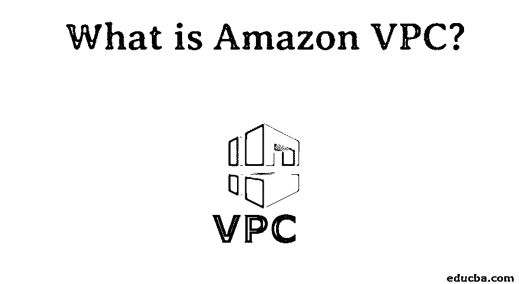
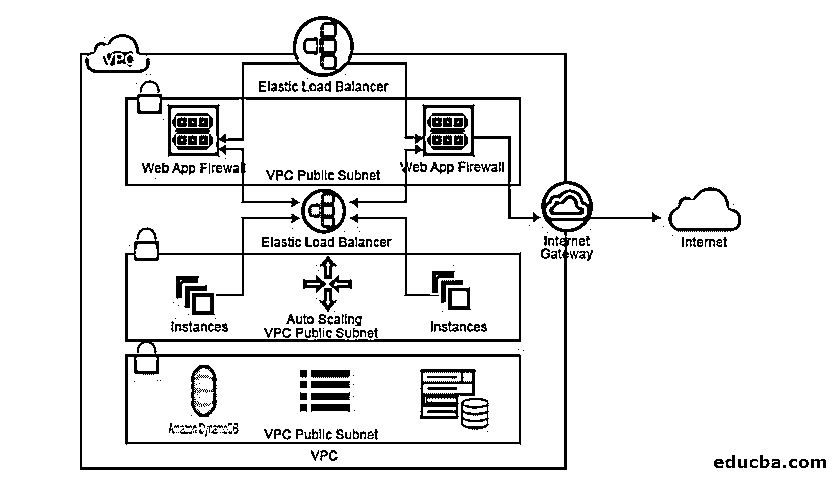
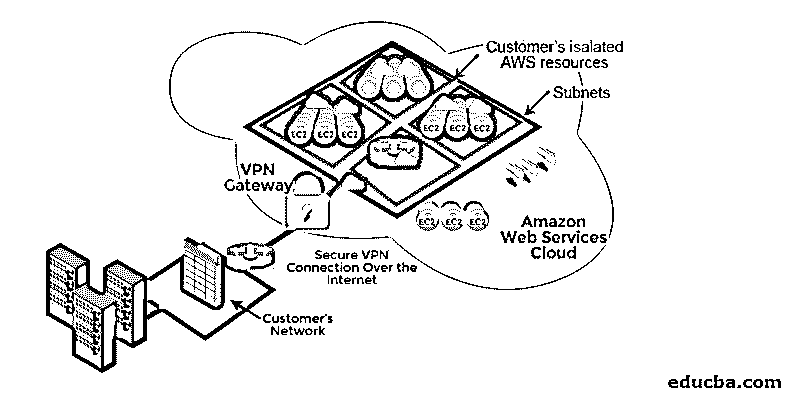

# 什么是亚马逊 VPC？

> 原文：<https://www.educba.com/what-is-amazon-vpc/>

## AWS 虚拟私有云(VPC)

以下文章概述了什么是亚马逊 VPC？Amazon 虚拟私有云允许您将 AWS 资源启动到预定义的虚拟网络中。它提供商业[云计算服务](https://www.educba.com/cloud-computing-services/)，用户可以通过基于 IP 的虚拟网络访问亚马逊弹性计算云。其主要特点是用户可以选择自己唯一的 IP 地址范围、子网、网络路径配置和路由电缆。它旨在通过为具有互联网连接的 web 服务器提供一个公共子网，并使您的后端数据库或应用程序服务器处于没有互联网连接的私有子网中，从而提供更细粒度的安全性。

<small>Hadoop、数据科学、统计学&其他</small>

### 亚马逊 VPC 入门

在开始任务之前，使用 amazon 凭据登录或创建一个免费的 AWS 帐户。用户可以通过 IPv4 或 IPv6 两种方式连接到亚马逊 VPC。

从亚马逊 VPC 开始有五个主要步骤:

*   创造 VPC
*   创建您的安全组
*   将一个实例启动到您创建的 VPC 中
*   为您创建的实例分配一个弹性 IP 地址
*   打扫

#### 1.创建虚拟私有云

使用亚马逊 VPC 控制台中的亚马逊 VPC 向导创建 VPC。然后创建一个带有/16 IPv4 CIDR 地址块的 VPC。它是一个拥有 65，536 个私有 IP 地址的网络，并将一个互联网网关连接到创建的 VPC。创建一个大小在 256 个私有 IP 地址范围内的子网。自定义您的路由表，并将其分配给子网，以控制子网和互联网网关之间的流量

要查看您的 VPC 的任何信息，请遵循以下步骤:

*   登录亚马逊 VPC 控制台。
*   在导航面板的 VPCs 列中，记下您的 VPC 姓名和 VPC ID。
*   在导航面板中，选择子网；它显示创建的名称和日期以及它所属的 VPC。Internet Gateways 栏帮助您提供它连接到子网的方式。
*   路由表在导航面板中标识，但您可以在其中找到两行。
*   路由表中的第一行是默认的本地路由方式，不能更改，它允许实例与 VPC 通信。
*   第二行显示了子网到互联网网关之间的路由。这里连接了亚马逊 VPC 向导，以确保流量流向 VPC 以外的 IP 地址。

#### 2.创建安全组

您的 VPC 带有默认的安全组，但是您可以根据实例的行为添加或删除一些规则集。要控制传入流量，请添加实例的入站规则和出站流量，并添加出站规则。安全组充当虚拟防火墙，控制相关实例之间的流量。

一组规则:

**创建 WebserverSG 安全组:**

*   登录你的亚马逊 VPC 控制台。
*   在导航面板中，选择安全组，然后选择创建安全组。
*   在“组名”字段中，提供 webserverSG 的名称和描述。
*   在“入站规则”选项卡上，进行如下编辑。
*   从类型列表中选择 HTTP。在源字段中，输入 0.0.0.0/0。
*   要添加另一个规则，在 source 字段中重复相同的操作，如果是 Linux，则选择 SSH 如果是 Windows 服务器，则选择 RDP。
*   另一个要点是，在生产环境中，对所有 IP 地址使用相同的 0.0.0.0/0 来控制实例是不安全的。它只适用于较小的练习。
*   点击保存。

#### 3.将实例启动到您的 VPC 中

*   登录您的 Amazon EC2 控制台。
*   从仪表板中，启动实例。基于你的服务器，你可以选择亚马逊 Linux AMI 或者亚马逊 Windows AMI。
*   您可以在“选择实例类型”页面上选择默认选项。
*   要配置实例详细信息，请选择网络和子网列表。
*   在 configure security 组中选择 WebServerSG，然后继续查看并启动。
*   选择现有的密钥对或创建新的密钥对。然后下载文件并保存在一个安全的位置。
*   在选择启动实例之前，请检查实例的详细信息和描述。

#### 4.为实例分配弹性 IP 地址

*   登录亚马逊 VPC 控制台。
*   在导航面板中选择弹性 IP。
*   选择分配新地址，然后选择分配。
*   从列表中选择一个 IP 地址，选择操作，然后选择关联地址。
*   在资源类型中，从实例列表中选择实例，然后单击关联。

#### 5.打扫

在导航窗格中，选择您的 VPC，选择操作并删除 VPC。

### 亚马逊 VPC 的特色

以下是亚马逊 VPC 的功能:

*   根据您的可靠性，在 IPv4 或 IPV6 中创建您的[版本。](https://www.educba.com/ipv4-vs-ipv6/)
*   将您的 VPC 连接到其他 SAAS 或您的现场 IT 基础架构。
*   启用 VPC 安全组和 VPC 流来记录有关流量的信息。
*   提供服务包括 DynamoDB、S3、EC2 系统管理器、服务目录、ELB API、EC2 API 和亚马逊 SNS 通过定期备份在灾难恢复中发挥重要作用。它有多个连接动作。

### 亚马逊 VPC 的优势

下面是提到的优点:

*   通过根据您的需求增减资源来提供持续的可伸缩性和可靠性。
*   更高级别的托管服务。
*   它提供高级安全选项，并通过入站和出站过滤、安全组和网络访问控制列表来安全地存储您的数据。
*   你可以为你使用的东西付费。因此它只需要最低的运行成本。
*   简单易用。

### 用例

具有单一公共子网的 VPC。它用于运行一个简单的流程。

*   **具有公共和私有子网的 VPC:**它创建了运行在面向公众的网页中的 VPC，但是在后端，它不能被公开访问
*   **具有公共和私有子网以及 AWS 站点到站点 VPN 访问的 VPC:**通过创建 VPC，它可用于扩展和提供对您的数据中心的直接互联网访问。
*   **仅支持私有子网和 AWS 站点到站点 VPN 访问的 VPC:**通过创建 VPC，它可用于扩展数据中心和利用亚马逊基础设施，而不会将您的网络暴露给互联网网关。

它经济实惠、可靠，并为我们提供了内置的安全系统。您可以根据业务需求轻松定制您的配置。它与大交换网络、蓝色六角形、Corelight、Extrahop、费德利斯、火眼、Flowmon 等公司合作。

### 推荐文章

这是一个什么是亚马逊 VPC 指南？在这里，我们讨论如何开始使用亚马逊 VPC，以及特性、优势和用例。您也可以阅读以下文章，了解更多信息——

1.  [微软 Azure vs 亚马逊网络服务](https://www.educba.com/microsoft-azure-vs-amazon-web-services/)
2.  [什么是 Azure？](https://www.educba.com/what-is-azure/)
3.  [AWS 架构](https://www.educba.com/aws-architecture/)
4.  [Mac 与 IP 地址](https://www.educba.com/mac-vs-ip-addresses/)

