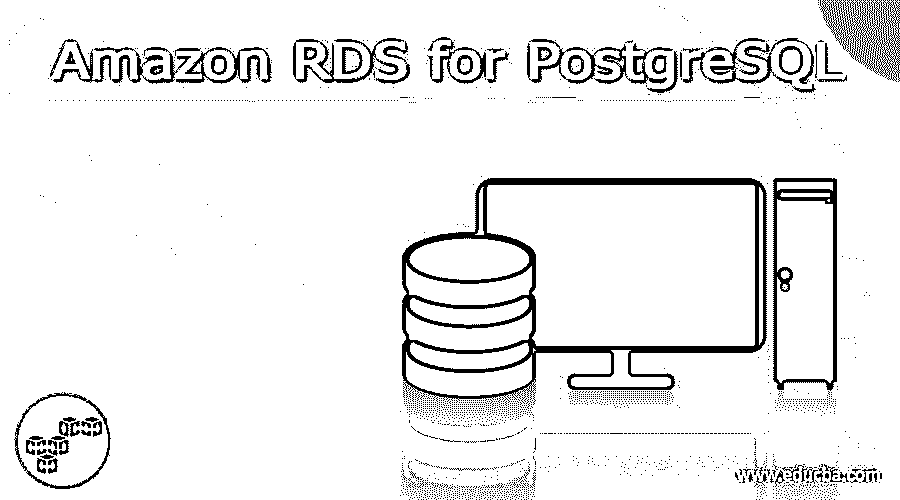
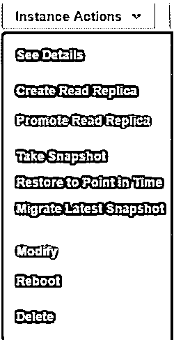
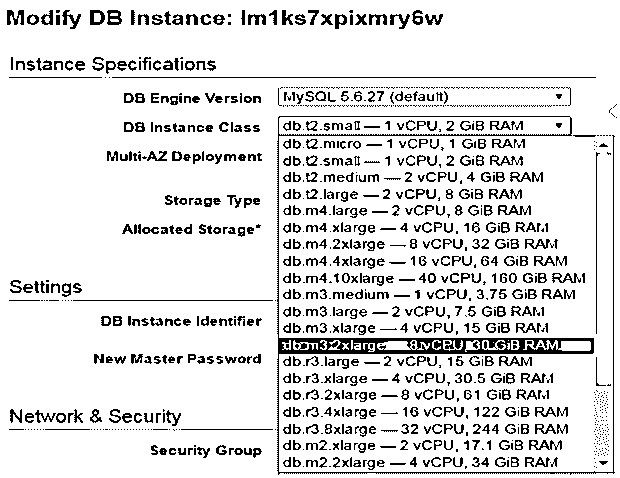

# 亚马逊 RDS for PostgreSQL

> 原文：<https://www.educba.com/amazon-rds-for-postgresql/>

## PostgreSQL 的 Amazon RDS 简介

Amazon RDS for PostgreSQL 使用 Amazon RDS 在云服务器上运行、设置环境和扩展 PostgreSQL 部署。

### 什么是亚马逊 RDS for PostgreSQL？

该流程中涉及的完整管理任务由 Amazon RDS 管理和处理，通常非常耗时且本质上非常复杂。这些任务涉及存储管理、软件包和资源的升级、必要软件的安装、读取吞吐量应该很高，为了实现高可用性，需要提供复制，并且在灾难或不可避免的情况下，如果任何数据损坏，应该从 Amazon RDS 管理的备份中恢复。

<small>Hadoop、数据科学、统计学&其他</small>

### 为什么选择 PostgreSQL？

PostgreSQL 是在很大程度上使用的关系数据库，并且正在成为开发人员中最受欢迎的数据库之一，可以在各种小型和企业应用程序以及初创企业中使用。PostgreSQL 数据库用于移动应用程序、独立软件和其他 web 应用程序。

PostgreSQL 是一个对象关系数据库，完全开源，功能强大，拥有 30 年的总体经验。它非常健壮、可靠，并且具有高性能。想了解更多关于 PostgreSQL 的信息，可以参考这个官方链接。

### 为什么选择亚马逊 RDS？

Amazon RDS 代表 Amazon 关系数据库服务，用于在云中扩展和操作关系数据库，还可以通过最少的任务和几次点击来管理其设置。作为开发人员，我们可以专注于业务逻辑和我们的应用程序，而不必担心我们将在应用程序中使用的数据库所需的性能、可用性、兼容性和安全性。

Amazon RDS 提供现成的功能，例如管理任务(如备份和修补)的自动化、硬件组件的供应、与数据库相关的设置(所有这些通常需要大量时间)、可调整大小和价格合理的容量。该工具可用于流行的数据库，包括 Amazon Aurora、MySQL、PostgreSQL、Oracle 数据库、MariaDB 和 SQL server。将数据迁移到 amazon RDS 非常容易。

我们如何纵向和横向扩展您的 RDS 实例–

随着应用程序的增长以及与之相关的用户数量的增加，需要更多的内存空间来存储数据库中的数据。增加数据库大小的过程称为扩展。在 Amazon RDS 中，我们可以水平或垂直扩展数据库，这完全取决于我们的应用程序。如果执行读写请求和操作的次数大致相等，那么我们就垂直扩展我们的数据库。如果在您的数据库中执行的大多数操作都是从数据库到应用程序高度读取数据，那么我们更喜欢随着需求的增加而水平扩展数据库，以应对这种需要。

垂直缩放–

当您存储数据的需求快速增长时，我们可以垂直扩展我们的主数据库，只需按下一个按钮即可完成。现在，当您尝试在 PostgreSQL 中扩展应用程序时，有超过 18 种可用的大小实例可供选择。提供这些选项只是为了让您可以选择最适合您的数据库成本以及数据库资源和容量的实例。如果对数据库的读写请求数量大致相等，将选择垂直缩放。

### 先决条件

在纵向或横向扩展 RDS 实例时，我们应该注意的先决条件如下所列

您应该确保您有一个商业引擎，如 Oracle、SQL Server、PostgreSQL 以及正确的许可。即使你的驾照被称为“自带驾照”，也被称为“BYOL”。在商业引擎的情况下，你的许可证是捆绑到核心或 CPU 插座。

您必须从两个可用选项中决定您希望应用缩放比例更改的时间。第一个是立即应用所有的更改，而第二个是在指定的维护窗口内应用实例的更改。

您必须记住，实例类型和存储完全不同。因此，在扩大数据库实例的同时，存储空间仍然保持不变。因此，您需要修改分配给数据库的存储空间，或者更改存储类型以提高应用程序的性能。

请注意，在执行缩放操作时，您的单 A-Z 数据库实例将不可用。这是因为在多 A-Z 环境中，扩展过程的停机时间最短。

### 流程概述

垂直扩展 Amazon RDS 的过程包括以下步骤

*   更改实例类型

您必须打开 RDS 控制台上提供的实例操作菜单，并从下拉列表中选择修改选项，如下图所示

*   下一步是选择新的 DB 实例类。您可以修改现有的数据库实例，如下图所示

最后一步是决定变化需要发生的时间。如果您想要立即缩放，那么您可以选择其底部提供的修改页面上的立即应用复选框。如果未选中此复选框，则根据您的规范和定义，在首选维护窗口进行更改或缩放。

### 结论

我们可以利用 Amazon RDS for PostgreSQL 来执行所有管理任务，只需点击几下鼠标，因为其余的一切都由 Amazon RDS 管理，我们可以更专注于我们的应用程序。我们还可以根据您的应用需求扩大或缩小我们的数据库，以满足不断增长的需求。

### 推荐文章

这是亚马逊 RDS for PostgreSQL 的指南。这里我们讨论一下入门，什么是 Amazon RDS for PostgreSQL，为什么分别是 PostgreSQL。您也可以看看以下文章，了解更多信息–

1.  [亚马逊 SQS](https://www.educba.com/amazon-sqs/)
2.  [亚马逊替代品](https://www.educba.com/amazon-alternatives/)
3.  [亚马逊 53 号公路](https://www.educba.com/amazon-route-53/)
4.  [亚马逊 EBS](https://www.educba.com/amazon-ebs/)

