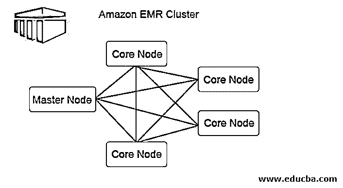

# AWS EMR

> 原文：<https://www.educba.com/aws-emr/>

## AWS EMR 简介

以下文章提供了 AWS EMR 的概要。亚马逊 EMR 是一个大数据平台，目前在云原生大数据平台中处于领先地位，其功能包括快速、经济高效地处理大量数据，所有这些都是通过使用开源工具，如 Apache Spark、Apache Hive、Apache HBase、Apache Flink、Apache 胡迪和 Presto，以及亚马逊 EC2 的自动扩展能力和亚马逊 S3 的存储可扩展性，EMR 提供了运行短期集群的灵活性，这些集群可以自动扩展以满足需求任务或长期运行的高可用性集群。

AWS EMR 提供了许多功能，让我们的工作变得更加轻松；一些技术是:

<small>Hadoop、数据科学、统计学&其他</small>

*   亚马逊 EC2
*   亚马逊 RDS
*   亚马逊 S3
*   亚马逊云锋
*   亚马逊自动缩放
*   亚马逊拉姆达
*   亚马逊红移
*   亚马逊弹性映射减少(EMR)

AWS EMR 提供的主要服务之一，也是我们将要处理的，是 Amazon EMR。

EMR 通常被称为 Elastic Map Reduce，它提供了一种简单易用的方法来处理较大的数据块。想象一个大数据场景，我们有大量的数据，我们正在对它们执行一组操作，比如说一个 Map-Reduce 作业正在运行；Bigdata 应用程序面临的一个主要问题是程序的调优，我们经常发现很难通过适当消耗所有分配的资源来微调我们的程序。

由于上述调整因素，处理时间逐渐增加。elastic Map Reduce the service by Amazon 是一项 web 服务，它提供了一个框架，以经济高效、快速安全的方式管理大数据处理所需的所有必要功能。从集群创建到各种实例上的数据分发，所有这些都可以在 Amazon EMR 下轻松管理。此外，这里的服务是按需提供的，这意味着我们可以根据我们的数据控制数量，使其具有成本效益和可扩展性。

### 使用 AWS EMR 的原因

那么为什么要使用 AMR 呢？是什么让它比别人好。首先，我们经常遇到一个基本问题，即我们无法将集群中所有可用的资源分配给任何应用程序；亚马逊电子病历解决了这些问题。基于数据的大小和应用的需求，它分配必要的资源。此外，由于本质上的弹性，我们可以相应地改变它。

第二，EMR 有巨大的应用支持，无论是 Hadoop、Spark、HBase，使[数据处理](https://www.educba.com/what-is-data-processing/)更容易。它快速且经济地支持各种 ETL 操作。它也可以用于 MLIB 在火花。我们可以在里面执行各种机器学习算法。无论是批量数据还是实时数据流，EMR 都可以组织和处理这两种类型的数据。

### 自动气象站电子病历的工作

让我们看看这个亚马逊 EMR 集群的图表，并尝试理解它实际上是如何工作的:

下图描述了 EMR 内部的集群分布。

1.集群是 Amazon EMR 架构的核心组件。它们是称为节点的 EC2 实例的集合。每个节点在集群中有其特定的角色，称为节点类型，并基于它们的角色；我们可以将它们分为三种类型:

*   主网点
*   核心节点
*   任务节点

2.顾名思义，主节点是负责管理集群、运行组件和在节点上分发数据以进行处理的主节点。它只是跟踪是否一切都管理得当，运行良好，并在出现故障的情况下继续工作。

3.核心节点负责运行任务并将数据存储在集群中的 HDFS 中。此外，核心节点处理所有的处理部分，处理后的数据被放到所需的 HDFS 位置。

4.任务节点是可选的，只有运行任务的作业。这并不存储 HDFS 的数据。

5.每当提交一个工作，我们有几种方法来选择如何完成工作。从任务完成后的集群终止到使用 EMR 控制台和 CLI 提交步骤的长期运行的集群，我们都有特权这样做。

6.我们可以直接在 EMR 上运行作业，方法是通过在集群上直接运行作业的可用接口和工具将它与主节点连接起来。

7.在电子病历的帮助下，我们还可以在不同的步骤中运行我们的数据；我们所要做的就是在 EMR 集群中提交一个或多个有序的步骤。数据存储为文件，并按顺序进行处理。从“挂起状态到完成状态”开始，我们可以跟踪处理步骤，并找到从“取消失败”的错误，所有这些步骤都可以很容易地追溯到这一点。

8.一旦所有实例都终止，集群就达到了完成状态。

### AWS EMR 的架构

EMR 的架构自我介绍，从存储部分到应用部分。

*   第一层是存储层，包括我们的集群使用的不同文件系统。从 HDFS 到 EMRFS 再到本地文件系统，所有这些都用于整个应用程序的数据存储。在 MapReduce 处理过程中缓存中间结果可以通过 EMR 附带的这些技术来实现。
*   第二层是集群的资源管理；这一层负责应用程序上集群和节点的资源管理。这基本上有助于作为管理工具在集群中分发数据并进行适当的管理。EMR 使用的默认资源管理工具是在 Apache Hadoop 2.0 中引入的 YARN。它集中管理多个数据处理框架的资源。它负责集群良好运行所需的所有信息，从节点健康到内存管理的资源分配。
*   第三层是数据处理框架；这一层负责分析和处理数据。EMR 支持的许多框架在并行和高效的数据处理中发挥着重要作用。它支持的一些框架，我们知道的有 APACHE HADOOP、SPARK、SPARK STREAMING 等。
*   第四层是应用程序和程序，如 HIVE、PIG、流库、ML 算法，帮助处理和管理大型数据集。

### AWS EMR 的优势

下面是提到的优点:

*   **速度快:**由于所有的资源都得到了合理的利用，查询处理的时间比其他数据处理工具要快得多，而这些工具的画面要清晰得多。
*   **批量数据处理:**数据量更大 EMR 可以在充足的时间内处理海量数据。
*   **最小数据丢失:**由于数据分布在集群上，在网络上并行处理，因此数据丢失的机会最小，处理后的数据准确率更高。
*   **经济高效:**由于经济高效，它比任何其他可用的替代品都便宜，因此在行业应用中具有很强的优势。由于价格更低，我们可以容纳大量的数据，并在预算内处理它们。
*   **AWS 集成:**它与 AWS 的所有服务集成在一起，便于在同一屋檐下使用，因此安全、存储、网络等一切都集成在一个地方。
*   **安全:**自带惊人的安全组，控制进出流量。此外，IAM 角色的使用使其更加安全，因为它提供了各种权限来保证数据的安全。
*   **监控和部署:**我们为运行在 EMR 集群上的所有应用程序提供了适当的监控工具，使分析部分变得透明而简单。它还具有自动部署特性，可以自动配置和部署应用程序。

与其他集群计算方法相比，EMR 具有更多优势。

### AWS EMR 定价

EMR 提供了一个惊人的价格列表，吸引了开发者或市场对它的关注。由于它提供了按需定价功能，我们可以按小时和集群中的节点数量使用它。我们可以为我们使用的每秒钟支付每秒钟的费用，最少一分钟。我们还可以选择将我们的实例用作保留实例或 spot 实例，Spot 可以节省很多成本。

我们可以通过下面的链接，用一个简单的月度计算器来计算总账单:

[https://calculator.s3.amazonaws.com/index.html#s=EMR](https://calculator.s3.amazonaws.com/index.html#s=EMR)

关于确切的定价细节，您可以参考亚马逊的以下文档:

[https://aws.amazon.com/emr/pricing/](https://aws.amazon.com/emr/pricing/)

### 结论

从上面的文章中，我们看到了 EMR 如何被用于公平的数据处理，所有的资源都被传统地利用。使用电子病历解决了我们的基本数据处理问题，并大大减少了处理时间，具有成本效益。另外，使用起来简单方便。

### 推荐文章

这是 AWS EMR 的指南。这里我们分别讨论 AWS 电子病历的介绍、工作原理、体系结构和优点。您也可以浏览我们推荐的其他文章，了解更多信息——

1.  [AWS 替代品](https://www.educba.com/aws-alternatives/)
2.  [AWS 命令](https://www.educba.com/aws-commands/)
3.  [AWS 服务](https://www.educba.com/aws-services/)
4.  [AWS 面试问题](https://www.educba.com/aws-interview-questions/)

