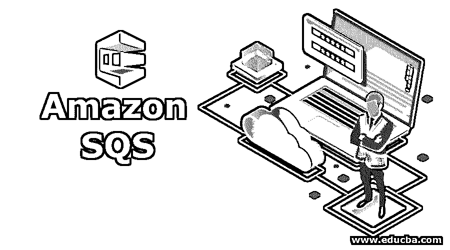

# 亚马逊 SQS

> 原文：<https://www.educba.com/amazon-sqs/>

## 亚马逊 SQS 简介

亚马逊 SQS 可以扩展为简单的队列服务，这是亚马逊网络服务的副产品。它是一种以临时缓冲存储的形式处理传入消息的方法，允许各个系统独立运行。Amazon Web Services (AWS)中的两种队列系统是默认队列，也称为标准队列，以及先来先服务(FIFO)类型的队列。这种技术的几个显著优点是可扩展性提高到无限极限，便于服务器端加密，并且不需要手动维护来扩展存储，因为每当系统内部接收到数据时，存储就会自动扩展。

消息可以是 json、字节、xml 或简单的文本格式，最大可达 256kb。任何组件都可以使用 SQS Api 检索 AWS 队列中存储的消息。当一个组件以非常快的速度产生数据，而另一个组件不能以同样的速度处理数据时，队列可以解决这个问题，然后队列保存数据，以便用户可以随时读取和处理数据。

<small>Hadoop、数据科学、统计学&其他</small>

队列充当组件产生和保存数据之间的缓冲区，组件接收数据进行处理。我们可以使用自动伸缩功能进行队列处理。当消息超过某个限制时，我们可以配置一个自动伸缩组，它将启动另一个 EC2 实例来处理消息并更快地完成工作。

### 队列系统是如何工作的？

例如，让我们来看一个场景:我们有两个异步通信的系统。

**系统 1 生产者:**以非常高的速率周期性地产生数据或说消息。

**系统 2 消费者**:以自己的速度消费消息，但比生产者慢。

队列将允许系统 1 以其自己的速度产生消息，而系统 2 将以其自己的速度消耗消息，即比系统 1 慢。

几十年来，队列在软件架构中一直扮演着重要的角色。队列在当今世界很有用，人们正在适应微服务架构，这些微服务通过一种称为应用编程接口的方式相互交谈。这使得队列在今天的趋势中比以往任何时候都更加重要。

### 现实世界中对 SQS 的需求和使用

让我们来看一个真实世界系统的场景，它处理来自摄像机的实时反馈。这是一个视频处理系统，其唯一的工作是处理视频，获得重要的数据并显示在仪表板上。该系统可以是人脸识别、交通分析器或牌照识别系统。

*   生产者的角色是读取提要，获取重要的帧，并将它们推送到队列系统。
*   消费者的工作是从队列中取出帧，进行必要的处理，并将其与元数据一起上传到所需的位置。
*   这里的工作似乎很简单，但制片人可以以非常高的速度推帧，但消费者无法以这样的速度处理它。
*   如果我们的消费者仍然出现故障，我们不会失去工作，因为它将始终在队列中可用。

我们可以看到队列是如何在这个体系结构中发挥不可或缺的作用的。

### 队列类型

AWS 提供两种类型的队列:

*   标准队列(默认)
*   FIFO 队列(先进先出)

#### 1.标准队列

*   标准队列是 SQS 提供的默认队列。
*   在标准队列中，我们每秒可以处理无限数量的事务。
*   消息至少会被传递一次，这是标准队列的唯一工作，它保证消息会被传递，但有时我们会看到消息中的冗余。它不保证只传递一个消息实例，有时可能会传递一个以上的消息副本。冗余消息将是无序的。
*   标准队列尽最大努力使消息有序。但这并不保证会发生，有时消息可能会乱序。

#### 2.FIFO 队列(先进先出)

*   FIFO 队列就像标准队列上的进步。
*   消息的顺序保持在 FIFO 中，也就是说，您接收消息的顺序与您发送消息的顺序相同。
*   消息的冗余没有问题。只有一条消息可供使用，它将保留在队列中，直到被使用者使用。
*   FIFO 保证消息的排序和唯一性(无冗余)。
*   它允许在单个队列中对多个有序消息进行分组。
*   FIFO 每秒处理的事务数量有限，即 300 个，不像标准队列可以处理任意数量的事务。

### SQS 能见度超时

*   这是组件读取并执行作业后，消息在 SQS 中不可见的时间。
*   如果处理在超时过期之前完成，则消息将从队列中删除。
*   如果工作没有完成，那么消息将再次可见，一些其他组件可以接管该工作，并且相同的消息将被引入两次。
*   默认可见性为 30 秒。
*   能见度超时可以增加到 12 小时。

### 亚马逊 SQS 的优势

*   **自动缩放:**在体积增加的情况下，AWS 将负责缩放，您的工作将以相同的速度执行。
*   **无限扩展**:尽管有某种限制，但 AWS 声称它可以支持队列中任何级别的消息。
*   **服务器端加密:**可以使用 AWS SSE(服务器端加密)来保护消息。

### 结论——亚马逊 SQS

消费者和生产者并不是一个新的世界问题，它从一个复杂的系统开始就存在了。在很多情况下，我们需要一个队列来处理传入的流量，并且我们不想丢失任何数据。即使在现实世界系统中，人们排队购买演出或旅行的门票，也是一种队列处理系统。有了 AWS SQS，我们可以在云上获得具有安全性、可伸缩性和其他 [AWS 特性](https://www.educba.com/aws-features/)的队列管理系统。

### 推荐文章

这是亚马逊 SQS 的指南。这里我们讨论一下引言，队列系统是如何工作的？SQS 可见性超时、类型和优点。您也可以看看以下文章，了解更多信息–

1.  [SOA 替代方案](https://www.educba.com/soa-alternatives/)
2.  [云计算平台](https://www.educba.com/cloud-computing-platforms/)
3.  [什么是 AWS EC2？](https://www.educba.com/what-is-aws-ec2/)
4.  [SOA 测试工具](https://www.educba.com/soa-testing-tools/)

