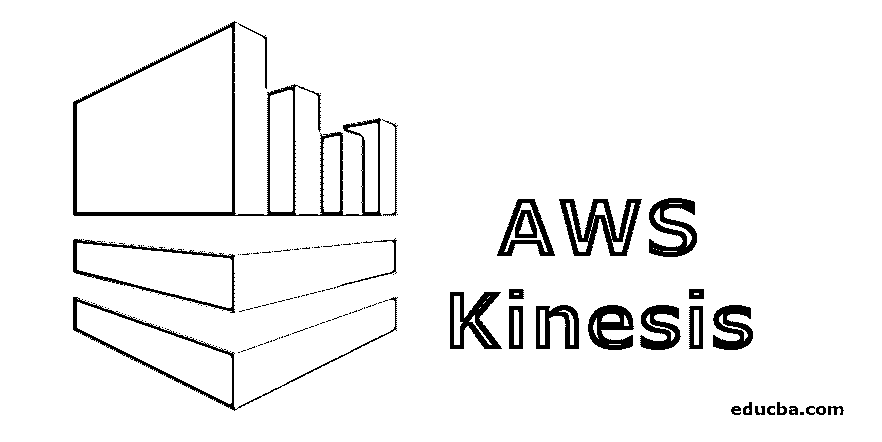
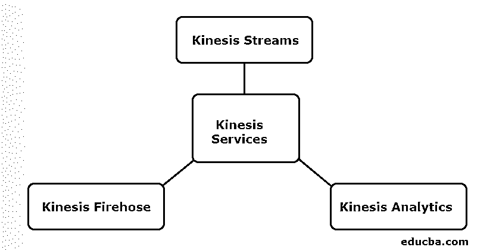
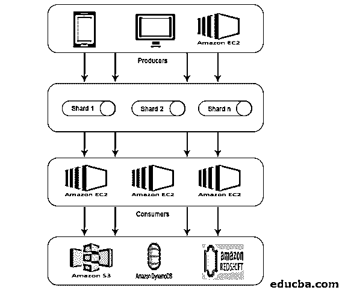

# AWS 室壁运动

> 原文：<https://www.educba.com/aws-kinesis/>

## 什么是 AWS Kinesis？

Amazon Kinesis 是一个在 Amazon Web Services 中收集、处理和分析流数据的平台，因此您可以获得及时、预定或基于事件的数据洞察，并根据洞察采取行动。与所有其他服务一样，AWS Kinesis 提供了按速度和规模经济高效地处理流数据的能力，可以灵活选择适合您的应用要求的工具，无论是视频、音频还是任何其他需要处理流数据的应用。

### AWS Kinesis 服务

在开始服务之前，让我们先了解一下 Kinesis 中使用的一些术语:

<small>Hadoop、数据科学、统计学&其他</small>

| **期限** | **定义** |
| **数据记录** | 存储在 Kinesis 数据流中的数据单元。它由一个数据 blob、序列号和一个分区键组成。 |
| **碎片** | 数据记录序列的集合。如果数据速率增加，碎片的数量可以增加或减少。 |
| **保持期** | 将数据添加到流中后可以访问数据的时间段。默认保留期:24 小时。 |
| **制作人** | 它将数据记录输入 Kinesis 流。 |
| **消费者** | 它从 Kinesis 流中获取记录并处理它们。 |

Kinesis 提供 3 项核心服务。

它们如下:

#### 1.Kinesis 流

Kinesis 流由一组称为碎片的数据记录序列组成。这些碎片具有固定的容量，可以提供 2mb/秒的最大读取速率和 1mb/秒的写入速率。流的最大容量是每个碎片容量的总和。

**Kinesis 的工作:**

*   物联网和其他来源(称为生产者)产生的数据被输入 Kinesis 流，以存储在碎片中。
*   该数据将在 Shard 中最多提供 24 小时。
*   如果需要存储的时间超过此默认时间，用户可以将保留期增加到 7 天。
*   一旦数据到达碎片，EC2 实例就可以将这些数据用于不同的目的。
*   检索数据的 EC2 实例被称为消费者。
*   经过数据处理后，它被输入到一个亚马逊网络服务中，如简单存储服务(S3)、DynamoDB、Redshift 等。

#### 2.Kinesis 消防软管

Kinesis Firehose 有助于将数据移动到 Redshift、简单存储服务、弹性搜索等亚马逊网络服务。它是流媒体平台的一部分，不管理任何资源。数据生成器被配置为必须将数据发送到 Kinesis Firehose，然后它自动将数据发送到相应的目的地。

**Kinesis 消防软管的工作:**

*   正如在 AWS Kinesis Streams 的工作中提到的，Kinesis Firehose 也从手机、笔记本电脑、EC2 等生产者那里获取数据。但是，这不需要像 Kinesis 流那样将数据分成碎片或增加保留期。这是因为 Kinesis Firehose 可以自动完成。
*   然后，数据会被自动分析并提供给简单的存储服务。
*   由于没有保留期，数据必须根据用户的要求进行分析或发送到任何存储。
*   如果数据必须发送到红移，它必须首先移动到简单存储服务，并需要从那里复制到红移。
*   但是，在弹性搜索中，数据可以直接输入其中，类似于简单的存储服务。

#### 3.运动学分析

Kinesis Firehose 允许在 Kinesis Firehose 中存在的数据中运行 SQL 查询。使用这个 SQL 查询，数据可以存储在 Redshift、简单存储服务、ElasticSearch 等中。

### AWS Kinesis 架构

下面给出的是 AWS kinesis 架构:

AWS Kinesis 架构包括:

*   生产者
*   陶瓷或玻璃碎片
*   顾客
*   储存；储备

类似于 AWS Kinesis 数据流中解释的工作，来自生产者的数据被输入到碎片中，在那里数据被处理和分析。然后，分析后的数据被移动到 EC2 实例，以执行某些应用程序。最后，数据将存储在任何亚马逊网络服务中，如 S3、红移等。

### 如何使用 AWS Kinesis？

要使用 AWS Kinesis，需要完成以下两个步骤:

#### 1.安装 AWS 命令行界面(CLI)

对于不同的操作系统，安装命令行界面是不同的。因此，请根据您的操作系统安装 CLI。

对于 Linux 用户，使用命令 sudo pip 安装 AWS CLI。

确保您拥有 python 版本 2.6.5 或更高版本。下载后，使用 AWS configure 命令对其进行配置。

然后，会问下面的细节，如下图。

**代码:**

`AWS Access Key ID [None]: #########################
AWS Secret Access Key [None]: #########################
Default region name [None]: ##################
Default output format [None]: ###########`

对于 Windows 用户，下载适当的 MSI 安装程序并运行它。

#### 2.使用 CLI 执行 Kinesis 操作

请注意，Kinesis 数据流不适用于 AWS 免费层。因此，创造的动力流将被充电。

现在让我们看看 CLI 中的一些 kinesis 操作。

*   **创建流**

使用以下命令创建碎片计数为 2 的流 KStream。

**代码:**

`aws kinesis create-stream --stream-name KStream --shard-count 2`

检查流是否已创建。

**代码:**

`aws kinesis describe-stream --stream-name KStream`

如果创建了它，将会出现类似于以下示例的输出。

**代码:**

`{
"StreamDescription": {
"StreamStatus": "ACTIVE",
"StreamName": " KStream ",
"StreamARN": ####################,
"Shards": [
{
"ShardId": #################,
"HashKeyRange": {
"EndingHashKey": ###################,
"StartingHashKey": "0"
},
"SequenceNumberRange": {
"StartingSequenceNumber": "###################"
}
}
] }
}`

*   **摆放记录**

现在，可以使用 put-record 命令插入数据记录。这里，包含数据测试的记录被插入到流中。

**代码:**

`aws kinesis put-record --stream-name KStream --partition-key 456 --data test`

如果插入成功，将显示输出，如下所示。

**代码:**

`{
"ShardId": "#############",
"SequenceNumber": "##################"
}`

*   **获取记录**

首先，用户需要获得代表流在分片中的位置的分片迭代器。

**代码:**

`aws kinesis get-shard-iterator --shard-id shardId-########## --shard-iterator-type TRIM_HORIZON --stream-name KStream`

然后，使用获得的碎片迭代器运行命令。

**代码:**

`aws kinesis get-records --shard-iterator ###########`

将获得一个示例输出，如下所示。

**代码:**

`{
"Records":[ {
"Data":"######",
"PartitionKey":"456”,
"ApproximateArrivalTimestamp": 1.441215410867E9,
"SequenceNumber":"##########"
} ],
"MillisBehindLatest":24000,
"NextShardIterator":"#######"
}`

*   **清理**

为了避免费用，可以使用下面的命令删除创建的流。

**代码:**

`aws kinesis delete-stream --stream-name KStream`

### 结论

AWS Kinesis 是一个为机器学习、预测分析等多种应用收集、处理和分析流数据的平台。流数据可以是任何格式，例如音频、视频、传感器数据等。

### 推荐文章

这是一份 AWS Kinesis 指南。在这里，我们讨论如何使用 AWS Kinesis 及其服务的工作和架构。您也可以阅读以下文章，了解更多信息——

1.  [AWS 架构](https://www.educba.com/aws-architecture/)
2.  [什么是 AWS Lambda？](https://www.educba.com/what-is-aws-lambda/)
3.  [大数据技术](https://www.educba.com/big-data-technologies/)
4.  [数据挖掘架构](https://www.educba.com/data-mining-architecture/)

