# AWS 中的 IAM 角色

> 原文：<https://www.educba.com/iam-roles-in-aws/>

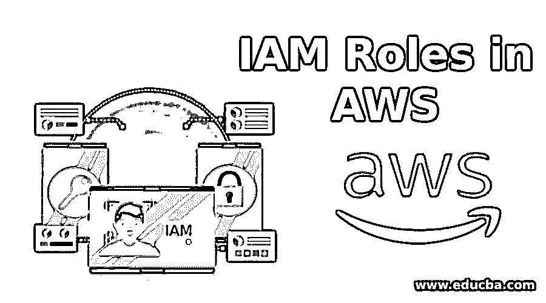

## 什么是 IAM 角色？

以下文章概述了 AWS 中的 IAM 角色。在 AWS 中，IAM 角色是一个 IAM 身份，在创建过程中具有指定的特定权限。IAM 角色可以与一个或多个 Amazon 的服务/用户相关联。它还定义了一组用于发出 AWS 服务请求的权限。

为了明确 IAM 的角色，我们举一个媒体服务提供商的例子。通常，媒体服务提供商基于各种类别，如体育、音乐、电影、高级访问、基本访问等，为他们的用户提供不同类型的访问。每个类别都有特定的权限，允许用户利用其优势。例如，如果用户已经订阅了高级访问，他/她可以提前访问最新和最受欢迎的电影，或者如果用户只想观看体育娱乐，那么他可以只订阅体育套餐。类似地，在 AWS 中，特定的权限被附加到特定的 IAM 角色上，这些角色由 [AWS 服务](https://www.educba.com/aws-services/)或用户根据他们的需求和访问级别进一步承担。

<small>Hadoop、数据科学、统计学&其他</small>

### 如何在 AWS 中创建 IAM 角色？

以下是在 AWS 中创建 IAM 角色的不同步骤:

**步骤 1:** 要通过 AWS 控制台创建 IAM 角色，首先您需要登录您的 AWS 帐户，并选择 IAM，该帐户位于安全、身份和合规项下，如下图所示。

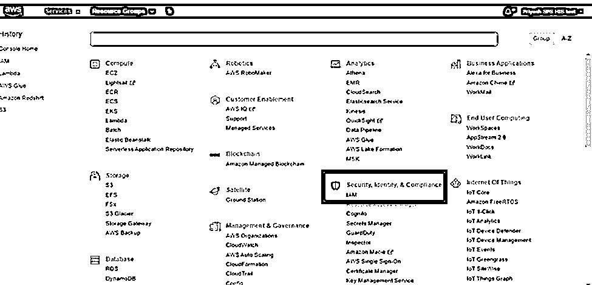

**步骤 2:** 在 IAM 部分，您必须单击“Roles”，然后单击“Create role”。

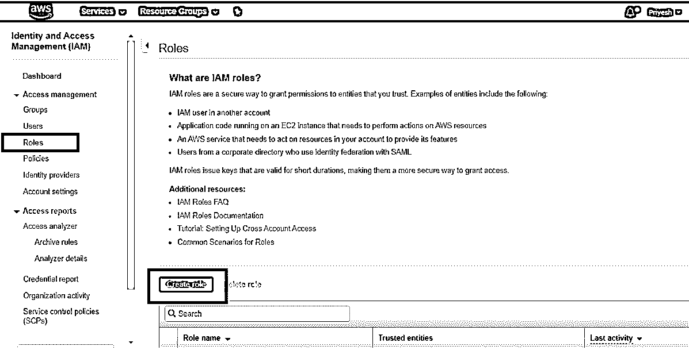

**步骤 3:** 然后选择您想要为其创建角色的 AWS 服务。例如，您可以为 EC2 创建一个角色，通过该角色，EC2 将能够访问 S3 存储桶。选择 AWS 服务后，单击“下一步:权限”。

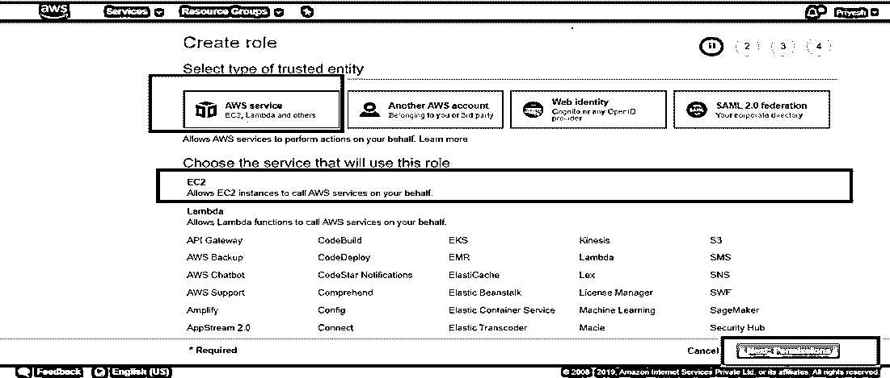

**第 4 步:**在这一步中，您可以选择想要授予所选服务的访问类型，在我们的例子中是 EC2。您可以授予不同类型的访问权限，如完全访问权限、只读访问权限、读写访问权限等。在下图中，我们授予 Amazon S3 对 EC2 的完全访问权限。

然后点击“下一步:标签”。标签通过为每个标签指定一个值来帮助我们轻松地管理角色。这一步是完全可选的。

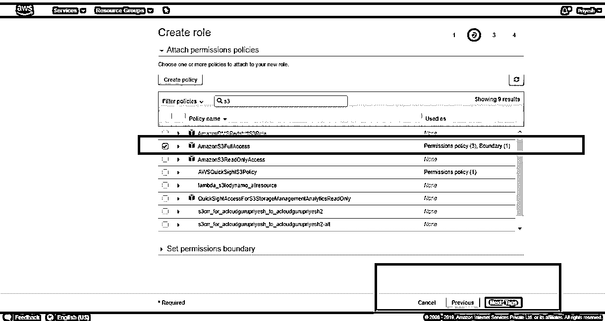

在上面的步骤中，您还可以选择“创建策略”,通过该选项，您可以根据自己的要求创建策略，而不是选择现有的策略。

您可以在可视化编辑器的帮助下创建自己的策略，如下图所示。

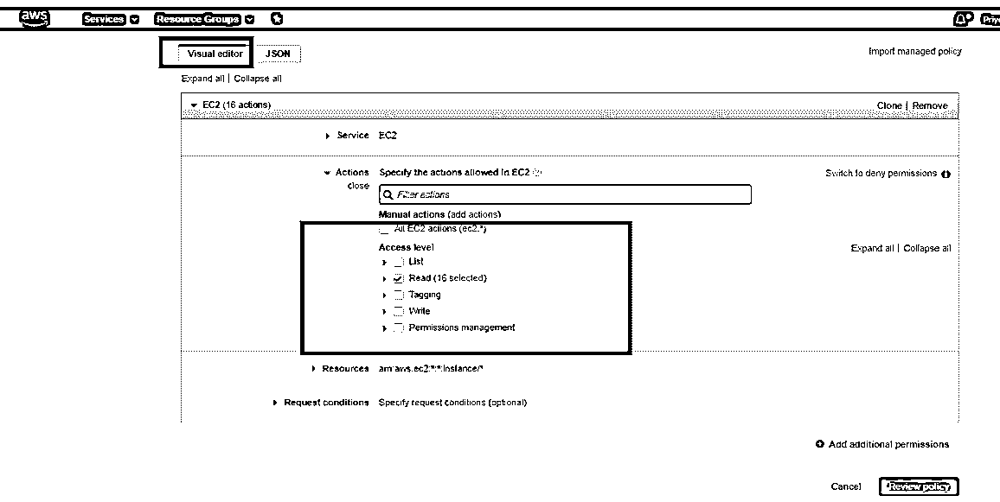

在可视化编辑器中，您可以选择策略的访问级别以及请求条件。

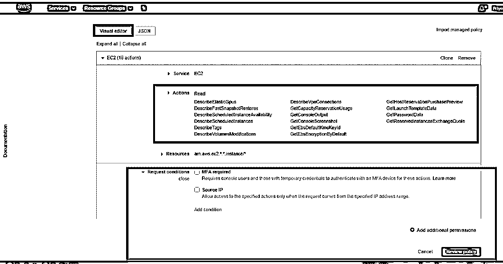

您还可以编写一个 JSON 脚本来为您的角色创建策略，如下所示。编写完 JSON 脚本后，您可以单击“Review policy”并将策略附加到您的角色。

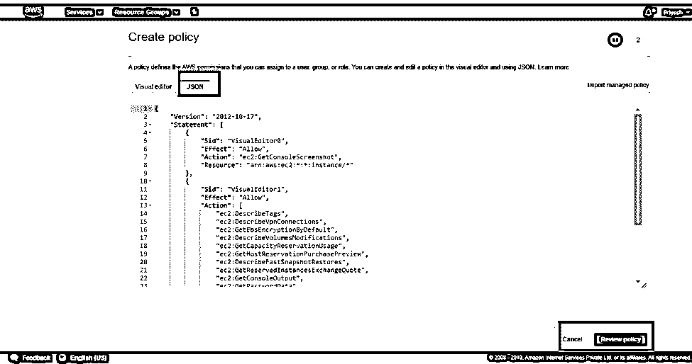

**第 5 步:**在这一步中，您将处于角色的评审部分，在这里您需要提供角色名称及其描述。您还可以查看附加了哪些策略，如果创建了标记，还可以查看标记。查看您的角色后，您可以单击“创建角色”，如下图所示。

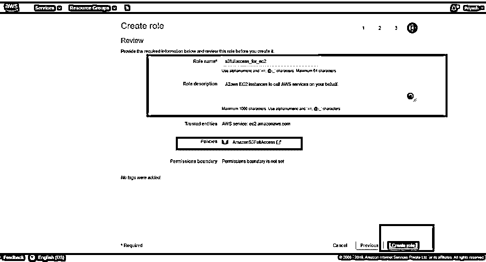

然后，您将能够在 IAM 控制面板中的 Roles 选项卡下查看您的角色，如下所示。

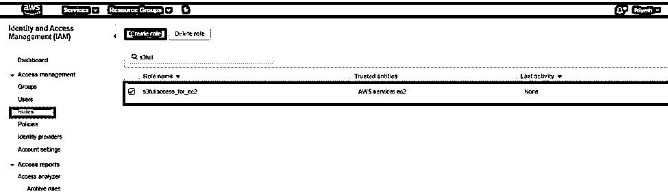

### 如何在 AWS 中使用 IAM 角色？

IAM 角色可由 AWS 服务(如 EC2、应用程序)和 IAM 用户用于 AWS 访问。您可以使用 IAM 角色将访问权限委派给在您的帐户内管理的 IAM 用户或不同 AWS 帐户下的 IAM 用户。IAM 角色允许您为受信任的实体定义权限并委派访问权限，而不必共享长期访问密钥。

要在 AWS 服务中使用 IAM 角色，您只需按照前面提到的创建角色的步骤进行操作。如何为 AWS 服务使用现有的 IAM 角色将在下一个主题中解释。

#### IAM 角色用例:

在很多情况下，我们可以使用 IAM 角色，比如我们可以授予 S3 对 Lambda 函数的访问权限以自动处理文件，使用 IAM 角色通过 STS 令牌授予对 AWS 的临时访问权限，等等。出于解释，我们将使用 IAM 角色和 EC2 来授予 EC2 访问权限，以查看我们的 AWS 帐户中的 S3 时段。

**步骤 1:** 为 EC2 实例创建一个 IAM 角色。要创建角色，只需遵循我们在上一节中讨论的步骤。

**步骤 2:** 转到 EC2 仪表板，点击 Launch Instance，创建一个 EC2 实例。

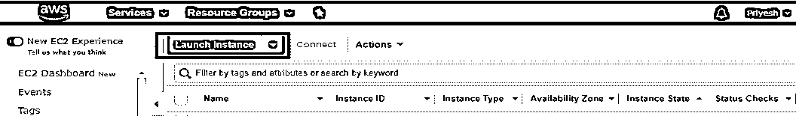

然后选择亚马逊 Linux 免费层 AMI。

在“配置实例”部分，选择如下图所示的角色。保留所有内容为默认值。

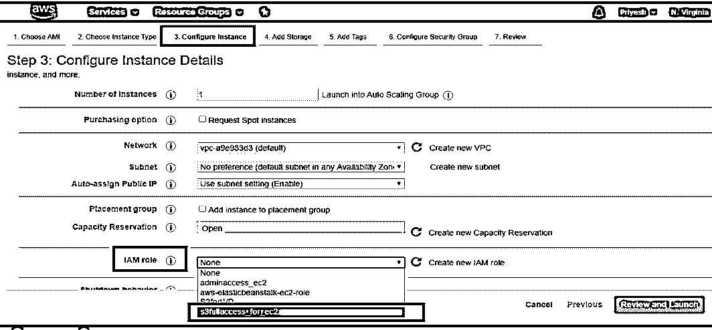

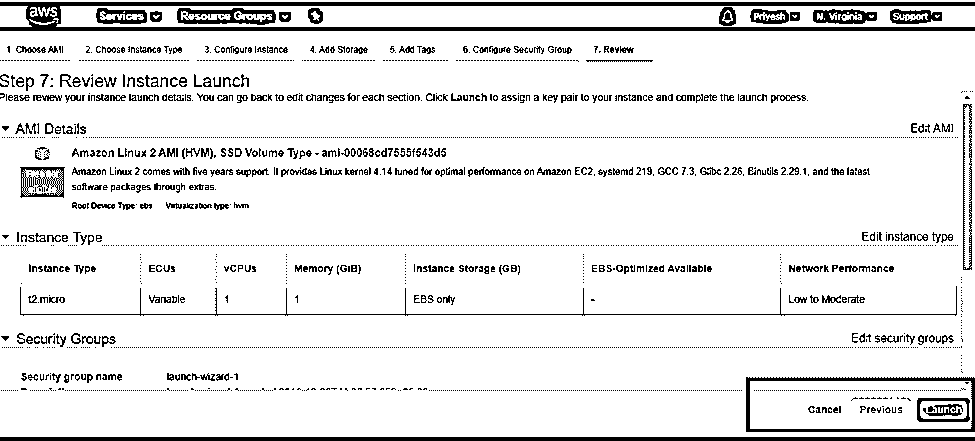

**步骤 3:** 选择或创建一个密钥对，将该密钥对保存在本地系统中。pem 格式化并启动实例。在本例中，我们将使用 Putty 登录到我们的 Linux EC2 实例。在我们登录之前，我们需要转换。pem to。ppk，可以在 Puttygen 的帮助下完成。

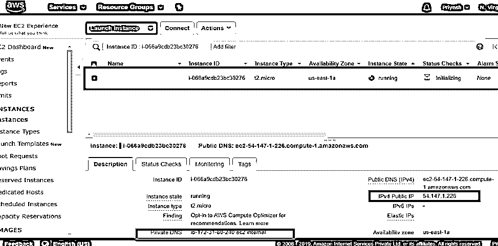

**步骤 4:** 启动实例后，复制公共 IPv4 并打开 PuTTY，在 Auth 部分指定 PPK 文件的路径，如下图所示，然后粘贴 IPv4 并单击 open。

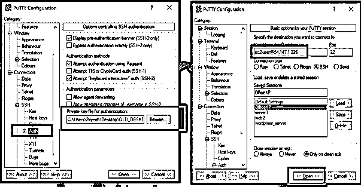

**步骤 5:** 登录后，您将能够看到如下图所示的以蓝色突出显示的专用 DNS 地址，然后键入 CLI 命令“aws s3 ls”列出我们帐户中所有 s3 存储桶的名称。在下图中，桶以绿色突出显示。

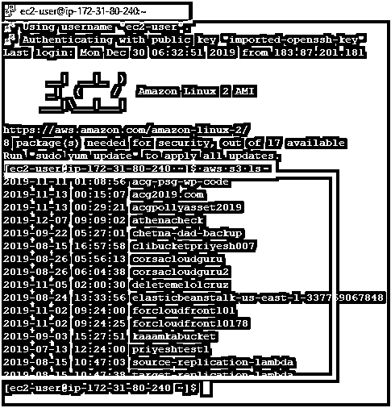

如果没有将 IAM 角色附加到 EC2 实例，此 CLI 命令将不起作用。

### 结论

就安全性而言，IAM 角色在 AWS 中起着至关重要的作用。它允许我们轻松无缝地保护我们的应用程序，它还允许我们为不同的需求创建不同的角色，从而帮助我们避免依赖性。

### 推荐文章

这是 AWS 中 IAM 角色的指南。这里我们讨论一下简介以及如何在 AWS 中创建和使用 IAM 角色？。您也可以阅读以下文章，了解更多信息——

1.  [AWS EMR](https://www.educba.com/aws-emr/)
2.  [什么是 AWS 红移](https://www.educba.com/what-is-aws-redshift/)
3.  [AWS 的主要竞争对手](https://www.educba.com/aws-competitors/)
4.  [AWS 存储服务](https://www.educba.com/aws-storage-services/)

