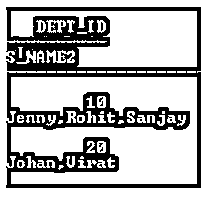
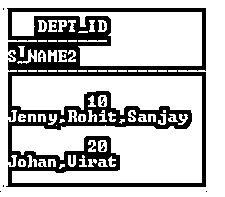

# RedShift listagg

> 原文：<https://www.educba.com/redshift-listagg/>

## 红移 listagg 简介

Redshift 为用户提供了不同类型的功能，其中 listagg()是 Redshift 提供的功能之一。基本上，listagg()用于根据用户要求进行分组，或者我们可以说根据表达式排序。换句话说，我们可以说它是一个单一集合聚合函数，这意味着它作用于表中的所有行，并根据我们的要求生成单个行，其中数据对其进行分组，我们指定 order by 子句，然后最终连接所有数据。

**红移 listagg 的语法**

<small>Hadoop、数据科学、统计学&其他</small>

下面给出了提到的语法:

`select listagg (specified colm name [, ‘required delimiter’]) within group (order by clause[specified colm name]) from specified table name;`

**说明:**

在上面的语法中，我们使用带有不同参数的 select 子句和 listagg()函数，如下所示:

*   **指定的列名:**它是一个指定的列名或表达式，我们需要将其连接在一起作为最终输出。如果它包含空值，则被忽略。
*   **必需分隔符:**是本语法的可选部分；基本上，它用于根据需要分隔列的值。
*   **分组依据:**分组依据用于对不同行进行分组。
*   **order by 子句:**用于确定串接值的顺序。

### listagg 在红移中是如何工作的？

*   要在 Amazon Redshift 信息库中链接字符串元素，SQL 工程师可以使用 listagg SQL total capacity，并进行一些竞争，如使用逗号分隔的 person 来获取 CSV 列表，或者在 Group Order By 但书中安排结果纲要中的元素，或者使用 Group By 语句，就像在不同条件下使用 listagg 工作一样。
*   这个针对 Amazon Redshift 信息库工程师和主席的 SQL 教学练习将为测试 SQL 代码提供 listagg 字符串累积工作的各种应用。
*   对于预定的度量，listagg 对 ORDER BY 但书中确定的每个集合内的信息进行排序，然后链接操作段的上侧。作为二进制集合总容量，listagg 作用于所有列，并返回二进制产量线。作为一个收集集总计，容量对 GROUP BY 语句所表征的每个收集进行处理并返回一个 yield 列。
*   作为一种有洞察力的能力，listagg 根据 query_partition_clause 中的至少一个发音将问题结果集分配到多个串中。

对容量的争论取决于附带的准则:

*   列名可以是任何发音。忽略操作部分中的无效质量。
*   分隔符指定用于隔离动作的字符串。这个但书是任意的，默认为 NULL。
*   order _ by _ 子句决定返回连接质量的请求。因此，仅当按段排序列表完成异常请求时，容量才是确定的。
*   如果操作部分是原始的，则返回信息类型是原始的；在任何情况下，返回的尊重值是 VARCHAR2。

### 红移 listagg 的例子

下面给出了红移 listagg 的例子:

在实现 listagg()函数之前，我们需要使用如下语句创建一个表:

**代码:**

`create table s_dept(dept_id number(20), s_name varchar2(30), City varchar2(30));`

**说明:**

*   在上面的示例中，我们创建 table 语句来创建一个新的表名 s_dept，它具有不同的属性，如 dept_id、s_name 和 city，并具有不同的数据类型。
*   最后的输出，或者我们可以说是上面语句的结果，用下面的截图来说明。

**输出:**

#### 示例#1

我们需要使用 insert into 语句将一些记录插入到新创建的表中，如下所示。

**代码:**

`insert into s_dept(dept_id, s_name, City) values(10,'Jenny','Hongking');
insert into s_dept(dept_id, s_name, City) values(10,'Rohit','London');
insert into s_dept(dept_id, s_name, City) values(20,'Virat','Singpore');
insert into s_dept(dept_id, s_name, City) values(10,'Sanjay','Mumbai');
insert into s_dept(dept_id, s_name, City) values(20,'Johan','Pune');`

**说明:**

*   通过在语句中使用 insert，我们插入了一些记录。
*   最后的输出，或者我们可以说是上面语句的结果，用下面的截图来说明。

**输出:**

#### 实施例 2

我们可以如下执行 listagg()函数。

**代码:**

`select listagg(s_name, ',') within group (order by s_name) as s_name2 from s_dept;`

**说明:**

*   在上面的示例中，我们使用 listagg()函数在一行中显示所有学生的姓名，并用逗号分隔，如上面的语句所示。在上面的语句中，我们使用了 select with listagg()函数；在括号内，我们需要提供带有分隔符的列名。
*   之后，我们需要根据我们的要求按条款分组和排序。最后，最后的输出或者我们可以说是上述语句的结果，我们用下面的截图来说明如下。

**输出:**

#### 实施例 3

让我们看看 listagg()函数的另一个例子，如下所示。

**代码:**

`select dept_id, listagg(s_name, ',') within group (order by s_name) as s_name2 from s_dept group by dept_id;`

**说明:**

*   在这个例子中，我们尝试实现 listagg()函数；在上面的语句中，我们使用了 select with listagg()函数；在括号内，我们需要提供带有分隔符的列名。之后，我们需要根据我们的要求按条款分组和排序。
*   在本例中，我们显示学生姓名和部门 id，用逗号分隔，如上面的语句所示。最终的输出或者我们可以说是上面语句的结果，我们用下面的截图来说明如下。

**输出:**

#### 实施例 4

让我们再看一个 listagg()函数的例子。

**代码:**

`select dept_id, listagg(s_name, ',') within group (order by s_name) as s_name2 from s_dept group by dept_id order by dept_id;`

**说明:**

*   通过使用上面的语句，我们实现了 listagg()函数。在本例中，我们显示了属于每个部门的学生姓名，并按所示的 dept_id 排序。
*   最终的输出或者我们可以说是上面语句的结果，我们用下面的截图来说明如下。

**输出:**

### 结论

从上面的文章中，我们已经看到了 listagg 函数的基本语法，也看到了 listagg 函数的不同例子。从本文中，我们看到了如何以及何时使用红移 listagg 函数。

### 推荐文章

这是红移 listagg 的指南。这里我们讨论一下引论，listagg 是如何在红移中工作的？和示例。您也可以看看以下文章，了解更多信息–

1.  [红移物化视图](https://www.educba.com/redshift-materialized-views/)
2.  [红移子串](https://www.educba.com/redshift-substring/)
3.  [红移创建表](https://www.educba.com/redshift-create-table/)
4.  红移日期差值

