# 红移创建表

> 原文：<https://www.educba.com/redshift-create-table/>

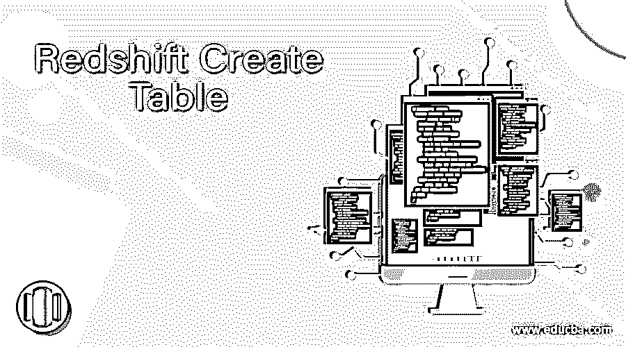

## 红移创建表简介

Redshift Create Table 类似于我们在其他数据库中创建表。Create table 语法将约束定义为表约束、列约束和属性，如列属性和表属性。定义约束保持更可靠，并使数据根据我们的需要插入。例如，列不应包含任何空值。我们可以把它表示为 <column_name>NOT NULL。它们也是指定的其他约束，我们可以深入研究它。</column_name>

在本节课中，我们将详细了解 Create Table 的用法、语法和示例:

<small>Hadoop、数据科学、统计学&其他</small>

**语法:**

Create Table 函数的语法如下:

`Create [temp | temporary | IF NOT EXISTS ] Table table_name
( column_name data type [ column_constraint ] | [ Table Constraint ] |
[ column attribute] | [ table attribute] | LIKE
);`

其中列属性定义为 DEFAULT、IDENTITY，默认生成为 IDENTITY、ENCODE、SORTKEY 和 DISTKEY。

其中列约束被称为 NOT NULL、NULL、UNIQUE、PRIMARY KEY 和 REFERENCE。

其中表约束被称为唯一、主键和外键[列名]引用表(列)。

其中表属性被称为 DISTSTYLE、DISTKEY。

### 红移创建表是如何工作的？

下面让我们看看 Create Table 在红移中是如何工作的。让我们创建一个如下的基本表，其中列不为空，并且定义了主键。

`Create table sample_table (
ID INT PRIMARY KEY NOT NULL,
NAME VARCHAR(20)
)`

同样的截图如下:

让我们在表中插入几行数据:

`INSERT INTO SAMPLE_TABLE VALUES ( 1, 'Rose' );
INSERT INTO SAMPLE_TABLE VALUES ( 2, 'BTS' );`

现在让我们从表中选择数据:

`SELECT * FROM SAMPLE_TABLE;`

让我们看看相同的截图:

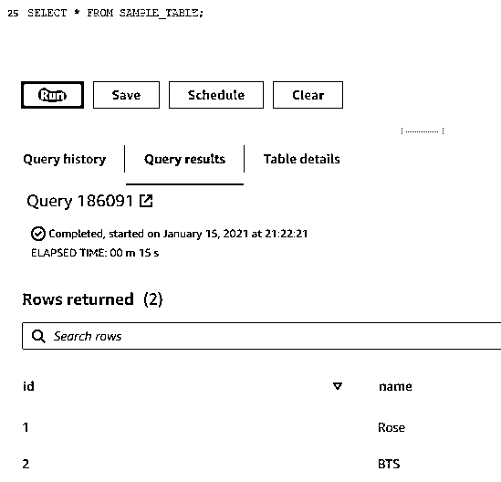

现在让我们尝试将 NULL 插入到“ID”列中。正如我们提到的非空列。该语句抛出如下错误:

`INSERT INTO SAMPLE_TABLE Values (NULL, 'BTS' );`

让我们看看相同的截图:

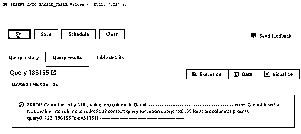

**创建表格为:**

它允许创建一个类似于前面提到的带有列名、数据类型和复制数据的表。

`CREATE TABLE SAMPLE_TABLE_DUP AS SELECT * FROM SAMPLE_TABLE;`

让我们看看相同的截图:

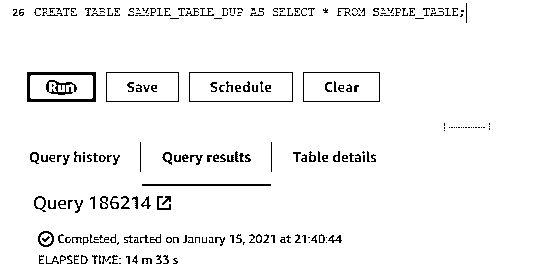

`Select * from sample_table_dup;`

它具有与 sample_table 相似的数据。

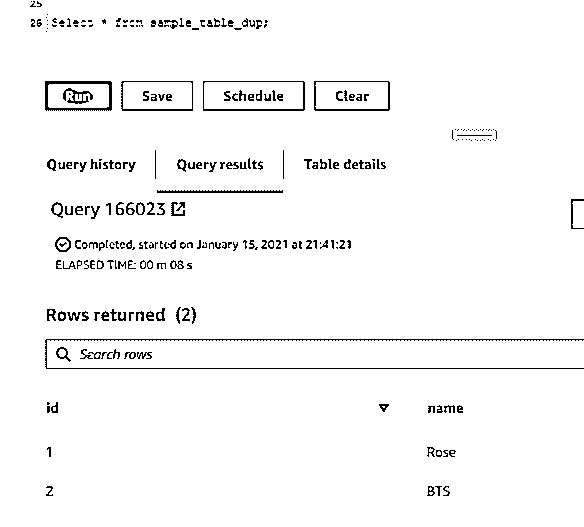

**创建表格，如:**

它允许创建一个表，有一个类似的结构提到的表没有任何数据复制。

`CREATE TABLE LIKE_SAMPLE_TABLE (LIKE SAMPLE_TABLE);`

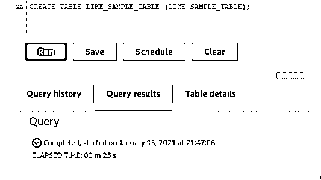

相同的截图:

`Select * from LIKE_SAMPLE_TABLE;`

它有一个类似 sample_table 的结构。

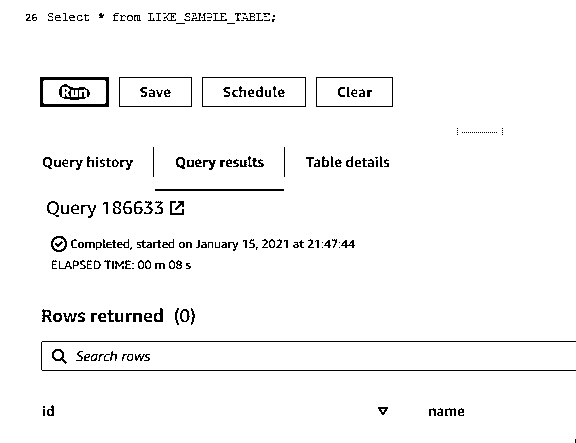

**临时或暂时:**

临时创建的表，在会话结束时被删除。

`Create temp table < Table name>;`

**如果不存在:**

仅当数据库中不存在时，这才用于创建表。使用这个我们可以避免“表名已经存在错误”。

`Create table IF NOT EXISTS < table name >;`

示例创建现有的表名来创建表。

`Create table IF NOT EXISTS sample_table (
ID INT PRIMARY KEY NOT NULL,
NAME VARCHAR(20)
)`

**举例:**

现在让我们来看一个创建红移表的示例。

`Create table U_Data (
ID INT PRIMARY KEY NOT NULL,
NAME VARCHAR(20),
SALARY DECIMAL
)`

相同的截图:

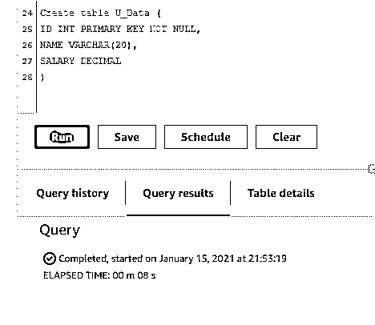

让我们将数据插入表中:

`INSERT INTO U_data values ( 1, 'Rak' , 20000);
INSERT INTO U_data values ( 2, 'Rak' , 34000);
INSERT INTO U_data values ( 3, 'Rak' , 56000);
INSERT INTO U_data values ( 4, 'Rak', 76000);
INSERT INTO U_data values ( 5, 'Rak', 78000);
INSERT INTO U_data values ( 6, 'Rak', 56000);
INSERT INTO U_data values ( 7, 'Rak', 23000);
INSERT INTO U_data values ( 8, 'Rak', 29000);
select * from U_data;`

相同的截图:

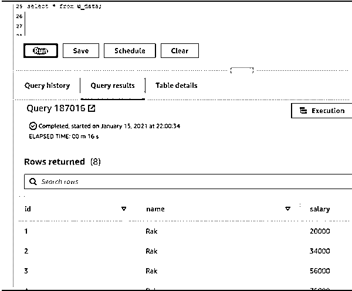

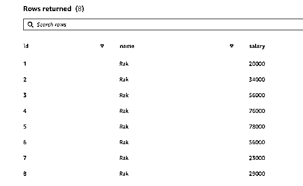

**排序键:**

`Create table Sort_Key_Data (
ID INT PRIMARY KEY NOT NULL,
NAME VARCHAR(20),
SALARY DECIMAL,
Country Varchar(20),
PINCODE INT
) SORTKEY ( Country, pincode );`

相同的截图:

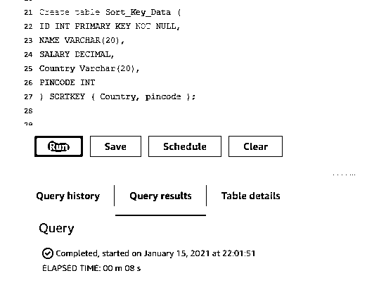

**DISTSTYLES:**

我们这里有三种不同风格:

*   偶数:使用循环法。
*   关键字:匹配的行将被插入同一节点。
*   ALL:存储在每个节点中的整个表的副本。

让我们创建相同的，看看:

`Create table DIST_Key_Data (
ID INT PRIMARY KEY NOT NULL,
NAME VARCHAR(20),
SALARY DECIMAL,
User_id INT DISTKEY
)`

相同的截图:

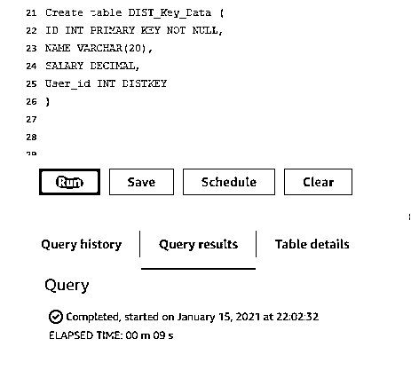

让我们创建相同的，看看:

`Create table DIST_ALL_Data (
ID INT PRIMARY KEY NOT NULL,
NAME VARCHAR(20),
SALARY DECIMAL,
User_id INT
) DISTSTYLE ALL ;`

相同的截图:

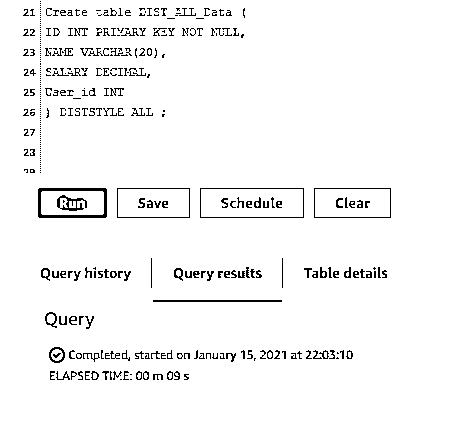

### 推荐文章

这是一个红移创建表的指南。这里我们讨论一下入门，语法，红移是如何创建表的工作原理？以及代码实现的例子。您也可以看看以下文章，了解更多信息–

1.  [什么是 AWS 红移？](https://www.educba.com/what-is-aws-redshift/)
2.  [AWS 竞争对手](https://www.educba.com/aws-competitors/)
3.  [AWS 开发者工具](https://www.educba.com/aws-developer-tools/)
4.  [AWS 深度学习](https://www.educba.com/aws-deep-learning/)

