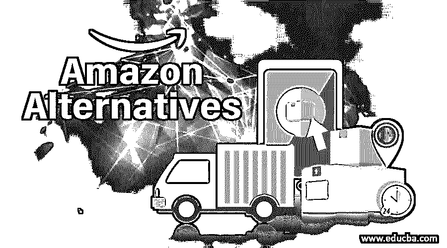

# 亚马逊替代品

> 原文：<https://www.educba.com/amazon-alternatives/>

## 亚马逊替代品概述

我们正在讨论亚马逊的替代品，这一事实表明了它在电子商务领域的旗舰地位。早在 1995 年，亚马逊作为一家在线图书销售公司起家，如今已发展成为最大的在线零售电子商务公司。

亚马逊 2018 年在美国的在线零售额几乎等于其余所有零售商的总和。2018 年，他们的销售额达到 2600 亿美元，占在线零售市场的 49.1%，占所有零售形式的 5%。亚马逊在其他地区也在增长。亚马逊于 2012-13 年在印度首次亮相，目前的市场份额为 30%，销售额为 50 亿美元，市值为 160 亿美元，总体年增长率为 20%。

<small>Hadoop、数据科学、统计学&其他</small>

在这篇文章中，让我们分析一下亚马逊有哪些选择。

### 亚马逊的成功故事及其原因

*   亚马逊从网上书店扩展到电子产品、玩具、游戏、软件、精美商品、成衣、家具和任何其他零售商品。
*   他们依靠技术来研究消费者行为及其怪异的需求和市场动态，以在其门户网站中推出创新来保留和扩大客户群。
*   更加注重为客户提供新的服务，如退货、货到付款等。
*   通过提供丰富的外观和感觉屏幕、简单的搜索工具和关于产品的附加信息等来改善用户体验。
*   开发了像 Kindle 这样的创新产品，使电子书的阅读变得简单，几乎和阅读实体书一样。
*   利用人工智能技术(NLP)推出 Echo 等小工具来倾听任何查询，并用自然语言回答它们。
*   更加依赖市场模式，在其门户网站中提供第三方供应商的商品/服务，使客户能够在一个地方购买所有商品，这种模式的收入超过亚马逊销售额的 50%。在这种模式下，商品/服务的物流/配送由亚马逊管理。
*   充满活力的管理，对客户的关注超过竞争，客户满意度超过利润是其他原因。

### 为什么选择亚马逊？

我们应该为亚马逊寻找替代选择的原因有几个，其中一些如下:

*   市场主导地位:亚马逊主导着美国的网上零售，它在其他国家也在快速扩张。他们正在扩展到开发自己的产品/服务，如 Echo 和其他人工智能产品，AWS 云服务。他们的优势和增长可能会压制第三方供应商，扼杀他们的业务。
*   商业道德:私人调查显示，亚马逊员工因不合理的绩效水平而受到压力，亚马逊因其在市场中的强大地位而纵容其他一些不道德的行为。
*   **垄断态度:**他们的垄断地位可能会在未来的价格和服务水平上对他们的客户不利。

### 亚马逊的顶级替代品

以下是亚马逊的不同选择，解释如下:

#### 1.美国亚马逊的替代产品及其独特的销售主张(USP)

*   **易贝:**它不拥有他们销售的任何产品，它以竞标而闻名。易贝将第三方产品与潜在买家联系起来，他们可以通过直接购买和竞价模式购买产品。有些产品这两种型号都有，买家可以选择其中任何一种。
*   这个网站熟悉销售手工制作的利基产品，它最初是一个以低廉的价格出售多余的不需要的物品的网站。它与工匠分享销售收入的很大一部分，以回报他们的贡献。
*   新蛋:主要经营数码相机、电脑、电视等电子产品。<u>他们的优势在于更快的交货速度、良好的客户服务以及与其他公司相匹配的价格。</u>
<u>*   Zappos: 一家电子商务网站以其卓越的客户服务而闻名，主要经营服装。它提供了一种独特的功能，可以在采购一年后接受客户的退货。它是亚马逊的子公司。*   全球速卖通:该网站由阿里巴巴集团运营，它将制造商和客户联系起来，避开中间商，实现价格经济。它在其门户网站上提供大量廉价商品，只有当买家确认收到商品时，才会向卖家付款。*   **Jet.com:** 在这个门户网站中，品牌商品以低廉的价格提供给美国的顾客。季节性销售优惠和促销是这个网站的主要吸引力。*   Barnes & Noble: 主要经营书籍，是亚马逊的强劲竞争对手。它提供实体书和电子书，并拥有大量的藏书。*   乐天:像易贝一样，这个网站将制造商和买家联系起来。视频评论和有吸引力的奖励积分系统是这个门户网站的优势。*   沃尔玛:每日折扣/优惠和低价是这家最大的实体店集团的特色。人们可以在这个网站上购买实体店的商品。物品要么送到家里，要么送到最近的当地商店。*   **目标:**经营最新潮流的优质产品。它是美国的另一家连锁超市，就像沃尔玛一样。季节性促销和向顾客提供流行产品是它的优势。*   质量、价值和便利是 QVC 的全部形式。它以电视营销起家，以略高的价格提供利基品牌产品。*   BestBuy.com: 主要经营家用电子物品，电脑。定期销售优惠和无忧无虑的回报是它的优势。*   Etsy: 这个网站向顾客提供手工制作的物品，经典的复古物品。大部分销售收入与工匠分享。家居装饰者和那些寻找独特礼品的人是 Etsy 的主要客户。</u>

 <u>#### 2.亚马逊在印度的替代品

*   **Flipkart:** 印度电子商务国家领导者，被沃尔玛收购。和亚马逊一样，它是从书籍开始扩展到其他产品的。
*   **Snapdeal:** 多元化平台争夺全国领导权。
*   **Indiamart:** 通过这个平台连接供应商、制造商、出口商和消费者。
*   **Bookmyshow:** 熟悉活动、展览、电影等的网上订票。
*   Myntra: 主要经营服饰、时尚、生活用品。
*   Firstcry:提供婴儿护理和儿童用品。

### 结论

通过利用最新的数字技术和充满活力的商业模式，所有地区都有许多电子商务供应商用他们的创新产品挑战亚马逊。

### 推荐文章

这是亚马逊替代品指南。在这里，我们讨论了亚马逊的成功故事及其原因，以及亚马逊在美国和印度的顶级替代品。你也可以看看下面的文章来了解更多-

1.  [AWS 容器](https://www.educba.com/aws-containers/)
2.  [什么是 AWS 红移？](https://www.educba.com/what-is-aws-redshift/)
3.  [AWS 竞争对手](https://www.educba.com/aws-competitors/)
4.  什么是亚马逊 VPC？

</u>