# 红移截断

> 原文：<https://www.educba.com/redshift-truncate/>

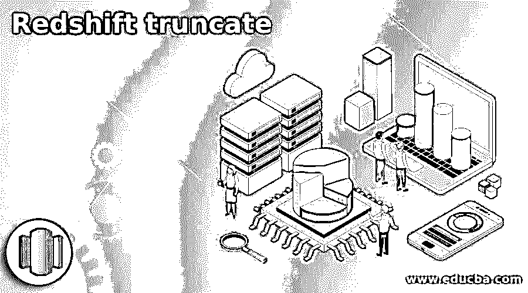

## 红移截断简介

Redshift truncate 命令用于从表中删除所有记录，基本上，我们使用 delete 语句从表中删除数据，但对于大型表，我们使用 truncate 命令从表中删除整个数据。Truncate 命令从表中删除所有记录，它也比 delete 命令快，delete 命令从表中删除单个以及所有记录，但是 truncate 将从表中删除所有记录。Truncate 不用于从表中删除单个记录。对表执行 truncate 命令后，我们无法检索数据。

**语法:**

<small>Hadoop、数据科学、统计学&其他</small>

下面是 redshift 中 truncate 命令的语法如下。

*   Truncate table _ name
*   Truncate table table _ name

**redshift 中 truncate 的参数描述语法。**

*   **Truncate–**这是一个在 redshift 中使用的命令，用于从表中删除所有记录。使用 truncate 可以删除表中的所有记录。
*   **表–**这是一个可选参数，在 redshift 中与 truncate 命令一起使用。我们还可以在不使用表关键字的情况下对表执行 truncate 命令。
*   **表名–**这是我们执行了 truncate 命令的表的名称。它是一个持久的或临时的表。在截断桌子的时候，我们不需要再次吸尘。

### truncate 在红移中是如何工作的？

*   redshift 中的 Truncate 命令将删除表中的所有行，而不进行全表扫描。
*   在使用 delete 命令删除记录时，它会执行全表扫描，但是 truncate 命令在从表中删除记录时不会执行全表扫描。
*   与删除操作相比，截断更快，因为删除操作是对表进行全表扫描。
*   要执行 truncate 命令，我们需要表的所有者或数据库的超级用户权限。另一个用户无法对该表运行 truncate 命令。
*   下面的例子表明，我们需要所有者或超级用户权限来执行 redshift 中的 truncate 命令。
*   在下面的例子中，我们使用测试用户来执行 truncate 命令。但是我们可以看到它显示了错误，就像它必须是特定表的所有者一样。我们必须设法截断数据表。

**代码:**

`Truncate table date;`

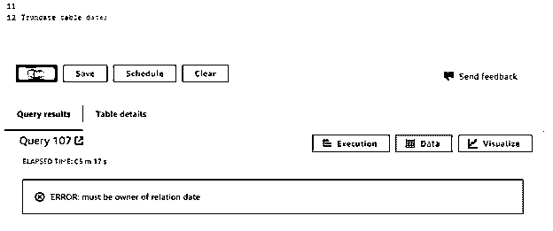

图-我们需要所有者或超级用户权限来执行 redshift 中的 truncate 命令。

*   如果假设我们想从表中删除所有记录，并且如果我们将来不需要这些记录，那么 truncate 命令在 redshift 中比 delete 命令更有效。
*   Truncate table 语句执行的操作与 redshift 中没有 where 子句的 delete 语句相同。如果我们在 delete 语句中使用了 where 子句，它将删除指定的行。
*   从表中截断数据后，我们不需要在表上运行 analyze 或 vacuum 命令。
*   基本上，我们没有在包含来自其他表的外键引用的表上使用 truncate table 语句，因为它将截断所有具有外键引用的表。
*   Truncate table 语句正在从表中回收存储。
*   使用 truncate 命令，我们可以在一个命令中删除一个表。我们不能在一个命令中删除多个表，因为我们必须在其他数据库中删除。
*   Truncate table 语句在 redshift 中不是事务安全的。如果我们在 Truncate table 命令后使用了 commit 语句，truncate table 不会回滚该语句。
*   在 redshift 中使用 truncate 命令的时候，我们需要非常小心地使用它。因为在执行 truncate 语句后，将不能进行任何撤消操作。
*   在生产中使用 truncate 命令时，我们需要非常小心地使用它。
*   在使用 truncate 命令时，它会自动提交事务。我们不能在提交后回滚。

**代码:**

`Truncate table venue;
Rollback;
Select * from venue;`

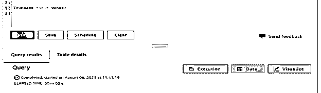

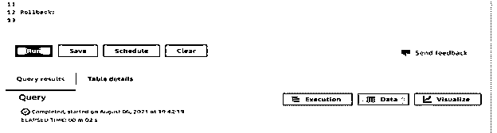

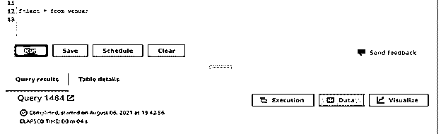

图-在使用 truncate 命令时，它将自动提交事务。我们不能在提交后回滚。

*   在上面的例子中，我们可以看到，在执行 truncate 命令后，我们无法回滚事务。
*   在第一个示例中，我们截断了作为场所的桌子名称，在第二个示例中，我们必须尝试回滚事务。但是在第三个例子中，我们可以看到我们不能回滚事务，它将检索空的结果集。
*   我们也可以在 redshift 中截断任何表，只要它包含外键约束的引用。
*   在 redshift truncate 命令中，当它提交自己的事务时，它将提交其他事务。
*   redshift 中的 Truncate 语句将在我们执行 truncate 操作的表上获取访问排他锁。
*   执行 truncate 命令后，表中的所有记录都将被删除，对于数据库服务器上运行的并发事务，表将显示为空。

### 例子

下面的例子显示了红移中的截断如下。

**使用截断命令截断单个表格**

*   以下示例显示了使用 truncate 命令截断单个表，如下所示。在下面的例子中，我们使用 truncate 命令截断了数据表。
*   截断日期表后，我们可以看到该表将返回空结果。

**代码:**

`Truncate table date;
Select * from date;`

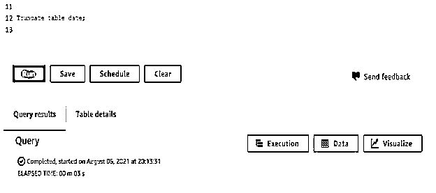

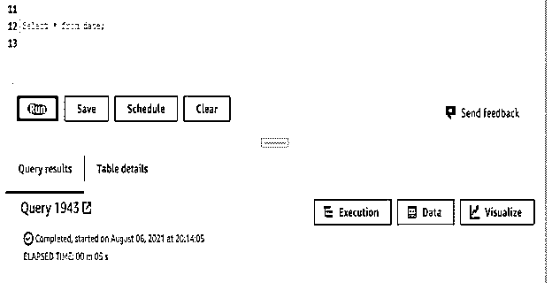

**不使用表关键字截断单个表—**

*   以下示例显示了不使用 table 关键字截断单个表，如下所示。在下面的例子中，我们使用 truncate 命令截断了 sales 表。
*   我们没有在 truncate 命令后使用表关键字。
*   截断 sales 表后，我们可以看到该表将返回空的结果集。

**代码:**

`Truncate sales;
Select * from sales;`

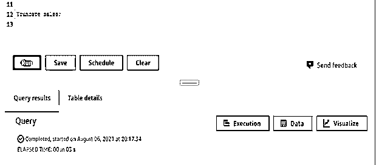

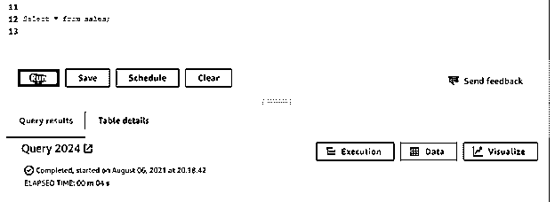

**使用截断命令截断多个表格**

*   以下示例显示了使用 truncate 命令截断多个表，如下所示。在下面的示例中，我们使用 truncate 命令截断了用户和事件表。
*   我们用两个命令截断了用户和事件表。我们不能在一个命令中删除多个表。

**代码:**

`Truncate table users;
Truncate table event;`

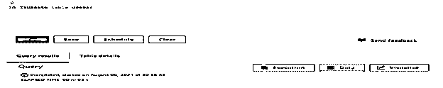

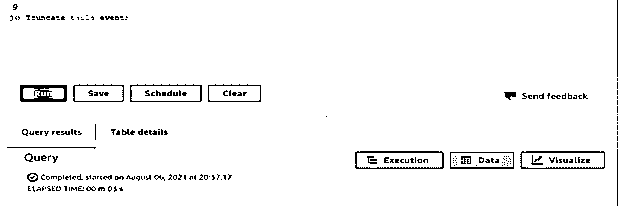

### 结论

truncate 命令用于删除 redshift 中的所有记录。截断记录后，我们无法回滚它们。对表运行 truncate 命令后，我们不需要对表运行 analyze 或 vacuum，truncate 会自动从表中回收空间。

### 推荐文章

这是一个红移截断的指南。这里我们讨论 truncate 在红移中是如何工作的，并给出了详细的例子。您也可以看看以下文章，了解更多信息–

1.  红移日期差值
2.  [红移创建表](https://www.educba.com/redshift-create-table/)
3.  [红移 Row_NUMBER()](https://www.educba.com/redshift-row_number/)
4.  [红移子串](https://www.educba.com/redshift-substring/)

