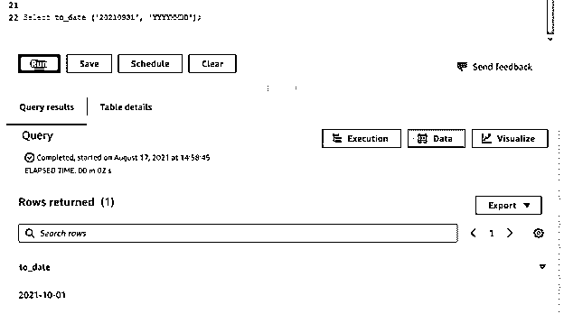
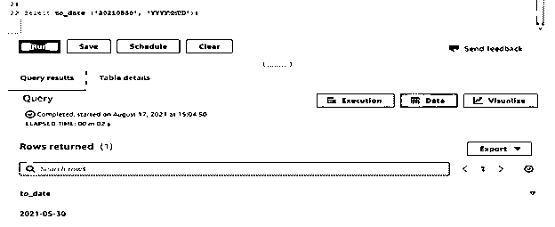
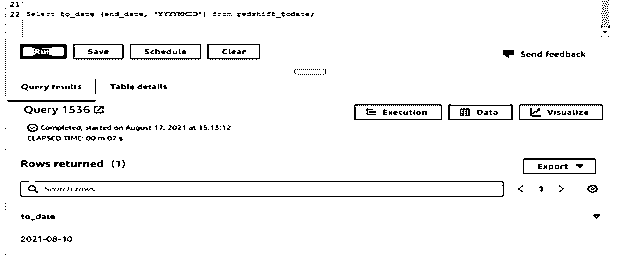
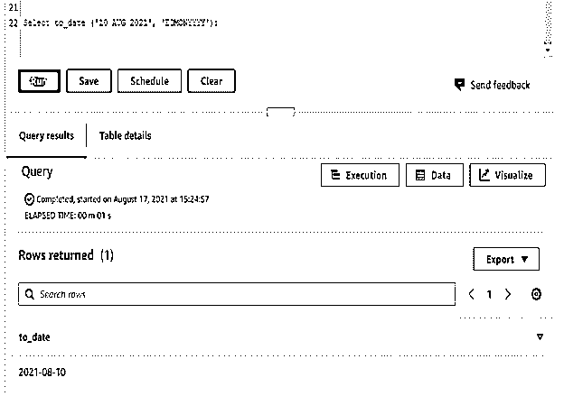
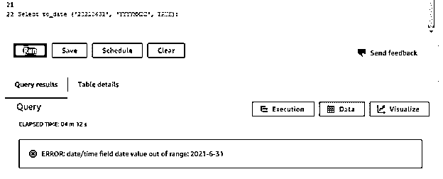

# 红移至 _date

> 原文：<https://www.educba.com/redshift-to_date/>

## 红移至 _ 日期简介

Redshift to_date 函数用于将字符串类型的列或字符值转换成日期格式。我们需要用红移中的 to_date 函数传递两个参数；第一个包含我们转换成日期数据类型的字符串，第二个包含我们用来将字符串转换成日期数据类型的格式。红移中 to_date 函数的返回类型是 date；此外，to_date 函数的返回类型取决于我们在查询中使用的格式。如果假设使用的格式是错误的，那么 to_date 函数将发出一个错误。

**语法**

<small>Hadoop、数据科学、统计学&其他</small>

下面是红移中 to_date 函数的语法如下。

*   To_date((字符串值)，(输入字符串的格式))；
*   To_date((字符串值)，(输入字符串的格式)，(is _ strict))；
*   select _ of _ column，to_char (column_name，format)from name _ of _ table；

**redshift 中 to_date 函数的参数描述语法。**

*   **String–**这被定义为字符串值，我们用它来转换为日期类型。我们也可以使用表的列名，而不是传递硬代码值。
*   **格式–**这被定义为输入字符串的格式，我们用它将字符串值转换为日期类型。它也被称为 literal，用于定义字符串的格式。它将接受日，月和年格式字符串。
*   **To _ date–**这是 redshift 中使用的一个函数，用于将字符串转换为日期类型格式。我们也可以将字符串转换成日期类型格式。
*   **是严格的–**这是在 to_date 函数中使用的可选参数。此参数将只接受真和假的布尔值。布尔值检查我们输入的输入值是否超出范围。当如果我们设置 is_strict 为 true，那么将会返回一个输入值超出范围的错误。当我们将 is_strict 设置为 false 时，则使用红移中的 to_date 函数接受超出边界的值。
*   **列名–**这被定义为列名，我们使用日期函数代替字符串值。
*   **表名–**这被定义为我们使用 to_date 函数将列字符串转换为日期类型值的表的名称。

### 如何在红移中约会工作？

基本上，to_date 函数在 redshift 中的主要用途是将字符串值转换为日期类型。

我们可以使用 redshift 中的 to_date 函数使用多种类型的模式来格式化日期值。

下面是 redshift 中的 to_date 函数使用的日期时间格式字符串。

1.  月份–大写的月份名称。
2.  月份–月份的第一个大写字母。
3.  month–小写的月份名称。
4.  MON–月份名称的大写缩写。
5.  mon–缩写月份名称的第一个大写字母。
6.  mon–小写字母中月份名称的缩写。
7.  MM–从 1 到 12 的月份数。
8.  DAY–以大写字母表示的日期名称。
9.  day–一天的名称，第一个大写字母。
10.  day–以小写字母表示的日期名称。
11.  DY–大写字母的日名缩写。
12.  dy–首字母大写的日名缩写。
13.  dy–小写字母的日名缩写。
14.  IYY–ISO 编号格式，定义编号年份的最后三位数字。
15.  IY–ISO 编号格式，定义编号年份的最后两位数字。
16.  y，YYY–用逗号分隔的四位数年份。
17.  YYYY–四位数的年份。
18.  year 今年的最后三位数字。
19.  YY—今年的最后两位数字。
20.  y–一年的最后一位数。
21.  IYYY–ISO 年份编号，定义了年份的最后四位数字。
22.  I–ISO 年份编号，定义了年份的最后一位数字。
23.  DDD——一年中的每一天从 1 到 366 结束。
24.  DD–一个月中的某一天，从 01 开始，到 31 结束。
25.  d-一周中的某一天从 1 开始，以 7 结束。
26.  CC–它被定义为世纪数字两位数。
27.  WW–年周数从 1 开始，以 53 结束。

当我们在字符串值中使用了错误的日期时，to_date 函数将返回下一个日期。

在下面的示例中，我们可以看到，当我们输入字符串“20210931”时，to_date 函数返回日期 2021-10-01。

它将返回下一个值，因为“20210931”是错误的字符串值。

**代码**

`Select to_date ('20210931', 'YYYYMMDD');`

### 至今红移的例子

下面的例子显示了红移中的 to_date 函数如下。

**Redshift to_date 函数使用“YYYYMMDD”格式转换字符串—**

*   以下示例显示了 to_date 函数使用“YYYYMMDD”格式转换字符串，如下所示。
*   我们使用字符串值“20210530”

**代码**

`Select to_date ('20210530', 'YYYYMMDD');`

**Redshift to_date 函数使用“YYYYMMDD”格式转换列字符串—**

*   我们使用列名作为 end_date from _todate 表。列 end_date 包含 varchar 类型的数据类型。

**代码**

`Select to_date (end_date, 'YYYYMMDD') from redshift_todate;`

**Redshift to_date 函数使用“DDMONYYYY”格式转换字符串—**

*   在下面的示例中，我们必须使用“DDMONYYYY”格式转换“2021 年 8 月 10 日”日期。这个转换的输出是 2021-08-10。

**代码**

`Select to_date ('10 AUG 2021', 'DDMONYYYY');`

**使用真值的 is_strict 参数的红移至 _date 函数—**

*   我们使用“20210631”作为输入字符串。这是一个无效的字符串，所以它会发出错误，如超出范围的值。

**代码**

`Select to_date ('20210631', 'YYYYMMDD', TRUE);`

**带有 is_strict 参数的 Redshift to_date 函数使用假值—**

*   我们使用“20210631”作为输入字符串。这是一个无效的字符串，但是我们使用 is_strict 作为 false，所以它将返回下一个日期。

**代码**

`Select to_date ('20210631', 'YYYYMMDD', FALSE);`

### 结论

to_date 函数用于将字符串类型的数据转换为日期类型。我们可以使用 redshift 中的 to_date 函数来使用多日期格式函数。我们可以用 to_date 函数传递字符串、格式、is_strict 参数；is_strict 是使用 to_date 函数时的可选参数。

### 推荐文章

这是红移到 _date 的指南。在这里我们讨论如何在红移中更新工作，并给出例子和代码。您也可以看看以下文章，了解更多信息–

1.  红移日期差值
2.  [什么是 AWS 红移？](https://www.educba.com/what-is-aws-redshift/)
3.  [红移物化视图](https://www.educba.com/redshift-materialized-views/)
4.  [红移子串](https://www.educba.com/redshift-substring/)

