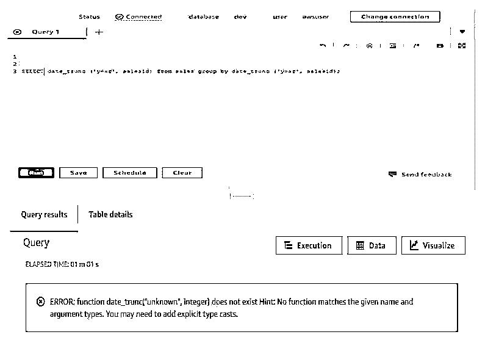
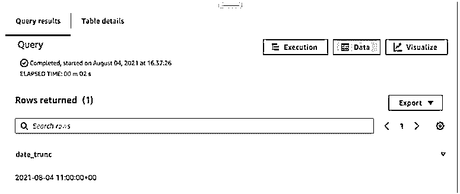
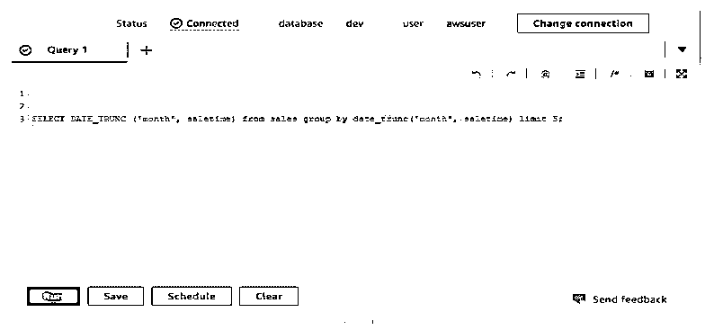
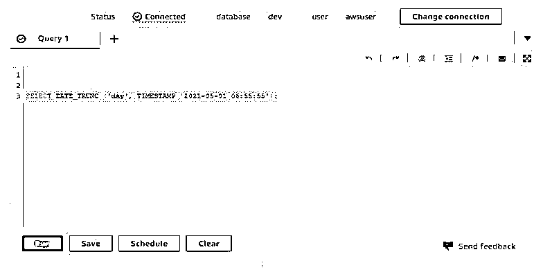
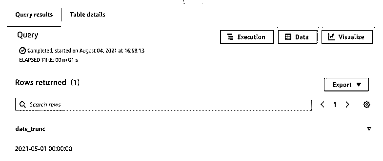
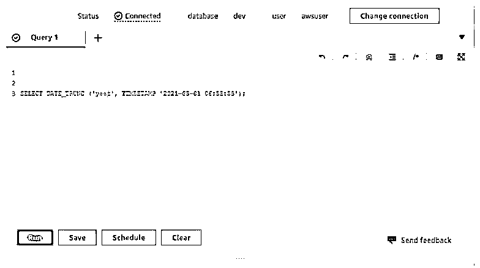
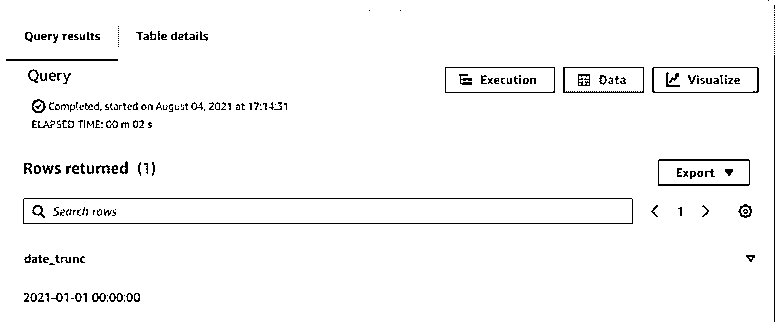
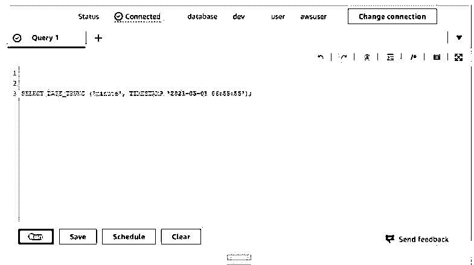
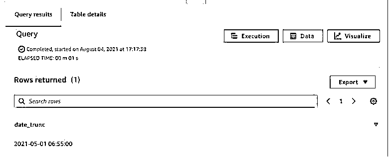

# 红移日期 _trunc

> 原文：<https://www.educba.com/redshift-date_trunc/>

## 红移 date_trunc 简介

Redshift date_trunc 函数用于根据指定的日期部分(如月、周或小时)截断时间戳或时间间隔，它将返回截断的时间戳或时间间隔，并具有一定的精度。redshift 中的 date_trunc 函数专门用于截断指定的精度。例如，如果我们想要将日期和时间值截断到最近的小时或周，可以使用 date_trunc 函数进行截断。date_trunc 函数包含两个输入参数，即 datepart 和 timestamp，redshift 中 date_trunc 函数的返回类型是 timestamp。

**红移日期 _trunc 的语法**

<small>Hadoop、数据科学、统计学&其他</small>

下面是 redshift 中 date_trunc 函数的语法:

`Select date_trunc (‘datepart’, column_name), column_name, …., column_nameN from table_name where condition group by clause order by clause`

`Date_trunc (datepart, timestamp)`

`Date_trunc (interval, column_name)`

`date_trunc (interval, timestamp)`

**参数:**

*   **date_trunc:** 红移中的这个函数类似于 trunc，用于数字。我们将这个函数用于日期和时间值。如果假设我们想从日期和时间中删除不想要的细节，那么我们必须在 redshift 中使用 date_trunc 函数。
*   **datepart:** 使用这个参数，我们必须截断指定的时间戳值。这是红移中 date_trunc 函数的一个必不可少的参数。
*   **列名:**我们使用列名从日期列中截取指定的时间戳值。我们必须指定数据类型包含日期值的列名。
*   **timestamp:** 使用 date_trunc 函数，我们还可以使用 timestamp 值，该值用于将 timestamp 列转换为时间戳。这个参数也将表达式转换成时间戳格式。
*   **interval:** 这个参数就是 interval 实参，是我们在 redshift 中要和 date_trunc 函数一起传递的。

### date_trunc 在红移中是如何工作的？

下面是 precision 的字段或区间参数，它用于在 redshift 中使用 date_trunc 函数截断日期。

*   百年
*   年
*   世
*   时区
*   时区小时
*   时区分钟
*   十年
*   千禧年
*   四分之一
*   月
*   周
*   分钟
*   小时
*   一天
*   毫秒
*   秒
*   微秒

基本上，我们可以说这个函数只对日期类型的列或值起作用。使用函数，我们可以截断小时，周，月，年，日，秒，分钟等。要在 redshift 中使用 date_trunc 函数，它将需要日期部分。我们可以将日期部分指定为日期类型列名或周、月、年、日、秒、分。我们不能对字符串或数字数据类型列使用 date_trunc 函数。要使用 date_trunc 函数，我们需要列的数据类型为日期类型格式。

下面的例子表明，要使用 date_trunc 函数，我们需要将列的数据类型设置为日期类型格式。

在下面的例子中，我们使用列名作为 salesid 该列包含整数数据类型。因此，在执行下面的查询时，它会发出函数与参数类型不匹配的错误。

**代码:**

`SELECT date_trunc ('year', salesid) from sales group by date_trunc ('year', salesid);`

**输出:**

要使用 date_trunc 函数，我们需要列的数据类型为日期类型格式。

我们还可以使用带有 group by 和 order by 子句的 date_trunc 函数，按照我们在查询中使用的 order 或 per 子句检索数据。如果我们想要截断分钟的时间戳值，那么我们需要用 date_trunc 函数传递分钟参数。如果我们从特定日期截断日期的一部分，如微秒、毫秒、秒、分钟、小时、日、周、月、季度、年、十年、世纪、千年，那么我们需要在 redshift 中使用 date_trunc 函数传递第一个参数中的特定参数。date_trunc 函数主要传递两个参数，即红移中的间隔和时间戳。

该函数将返回时间戳值。我们还可以将 now 函数与 date_trunc 函数一起使用。将 now 函数与 date_trunc 函数一起使用后，将从系统中传递当前日期。在传递当前日期和时间之后，它将截断我们必须在查询中传递的值。因此，在从列中检索日期和时间值之后，我们不需要提取时间戳值来对指定的列使用 date_trunc 函数。

### 红移的例子 date_trunc

下面给出了红移 date_trunc 的示例:

#### 示例# 1–使用 now 函数。

*   以下示例显示了带有 now 函数的 date_trunc 如下所示。将 now 函数与 date_trunc 一起使用后，将从指定的参数值中截断当前日期值。
*   我们将参数用作小时，因此它将从当前日期截断分钟。

**代码:**

`SELECT DATE_TRUNC ('hour', now ());`

**输出:**

#### 示例 2–以参数作为列名的函数。

*   以下示例显示了以参数作为列名的函数。
*   我们将列名用作销售表中销售时间。我们使用 datepart 参数作为月份。
*   此外，我们还在 date_trunc 函数中使用了 group by 子句。

**代码:**

`SELECT DATE_TRUNC ('month', saletime) from sales group by date_trunc ('month', saletime) limit 5;`

**输出:**

#### 示例 3–带有时间戳的函数。

*   下面的例子显示了带有时间戳的函数。在将 timestamp 与 date_trunc 一起使用后，它将从指定的时间戳中截断 datepart 值。
*   我们将 datepart 参数作为 day 传递。

**代码:**

`SELECT DATE_TRUNC ('day', TIMESTAMP '2021-05-01 06:55:55');`

**输出:**

#### 示例# 4–datepart 参数为年份的函数。

*   以下示例显示了将 datepart 参数作为年份的函数。
*   我们使用日期部分参数作为年份。

**代码:**

`SELECT DATE_TRUNC (‘year’, TIMESTAMP '2021-05-01 06:55:55');`

**输出:**

#### 示例# 5–datepart 参数为分钟的函数。

*   以下示例显示了将 datepart 参数作为年份的函数。
*   我们将 datepart 参数用作分钟。

**代码:**

`SELECT DATE_TRUNC (‘minute’, TIMESTAMP '2021-05-01 06:55:55');`

**输出:**

### 结论

该函数将截断我们在查询中使用的 timestamp 或 datepart 的表达式。redshift 中 date_trunc 函数的输入参数是 datepart 和 timestamp。redshift 中 date_trunc 函数的返回类型是时间戳。

### 推荐文章

这是红移 date_trunc 的指南。这里我们讨论一下绪论，date_trunc 在红移中是如何工作的？和示例。您也可以看看以下文章，了解更多信息–

1.  [红移物化视图](https://www.educba.com/redshift-materialized-views/)
2.  [红移子串](https://www.educba.com/redshift-substring/)
3.  [红移创建表](https://www.educba.com/redshift-create-table/)
4.  红移日期差值

