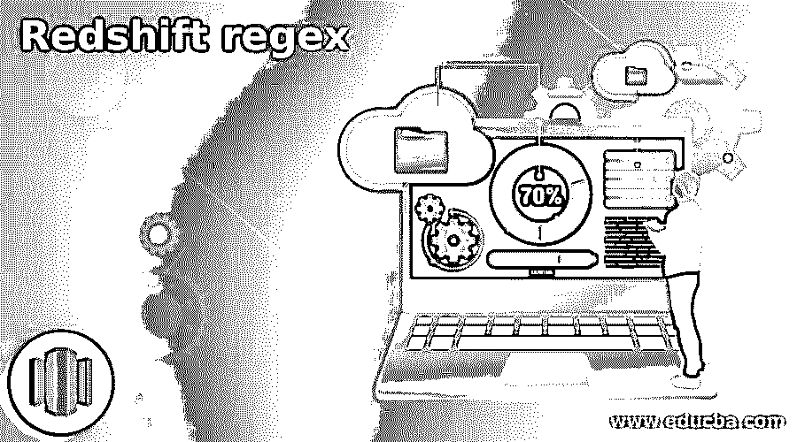
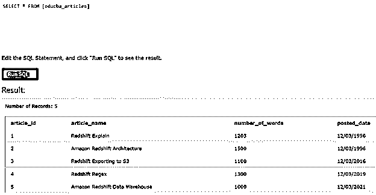
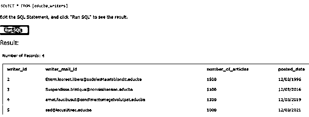
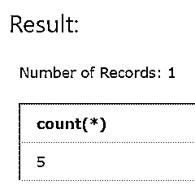
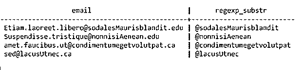

# 红移正则表达式

> 原文：<https://www.educba.com/redshift-regex/>

## 红移正则表达式简介

红移正则表达式用于在正则表达式的帮助下执行模式匹配，这是根据我们的要求指定的。在 amazon redshift 中，字符串中模式的匹配是通过使用正则表达式搜索子字符串的出现来执行的，比如使用 LIKE 操作符，或者使用与正则表达式 regex 的操作相同的相似操作符，或者使用 POSIX 正则表达式。

在本文中，我们将研究 redshift 中用于模式匹配的正则表达式，研究每个正则表达式的语法，了解它们是如何工作的，以及如何借助某些示例在 Redshift 中实现。

<small>Hadoop、数据科学、统计学&其他</small>

**语法:**

类似于运算符–的语法

`SELECT column and expressions FROM table name WHERE expression SIMILAR TO regex;`

LIKE 运算符的语法–

`SELECT column and expressions FROM table name WHERE expression LIKE regex;`

REGEX_SUBSTR 函数的语法–

`SELECT column and expressions FROM table name WHERE expression REGEX_SUBSTR (source string, regex or pattern [, index that is position [, occurrence [, arguments or parameters]]);`

### 工作和术语解释

在上述所有语法中，这里将逐一讨论所使用的术语

**Regex–**这代表正则表达式，它有助于指定我们试图在源字符串或列值中匹配和查找的模式，或者涉及对列值或字符串文字执行多个数学或逻辑运算的表达式。正则表达式包含具有特殊含义的特殊符号，例如*代表零个或多个出现的任何字符。%表示任何字符只出现一次。

**表格名称–**这是表格的名称，您将从该表格中检索要检查其正则表达式的列名或表达式值。

**表达式–**这是对表的列值或字符串文字执行数学或逻辑运算后得到的值。该运算可能涉及求和、求平均值、最大值、最小值以及其他聚合运算符或逻辑运算，例如 and、or 和 NOT。

**Source string–**这是一个源字符串，我们要在其中用命令中指定的正则表达式扫描匹配模式的存在。源字符串可以是字符串文字或任何列名，其值应该是 I string 数据类型或至少与 string 数据类型兼容。

**模式或正则表达式–**这是符合 SQL 标准的正则表达式，是一个字符串值。

**位置索引—**这是索引+1 值，是扫描匹配正则表达式时要考虑的位置。从这里开始，根据源字符串中的正则表达式进行匹配和搜索。这是一个正整数。该位置是基于字符的，这意味着即使有多字节字符，它们也被视为单个字符，而扫描位置不是基于字节的。如果未指定，position 的默认值为 1，因为扫描从源字符串的第一个字符开始。如果我们指定 position 的值，使它的值大于源字符串的长度，那么我们在输出中得到的就是一个空字符串(" ")。

**参数或自变量–**这些值可以帮助给出关于我们应该如何执行模式匹配的额外信息。它是一个字符串，有 c、I 或 e 值，每个值都有自己的含义。当我被指定时，意味着正则表达式的模式匹配应该以不区分大小写的格式进行。在 c #的情况下，模式匹配是区分大小写的，当没有指定任何或参数时，这是默认值。在 e 的情况下，我们的意思是使用一个子表达式从源字符串中提取子字符串。

**Occurrence–**这有助于指定扫描时要使用的模式的出现次数，它是一个正整数。默认情况下，未指定时，occurrence 的值设置为 1，REGEXP_SUBSTR()函数忽略第一次出现的-1 匹配。如果我们将这个值指定为小于 1 或大于要扫描的字符串中的字符数，那么将返回一个空值作为结果，因为没有进行搜索。

LIKE 运算符用于字符串比较和匹配正则表达式中指定模式的适当出现。上面讨论的通配符%和 _ 用于在该位置多次或单次出现的字符，与 LIKE 一起使用。用正则表达式扫描整个字符串进行模式匹配。SIMILAR TO is same as LIKE 运算符都执行区分大小写的整个字符串匹配。ILIKE 运算符执行不区分大小写的匹配。

### 例子

现在让我们借助例子来研究上面讨论的所有三个操作符和函数的实现。我们有两个名为 educba_articles 和 educba_writers 的表，其内容显示在以下 SQL 查询的输出中

`SELECT * from educba_articles;`

上述查询语句的输出如下图所示

`SELECT * from educba_writers;`

上述查询语句的输出如下图所示

**例#1**

类似于操作员示例——

`select count (*) from educba_articles where article_name SIMILAR TO '%(Redshift|Amazon) %';`

上述查询语句的输出是-

**例 2**

类似操作员示例——

`select count (*) from educba_articles where article_name LIKE '%Redshift%' OR article_name LIKE '%Amazon%';`

上述查询语句的输出是-

**例 3**

函数示例–

`SELECT writer_mail_id, regexp_substr(email,'@[^.]*')
FROM educba_writers
ORDER BY writer_id LIMIT 4;`

上述查询语句的输出是-

### 结论–红移正则表达式

红移正则表达式用于字符串的模式匹配，在红移中我们可以使用许多运算符和函数来做同样的事情。其中一些是 LIK 运算符，类似于运算符，以及 REGEX_SUBSTR()函数。

### 推荐文章

这是一个红移正则表达式的指南。在这里，我们讨论用于模式匹配的 redshift 中的正则表达式，研究它们各自的语法，并了解它们是如何工作的。您也可以看看以下文章，了解更多信息–

1.  [红移创建表](https://www.educba.com/redshift-create-table/)
2.  红移日期差值
3.  [什么是 AWS 红移？](https://www.educba.com/what-is-aws-redshift/)
4.  [红移物化视图](https://www.educba.com/redshift-materialized-views/)

