# 红移添加列

> 原文：<https://www.educba.com/redshift-add-column/>

## 红移添加列简介

Redshift add column 用于向现有表中添加新列，使用 add column 函数我们可以向现有表中添加新列。在添加新列时，我们需要指定要添加到表中的列的数据类型。此外，我们需要指定要添加的列的名称，在 redshift 中将列添加到表中时，列的名称和数据类型是一个重要的参数。在定义数据类型的时候还需要定义列的大小。

### 红移添加列的语法

下面给出了 redshift 中添加列的语法:

<small>Hadoop、数据科学、统计学&其他</small>

`Alter table name_of_schema.name_of_table add name_of_column datatype (size of the column);`

**redshift 中 add 列的参数描述语法:**

*   **Alter table:** 这个函数在 redshift 中使用，用来更改表，我们可以添加列，也可以在 redshift 中使用 Alter table 命令删除列。当我们在 redshift 中添加或删除列时，Alter table 很重要。
*   **模式名称:**这被定义为我们在为特定表添加新列时使用的模式名称。要使用指定模式中的表，我们需要在 redshift 中的表名之前使用模式名。
*   **表名:**这被定义为我们在添加新列时使用的表名。在 redshift 中添加列时，表名是一个重要的参数。
*   **列名:**这被定义为我们在向表中添加新列时使用的列名。
*   **列的数据类型:**在 redshift 中向表中添加新列时，我们需要定义指定列的数据类型。我们可以根据插入到列中的数据定义数据类型。
*   **列的大小:**我们需要在 redshift 中添加新列时定义列的大小。我们可以根据插入到列中的数据来定义列的大小。

### 红移中如何加列？

在向表中添加新列时，我们对新列使用下面的数据类型。根据数据，我们正在定义列的数据类型。

*   整数
*   比吉斯本
*   斯莫列特
*   真实的
*   小数
*   双倍精密度
*   茶
*   布尔代数学体系的
*   可变长字符串
*   时间戳
*   日期

我们还可以在添加时定义对列的约束。在添加到表中时，我们可以为列定义 null 或 not null 约束。在向表中添加新列时，新列被添加在所有列的最后位置。

下面的例子表明，在 redshift 中向表中添加新列时，它将被添加到最后一个位置。

在下面的例子中，我们可以看到我们已经将列名添加为 new_date，并将数据类型定义为 date。下面的查询执行成功，并给出了成功消息，意味着在日期表中添加了列。

**代码:**

`ALTER TABLE date ADD new_date date;`

**输出:**

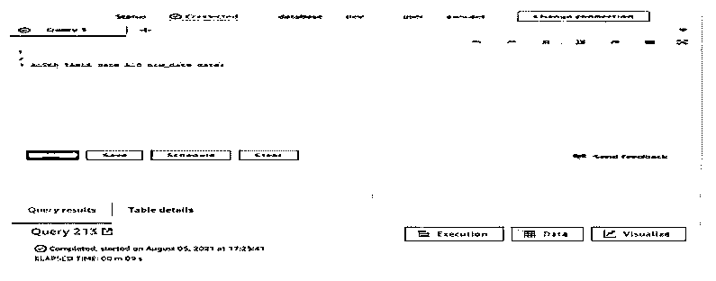

但是在下面的快照中，我们可以看到该列被添加到所有列的最后一个位置。我们可以在最后一个位置看到名为 new_column 列。

**代码:**

`SELECT * from date limit 5;`

**输出:**

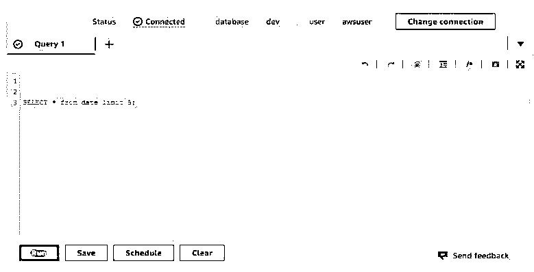

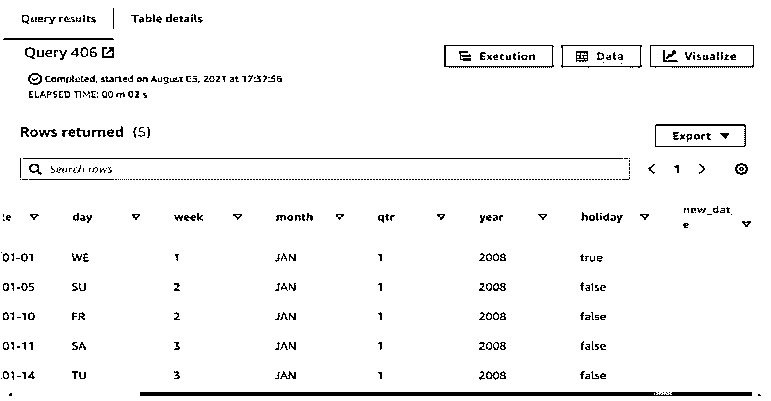

我们还可以使用像 RazorSQL 这样的 GUI 工具将列添加到表中，使用这个工具我们可以选择像在表中添加新列这样的选项。假设我们在红移中添加新列时没有定义任何约束。它将自动对新添加的列采用默认约束。

在下面的示例中，我们可以看到，在将 new_date 列添加到日期表时，我们没有使用任何约束，因此默认情况下，它会将 new_date 列视为空约束。

**代码:**

`SELECT * FROM pg_table_def WHERE schemaname = 'public' AND tablename = 'date';`

**输出:**

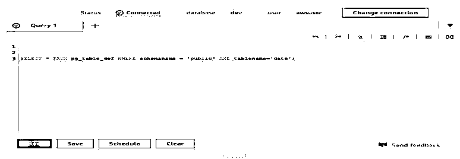

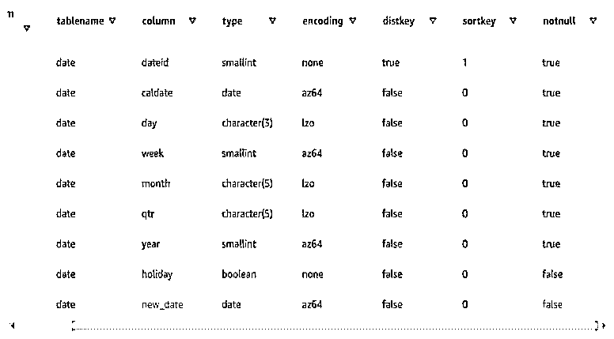

### 红移添加列的示例

下面是提到的例子:

#### 示例#1

在 redshift 中向表中添加新列。

下面的例子说明向表中添加新列如下。我们将新的列名 start_date 添加到日期表中。

**代码:**

`Alter table date add start_date date;
Select * from date limit 1;`

**输出:**

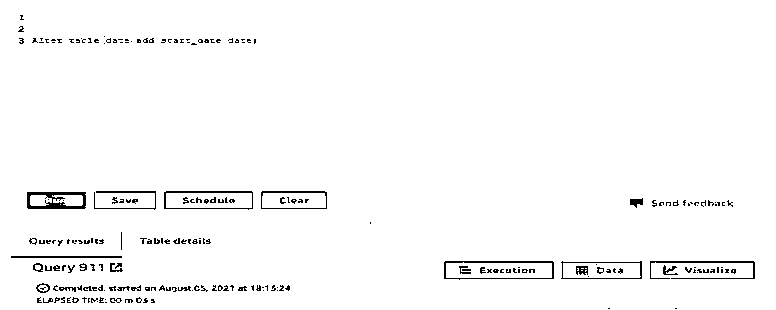

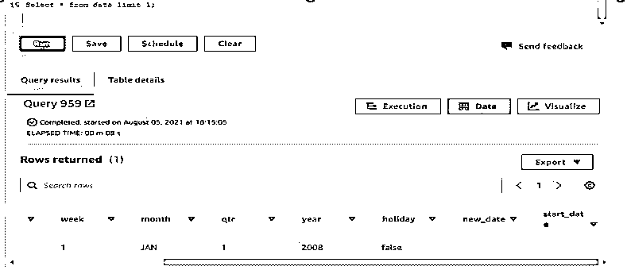

#### 实施例 2

使用 null 约束添加列。

*   下面的示例显示了使用空约束添加列。我们已经将列名 cust_name 添加到 sales 表中。
*   我们已经为 cust_name 列定义了 varchar 数据类型，还为 cust_name 列定义了 null 约束。

**代码:**

`Alter table sales add cust_name varchar null;
SELECT * FROM sales limit 1;`

**输出:**

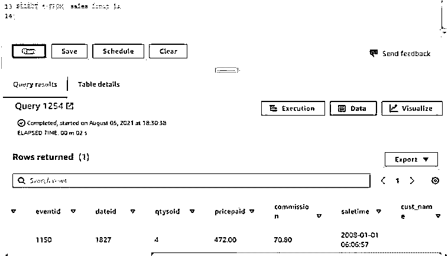

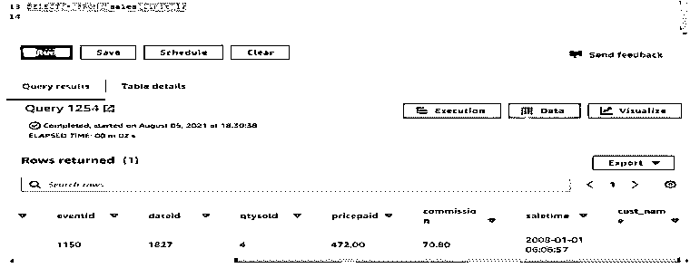

#### 实施例 3

将列添加到表中，并定义列的数据类型大小。

*   下面的示例显示了将列添加到表中并为该列定义列数据类型大小。
*   在下面的示例中，我们将 last_name 列添加到 sales 表中，并将数据类型定义为 varchar。此外，我们还将列数据类型大小定义为 10，这意味着我们最多可以在该列中添加 10 个字符。

**代码:**

`Alter table sales add last_name varchar (10);
Select * from sales limit 1;`

**输出:**

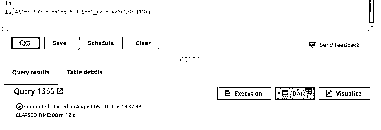

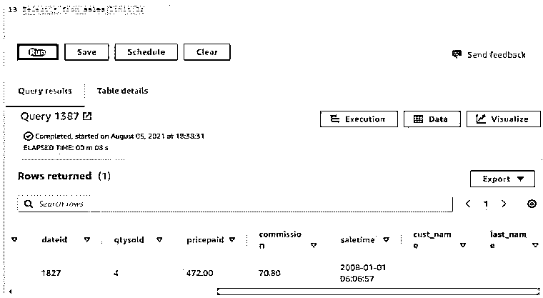

#### 实施例 4

向表中添加列，并将数据类型定义为整数。

*   以下示例显示了将列添加到表中，并将数据类型定义为该列的整数。
*   我们已经在日期表中添加了列名 dateid1。

**代码:**

`Alter table date add column dateid1 int;
SELECT * FROM date limit 1;`

**输出:**

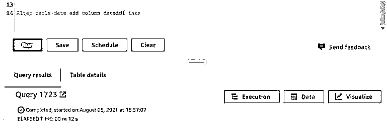

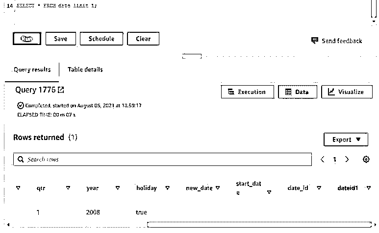

### 结论

我们可以使用 alter table 命令在现有的表中添加列。在向表中添加新列时，我们可以为该列定义任何数据类型。将新列添加到表中后，它将被添加到最后一个位置。

### 推荐文章

这是一个红移加列的指南。这里我们讨论一下入门，如何在红移中添加列？和示例。您也可以看看以下文章，了解更多信息–

1.  [红移物化视图](https://www.educba.com/redshift-materialized-views/)
2.  [红移子串](https://www.educba.com/redshift-substring/)
3.  [红移创建表](https://www.educba.com/redshift-create-table/)
4.  红移日期差值

