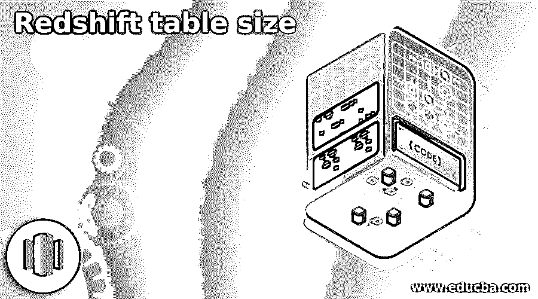
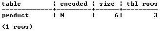

# 红移表大小

> 原文：<https://www.educba.com/redshift-table-size/>

## 红移表大小介绍

红移为用户提供了不同类型的功能，其中表大小是红移提供的功能之一。基本上，红移表大小用于获取关于用户定义的表的所有基本信息，该表的大小取决于用户的要求。换句话说，我们可以说它只对用户定义的表有效，对系统生成的表无效。通过使用 table size 命令，我们可以列出指定数据库中的所有表及其大小，还可以显示最小大小和最大大小的表，从最大到最小的表自动排序。

**语法:**

<small>Hadoop、数据科学、统计学&其他</small>

`select “name of table”, size of table, number of rows from each table from svv_table_info;`

**说明:**

在上面的语法中，我们使用 select 语句来显示具有不同参数的表的大小，如下所示。

**表名:**表名是指用户实际创建的表名，基本上我们可以认为是列名。

**表的大小:**表的大小是一列，基本上是用来存储用户自定义的表的大小。

**每个表的行数:**行数列用于显示每个自定义表的总行数。

**svv _ table _ info:**svv _ table _ info 用于显示数据库中表格的汇总，基本上是一个过滤器。

### 如何在红移中获取表大小？

现在让我们来看看如何在红移中得到表的大小，如下所示。在表大小之前，我们必须知道什么是数据库，什么是表，如下。

基本上，对数据库的理解是基础的和重要的进步，它将使你的数据集计划建立在一个坚实的基础上。根据您对数据库的理解，您可以使用许多条件来获得您的潜在利益，就像您可以选择基于受过教育的选择和合理的执行愿景。数据库帮助你设置不同界限的权力，包括你正常的数据库储备，甚至问题执行得如何。在继续构建您的查询之前，先努力完全理解您的数据库和当前的连接。

在创建数据集之前，您需要设置 Amazon redshift 的 bunch，并保证一切都与您的 SQL 客户设备相关联。一个孤立的集群可以有许多数据库。

创建数据库后，我们可以在单个数据库中创建多个表。基本上，我们可以根据用户要求创建表格，这意味着我们需要什么列，表格的大小等。表格是数据集内表格配置中保存的相关信息的分类。它由线段和直线组成。

基本上，该表包含不同列和行的组合，用户可以创建具有不同类型约束(如主键、外键等)的表。按照他们的要求。当我们在那时创建一个表时，它会在云或本地系统上分配一些与数字列和数字行相关的空间。

在简单的 Amazon 中，Redshift 提供了不同的实用程序来显示表的大小。这些内容看起来(实际上是)有些复杂，但是从根本上说，执行这些内容是为了快速返回框架中所有客户机表的概要，以及每个表的不同数据。我们动机的重要部分是兆字节，它显示了特定表的所有超大部分，以兆字节为单位。

显示数据集中表格的概要数据。view channels 框架表和仅显示了客户端特征表。我们可以利用 SVV _ 表 _ 信息视图来分析和处理可能影响查询执行的表计划，合并压力编码、循环键、排序样式、信息传递倾斜、表大小和洞察力的问题。SVV _ 表 _ 信息 see 不返回空表的任何数据。

### 例子

现在让我们来看看不同的表大小的例子，以便更好地理解红移。在执行 table size 命令之前，我们必须使用如下命令创建表格。

`create table product(
product_id int not null,
product_name varchar(255) not null,
product_cost decimal(15,2) not null,
primary key (product_id));`

**解释**

在上面的示例中，我们使用 create table 语句在创建表的过程中创建索引，如下所示:我们创建了一个具有不同属性和不同数据类型的产品表，如图所示。这里，我们在 product_id 列名上添加主键，如下所示。最后的输出或者我们可以说上面语句的最终结果我们可以用下面的截图来说明如下。

现在让我们如下执行表格大小命令。

`select “table”, encoded, size, tbl_rows from svv_table_info;`

**解释**

在上面的例子中，我们使用 svv_table_info 根据用户需求显示表格的大小。在本例中，我们使用一个带有不同参数的 select 子句，如下所示。

**表:**基本上是一个列名，包含了用户自定义的所有名称

**encoded:** 它也是一个列名，用于显示特定的表是否编码。

**Size:** 用来显示表格的大小。

**tbl_rows:** 用于显示表格中存在的多行。

最终输出或者我们可以说是上述语句的结果，我们可以使用下面的屏幕截图来说明。

这里我们只创建了一个表，但是您可以创建多个表，并使用 diststyle、sortley1 等表大小命令应用不同的参数。

### 结论

我们希望从这篇文章中你了解更多关于红移表的大小。从上面的文章中，我们已经了解了红移表大小的基本概念和语法，我们还看到了红移表大小的不同示例。从本文中，我们了解了如何以及何时使用红移表大小。

### 推荐文章

这是红移表大小的指南。这里我们讨论红移表大小的基本概念和语法，我们也看到不同的例子。您也可以看看以下文章，了解更多信息–

1.  [红移子串](https://www.educba.com/redshift-substring/)
2.  [什么是 AWS 红移？](https://www.educba.com/what-is-aws-redshift/)
3.  [红移 Row_NUMBER()](https://www.educba.com/redshift-row_number/)
4.  [红移物化视图](https://www.educba.com/redshift-materialized-views/)

