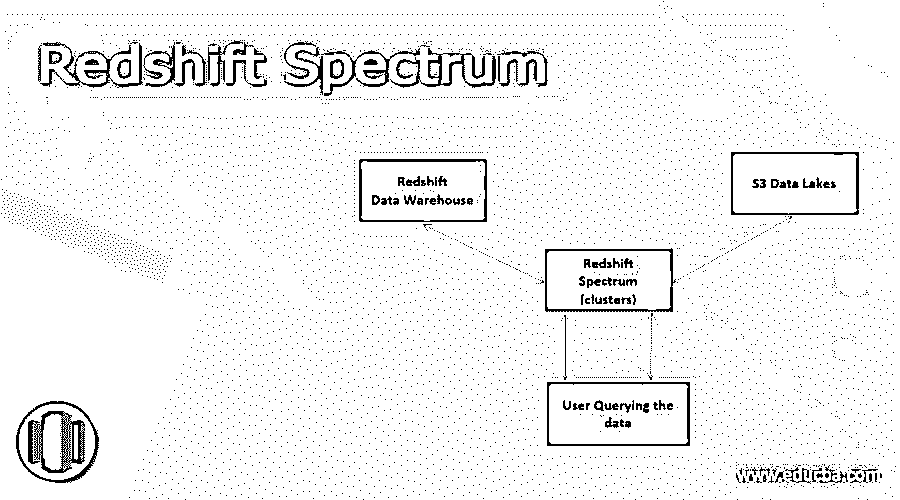
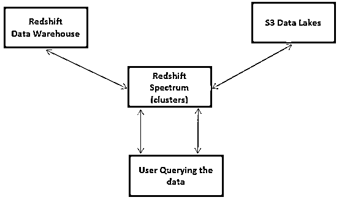

# 红移光谱

> 原文：<https://www.educba.com/redshift-spectrum/>

## 什么是红移光谱？

Redshift spectrum 是 Amazon Redshift Web Services 的一部分，它提供了一个通用平台，可以从其热数据存储和冷数据存储(遗留数据)中提取/查看数据，而不必转移到不同的软件工具。热实时数据存储在成本更高的红移数据仓库中，而被稀疏访问的冷传统数据存储在更便宜的数据湖中，如亚马逊 S3 桶。

Redshift spectrum 通过将不常访问的数据从其主存储中移走，帮助许多组织节约存储成本，并以合理的更快速度检索隔离的数据，而无需花费太多精力。

<small>Hadoop、数据科学、统计学&其他</small>

### 红移光谱 vs 雅典娜

Redshift Spectrum 是 Redshift 的逻辑扩展，用于查询 Redshift 以及亚马逊 S3 数据湖中的数据，而 Athena 是一个专用工具，仅用于查询亚马逊 S3 的数据。

在 Athena 的例子中，资源分配和取消分配由 Amazon web services 负责，而 Spectrum 中的集群供应由最终用户处理。用户将能够控制红移光谱的成本。

Athena 的性能取决于系统的负载，因为它是在与其他用户共享资源的模式下工作的，而 Spectrum 的性能是一致的，因为它是在专有的内部设置上运行的。

可以通过增加或优化红移集群资源和 S3 存储来增强频谱性能，但 Athena 的性能仅基于 S3 参数。

大型 IT 安装可以选择 Spectrum，而小型安装可以选择简单的 Athena。

用户将不得不在 Spectrum 中管理集群，而在 Athena 中是绝对无服务器的。

Athena 根据所做的查询和扫描的数据量向用户收费。频谱成本也基于按使用付费模式。用户可以通过压缩数据、将数据存储在列中以及对数据进行分区来节省资金。

### 亚马逊红移客户

Amazon Redshift 在 500 强公司、几家中型公司和许多初创公司的数据分析领域拥有强大的影响力。它无所不在，无所不能。亚马逊红移使其客户能够获得对数据的深刻见解，并获得最大利益。

Zyanga、可口可乐、Wynk Music、必胜客、redhill games、肯德基、Big Basket、纳斯达克和丰田是红移客户名单中的一些大公司。

亚马逊红移谱的三个关键概念

### 频谱是如何工作的？

传统上，实时数据存储在结构化数据库中，需要时通过查询语言查询数据。Redshift 提供了存储此类数据的仓库工具和呈现查询工具。不经常使用的数据被推入冷存储，亚马逊提供 S3(简单存储服务)来存储旧数据。数万亿兆字节大小的对象存储在亚马逊 S3 提供的存储服务中。

Amazon 的 Athena、Elastic MapReduce 和 Redshift 可用于从 S3 提取数据，并将结果呈现给最终用户。
1。Athena 提供了存储在 S3 中的遗留数据的直接查询工具。有几个接口(API)可以方便这些查询。用户不必管理任何服务器。

2.MapReduce 部署 Hadoop 类型的查询来处理以非结构化方式存储的大数据。

3.Redshift 从 S3 中提取数据，并将其加载到 Redshift 集群中进行进一步处理(通过 ETL 方法)。

所有上述解决方案都涉及很高的成本和工作量，而红移光谱提供了一个简单的解决方案来处理热

最便宜的遗留数据让用户享受两个世界的好处。

1.红移中为活动数据构建的红移查询可以继续使用

2.它直接从 S3 查询冷的遗留数据，而不遵循任何 ETL 处理

3.来自 S3 的结果和实时数据被结合并呈现给用户

4.单个查询就足以从红移仓库和 S3 数据湖中提取数据。

5.用户不必为处理 S3 数据支付任何额外的计算资源，他们只需为从 S3 查询的数据量付费

### 三个关键概念

整个部署红移频谱在虚拟私有云模式下工作，集群资源可用于运行查询并获得结果。这些星团由光谱支持，独立于红移域。

三个关键概念是

a.S3 的数据目录，
b . S3 数据的模式
c. S3 数据表

数据目录保存了存储在 S3 数据湖中的组织数据的模式定义，它是数据资产的元数据的中央存储库。AWS glue、Athena 数据目录、Hive metastore (Amazon EMR)是目录中可用的各种选项。

模式包含数据表和其他数据库对象的信息，例如视图、S3 数据存储的函数。

表保存数据，并在使用 SQL 中的 Select 语句查询时返回数据，这些表是只读的，不允许写或更新。没有对频谱的独家查询。Redshift 中使用的查询可以直接用于对 S3 数据存储的数据库引用的更改。

连接内部和外部表

红移内部表和 S3 外部表可以在 SQL 的查询语句中组合在一起，并明确引用表的源，无论是红移还是 S3。匹配表时应该使用匹配条件

### 红移光谱图

从仓库和 S3 查询的数据的图形表示，以及它们被合并并呈现给用户的方式

### 红移光谱的好处

1.可以在单个查询中访问实时数据和遗留数据。
2。它提供了经济高效的数据分析解决方案。
3。用户不必担心他们不会驻留在仓库或湖泊中的数据。
4。易于维护和管理。
5。提供安全且可扩展的解决方案。

### 结论

红移光谱提供了一个集成的商业智能解决方案。由于可以很容易地从档案中提取数据，如果交易处理不需要数据，越来越多的数据可以转移到档案中，本组织也不必增加实时存储，从而节省大量成本。

### 推荐文章

这是红移光谱指南。这里我们讨论什么是红移光谱？频谱是如何工作的？分别受益。您也可以看看以下文章，了解更多信息–

1.  [红移物化视图](https://www.educba.com/redshift-materialized-views/)
2.  [红移子串](https://www.educba.com/redshift-substring/)
3.  [红移创建表](https://www.educba.com/redshift-create-table/)
4.  红移日期差值

