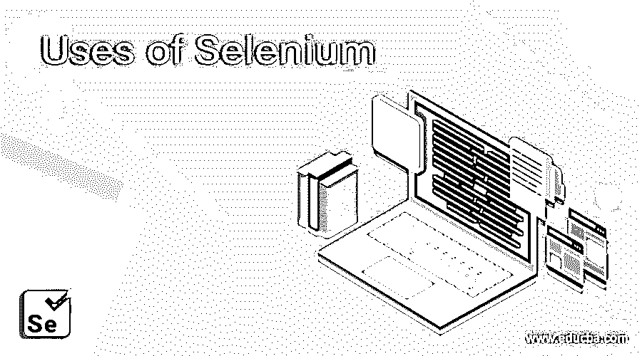

# 硒的用途

> 原文：<https://www.educba.com/uses-of-selenium/>

## 硒的用途介绍

Selenium 是一个用于测试网站和 web 应用程序的自动化框架，因为它是开源的，所以成本更低或者没有成本。由于其效率非常高，因此缺陷滑移的可能性更小，测试曝光和测试精度更高。与目前市场上可用的任何其他自动化工具相比，它涉及的人工参与非常少，因为它通过支持一键式自动化来更快地处理测试脚本。

### 硒的十大用途

请查看以下部分，以下是 10 大用途列表。

<small>网页开发、编程语言、软件测试&其他</small>

#### 1.自动化测试

早些时候，人们习惯于做手工测试，这曾经是一件令人头疼的事情。自动化测试的主要目的在于自动化回归测试。这对非常大的项目非常有帮助。在这种情况下，当在项目中的任何一个脚本中的源代码中进行小的改变时，测试人员需要手动测试软件或项目的每一个创建的功能，这需要花费大量的时间。对于测试人员来说，从头开始完全测试整个功能可能需要几天的努力，[自动化测试工具](https://www.educba.com/automation-testing-tools/)比如 selenium 在这种情况下非常有用。它节省了测试人员巨大的测试时间，也减轻了他们的压力。

#### 2.重要优势

下面提到了使用自动化测试工具的一些最重要的好处:

*   测试人员的负担和压力更少—如上所述，在每一个新的构建中测试重复的测试场景所需的时间几乎减少到零。因此，减轻了测试者的负担。
*   **降低商业客户的成本—**企业需要支付测试人员的工资，使用自动化测试工具来节省工资。自动化不仅节省了时间，还为企业带来了成本优势。
*   **增加测试覆盖—**随着使用的增加，测试时间减少了，因此测试人员可以在同一时间对其他测试场景进行更多的测试。
*   **提高测试准确性–**使用手工测试过程，测试人员可能会忘记或错误地测试测试场景。但是通过使用自动化测试脚本，系统既不会忘记也不会错误地测试测试用例。

#### 3.人力资源减少

自动化测试可以在不需要测试工程师的情况下执行软件测试。

*   **创建自动化脚本—**测试人员可以使用他/她选择的语言或者自动化工具支持的语言来开发自动化脚本，正如前面提到的，因此语言不是障碍。
*   **运行自动化脚本—**测试人员运行他刚刚使用自动化工具的运行命令创建的测试脚本。就这么简单。
*   **查看自动化工具的测试结果—**对于自动化脚本的每次运行，工具都会生成结果并提供详细的报告 0。结果报告向用户显示所有重要的发现，例如所执行的测试是正确的还是错误的。

#### 4.几种补充服务

它可以执行许多测试服务，因此使用非常广泛。

*   Selenium 自动化测试可以与 web 应用程序类型无关地工作。
*   它也可以通过[测试自动化框架](https://www.educba.com/test-automation-framework/)用于性能测试。
*   它也用于自动化 web 应用程序测试。
*   它与广泛流行的 POM 概念和关键字、数据驱动、混合方法一起使用。
*   Selenium 网站测试可以使用多种语言、浏览器和平台来执行。
*   Selenium 移动测试也适用于所有类型的基于智能手机的应用程序。

#### 5.快速准确

速度要求是另一个优点。在所有场景中，自动化测试都可以击败手工测试。它不仅速度更快，而且还需要更少的人力测试投资。有了更少错误的可能性，频繁执行测试用例也是可能的。它还支持无人值守执行、功能测试和回归测试。

例如:–假设有一个登录页面，需要验证登录尝试是否成功。对于这种情况，很容易编写几行代码，并通过自动化测试用例的执行来验证登录尝试是否成功。不仅如此，这些测试还可以进行适当的配置，以便可以在不同的环境和不同的 web 浏览器中进行测试。结果文件的生成也可以仅通过在给定的时间安排它来自动化。

#### 6.支持多种浏览器:–

Selenium 作为一种测试工具，支持各种浏览器，例如所有最新版本的 Internet Explorer、Opera、Chrome、Safari 和 Mozilla Firefox。

#### 7.由动态社区支持

它有一个由谷歌支持的动态开发者社区。这确保了对任何问题、错误或附加版本的快速支持。

#### 8.其他可行性

就其用途而言，有许多定位元素的可靠方法，如 Xpath、CSS、DOM 等。

#### 9.适用于面向对象

如果使用 Selenium 的应用程序，那么实现那些围绕面向对象编程概念的框架就非常方便，比如关键字驱动、数据驱动和混合模型。

#### 10.不错的集成支持

使用它还可以支持 on 的集成。有了这个特性，它可以用来执行同步测试。因此，可以在各种机器上利用各种浏览器。这减少了大型项目的测试执行时间。

### 结论

硒的使用有多种选择。它带有以下选项:-

*   硒 IDE
*   硒遥控(遥控器)
*   Selenium 2.0(网络驱动)

Web Driver 或 selenium 2.0 是其家族中最流行、使用最广泛的工具。Web 驱动 API 与 Selenium RC 扮演的角色相同。建议未来的测试工程师必须学习 Selenium，因为它几乎用于所有的测试工作。

### 推荐文章

这是硒在现实世界中的使用指南。这里我们讨论了硒的不同应用，如快速和准确，动态社区，减少人力资源等。您也可以阅读以下文章，了解更多信息——

1.  [Hadoop 的用途](https://www.educba.com/uses-of-hadoop/)
2.  [CSS 的用途](https://www.educba.com/uses-of-css/)
3.  [什么是 XPath？](https://www.educba.com/what-is-xpath/)

