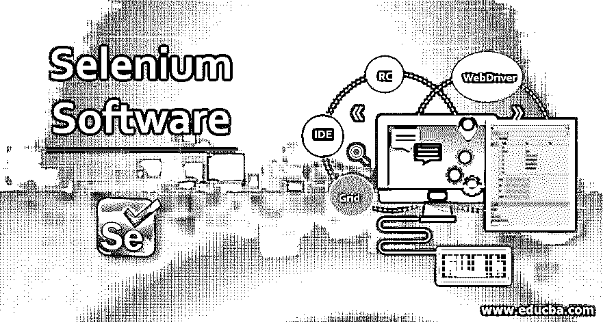
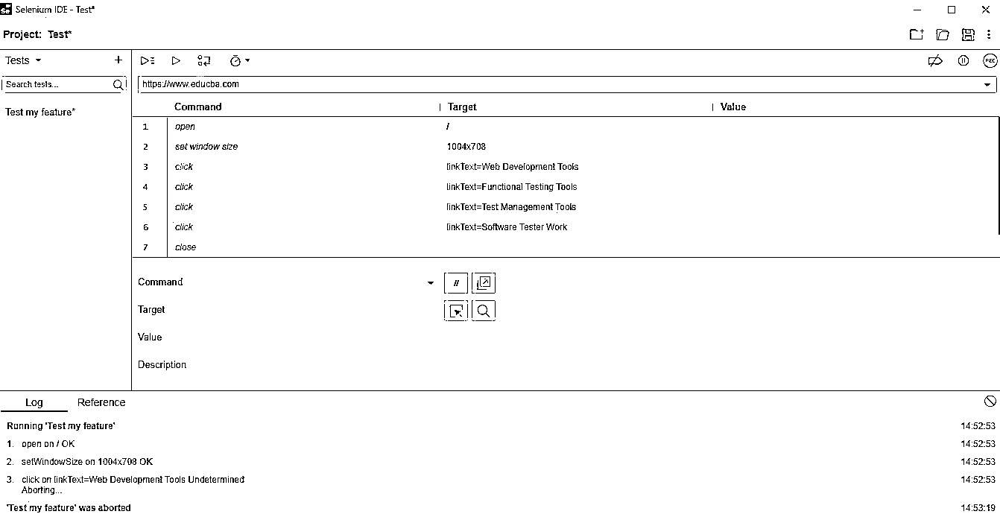

# Selenium 软件

> 原文：<https://www.educba.com/selenium-software/>




## Selenium 软件简介

下面的文章提供了 Selenium 软件的概要。Selenium 是一个测试自动化框架，可用于 web 应用程序。它是一个开源软件，所以可以零成本使用。这是为数不多的可以在多种操作系统上工作的自动化测试工具之一，包括 Mac、Linux 和 Windows 操作系统。它受到各种编程语言和编程脚本的支持，如 PHP、Perl、Java、Python、JavaScript 等。

### 为什么是硒？

首先，对手工测试说不。为什么？啊！嗯，在我看来，我们不喜欢一遍又一遍地做同样的工作。它既无聊，又费时，还会出错？不，不，不，不。我们很聪明，我们知道周围的路。为什么没有一个程序来做呢？答案硒来了。通过脚本执行，生成报告，并设置生命。显然，市场上还有其他工具可供选择，比如惠普的 QTP(快速测试专家)，IBM 的 RFT (Rational Function Tester)，但这两个工具都是专有的。

<small>网页开发、编程语言、软件测试&其他</small>

| **特性** | **硒** | **惠普的 QTP** | **IBM 的 RFT** |
| **开源** | 是 | 不 | 不 |
| **客户支持** | 开源社区 | 惠普支持 | IBM 支持 |
| **操作系统支持** | Windows、Linux 和 Mac | Windows 操作系统 | Windows 操作系统 |
| **编程经验** | 需要丰富的经验 | 不需要 | 需要 |
| **执行过程中 CPU 堵塞** | 低的 | 高的 | 高的 |
| **编程语言支持** | Java、Ruby、Perl、Python、C#、PHP 和 JavaScript | vbscript | Java 和 C# |

### 软件中 Selenium 的 4 个组件

Selenium suite 有 4 个组件，每个组件都有其重要意义:

#### 1.Selenium IDE(集成开发环境)

一个浏览器扩展，具有记录和回放功能，可以提高创建测试用例的速度。

样本记录可以是:




上面的截图取自我的谷歌 Chrome Selenium 扩展。要下载您的，请转到浏览器的扩展页面并尝试安装 Selenium IDE。尝试记录和运行脚本。如您所见，它捕获了每个步骤的执行时间，这对性能测试非常有帮助。

#### 2.Selenium RC(遥控)或 Selenium 1

它有两个组件 Selenium RC 服务器和 Selenium RC 客户端，以克服同源策略的问题。它欺骗浏览器相信请求来自同一个域。由于性能较慢，它现在已被弃用，并与 WebDriver 合并。

#### 3.web 驱动程序

这是一个跨平台的测试框架，可以从操作系统层面控制浏览器。它提供了创建和执行测试用例的编程接口。比 Selenium RC 快多了。

根据您执行测试的选择，有不同的 web 驱动程序可用:

*   铬驱动程序
*   火狐驱动(Geko 驱动)
*   Internet Explorer 驱动程序
*   歌剧司机
*   HTML 单元驱动程序 safari 驱动程序

您可以考虑下面的示例代码来测试 eduCBA 的一个链接。代码是用 Java 写的，用的是 Chrome WebDriver。我们已经在我的类路径中添加了一个 selenium jar，我还下载了 chromedriver.exe 并把它放到了我的 D: drive 中。如果您的项目是基于 Maven 或 Gradle 的，那么继续添加依赖项。

**代码:**

```
public class ChromeTest {
public static void main(String[] args) throws IOException {
System.setProperty("webdriver.chrome.driver", "D:\\chromedriver.exe");
ChromeOptions chromeOptions = new ChromeOptions();      
chromeOptions.addArguments("disable-gpu");       
chromeOptions.addArguments("window-size=1200,1100");
WebDriver driver = new ChromeDriver(chromeOptions);              
driver.get("https://www.educba.com/");
By link = By.xpath("//a[text()='Certification Courses']");
WebElement element = driver.findElement(link);          
System.out.println(element.getText());           
driver.quit();
}
}
```

这将尝试捕获带有文本“认证课程”的

#### 4.硒栅

Selenium Grid 与 RC 一起用于在远程机器上运行测试。我们可以用 Grid 运行多个脚本。它能够在执行过程中捕获屏幕截图，并同时向机器发送 selenium 命令。它利用了中枢和节点的概念。作为中心源的集线器和与之相连的节点。

现在你可以想花就花了。我们看到了不同味道的硒。你可以很容易地在它们中选择什么。公司对这种角色有一个特殊的简介，如果你想进入这个领域，学习 Selenium 可能是一个好的开始，但在你选择任何东西之前，他们都知道你的职业道路。

### Selenium 软件的优缺点

下面给出了提到的优点和缺点:

#### 优势

由于 selenium 是开源的，因此不涉及许可成本，并且谈论其他优势:

*   测试脚本可以用任何一种编程语言编写:Java，C#。Net、Ruby、PHP、Python 和 Perl。
*   你可以在任何一种网络浏览器上进行测试:谷歌 Chrome、Mozilla Firefox、Internet Explorer、Safari 或 Opera
*   人们可以在任何操作系统上进行测试:Linux、Windows 或 Mac。
*   Selenium 还可以与 Maven(构建自动化工具)、Jenkins 和 Docker 集成，进行持续测试。

#### 不足之处

让我们知道 selenium 只能用于测试 web 应用程序。

此外，下面列出了一些限制，在继续下一步操作之前应该了解这些限制:

*   Selenium 没有任何客户支持系统，但是可以利用现有的客户社区。
*   Selenium 不支持对图像进行测试。但是 Selenium 可以与 Sikuli (GUI 自动化工具)集成，用于基于图像的测试。

### 推荐文章

这是一个硒软件指南。在这里，我们讨论 selenium 在软件中的 4 个主要组件，以及 Selenium 的优缺点。您也可以浏览我们推荐的其他文章，了解更多信息——

1.  [Selenium 中的 XPath 是什么？](https://www.educba.com/what-is-xpath-in-selenium/)
2.  [硒自动化测试](https://www.educba.com/selenium-automation-testing/)
3.  [硒工具](https://www.educba.com/selenium-tools/)
4.  [Selenium IDE 命令](https://www.educba.com/selenium-ide-commands/)


