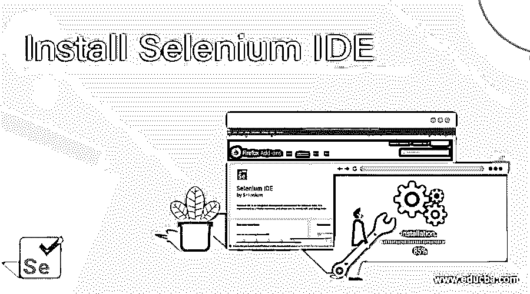
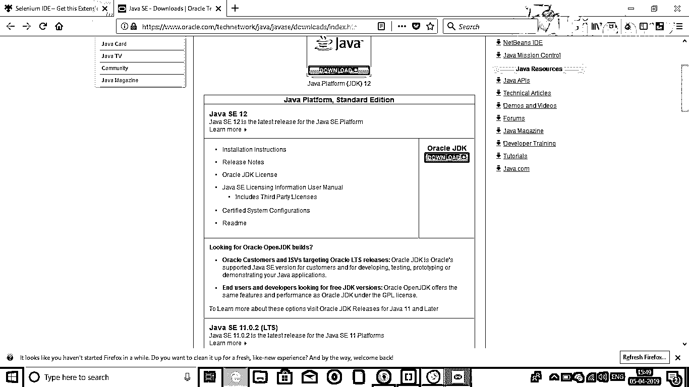
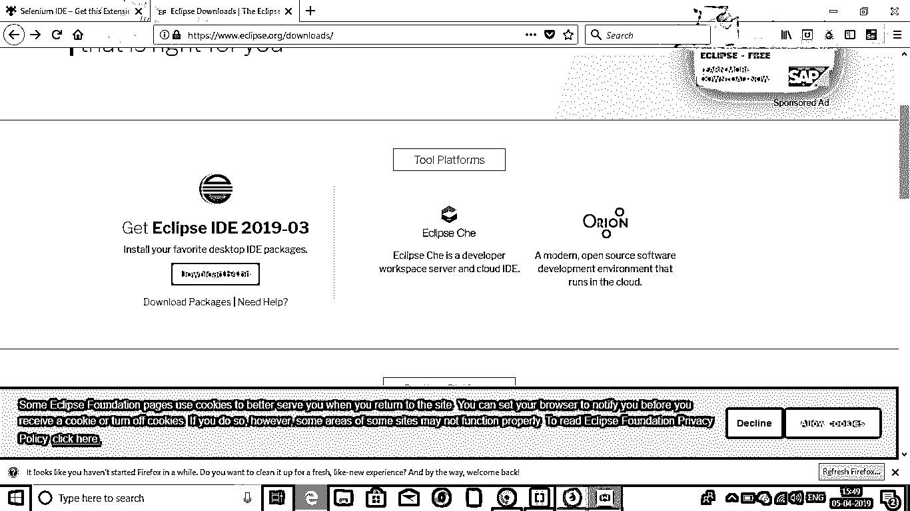
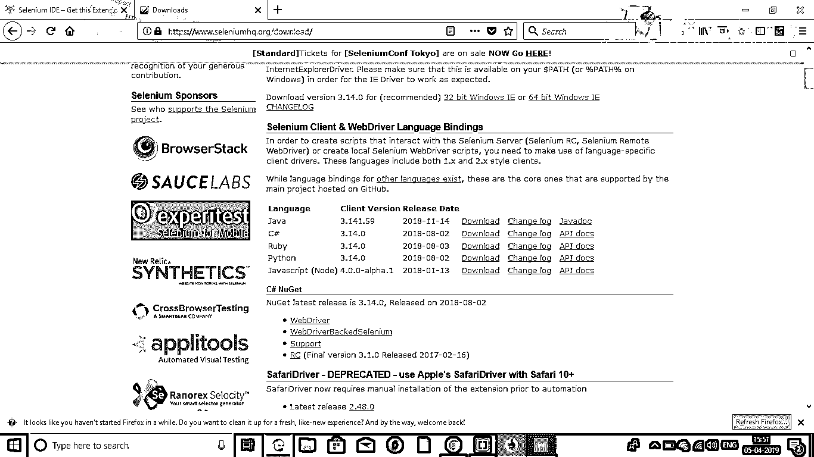
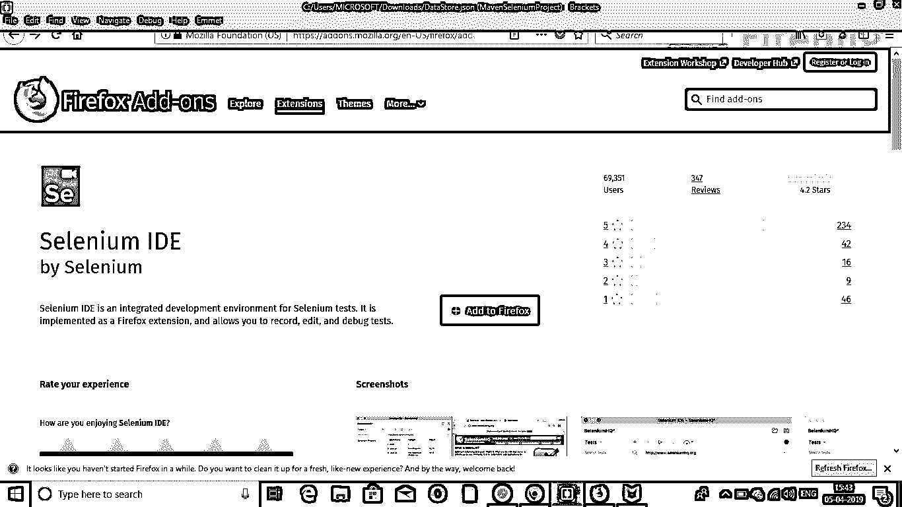
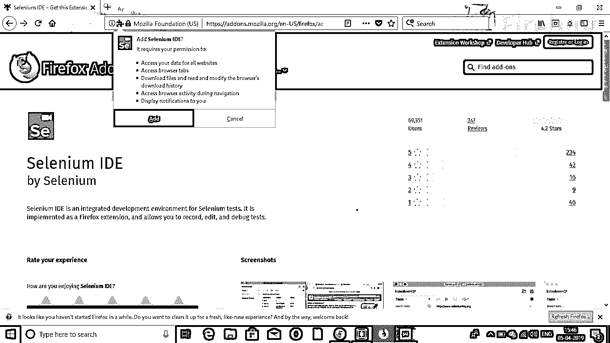
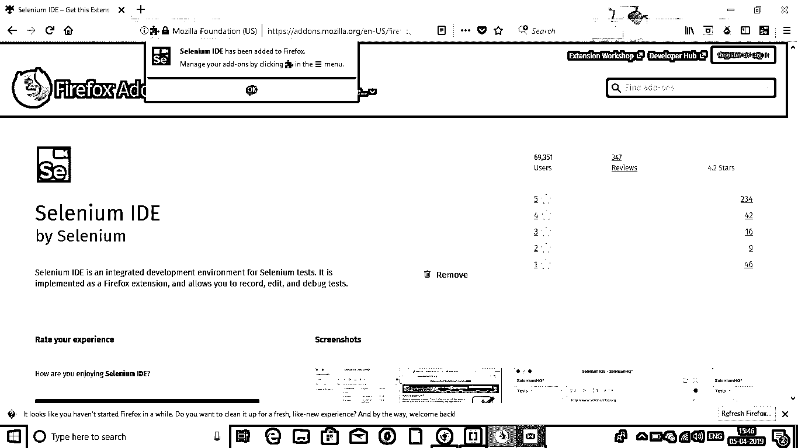
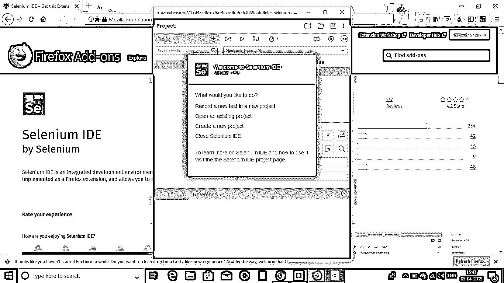

# 安装 Selenium IDE

> 原文：<https://www.educba.com/install-selenium-ide/>

## 如何安装 Selenium IDE

Selenium IDE(集成开发环境)是用于开发测试用例的自动化工具。这既是一种节省时间的方法，也是一种学习 Selenium 语法的好方法。它通过 Selenium 命令以及特定元素上下文中定义的参数来记录用户在浏览器中的操作。这通常是开发测试用例最有效的方式，也是 Chrome 和 Firefox 扩展的易用方式。在本文中，我们将讨论如何安装 Selenium IDE。

硒 IDE 因以下特性而闻名:

<small>网页开发、编程语言、软件测试&其他</small>

*   **弹性测试:【Selenium IDE 所做的是，它将记录它将要与之交互的每个元素的所有定位器。在回放过程中，一个定位器失败了，那么其他定位器仍将被尝试，直到一个定位器成功为止。**
*   **控制流:** Selenium IDE 自带 if、while、times 等循环结构，是一种扩展的控制流结构。
*   **测试用例的重用:**通过使用 run 命令，我们可以重用另一个测试用例中的一个测试用例，比如说，允许我们在整个套件的许多地方反复使用登录逻辑。
*   **插件:**通过插件的使用，可以对 Selenium IDE 进行扩展。它们可以与第三方服务集成。

### 安装 Selenium WebDriver 的步骤

下面是安装 Selenium Web 驱动程序的步骤:

#### 步骤 1: Java 安装

*   从****下载并安装最新的 Java 软件开发工具包(JDK)。****
***   JDK 的优点是它与 Java 运行时环境(JRE)结合在一起，从而节省了您单独下载和安装 JRE 的时间和精力。*   安装完成后，打开命令提示符并键入 java。你会得到一份关于它的详细清单。**

 **

#### 步骤 2: Eclipse IDE 安装

*   从[https://www.eclipse.org/downloads/](https://www.eclipse.org/downloads/)下载并安装最新版本的“Eclipse IDE”。在选择 [Windows 32 位和 64 位版本](https://www.educba.com/32-bit-vs-64-bit-operating-system/)时要小心。exe 文件将作为“eclipse-inst-win64”下载。
*   安装程序完成后，单击启动。这将启动 Eclipse IDE。

#### 步骤 3: Selenium Java 客户端驱动程序安装

*   从 https://www.seleniumhq.dev/[下载 Selenium Java 客户端驱动程序。选择 Java 的客户端驱动程序。这将下载名为“selenium-2.25.0.zip”的压缩文件。](https://www.selenium.dev/)

### 用 WebDriver 配置 Eclipse IDE

*   打开 Eclipse IDE。创建一个新项目，从而导航到文件>新建> Java 项目。你可以给它起任何你喜欢的名字。然后点击完成按钮。
*   在 Package Explorer 中右键单击创建的项目，选择 New > Package，并将包命名为“pack”。
*   右键单击选择 New > Class，在包中创建一个新的 Java 类。你可以给它起任何你喜欢的名字。
*   现在右键单击您的项目，然后单击 Properties。接下来，单击 Java 构建路径。单击“库”选项卡，然后“添加外部 jar”。选择 lib 文件夹内和 lib 文件夹外的所有文件。添加后，单击“应用并关闭”按钮。
*   最后单击 OK，所有的 Selenium 库都将被导入到项目中。

### 安装 Selenium IDE 的步骤

Selenium IDE 不需要任何额外的设置，只需要在浏览器上安装扩展即可。这些步骤如下:

**第一步:**打开火狐浏览器，导航至 https://addons . Mozilla . org/en-US/Firefox/addon/selenium-ide/。一扇窗户将会打开。点击“添加到 Firefox”。

**第二步:**等待下载完成。之后，点击**添加。**

**第三步:**安装完成。之后，点击“确定”。

第 4 步:你会在顶部看到一个 Selenium IDE 图标。点击之后，Selenium IDE 就会打开。

### 用户扩展

Selenium IDE 支持许多用户扩展，以便提供高级功能。这些都是 JavaScript 的[格式。可以通过在选项对话框的以下两个字段中输入绝对路径来安装它们。](https://www.educba.com/what-javascript-can-do/)

1.  Selenium 核心扩展:文件名是 user-extensions.js
2.  Selenium IDE 扩展

### 插件

Selenium IDE 还支持其他用户创建的 Firefox 插件。安装过程与其他附加组件的安装过程相同。

Selenium IDE 默认有 4 个插件:

*   Selenium IDE: Ruby 格式化程序
*   Selenium IDE: Python 格式化程序
*   Selenium IDE: Java 格式化程序
*   Selenium IDE: C#格式化程序

Selenium IDE 使用上述四个插件将 Selenium 语言转换成其他不同的格式。

### 硒 IDE 的特点

以下是 selenium ide 的一些特性:

#### 1.动作菜单

*   **记录:**记录功能将记录所有在浏览器上进行的操作。它基本上将 Selenium IDE 转换为记录模式。
*   **播放当前测试用例:** 该功能会播放当前已经创建或记录的测试用例。
*   Playtest suite: 这个特性将会播放所有与当前测试套件相关的测试用例。
*   **暂停/恢复:**该功能可以在任何时间点暂停或恢复执行。

#### 2.选项菜单

这个特定的菜单将允许用户设置 Selenium IDE 提供的各种设置。下面提到了其中的一些设置:

*   **默认超时值:**该设置表示 Selenium 在生成错误之前等待测试步骤执行的时间(毫秒)。
*   **启用实验功能:**首次选中该特定字段时，可用的不同格式将被导入 IDE。
*   **记住基本 URL** :当这个特定字段被选中时，用户每次启动它时都会记住这个 URL。必须将其标记为选中。
*   **自动记录 assertTitle:**当这个特定的字段被选中时，assert title 命令将自动插入到每个被访问的网页中，同时插入目标值。

#### 3.帮助菜单

帮助菜单通常用于为用户列出笔记和官方文档。

#### 4.编辑菜单

该菜单允许用户撤销、重做、剪切、复制、粘贴、删除、全选、插入新命令和插入新注释。

### 推荐文章

这是安装 Selenium IDE 的指南。这里我们讨论如何安装 Selenium IDE，它的先决条件以及安装的步骤。您也可以浏览我们推荐的其他文章，了解更多信息——

1.  [安装 AutoCAD](https://www.educba.com/install-autocad/)
2.  [安装 iOS](https://www.educba.com/install-ios/)
3.  [安装 Bugzilla](https://www.educba.com/install-bugzilla/)
4.  [安装 OpenStack](https://www.educba.com/install-openstack/)

**