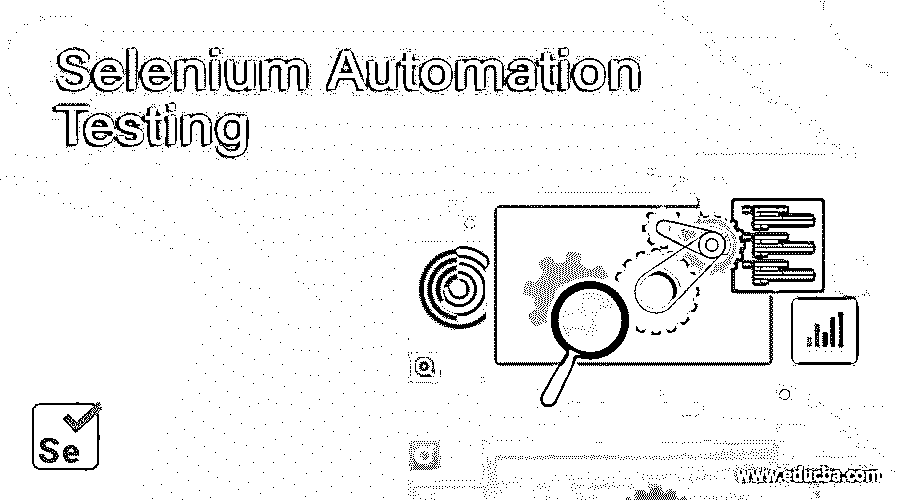

# 硒自动化测试

> 原文：<https://www.educba.com/selenium-automation-testing/>

## 什么是 Selenium 自动化测试？

Selenium 是一个自动化测试软件，用于测试 web 应用系统。它包含五个主要组件，即 Selenium IDE、Selenium Webdriver、Selenium RC、Selenium Grid 和 Selenium Client API。Selenium 几乎不需要编程语言知识，并且对于跨浏览器测试也很灵活。由于这些特征，并且它是用于自动化测试的很少可用的开源应用软件之一，Selenium 是行业中广泛使用的工具。

### 硒自动化测试工作

Selenium 不是一个软件工具。它主要由几个组件或许多软件工具或一套软件组成。

<small>网页开发、编程语言、软件测试&其他</small>

它们的组件和用法如下所示:

*   **Selenium IDE:** 它用于在任何编程语言中运行和编写 Selenium 测试。在这里，测试可以被编辑、记录和调试。它也被称为软件记录器。它通常记录用户操作，然后用任何一种编程语言导出脚本，这些语言可以在以后执行，对脚本的修改可以手动完成。
*   **硒遥控器(SRC):** 又称硒 1。一般是服务器借助 HTTP 协议接受浏览器命令。需要启动 selenium RC 实例来测试 web 应用程序的功能。它没有得到积极的支持，因为 selenium 2 已经在市场上出现并且主要被使用。
*   **Selenium Grid:** 它允许 Selenium 远程控制扩展测试用例套件。它有助于在不同的远程机器上并行运行测试。它的主要目的是划分测试用例，并在不同的机器上同时运行不同的测试。它通过并行处理提高了运行测试的性能和时间。
*   **Selenium Web 驱动:**又称 Selenium 2。它是 Selenium 1 或 Selenium 遥控器的继任者。它被开发人员广泛使用。Selenium web 驱动程序在 API(也称为客户端 API)的帮助下接受命令。它的调用比 selenium 1 的调用少。它主要在浏览器驱动中实现，用于发送命令和检索结果。

### 优势

使用 selenium 自动化测试工具的优势如下:

*   它具有高度的灵活性和可扩展性。它提供了许多通过 selenium 测试功能的方法。
*   它支持许多编程语言，有利于程序员轻松地用语言编写或编辑测试脚本。
*   它还支持用于测试 web 应用程序的各种浏览器。
*   它是独立于平台的，这意味着任何脚本都可以在任何平台上运行。
*   它总是在改进测试应用程序的特性。
*   省了很多时间和精力。
*   它有助于满足组织和客户的要求。

### 职业成长

Selenium 是未来的工具之一。它为专业人士和初学者提供了很好的机会。在 selenium 方面经验丰富的程序员或测试人员收入丰厚，并在全球范围内获得了大量机会。这是执行 QA 测试的最好方法。程序员通常需要编程知识、测试技能和创建测试 web 应用程序功能的框架的技能。

Selenium 自动化测试还需要设置、创建测试用例或套件、执行测试套件以及创建报告的技能。拥有这些技能的程序员从组织那里获得了高额报酬。现在，在 selenium 帮助下的自动化测试是客户和组织的项目的关键方面之一。

### 学习 Selenium 工具

[selenium 工具](https://www.educba.com/selenium-tools/)学习曲线较少。如果程序员了解面向对象的概念，并且精通任何编程知识，就可以很容易地使用 Selenium。在为 web 应用程序执行和编写自动化测试脚本时，有一个很好的在线支持社区可以帮助解决问题。许多专业人员正在学习和实践 Selenium，他们正在成功地将它应用到他们的实际项目中，以便在各个方面使他们的组织和客户受益。

selenium 可以从在线视频、社区论坛和官方网站上的官方文档中学习。顶级组织正在使用它来测试他们的 web 应用程序。这些组织还提供在线培训，以提升其员工或其他个人技能。初学编程语言的程序员可以从 Selenium IDE 开始，它有助于理解语言和测试的创建，以及执行那些测试用例。

### 结论–Selenium 自动化测试

Selenium 被认为是用于 web 应用程序 QA 测试的最流行的工具。它在测试领域不断发展，许多组织或个人正在采用 selenium，因为它在测试 web 应用程序方面具有广泛的特性，如灵活性、开源、免费和平台无关。Selenium 有很多优点需要改进，但也有一些缺点。在 selenium 中，很难生成测试执行的详细报告，selenium 根本无法测试图像。但是 selenium 提供了与其他工具集成来测试功能的灵活性。随着对 selenium 工具的基本理解变得简单，人们很容易使用 selenium 进行开发，新的特性也随着文档的增加而适当增加，这些文档有助于毫无问题地实现相同的特性。

### 推荐文章

这是 Selenium 自动化测试的指南。在这里，我们讨论 Selenium 自动化测试的工作、优势和职业发展。您也可以阅读以下文章，了解更多信息——

1.  [硒替代品](https://www.educba.com/selenium-alternatives/)
2.  [硒命令](https://www.educba.com/selenium-commands/)
3.  [硒键](https://www.educba.com/selenium-keys/)
4.  [硒与测试 NG](https://www.educba.com/selenium-with-testng/)

