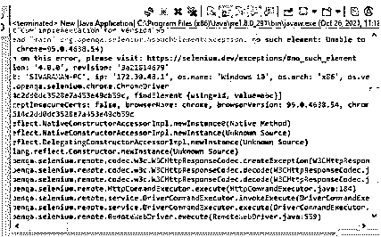
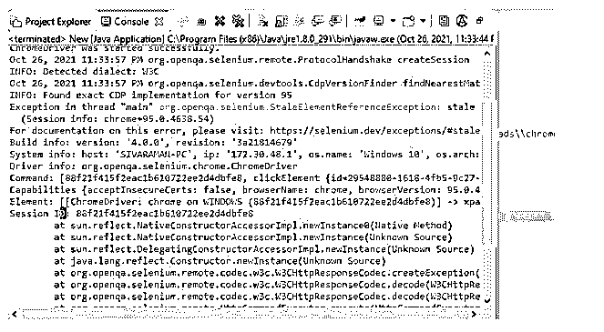

# 硒例外

> 原文：<https://www.educba.com/selenium-exceptions/>

## 硒异常简介

下面的文章提供了 Selenium 异常的概要。selenium 异常是特性之一。在自动化代码的执行过程中，Selenium WebDriver 经常出现这种情况；此外，异常名称本身，它暗示或不寻常的事件有许多原因。最重要的一点是捕捉问题，这些问题将处理异常处理的结果以预测流程，并在异常问题发生之前智能地处理异常问题的机制，这些错误是由于各种原因发生的，包括语法错误、错误的参数传递值或缺少应用程序所需的特定功能。

### 什么是硒的例外？

*   当 DOM 中提供了一个元素，但我们无法选择它时，会发生 selenium 异常，因此无法与可以从当前 DOM 中分离的 web 元素进行交互。在此会话期间会发生 selenium 异常，它还会引发 SessionNotFoundException。一旦浏览器关闭，webdriver 就会启动自己的活动。
*   一般来说，异常发生在程序执行的时候；当我们运行程序时，它会生成异常，应该处理该异常以避免应用程序崩溃。

### 如何使用 Selenium 异常？

*   通常，selenium webdriver 遵循一些标准的方法来处理 Selenium WebDriver 中的异常。借助于 try-catch、多重 catch 块、Throw/Throws，这些是在编译和运行时机制中处理 selenium 异常的一些方法。如果假设我们使用了，try-catch 是其中一个方法，它可以通过使用 try 和 catch 关键字的组合来捕获异常。try 块是块的初始或开始，catch 方法位于 try 块的末尾，用于处理已解决的异常。基本上，try-catch 块被称为受保护的代码。
*   因此，如果我们使用多个 catch 块，异常将在单个代码块中出现不止一次，但多个 catch 块用于通过某个代码块分别处理每种异常。两个 catch 块对于计算 catch 块的数量没有限制。Throw 和 Throws 关键字对于程序员隐式和显式生成异常是最重要的；throw 关键字用于抛出运行时异常的异常来处理它。如果假设编码器不能处理异常；那么它将被用作任何方法签名中的 Throws 关键字。无论代码中有没有 catch 块，finally 块都应该执行。

### 硒例外的类型

它有 n 种类型，其中一些如下:

<small>网页开发、编程语言、软件测试&其他</small>

*   **WebDriver 异常:**这个异常比较重要，在程序执行过程中打开和关闭浏览器后会立即出现。
*   **超时异常:**我们知道异常；它将只执行持续时间，因此如果用户操作无法到达该时间，它将显示超时异常。在应用程序和程序执行期间也调用它；自动创建、激活和销毁线程的线程生命周期将在程序结束时连续执行和循环。
*   **找不到会话异常:**该异常对于浏览器存在后立即执行的 web 驱动程序更为重要。
*   **StaleElementReferenceException:**它主要用于极少数情况，所以 DOM 元素不会以稳定状态出现。
*   **NoSuchWindowException:**web driver 只存在；它将切换程序执行过程中出现的无效窗口。
*   **NoAlertPresentException:** 它还使用 webdriver 来切换应用程序中不存在的无效窗口。
*   **NoSuchFrameException:** 网络驱动程序将验证并尝试切换未显示在应用程序窗口上的帧。
*   **NoSuchElementException:** 主要在 finding 元素下覆盖，在 webdriver 上不呈现。
*   **ElementNotSelectableException:**只有当 DOM 上可用的单击、选择、选择 UI 元素的 web 元素被禁用或取消选择时，才会发生此异常。
*   **ElementNotVisibleException:**只有元素类型或属性是隐藏模式时才会发生此异常，这时只有此异常抛出 else，它不会发生。

### 硒异常方法

我们知道在程序执行的每个阶段发生的异常类型。但在正常时间，它已经被检查过了，未检查的异常是编译和运行时发生的两种主要类型的异常。

*   **Checked Exception:** 只在编译时出现；它有一些子类型。
*   **未检查异常:**仅在运行时发生。

### 硒例外的例子

不同的例子如下:

**代码:**

`import org.openqa.selenium.By;
import org.openqa.selenium.WebDriver;
import org.openqa.selenium.chrome.ChromeDriver;
public class New {
public static void main(String[] args) throws InterruptedException{
System.setProperty("webdriver.chrome.driver", "C:\\Users\\Kripya-PC\\Downloads\\chromedriver_win32 (1)\\chromedriver.exe");
WebDriver dr = new ChromeDriver();
dr.manage().window().maximize();
String strs="http://www.testyou.in/Login.aspx";
dr.get(strs);
dr.findElement(By.id("abc")).sendKeys("sdvg");
dr.quit();
}
}`

**输出:**

在上面的例子中，我们在 web 应用程序中没有重现这样的元素发现异常。每个 web 页面将计算 id 和名称，用于访问 selenium 驱动程序接口中的 web 元素。如果元素不匹配或者在 Xpath 中被错误地提到，它将抛出 no this element found 异常。

**举例:**

**代码:**

`import org.openqa.selenium.By;
import org.openqa.selenium.WebDriver;
import org.openqa.selenium.WebElement;
import org.openqa.selenium.chrome.ChromeDriver;
public class New {
public static void main(String[] args) throws InterruptedException {
System.setProperty("webdriver.chrome.driver", "C:\\Users\\Kripya-PC\\Downloads\\chromedriver_win32 (1)\\chromedriver.exe");
WebDriver dr = new ChromeDriver();
dr.get("https://in.search.yahoo.com/?fr2=inr");
dr.manage().window().maximize();
Thread.sleep(2000);
WebElement wb=dr.findElement(By.xpath("//a[@id='ysignin']"));
wb.click();
dr.navigate().back();
Thread.sleep(2000);
wb.click();
}
}`

**输出:**

在上面的示例中，我们重现了一个名为 StaleElementReferenceException 的异常，用于在 yahoo web 应用程序上执行登录操作。我们使用线程计数来执行每个操作，并计算在每个页面上花费稳定位置的时间。我们使用默认方法在应用程序中导航和点击页面。

### 结论

在 selenium 框架中，自动化脚本用于节省应用程序生产率的时间，并满足客户的业务需求。因此，我们使用不同的特性类、方法、变量和关键字来执行操作，并使应用程序的生产率达到用户满意度。

### 推荐文章

这是一个关于 Selenium 异常的指南。这里我们讨论一下入门，如何使用 selenium 异常？类型和方法。您也可以看看以下文章，了解更多信息–

1.  [Selenium IDE 命令](https://www.educba.com/selenium-ide-commands/)
2.  [如何使用硒？](https://www.educba.com/how-to-use-selenium/)
3.  [硒面试问题](https://www.educba.com/selenium-interview-questions/)
4.  [Selenium Webdriver 命令](https://www.educba.com/selenium-webdriver-commands/)

