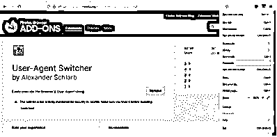
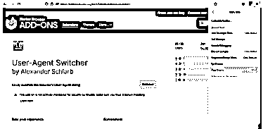
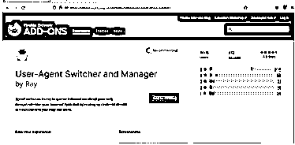
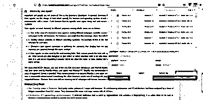
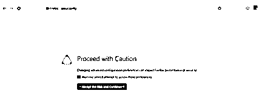
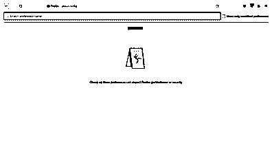
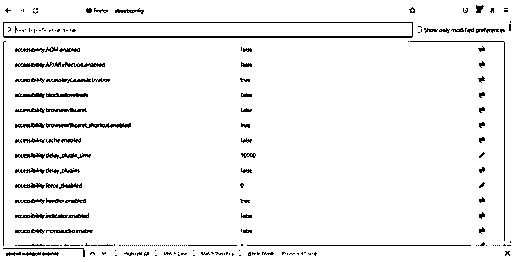

# Selenium 用户代理

> 原文：<https://www.educba.com/selenium-user-agent/>

## Selenium 用户代理简介

selenium 用户代理将在 selenium automation 中执行脚本方法，并提供逐步说明，它必须与 return navigator 一起提供，用户代理参数将执行脚本函数以获取用户代理的详细信息，selenium 也有直接获取或更改用户代理的直接方法，当我们使用指定的说明在用户浏览器上连接它时，无法读取用户请求或响应头，连接可能通过记录用户信息的代理进行。

### 什么是 selenium 用户代理？

一般来说，为了区分不同的浏览器和设备，服务器采用用户代理字符串来识别浏览器以及每个设备的浏览器版本，此外，浏览器组合可以具有唯一的名称。任何收集数据并为最终用户显示 web 内容的软件，或者与 web 技术一起实现的软件，都被称为用户代理。Web 浏览器、媒体播放器和插件是可以帮助存储和检索用户信息的用户代理的最典型的例子。

<small>网页开发、编程语言、软件测试&其他</small>

### 如何使用 Selenium 更改用户代理？

对于 Selenium web 驱动程序，我们可以改变用户代理。用户代理头包含一个唯一的字符串，该字符串包含有关网络协议的信息，以及有关操作系统、软件版本、程序等的信息。Selenium 具有获取或更改用户代理的能力。JavaScript 执行器就是用来做这件事的。Selenium 中的 execute script 方法用于运行 JavaScript 指令。我们必须向该方法提供返回的 navigator.useragent 参数，以获取用户代理信息。ChromeOptions 类将用于修改用户代理。然后，我们可以使用 add argument 函数创建新生成的对象。我们将把用户代理和参数作为参数传递。在 Firefox 配置文件中设置变量“general.useragent.override”是修改用户代理最常用的技术。值得注意的是，这并不依赖于硒。在用户代理的帮助下，我们可以使用不同于默认配置文件的配置文件来计算用户数据。Selenium 没有提供任何从 WebDriver 对象查询用户代理的方法。即使在 Firefox 中，如果 general.useragent.override 没有设置为自定义值，您也无法确定默认的用户代理是什么。因为在它被设置为一个值之前，这个设置是不存在重复的。此外，一旦浏览器打开，我们就可以获得用户代理。

### 如何设置 selenium 用户代理？

通常在 Firefox 配置文件中设置变量“general.useragent.override ”,并在创建 Firefox WebDriver 实例时使用该配置文件来修改用户代理。Selenium web 驱动程序可以用来获取关于用户代理的信息。JavaScript 执行器就是用来做这件事的。Selenium 中的 execute script 方法用于运行 JavaScript 指令。我们必须通过返回导航器来获取用户代理信息。直到我们将删除，Firefox 继续利用用户代理，我们已经指定这样做，你可以使用“关于:配置”窗口寻找一般。useragent.override 首选项。如果它仍然作为插件和扩展在浏览器中可用，它会显示我们已经修改的内容。如果没有显示，Firefox 可能不再覆盖用户代理。然后我们可以仔细检查 Firefox 交付的用户代理。有没有可能该设置已经被重置为另一个时间使用？

一旦我们确定了覆盖用户代理的选项，右键单击该选项并选择“Reset”来删除它选项。

转到 Mozilla Firefox 浏览器，导航到更多工具选项，

在选项中选择“开发者扩展”选项，

它显示以下页面，并在搜索文本框中输入用户代理，

通过选择要安装插件的“添加到 Firefox”按钮，

该工具安装成功，并显示在上面。

### 更改 Firefox 的用户代理:

基本上，任何允许最终用户与 web 内容交互的软件都被称为 web 应用程序。用户代理(UA)被认为是一个字符串，它是一段可以由客户端软件发送的文本，它接收对请求的响应。用户代理字符串通知目标服务器正在使用的浏览器、设备类型和操作系统。例如，字符串数据类型通知服务器请求，该请求可以在环境中的 Chrome 浏览器和 Windows 10 操作系统上运行。然后，服务器可以根据设备、操作系统和浏览器来调整应答响应。

同样，首先我们需要打开一个新的选项卡，然后浏览到“关于配置”选项，

它显示了上面的屏幕截图。检查显示的警告框，以接受尝试访问的首选项。在接受风险并继续和按钮之后，它显示下面的 UI，

之后，当我们选择显示所有选项时，它会显示所有的首选项，

这是 Mozilla firefox 的默认设置，当我们更改首选项列表的值时请小心。因为会影响火狐浏览器性能问题。如果我们想创建一个新的首选项，如下所示

在上面的截图中，我只是随机输入 browser。测试它没有默认设置，所以如果我选择+符号，它将接受并创建一个新的，在此之前，我们应该被分配数据类型，

如果我们想通过使用编辑选项来更改值，我们可以修改值，使用删除选项，我们可以删除首选项。

### 结论–Selenium 用户代理

在用户代理中是重要的一个，它是与 web 服务器交互的方式，以确定我们如何访问可用于性能的浏览器。通常，它充当字符串、布尔、数字类型来创建用户偏好类型。

### 推荐文章

这是一个硒用户代理指南。这里我们讨论一下入门，什么是 selenium 用户代理？，如何使用 Selenium 更改用户代理？例子。您也可以看看以下文章，了解更多信息–

1.  [Selenium IDE 命令](https://www.educba.com/selenium-ide-commands/)
2.  [硒面试问题](https://www.educba.com/selenium-interview-questions/)
3.  [如何使用硒？](https://www.educba.com/how-to-use-selenium/)
4.  [Selenium Webdriver 命令](https://www.educba.com/selenium-webdriver-commands/)

