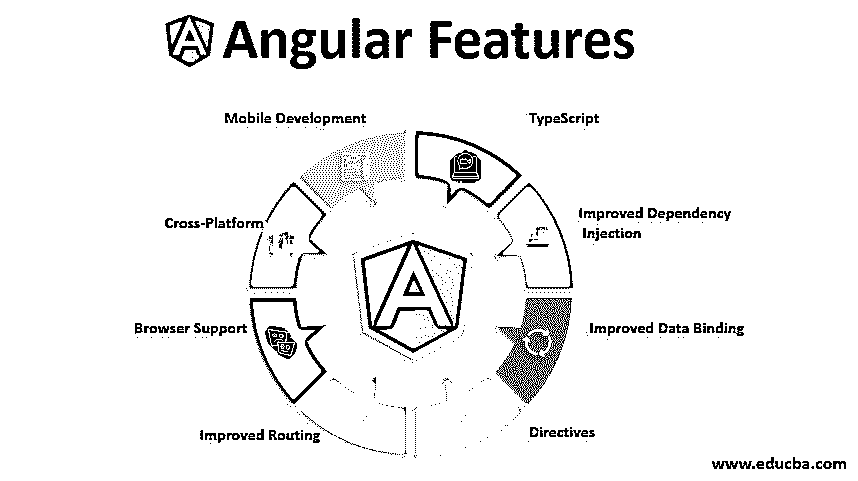

# 角度特征

> 原文：<https://www.educba.com/angular-features/>

## 角度特征介绍

Angular 的特性为应用程序的前端开发提供了帮助。在最短的时间内，它变得非常受欢迎，是最好的单页 web 应用程序开发解决方案。angular JS 和他们的最新版本之间的主要区别之一是 angular 项目的类型脚本和非常好的结构，这使得代码的维护变得容易，可读，提高性能和许多其他事情。

### 特征

到现在为止，angular 已经有了很多版本。Angular JS 是 Angular 的第一个版本，于 2009 年推出。角度 JS 的特征:

<small>网页开发、编程语言、软件测试&其他</small>

*   表单验证和动画。
*   它基本上是一个构建 Web 应用程序的 JavaScript 框架。
*   它允许简单的事件处理
*   依赖注入。
*   内置路由和引擎。
*   支持数据绑定。
*   通过添加表达式、标记和属性来扩展 HTML 支持。

继 Angular JS 之后，angular 2 带着用 TypeScript 编写的完全不同的框架出现了。这两个框架之间没有共性。因为 angular 2 的结构非常好。对外部库和许多其他东西的强大支持。它为我们的应用程序提供了高性能，从而最大限度地减少了页面的加载时间。

### Angular 2 的特性

以下是 Angular 2 的特性:

#### 1.以打字打的文件

*   它是 JavaScript 的超集，angular 2 大量使用了 TypeScript。TypeScript 因其易用性和简单性而备受关注。这是 angular 2 相比之前版本带来的最引人注目的变化。ReactJS 也使用 TypeScript，因此 angular 2 ha 在更短的时间内就得到更多的欢迎。
*   Typescript 是一种由微软开发和维护的开源编程语言。它给语言增加了可选的静态类型。因为它是 JavaScript 的超集，所以现有的 JavaScript 程序也是有效的。

#### 2.改进的依赖注入

*   为了使我们的应用程序松散耦合，这是我们应该拥有的设计模式。模块化组件隔离和开发是[使依赖注入](https://www.educba.com/dependency-injection-in-spring/)在 angular2 中易于使用和实现的特性。
*   在 angular 2 中，服务是可注入的。为此，我们使用@ Injectable 注释使任何类都是可注入的。

**例子:**服务是依赖注入的一个例子。它是一个可注入的类，用于在各种类或应用程序之间共享数据。它还负责调用服务器并获取要显示的数据。

#### 3.改进的数据绑定

angular 2 中的数据绑定改进了很多。我们不需要为此编写大量代码，我们只需要将元素放在方括号中。

**绑定类型**

以下是绑定的类型:

1.  **插值:**用于显示模板或视图的组件属性。为此，我们使用双花括号。我们可以用它来显示任何东西，如字符串、数字、数组等。
2.  **属性绑定:**属性绑定允许我们直接访问 HTML 的元素属性。我们可以直接将变量赋给 HTML 元素。
3.  **事件绑定:**这个绑定使用事件来绑定值。我们有各种可用的事件，例如点击。
4.  **双向绑定:**这基本上是属性绑定和事件绑定的结合。其中我们可以同时调用我们的方法并将值绑定到元素属性。

#### 4 .指令

Angular 2 支持 3 种类型的指令。具体如下:

*   属性指令:它修改 HTML 元素的行为或外观。
*   **结构指令:**这个指令用来改变元素的结构。它基本上改变了 DOM 元素，通过使用它我们可以添加、删除元素并用新元素替换元素。它修改了 DOM 布局。
*   组件指令:没有组件，我们无法创建 angular2 应用程序。现在我们可以更仔细地看看这个组件是如何工作的，以及它包含什么类型的元数据。
*   **性能:**angular 2 应用的性能因为快速的变化检测和离线编译而提升了很多。对异步模板和动态加载的支持有助于改善页面加载和时间。
*   **支持基于组件的架构:** Angular 2 应用完全基于组件。它遵循组件基础架构。这使得我们的代码结构更加简单。

角度组件是模块的一部分，或者我们可以说，模块包含实现应用程序的业务逻辑的组件，还包含调用时将触发的模板。

*   服务
*   模板
*   业务逻辑
*   样式和 CSS
*   应用数据

#### 5.改进的路由

angular 2 中的路由已经改进了很多，原因如下:

*   定位服务
*   导航模型
*   URL 解析器等

#### 6.浏览器支持

Angular 2 应用程序支持几乎所有浏览器，如下所示:

*   铬
*   IE 9，10，11
*   旅行队
*   火狐浏览器
*   安卓 4.1
*   微软新型浏览器

#### 7.跨平台

我们可以在任何平台上运行我们的应用程序，例如:

*   机器人
*   Ios 系统
*   桌面

#### 8.移动开发

angular 的早期版本是为了响应性开发，但是没有任何移动支持。但是 angular 2 为我们提供了对移动应用开发的内置支持，另一方面，需要利用一些库来在移动设备上运行我们的 angular js 应用。

*   基于组件的架构。
*   对 web 同样有用。移动和桌面应用程序。
*   支持依赖注入。
*   更快，现代和高度可扩展的框架。

### Angular 4 的特点

继 angular 2 之后，angular 4 带来了一些新功能。

*   支持电子邮件验证程序
*   单独的动画包。动画移动到新包@angular/animation
*   支持 if/else 语句
*   生成的捆绑代码的大小减少了 60%

### Angular 5 的特点

Angular 5 提出了如下新改进:

*   更新到 HTTP 客户端。
*   模板中的类型检查。
*   将 AOT 设为默认值。
*   支持国际化日期 m 货币和数字管道。
*   区域速度改进。
*   更容易建立渐进式网页。

### 结论

随着时间的推移，Angular 在性能、处理事件、支持不同的浏览器和类型检查方面都有所改进。由于 typescript 的存在，它一直在升级，已经成为 web 开发中最广泛使用的框架。

### 推荐文章

这是一个角度特征的指南。在这里，我们讨论不同 Angular 版本的概述以及 Angular JS 与其最新版本之间的差异。您也可以浏览我们推荐的其他文章，了解更多信息——

1.  [什么是 AngularJS？](https://www.educba.com/what-is-angularjs/)
2.  [角度 JS 应用](https://www.educba.com/angular-js-application/)
3.  [角度选择](https://www.educba.com/angular-alternatives/)
4.  [角度 2 指令](https://www.educba.com/angular-2-directives/)

