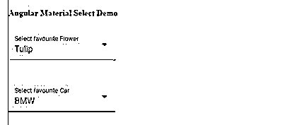

# 角度材料选择

> 原文：<https://www.educba.com/angular-material-select/>

## 角度材料选择简介

在角度材质中，我们还有一个称为“选择”的组件，它帮助我们从可用选项列表中选择值。它的工作方式与我们拥有的基本元素相同，但在材料上，它还带有样式和动画。当我们希望从选项列表中选择单个值时，这非常有用，我们有许多不同的要求，我们希望用户从列表中选择单个值，例如，我们希望他们选择国家、城市和州作为他们的地址，因为它不能是多个。在这种情况下，我们可以选择材质角度，使用户界面更具交互性和用户友好性。

### 角度材料选择的语法

正如我们所知，它与<select>元素相同，但在 material 中，我们有标准语法在应用程序中使用它。</select>

<small>网页开发、编程语言、软件测试&其他</small>

`<mat-form-field >
<mat-select>
<mat-option>
</mat-option>
</mat-select>
</mat-form-field>`

如你所见，上面是在角度材质中使用选择的基本语法，这里我们使用“mat-select”来创建功能。

### 如何选择有角度的材料？

Select 用于从列表中选择一个值，它还使我们能够根据我们的输入获得特定的值。在应用程序中，我们可能有不同的或如此多的需求，其中我们只想要我们拥有的值列表中的一个值，它指定了给定标签的值。因此，这可以在选择组件的帮助下实现。

**1。MatSelectModule:** 为了实现这个，我们在根模块文件中有这个模块，那么只有我们能够使用它。我们可以将它导入到任何想要实现该功能的子模块文件中。

查看下面的代码，并在你的根模块文件中使用它。

**代码:**

`import {MatSelectModule} from '@angular/material/select';`

**2。matSelect:** 它可以通过这个名称“matSelect”来公开，并可以通过这个选择器“mat-select”在模板上使用，之后只有我们能够看到 UI 上的更改，它总是接受一个它可以迭代的列表对象。

它还提出了不同的属性，其中一些如下所述:

*   **id:** 用于给出唯一的 id。
*   **多个:**用于表示是否允许用户选择多个值。
*   **禁用:**用于指示组件何时被禁用。
*   **errorStateMatcher:** 显示错误信息时。
*   **占位符:**用于表示该值是否还未被选中。
*   **必选:**用于表示需要选择的值。

为了实现这一点，我们必须在 angular 项目中安装或添加素材库。

为此，您需要遵循以下步骤，这将帮助我们开始在 angular 中实现我们的第一个组件。

1.第一步将是安装 Angular CLI，这使得我们的工作易于维护和处理 Angular 项目，只需执行下面的命令，并将其全局安装在系统上。

**代码:**

`npm install -g @angular/cli`

2.第二步是安装和创建 angular 项目，在这里我们可以指定我们的 angular 项目的名称，在此之后，它将只在系统内部使用这个名称。

**代码:**

`ng new your project name
>> ng new my-first-project`

您可以提供它们中的任何一个来代替“我的第一个项目”。

3.现在，通过运行下面的命令来安装角度依赖项，这是可选的，如果需要或者角度无法找到任何依赖项，我们可以使用它。

**代码:**

`npm install`

4.启动 angular 服务器只需在 src 文件夹中的命令提示符下执行下面的命令。

**代码:**

`ng serve`

5.一旦服务器成功启动，我们现在可以通过在浏览器上运行下面的 URL 来测试我们的应用程序，默认端口为 4200。

**http://localhps:4200**

6.现在我们可以使用下面的命令添加素材库，成功安装后，我们就可以在应用程序中使用材质组件了。

**代码:**

`ng add @angular/material`

### 角度材料选择示例

下面是提到的例子:

**a . index.html 电码**

`<link href="https://fonts.googleapis.com/icon?family=Material+Icons" rel="stylesheet">
<link href="https://fonts.googleapis.com/css?family=Roboto:300,400,500" rel="stylesheet">
<link rel="stylesheet" href="https://unpkg.com/normalize.css@8.0.0/normalize.css">
<my-select>loading.. </my-select>`

**b. demo.select.component.ts 代码**

`import { Component } from '@angular/core';
interface Flower {
value: string;
viewValue: string;
}
interface Cars {
value: string;
viewValue: string;
}
@Component({
selector: 'my-select',
templateUrl: './demo.select.component.html',
styleUrls: [ './demo.select.component.css' ] })
export class DemoSelectComponent {
name = 'Angular';
flowers: Flower[] = [
{value: 'one-0', viewValue: 'Rose'},
{value: 'two-1', viewValue: 'Sun Flower'},
{value: 'three-2', viewValue: 'Lotus'},
{value: 'four-1', viewValue: 'Lilly'},
{value: 'five-1', viewValue: 'Tulip'},
];
cars: Cars[] = [
{value: 'one-0', viewValue: 'BMW'},
{value: 'two-1', viewValue: 'AUDI'},
{value: 'three-2', viewValue: 'MB'},
{value: 'four-1', viewValue: 'MG'},
{value: 'five-1', viewValue: 'VW'},
];
}`

**demo.select.component.html 电码**

`<h4>Angular Material Select Demo</h4>
<mat-form-field appearance="fill">
<mat-label>Select favourite Flower</mat-label>
<mat-select>
<mat-option *ngFor="let flower of flowers" [value]="flower.value">
{{flower.viewValue}}
</mat-option>
</mat-select>
</mat-form-field>
  
<mat-form-field appearance="fill">
<mat-label>Select favourite Car</mat-label>
<mat-select>
<mat-option *ngFor="let car of cars" [value]="car.value">
{{car.viewValue}}
</mat-option>
</mat-select>
</mat-form-field>`

**d. module.ts 代码:**

`import { NgModule } from "@angular/core";
import { BrowserModule } from "@angular/platform-browser";
import { MaterialModule } from "./material.module";
import { BrowserAnimationsModule } from '@angular/platform-browser/animations';
import {MatSelectModule} from '@angular/material/select';
import { DemoSelectComponent } from "./app.component";
@NgModule({
imports: [BrowserModule, BrowserAnimationsModule, MaterialModule, MatSelectModule],
declarations: [DemoSelectComponent],
bootstrap: [DemoSelectComponent] })
export class DemoAppModule {}`

 `**输出:**

### 结论

因为我们已经看到了使用“从材料库中选择”所需的步骤。它也是素材库的重要组成部分之一，易于开发人员使用、操作、阅读和维护。

### 推荐文章

这是一个角度材料选择的指南。在这里我们讨论一下引言，选择如何在有角的材料中起作用？和示例。您也可以看看以下文章，了解更多信息–

1.  [AngularJS ng 级](https://www.educba.com/angularjs-ng-class/)
2.  [角度 CLI](https://www.educba.com/angular-cli/)
3.  [角度日期过滤器](https://www.educba.com/angularjs-date-filter/)
4.  [角度 7 形式验证](https://www.educba.com/angular-7-form-validations/)

`