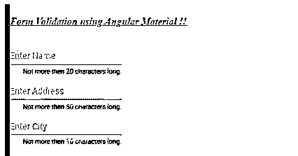
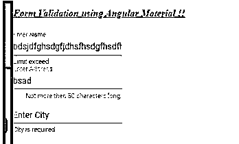

# 角形材料形式验证

> 原文：<https://www.educba.com/angular-material-form-validation/>


## 角形材料形式验证简介

在角形材料中，我们已经有了可以用来快速创建形状的模块，但是为了应用任何类型的验证，我们必须遵循基本上有两种类型的传统方法。因此，我们可以结合材料模块来创建表单，并通过使用我们拥有的两种方法中的任何一种进行验证，构建模块中的材料将帮助我们快速构建包含所有字段的表单，并提供默认绑定和动画。在我们可以选择的任何验证方法之后，我们只需要简单地将组件放入内置的素材库中。

### 角度材料形式验证的语法

正如我们所知，这是材料库中没有的东西，但我们仍然有帮助我们轻松创建表单的模块。

<small>网页开发、编程语言、软件测试&其他</small>

```
<form [formGroup]="form name" (ngSubmit)="your method">
<mat-card-content>
<mat-form-field>
<input matInput type="text" formControlName="field name" id="name">
</mat-form-field>
</mat-card-content>
</form>
```

正如你在上面的语法中看到的，我们正在尝试使用“formGroup”和表单名称，并使用“mat-form-field”来创建我们的表单以接受用户输入。

### 形状验证如何在有角度的材料中工作？

在 Angular 中，我们有两种不同的方法可以用来实现表单验证。为什么需要表单验证？表单用于接收用户的输入，但是用户可以输入任何错误的值，这会影响我们应用程序的业务逻辑。为此，我们需要进行表单验证，这可以改进用户需要输入的数据。让我们举一个例子，开发人员要求用户输入他/她的电话号码，但是他们错误地提供了几个字符串。因此，为了在客户端验证用户数据，我们需要表单验证。

在 angular 中，我们有两种不同的方法，即模板驱动和反应式表单，这两种方法都有各自的优缺点和特定用途，何时使用哪一种。

**1。反应式表单验证:**在反应式表单方法中，我们总是有新的表单启动程序，如果做了任何更改，它都遵循不可变的显式方法来验证表单。为了在应用程序中使用它，我们必须从 angular 库中导入一些模块。

*   **ReactiveFormsModule:** 该模块需要导入并存在于我们要实现它的组件模块中。如果我们忘记了这个错误将会发生，代码将不会工作。

**代码:**

```
import { ReactiveFormsModule } from '@angular/forms';
```

*   现在在组件文件中导入吹塑包。

**代码:**

```
import { FormControl, FormGroup, Validators } from '@angular/forms';
```

2.在有角度的材料中，我们有不同的选择器，可以用来显示我们的错误信息。

*   **mat-error:** 用于显示错误，并附上消息。如果表格无效，此信息将以红色显示在屏幕上。

**语法:**

```
<mat-error *ngIf="your condition">Error message</mat-error>
```

3.在 angular 中，我们也可以使用下面的选择器从 mat-form-field 模块向用户显示提示。

*   mat-hint: 这是用来在用户输入错误时向他们显示提示。附带提示信息。

**语法:**

```
<mat-hint >Hint Message</mat-hint>
```

### 角形材料形式验证示例

下面是提到的例子:

**a . index.html 代码:**

```
<link href="https://fonts.googleapis.com/icon?family=Material+Icons" rel="stylesheet">
<demo-validation'>loading</demo-validation'
```

**b . demo-validation . component . ts 代码:**

```
import { Component, OnInit } from '@angular/core';
import { FormControl, FormGroup, Validators } from '@angular/forms';
@Component({
selector: 'demo-validation',
templateUrl: './demo-validation.component.html',
styleUrls: [ './demo-validation.component.css' ]
})
export class AppValidationComponent implements OnInit {
public myForm: FormGroup;
constructor() { }
ngOnInit() {
this.myForm = new FormGroup({
myName: new FormControl('', [Validators.required, Validators.maxLength(20)]),
myAddress: new FormControl('', [Validators.required, Validators.maxLength(50)]),
mycity: new FormControl('', [Validators.required, Validators.maxLength(10)])
});
}
public myError = (controlName: string, errorName: string) =>{
return this.myForm.controls[controlName].hasError(errorName);
}
}
```

**c . demo-validation.component.html 代码:**

```
<h4><u><i> Form Validation using Angular Material !!</i></u></h4>
<form [formGroup]="myForm" novalidate fxLayout="column wrap" fxLayoutAlign="center center" fxLayoutGap="10px">
<mat-card-content>
<mat-form-field>
<input matInput type="text" placeholder="Enter Name" formControlName="myName" id="myName">
<mat-hint align="end">Not more then 20 characters long.</mat-hint>
<mat-error *ngIf="myError('myName', 'required')">Name is required</mat-error>
<mat-error *ngIf="myError('myName', 'maxlength')">Limit exceed</mat-error>
</mat-form-field>
</mat-card-content>
<br />
<mat-card-content>
<mat-form-field>
<input matInput type="text" placeholder="Enter Address" formControlName="myAddress" id="myAddress">
<mat-hint align="end">Not more then 50 characters long.</mat-hint>
<mat-error *ngIf="myError('myAddress', 'required')">Address is required</mat-error>
<mat-error *ngIf="myError('myAddress', 'maxlength')">Limit exceed</mat-error>
</mat-form-field>
</mat-card-content>
<br/>
<mat-card-content>
<mat-form-field>
<input matInput type="text" placeholder="Enter City" formControlName="mycity" id="myAddress">
<mat-hint align="end">Not more then 10 characters long.</mat-hint>
<mat-error *ngIf="myError('mycity', 'required')">City is required</mat-error>
<mat-error *ngIf="myError('mycity', 'maxlength')">Limit exceed</mat-error>
</mat-form-field>
</mat-card-content>
</form>
```

**d. module.ts 代码:**

```
import {NgModule} from '@angular/core';
import {MatFormFieldModule} from '@angular/material/form-field';
@NgModule({
exports: [
MatFormFieldModule
]
})
export class MaterialValidationModule {}
```

**e. demo-validation.module.ts 代码:**

```
import { NgModule } from "@angular/core"// other importsa
import { FormsModule } from "@angular/forms";
import { ReactiveFormsModule } from '@angular/forms';
import { AppValidationComponent } from "./app.component";@NgModule({
imports: [FormsModule, ReactiveFormsModule],
declarations: [AppValidationComponent],
bootstrap: [AppValidationComponent]
})
export class AppValidationModule {}
```

**输出:**

**点击前查看提示:**




**输入错误后:错误信息:**




### 结论

正如在教程中我们已经详细了解了表单验证的类型，使用素材库创建表单。反应式和模板驱动的表单验证易于实现、可读、可扩展并且易于由用户维护，不需要大量的配置来实现它。

### 推荐文章

这是角形材料形式验证的指南。在这里我们讨论介绍，形式验证如何在有角的材料中工作？还有例子。您也可以看看以下文章，了解更多信息–

1.  [AngularJS ng 级](https://www.educba.com/angularjs-ng-class/)
2.  [角度 CLI](https://www.educba.com/angular-cli/)
3.  [角度日期过滤器](https://www.educba.com/angularjs-date-filter/)
4.  [角度 7 形式验证](https://www.educba.com/angular-7-form-validations/)


