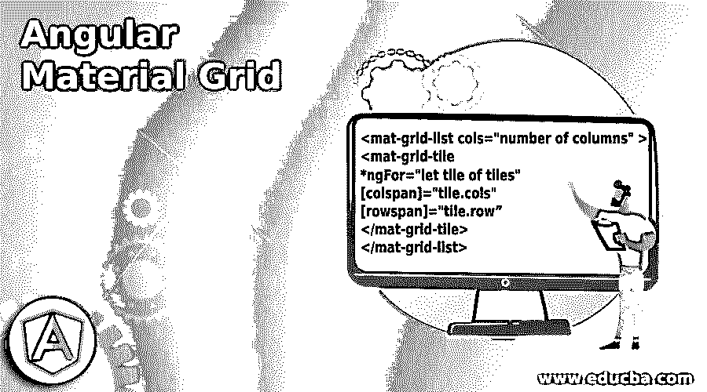
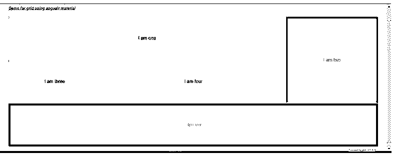

# 角状材料网格

> 原文：<https://www.educba.com/angular-material-grid/>

## 角状材料网格简介

在有角度的材料中，我们有一个网格用来创建不同大小的列的列表；我们可以创建一个网格列表并显示我们的数据。为了在应用程序中使用这个网格，我们必须在现有的网格中做一些小的配置；此外，我们应该有材料已经添加到我们的应用程序，否则它不会工作。在创建网格时，我们必须指定它的 cols 属性，该属性负责创建网格中的列数；在这之后，我们可以通过设置不同的属性值来改变网格，比如高度 fir 等。

**角度材质网格的语法**

<small>网页开发、编程语言、软件测试&其他</small>

该语法将通过指定所需的属性为我们创建网格。

`<mat-grid-list cols="number of columns" >
<mat-grid-tile
*ngFor="let tile of tiles"
[colspan]="tile.cols"
[rowspan]="tile.row”
</mat-grid-tile>
</mat-grid-list>`

如你所见，我们使用' mat-grid-list '指令来创建网格；为了创建它，我们必须指定“列”。

`<mat-grid-list cols="5" >
<mat-grid-tile>
</mat-grid-tile>
</mat-grid-list>`

### 网格在角状物质中是如何工作的？

正如我们已经看到的，这个网格是用来在有角的材料中创建网格布局的；我们还需要一些需要导入到应用程序内部的模块来使用它。这些模块是军事库的一部分，但是为了使用它们，我们必须显式地导入它们。

让我们来看看进行这次运行所需的配置:

#### 1.MatGridListModule

这是需要导入到应用程序中的模块名称。它存在于角状/物质内部。此外，我们可以将它导入到根模块或任何其他需要它的子模块中。

`import {MatGridListModule} from '@angular/material/grid-list';`

这一整行可以在代码中原样使用来导入它；此外，我们必须在@Ngmodule 中定义模块才能进一步使用它。

#### 2.MatGridList

现在我们有了“MatGridList”指令，它包含了作为“mat-grid-list”的选择器；这可以用在我们现有的 HTML 或模板上。该指令负责在我们的项目或应用程序中显示网格布局。

`<mat-grid-list cols="5" rowHeight="150px">
</mat-grid-list>`

如你所见，上面是使用材料创建我们自己的网格布局的示例语法。

下面是在项目中设置角度材质的步骤:

1.首先，安装 Angular CLI，它使我们能够下载项目所需的包和库。

您可以通过在命令中键入下面的命令来下载它，以确保您已经安装了该节点。

**代码:**

`npm install -g @angular/cli)`

以上命令将在我们的系统中全局安装 CLI 因此，我们可以在需要时全局使用它。

2.现在，在这一步中，我们将尝试从头开始创建新的 angular 项目；这个项目将不是一个材料项目，我们必须通过在我们的项目中安装材料依赖关系来添加它。所以只需在命令提示符下执行下面的命令，然后按回车键。

**代码:**

`ng new your project name
>> ng new my-first-project`

此命令将创建名为 my-first-project 的项目；您可以用提到的任何名称创建您的项目。

3.为了确保万无一失，请尝试下面提到的一个命令，将所有需要的库安装到我们的项目中。

**代码:**

`npm install`

4.现在，您可以通过键入下面提到的简单命令来测试和运行您的项目。这只是为了确保我们在正确的轨道上，我们的项目已经创建，没有任何错误或缺陷。

**代码:**

`ng serve`

5.进入浏览器，尝试使用以下 URL 运行应用程序:

**举例:**

**http://localhps:4200**

默认情况下，angular 项目运行在端口 4200 上；如果需要，您可以根据自己的需要进行更改。

6.现在一切都准备好了；我们现在有我们的角度项目；我们将通过在命令提示符下运行下面的命令，将素材库添加到我们的项目中。

**代码:**

`ng add @angular/material`

### 角形材料网格示例

下面给出的示例展示了如何使用材料模块简单快速地创建网格:

**模块代码:**

`import {NgModule} from '@angular/core';
import {MatGridListModule} from '@angular/material/grid-list';
@NgModule({
exports: [
MatGridListModule
] })
export class DemoGridModule {}`

**index.html 代码:**

`<!DOCTYPE html>
<html lang="en">
<head>
<meta charset="utf-8">
<meta name="viewport" content="width=device-width, initial-scale=1.0">
<link href="https://fonts.googleapis.com/icon?family=Material+Icons&display=block" rel="stylesheet">
<title>Grid demo in angular material</title>
</head>
<body class="mat-app-background">
<grid-demo>Loading</grid-demo>
Current build: 12.1.0
</body>
</html>`

**grid.componenet.ts 代码:**

`import {Component} from '@angular/core';
export interface Tile {
color: string;
cols: number;
rows: number;
text: string;
}
/**
* @title Demo
*/
@Component({
selector: 'grid-demo',
templateUrl: 'grid-demo.html',
})
export class GridListDynamicExample {
mytiles: Tile[] = [
{text: 'I am one', cols: 3, rows: 1, color: 'lightpink'},
{text: 'I am two', cols: 1, rows: 2, color: 'grey'},
{text: 'I am three', cols: 1, rows: 1, color: 'lightblue'},
{text: 'I am four', cols: 2, rows: 1, color: '#DDBDF1'},
{text: 'I am five', cols: 4, rows: 1, color: 'red'},
];
}`

**HTML 代码:**

`<h5><u><i>Demo for grid using angualr material</i></u></h5>
<mat-grid-list cols="4" rowHeight="150px">
<mat-grid-tile
*ngFor="let tile of mytiles"
[colspan]="tile.cols"
[rowspan]="tile.rows"
[style.background]="tile.color">
{{tile.text}}
</mat-grid-tile>
</mat-grid-list>`

**输出:**

### 结论

棱角分明的材质网格使开发速度更快；只需添加标签，我们就可以使用它。此外，它还有一些属性可以帮助我们创建网格。此外，我们还看到了需要导入哪个模块才能使用它。

### 推荐文章

这是一个有角度的材料网格指南。这里我们讨论一下导论，网格在有角的物质中是如何工作的？和示例。您也可以看看以下文章，了解更多信息–

1.  [AngularJS ng 级](https://www.educba.com/angularjs-ng-class/)
2.  [角度 CLI](https://www.educba.com/angular-cli/)
3.  [角度日期过滤器](https://www.educba.com/angularjs-date-filter/)
4.  [角度 7 形式验证](https://www.educba.com/angular-7-form-validations/)

