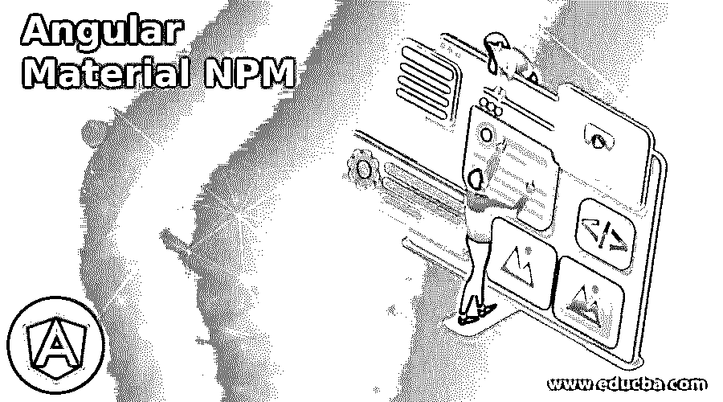
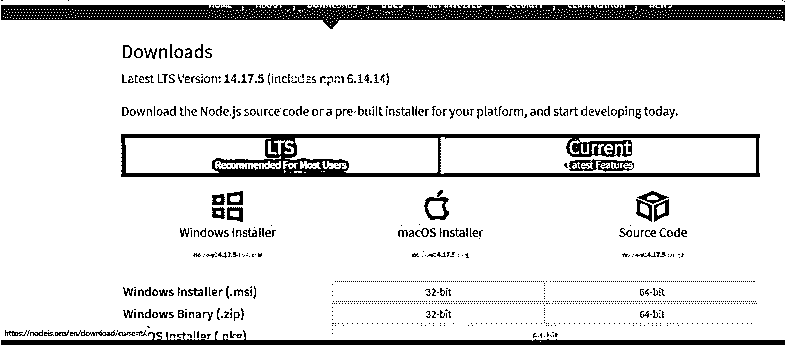
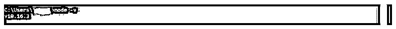
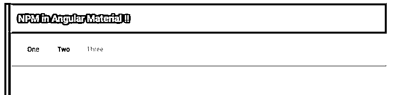

# 有角材料 NPM

> 原文：<https://www.educba.com/angular-material-npm/>

## 角状材料 NPM 简介

下面的文章提供了角材料 NPM 的概述。NPM 代表节点包管理器；它是 Node.js 的重要特性之一，我们可以通过命令行界面使用 NPM，它基本上与远程注册表进行交互，这有助于我们下载依赖关系。在此帮助下，我们可以轻松地使用和消费可用的 JavaScript 模块，或者说，存在于注册表中。NPM 并不特别属于棱角分明。因为它管理包，这个包是 CommonJS 格式的，还包含 JSON 格式的元数据文件。

它基本上充当 JavaScript 运行时环境的默认包。它包含各种组件，如命令行界面、公共、私有包、在线数据库等。它也有一个官方网站，我们可以在网上看到可用的软件包，NPM 管理这个软件包和注册表。在这里，我们将看到如何使用它来创建我们的 angular 应用程序，该应用程序使用 material 作为添加的库来进行更清晰的设计。

<small>网页开发、编程语言、软件测试&其他</small>

**有角物质 NPM 的语法**

NPM 是独一无二的，它为我们提供了不同类型的命令来安装和管理 angular 应用程序中所需的依赖关系。在这里，我们将看到一些可以用来安装和创建 angular 项目的命令。节点和 NPM 是开始角度应用的先决条件。

**安装角度 CLI:**

`npm install -g @angular/cli`

正如你在上面的语法中看到的，我们正在尝试使用 NPM 安装 angular cli 首先，它将 npm 作为标识符；之后，install 后面跟着依赖项或我们想从中安装的包。

### NPM 如何在有角的物质中工作？

正如我们所知，为什么我们在 angular 项目中使用 npm，它为我们提供包并管理我们的依赖性，这是创建我们的 angular 应用程序所需要的。

在这里，我们将看到关于 npm 的详细信息，以及使用 NPM 安装和创建 angular 项目的步骤。

NPM 管理特定项目的本地依赖包；它可以在一个简单的命令中为我们的项目安装任何包或依赖项。它还包含许多包，这些包根据需求代表不同的依赖类型。

它有一个 package.josn 文件包含了所有的依赖项和它们关于版本和所有的细节；如果我们想重新安装依赖项，它将使用这个包。然后为现有项目下载 json 文件。为此，我们只需运行下面的简单命令，它将安装现有项目运行所需的所有必需的依赖项；请参见下面的命令，并尝试在您的应用程序中运行该命令。

**代码:**

`npm install`

它还维护 package-lock.json 文件，只要包中有变化，该文件就会自动获得更新。json 文件。

因此，为了创建 angular 项目，我们需要由 npm 管理的依赖性，因此这是开始我们的 angular 项目的基本要求。因此，让我们看看使用 NPM 从头开始创建 angular 项目并使用 NPM 管理我们的依赖关系的每一步。稍后，我们将为其添加材料依赖性；我们将看到由 npm 创建的 node_module 包。

*   首先，我们必须按照下面的结构在我们的机器上设置使用 npm 的要求。
*   在您的计算机上安装以下指定版本的节点和 npm。
*   节点 8.9+和 NPM 5.5.1，通过下面的网址安装它们，之后，我们可以检查它们的版本。

**网址:**

[https://nodejs . org/en/download/](https://nodejs.org/en/download/)

*   通过运行以下命令检查版本。

对于节点:

**代码:**

`node -v`

**输出:**

对于 NPM:

**代码:**

`npm -v`

**输出:**

1.安装角度 cli。

**代码:**

`npm install -g @angular/cli`

2.创建角度项目。

**代码:**

`ng new your project name
>> ng new my-first-project
suitable name for your project ‘my-first-project’`

3.在下面的命令中使用 npm 安装依赖项。

**代码:**

`npm install`

4.使用下面的命令运行应用程序。

**代码:**

`ng serve`

5.在下面的 URL 上运行测试它。

**http://localhps:4200**

6.现在，最后一步是将素材库安装到现有项目中。

**代码:**

`ng add @angular/material`

从使用模块开始。

### 角状物质 NPM 的例子

下面给出了一个使用素材库的例子，我们在这个例子中尝试使用卡和按钮，目的只是为了展示在创建一个项目时 NPM 的用法，按照上面的步骤在你的机器上设置 NPM env 并构建一个有用的应用程序。

**a . index.html 代码:**

`<link href="https://fonts.googleapis.com/icon?family=Material+Icons" rel="stylesheet">
<demo-npm>loading..</demo-npm>`

**b. demo-npm.componenet.ts 代码**:

`import { Component } from '@angular/core';
@Component({
selector: 'demo-npm',
templateUrl: './demo-npm.componenet.html',
styleUrls: [ './demo-npm.componenet.css' ] })
export class AppDemoComponent {
}`

**c . demo-npm.componenet.html 代码:**

`<mat-toolbar color="primary">
<mat-toolbar-row class="flex">
 NPM in Angular Material !!
</mat-toolbar-row>
</mat-toolbar>

<mat-card>
<button mat-button color="primary">One</button>
<button mat-button color="warn">Two</button>
<button mat-button color="accent">Three</button>
</mat-card>

`

**d. module.ts 代码:**

`import {NgModule} from '@angular/core';
import {MatButtonModule} from '@angular/material/button';
import {MatCardModule} from '@angular/material/card';
@NgModule({
exports: [
MatButtonModule,
MatCardModule
] })
export class MaterialDemoModule {}
// include module as per the need.`

**输出:**

### 结论

通过使用 npm，我们可以轻松地管理项目中的依赖关系，我们只需安装并运行正确的命令来添加项目中的任何依赖关系，它将由 NPM 管理，NPM 在一个名为“node_module”的文件夹中的 angular 项目中管理这种依赖关系，这非常容易，开销更少，对开发人员来说一点也不耗时。

### 推荐文章

这是一个有角材料 NPM 指南。这里我们讨论一下导论，NPM 是如何在有角的物质中工作的？和示例。您也可以看看以下文章，了解更多信息–

1.  [AngularJS ng 级](https://www.educba.com/angularjs-ng-class/)
2.  [角度 CLI](https://www.educba.com/angular-cli/)
3.  [角度日期过滤器](https://www.educba.com/angularjs-date-filter/)
4.  [角度 7 形式验证](https://www.educba.com/angular-7-form-validations/)

