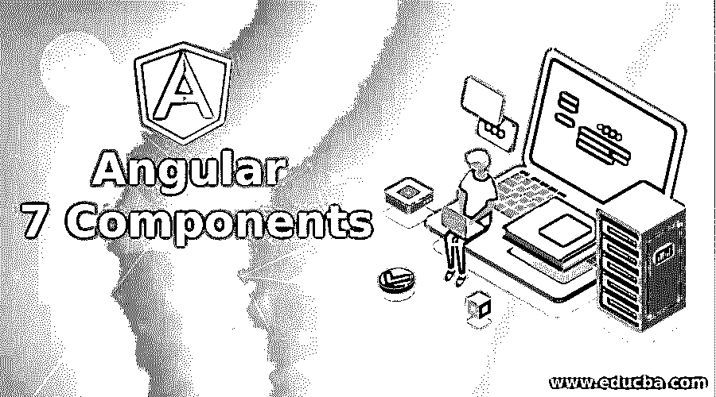
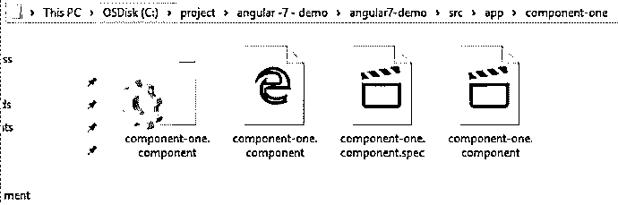
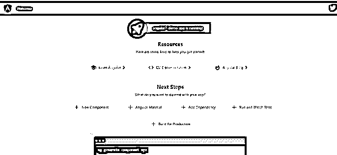

# 角度 7 分量

> 原文：<https://www.educba.com/angular-7-components/>




## 角度 7 分量介绍

以下文章概述了 Angular 7 组件。在角度上，一切都是组成部分。组件是 angular 最重要的特征。我们的整个角度应用程序是使用不同的组件构建的。我们的 angular 应用程序背后的思想是构建组件。组件是可重用部分，这也使得我们的应用程序易于维护和扩展。组件只不过是一个类，用来与浏览器上显示的 HTML 进行交互。

我们可以通过使用一些命令来生成角度分量。但为此，我们需要进入应用程序目录，然后打开命令 shell 来运行一些命令，如下所示:

<small>网页开发、编程语言、软件测试&其他</small>

**语法:**

```
ng generate component (component_name)
```

或者

```
ng g c (component_name)
```

### 角度 7 分量的例子

以下是 7°角组件的示例:

**举例:**

```
ng generate component_one
```

或者

```
ng g c componenet_one
```

现在，在项目的 app 目录中打开命令提示符，并运行上述命令之一。

**输出:**





**生成的文件**

*   组件-one.component.ts
*   comp1.component.css
*   组件一.组件规格
*   component-one.component.html

我们已经生成了我们的组件，它将由下面列出的 4 个文件组成:

#### 1.组件一/组件一.组件. ts

该文件是用 typescript 编写的名为 ComponentOneComponent 的组件类。默认情况下，该类实现 OnInit 并包含方法 ngOnInit。

**文件:component-one.component.ts**

```
import { Component, OnInit } from '@angular/core';
@Component({
selector: 'app-component-one',
templateUrl: './component-one.component.html',
styleUrls: ['./component-one.component.css']
})
export class ComponentOneComponent implements OnInit {
constructor() { }
ngOnInit() {
}
}
```

#### 2.component-one/comp 1 . component . CSS

这个文件是空的。

这是一个 CSS 文件，我们可以在其中放置我们想要应用的 CSS。

#### 3.组件一/组件一.组件规格

该文件是一个用于测试目的的类型脚本文件。这个文件是选项，它的存在是不必要的。

**文件:component-one . component . spec . ts:**

```
import { async, ComponentFixture, TestBed } from '@angular/core/testing';
import { ComponentOneComponent } from './component-one.component';
describe('ComponentOneComponent', () => {
let component: ComponentOneComponent;
let fixture: ComponentFixture<ComponentOneComponent>;
beforeEach(async(() => {
TestBed.configureTestingModule({
declarations: [ ComponentOneComponent ]
})
.compileComponents();
}));
beforeEach(() => {
fixture = TestBed.createComponent(ComponentOneComponent);
component = fixture.componentInstance;
fixture.detectChanges();
});
it('should create', () => {
expect(component).toBeTruthy();
});
});
```

#### 4.组件一/组件一.组件. html

这个文件是用 HTML 编写的。用于向用户显示数据。基本上，它将包含 html 代码，如何网页看起来像。

**文件:component-one.component.html**

```
<p>component-one works!</p>
```

**根目录文件和结构**

*   应用程序.组件. css
*   app.component.html
*   应用程序.组件.规格
*   应用程序组件
*   应用程序模块
*   应用程序-路由.模块

现在 angular cli 也为我们添加了路由文件。

这些文件是在我们创建 angular 项目时由 angular cli 默认创建的。

##### 1.应用程序模块

这个文件将包含库和其他东西。如果我们仔细观察该文件，它还包含一个新生成文件的条目，即 ComponentOneComponent。我们还需要将这个新创建的组件声明到声明数组中。但是现在它已经完成了。

**文件:**

```
import { BrowserModule } from '@angular/platform-browser';
import { NgModule } from '@angular/core';
import { AppRoutingModule } from './app-routing.module';
import { AppComponent } from './app.component';
import { ComponentOneComponent } from './component-one/component-one.component';
@NgModule({
declarations: [
AppComponent,
ComponentOneComponent
],
imports: [
BrowserModule,
AppRoutingModule
],
providers: [],
bootstrap: [AppComponent]
})
export class AppModule { }
```

现在我们可以测试我们的应用程序了。还有一件事，应用程序组件是父组件，我们后来添加的所有其他组件是子组件。

因此，我们可以说 app 是所有其他组件的父组件。当我们第一次运行我们的应用程序时，它将在 4200 端口 URL 上运行:“http://localhost:4200/”这将首先执行我们的 index.html 文件。

**文件:index.html**

```
<!doctype html>
<html lang="en">
<head>
<meta charset="utf-8">
<title>Angular7Demo</title>
<base href="/">
<meta name="viewport" content="width=device-width, initial-scale=1">
<link rel="icon" type="image/x-icon" href="favicon.ico">
</head>
<body>
<app-root></app-root>
</body>
</html>
```

这是由 angular 生成的普通 html 文件。但是这个文件包含一个标签，即 <app-root></app-root> 这个标签在 main.ts 中有引用。

我们将在下面看到 main.ts。

**文件 main.ts:**

```
import { AppModule } from './app/app.module';
import { environment } from './environments/environment';
if (environment.production) {
enableProdMode();
}
platformBrowserDynamic().bootstrapModule(AppModule)
.catch(err =>console.error(err));
```

在 main.ts 中，我们导入了 AppModule，在 bootstrapModule 中，我们也定义了它。因此，当我们第一次调用 angular 应用程序时，它使 AppModule 被加载。

main.ts 是包含父“appmodule”的 angular 应用程序的入口点。这个“appmodule”将进一步包含要加载的子模块。

我们已经将新组件输入到 appmodule 中。

##### 2.应用程序组件

默认情况下，该文件也由 angular 生成。AppModule 也有进入 app.module.ts 的入口。这是包含选择器定义的文件，这里编写了 oinindex.html。

即

To 类必须有@Component 注释。

这还包含各种属性，如:

*   选择器:我们需要为此指定一个唯一的名称。它将作为这个 html 页面的唯一标签。
*   **templateUrl:** 你要渲染的 html 的路径。
*   **styleUrls:** 数组 CSS 文件路径

**文件:**

```
import { Component } from '@angular/core';
@Component({
selector: 'app-root',
templateUrl: './app.component.html',
styleUrls: ['./app.component.css']
})
export class AppComponent {
title = 'angular7-demo';
}
```

##### 3.app.componenet.html

这是一个 html 文件，其中包含 html 代码和如何将网页看起来像用户。app.component.ts 在模板路径中有其条目。因此，无论何时调用 app.componenet.ts 文件，该页面都将显示数据以供使用。默认情况下，该文件将包含大量代码，但我们可以以任何方式修改它。

当我们将应用程序加载到浏览器时，默认功能如下:默认 html 页面。

**输出:**




### 结论

所以角度只取决于元件。要实现角度应用，我们必须在应用中包含一个角度分量。还有一点，组件是模块的子组件。模块是所有其他组件的父组件。通过它它们被装载。角度仅取决于组件。

### 推荐文章

这是一个角度 7 组件的指南。这里我们讨论角 7 分量的介绍和例子。您也可以看看以下文章，了解更多信息–

1.  [角度特征](https://www.educba.com/angular-features/)
2.  [AngularJS 服务](https://www.educba.com/angularjs-services/)
3.  [Angular 2 架构](https://www.educba.com/angular-2-architecture/)
4.  [角度选择](https://www.educba.com/angular-alternatives/)


