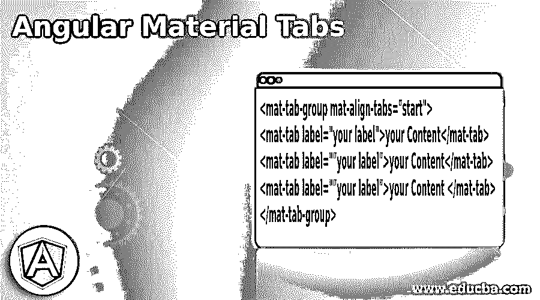
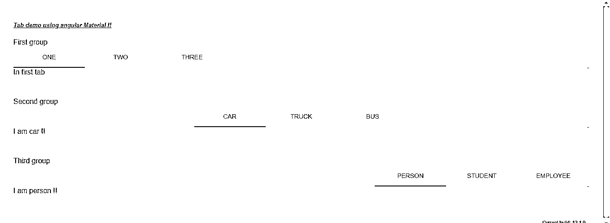

# 有角度的材料标签

> 原文：<https://www.educba.com/angular-material-tabs/>

## 角度材料选项卡简介

在有角度的材料中，标签用于将内容显示在不同的部分。这些选项卡增加了用户的可读性，并使应用程序更具用户交互性。根据我们的需求，我们可以有任意数量的选项卡，如果我们增加的选项卡数量大于标题的长度，那么滚动条会出现，让用户滚动并看到所有可用的选项卡。在 Angular material 中，为了使用此选项卡的功能，我们需要通过从我们已有的素材库导入一些模块或包来对应用程序进行一些配置。此外，对于选项卡来说，更重要的一点是，只有一个选项卡是活动的，或者我们可以一次对用户可见，我们可以通过简单地点击它们来在我们想要的选项卡之间切换。

**语法:**

<small>网页开发、编程语言、软件测试&其他</small>

在这一节中，我们将仔细研究在 Angular material 中创建选项卡的语法，以方便初学者，让我们开始吧；

`<mat-tab-group mat-align-tabs="start">
<mat-tab label="your label">your Content</mat-tab>
<mat-tab label=""your label">your Content</mat-tab>
<mat-tab label=""your label">your Content </mat-tab>
</mat-tab-group>`

正如你在上面的语法中所看到的，我们使用了“mat-tab-group”和“mat-tab”来创建标签。这是在 angular 中创建选项卡时要使用的两个重要标签。为了更好地理解，我们来练习一下语法，见下文；

例如:

`<mat-tab-group mat-align-tabs="start">
<mat-tab label="HELLO">I am hello</mat-tab>
<mat-tab label=""WORLD">I am world</mat-tab>
</mat-tab-group>`

### 如何在有角度的材料中创建选项卡？

正如我们现在已经知道的，选项卡用于表示不同部分的数据，这使得它对用户来说更具可读性。此外，它让用户可以随时在标签之间切换。我们可以在页面上有任意数量的选项卡，这取决于我们的需求。它通过添加和提供滚动条来自动调整大小，以查看所有可用的选项卡。让我们仔细看看在我们的应用程序中使用它所需的配置(见下文);

1) MatTabsModule:如果您想使用 angular material 实现选项卡，那么我们需要将这个包导入到我们的应用程序中，或者我们可以说是 Module。这个模块是素材库的一部分，为了使用它，我们应该在我们的 angular 应用程序中包含材质依赖。作为参考，看看下面的代码，我们如何在我们的程序中使用它，见下文；

例如:

`import {MatTabsModule} from '@angular/material/tabs';`

另外，不要忘记在应用程序的根模块中提到这个模块。

2)这个模块“MatTabsModule”提供了两个指令来帮助我们创建选项卡。我们可以直接在 HTML 页面的模板上使用这个指令来创建标签。下面提到的详细信息；

a) mat-tab:这是用来管理选项卡的，我们可以有任意数量的 mat-tab 来直接表示 UI 上的选项卡。

b) mat-tab-group:这将我们的选项卡表示为一个组，我们可以使用它作为“mat-tab”的父标记，它将组合我们所有的选项卡，并以适当的格式在 UI 上显示它们。

下面是创建角度材质应用程序的步骤；

1)首先安装 angular CLI，它使我们能够下载项目所需的包和库。您可以通过在命令上键入以下命令来下载它，请确保您已经安装了 node，见下文；

例如:

`npm install -g @angular/cli)`

上述命令将在我们的系统中全局安装 CLI，因此我们可以在需要时全局使用它。

3)现在，在这一步中，我们将尝试从头开始创建新的 angular 项目，该项目将不是我们稍后必须通过在项目中安装材料依赖项来添加的材料项目。因此，只需在您的命令提示符下执行下面的命令，并按回车键，见下文；

例如:

ng 新的项目名称

`ng new my-first-project`

该命令将创建名为 my-first-project 的项目，您可以使用提到的任何名称创建您的项目。

4)只是为了确保尝试下面提到的一个命令来将所有需要的库安装到我们的项目中，

例如:

`npm install`

5)现在，您可以通过键入下面提到的简单命令来测试和运行您的项目。这只是为了确保我们在正确的轨道上，我们的项目已经创建，没有任何错误或缺陷。

例如:

`ng serve`

6)进入浏览器，尝试使用以下 URL 运行应用程序:

例如:

http://localhps:4200

默认情况下，angular 项目在端口 4200 上运行，如果需要，您可以根据需要更改它。

7)现在一切都设置好了，我们有了我们的 angular 项目，现在我们只要在命令提示符下运行下面的命令，就可以将素材库添加到我们的项目中；

例如:

`ng add @angular/material`

### 角形材料标签示例

1)模块代码:

`import {NgModule} from '@angular/core';
import {MatTabsModule} from '@angular/material/tabs';
@NgModule({
exports: [
MatTabsModule
] })
export class TabsDemoModule {}`

2) demo.tabs.component.ts 代码:

`import {Component} from '@angular/core';
/**
* @title Tab Group Demo
*/
@Component({
selector: 'tab-demo',
templateUrl: 'tab-demo.html',
styleUrls: ['tab-demo.css'],
})
export class TabDemoComponent {}`

3)Index.html 电码:

`<!DOCTYPE html>
<html lang="en">
<head>
<meta charset="utf-8">
<meta name="viewport" content="width=device-width, initial-scale=1.0">
<link href="https://fonts.googleapis.com/icon?family=Material+Icons&display=block" rel="stylesheet">
<title>Tab Demo in Material</title>
</head>
<body class="mat-app-background">
<tab-demo>Loading...</tab-demo>
Current build: 12.1.0
</body>
</html>`

4)demo.componenet.html 电码:

`<h5><u><i>Tab demo using angular Material !!</i></u></h5>
First group
<mat-tab-group mat-align-tabs="start">
<mat-tab label="ONE">In first tab</mat-tab>
<mat-tab label="TWO">In second tab</mat-tab>
<mat-tab label="THREE">In third tab</mat-tab>
</mat-tab-group>
Second group
<mat-tab-group mat-align-tabs="center">
<mat-tab label="CAR">I am car !!</mat-tab>
<mat-tab label="TRUCK">I am truck !!</mat-tab>
<mat-tab label="BUS">I am bus !!</mat-tab>
</mat-tab-group>
Third group
<mat-tab-group mat-align-tabs="end">
<mat-tab label="PERSON">I am person !!</mat-tab>
<mat-tab label="STUDENT">I am student !!</mat-tab>
<mat-tab label="EMPLOYEE">I am employee !!</mat-tab>
</mat-tab-group>`

**输出:**

### 结论

正如我们已经看到的，这个库使我们的工作变得非常简单和方便，因为我们不需要维护太多的代码，只需使用简单的指令，我们就可以实现带有样式的功能，按照上面的步骤使用 angular material 实现我们的第一个应用程序。

### 推荐文章

这是一个有角度的材料标签指南。在这里，我们讨论的定义，语法，如何创建标签的角度材料与例子和代码实现。您也可以看看以下文章，了解更多信息–

1.  [角度 CLI](https://www.educba.com/angular-cli/)
2.  [角度 7 形式验证](https://www.educba.com/angular-7-form-validations/)
3.  [角度 7 特征](https://www.educba.com/angular-7-features/)
4.  [角的 ng-if](https://www.educba.com/angularjs-ng-if/)

