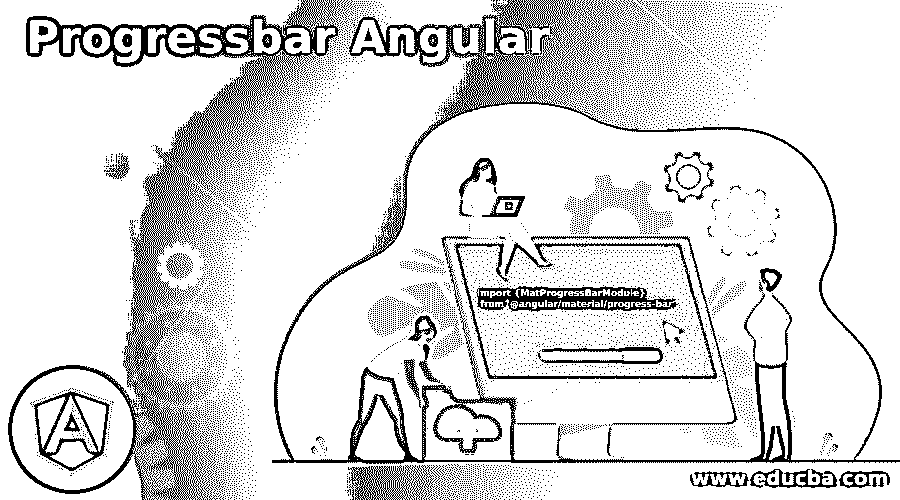
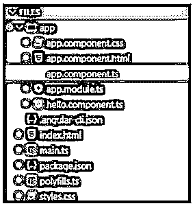
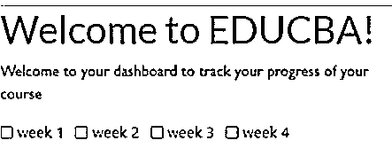
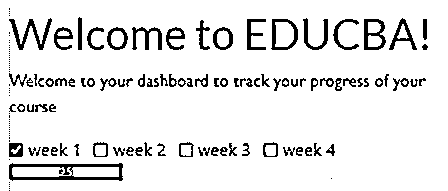
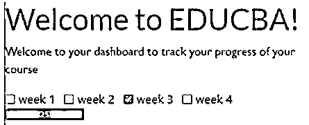
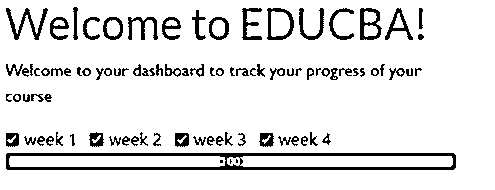

# 进度条角度

> 原文：<https://www.educba.com/progressbar-angular/>

## 进度条角度简介

下面的文章提供了 Progressbar Angular 的概要。每一个使用电话、台式机或笔记本电脑的人都知道进度条是什么样子的，以及它是做什么的。每当我们上传或下载一些东西，我们可以看到一个进度条，代表多少工作已经完成。它用于向用户显示流程完成了多少，还剩下多少。开发人员也使用带有进度条的百分比，有时使用缓冲条来显示进度，用户可以知道进程正在进行中，但不会显示已完成的进度。

**进度条角度语法:**

<small>网页开发、编程语言、软件测试&其他</small>

下面的语法用于开发一个水平进度条来指示活动和进度。

`import {MatProgressBarModule} from '@angular/material/progress-bar';`

### 加工进度条角度

angular 中的进度条支持四种模式。

这些模式如下:

*   **determine:**determine 是 angular 中最常用的一个应用或网站的进度条。在这里，用户可以以百分比的形式看到流程的进度，并知道还有多少工作要做。这种类型的进度条很出名，因为它为用户提供了帮助。
*   **不确定:**这是一种进度条，要求用户等待进程完成。这里没有向用户提供已完成工作的百分比。这种类型的进度条用于用户不需要知道进度状态的情况。
*   缓冲区:这种进度条只是用来向用户表明正在进行一些工作，比如连接或加载服务器，用户只需要知道正在进行什么进程，而不考虑进度百分比。
*   **查询:**查询进度条用于指示预加载进度，甚至在实际加载开始之前。

### 进度条角度示例

下面是提到的例子:

在下面的示例中，开发了一个进度条来跟踪课程的进度，例如完成了多少周以及整个课程还剩多少进度。因此，课程由四周组成，当选中第一周的复选框时，进度条显示进度为 25%，同样，单击第二周的复选框和第一周的复选框时，进度显示为 50%，当选中相应周的所有复选框时，进度条显示进度为 100%。在这个例子中，我们使用了 angular-bootstrap-progressbar 作为进度条。在此示例中，用于正确执行的文件显示在下图中，其详细内容显示在后面。为了正确执行代码并获得准确的输出，名称应该完全相同。

**代码:**

**a. app.component.css**

`a {
font-family: 'Gill Sans'
, 'Gill Sans MT'
, Calibri
, 'Trebuchet MS'
, sans-serif;
}`

b . app.component.html

`<y we="{{ we }}"></y>
<a>
Welcome to your dashboard to track your progress of your course
</a>

<input class="form-check-input" type="checkbox" (change)="selectCourse(box.id)" [id]="box.id" [value]="box.id">
<label class="form-check-label" [for]="box.id">{{box.label}}</label>

<a>
<ngb-progressbar type="success" [value]="coursesPercentage">{{coursesPercentage}}</ngb-progressbar>
</a>`

**c. app.component.ts**

`import { Component } from '@angular/core';
import * as _ from 'lodash';
@Component({
selector: 'my-app',
templateUrl: './app.component.html',
styleUrls: ['./app.component.css'] })
export class AppComponent {
coursesPercentage: number;
selectedCourses: any = {};
boxes = [{
label: 'week 1',
id: 1
},
{
label: 'week 2',
id: 2
},
{
label: 'week 3',
id: 3
},
{
label: 'week 4',
id: 4
}] we = 'EDUCBA';
selectCourse(EDUCBA) {
if (!!!EDUCBA) return;
this.selectedCourses[EDUCBA] = !this.selectedCourses[EDUCBA];
const arr = _.toArray(
this.selectedCourses
);
const trues = _.filter(arr
, r => r === true
).length;
const arrLength = this.boxes.length;
this.coursesPercentage = (trues / arrLength) * 100;
}
}`

**d. app.module.ts**

`import { BrowserModule } from '@angular/platform-browser';
import { NgbModule } from '@ng-bootstrap/ng-bootstrap';
import { NgModule } from '@angular/core';
import { HelloComponent } from './hello.component';
import { FormsModule } from '@angular/forms';
import { AppComponent } from './app.component';
@NgModule({
imports: [BrowserModule
, FormsModule
, NgbModule.forRoot()],
declarations: [AppComponent
, HelloComponent],
bootstrap: [AppComponent] })
export class AppModule { }`

**e. hello.component.ts**

`import { Component
, Input } from '@angular/core';
@Component({
selector: 'y',
template: `<h1>Welcome to {{we}}!</h1>`,
styles: [`h1 { font-family: 'Gill Sans'
, 'Gill Sans MT'
, Calibri
, 'Trebuchet MS'
, sans-serif; }`] })
export class HelloComponent {
@Input() we: string;
}
[vi] .angular-cli.json
{
"apps": [{
"styles": ["styles.css"] }] }`

index.html

`<my-app>Your progress will be updated</my-app>`

**g. main.ts**

`import './polyfills';
import { enableProdMode } from '@angular/core';
import { platformBrowserDynamic } from '@angular/platform-browser-dynamic';
import { AppModule } from './app/app.module';
platformBrowserDynamic().bootstrapModule(AppModule).then(ref => {
if (window['ngRef']) {
window['ngRef'].destroy();
}
window['ngRef'] = ref;
}).catch(err => console.error(err));`

**h. package.json**

`{
"we": "angular-bootstrap-progressbar",
"version": "0.0.0",
"private": true,
"dependencies": {
"rxjs": "5.5.6",
"lodash": "4.17.5",
"core-js": "2.5.1",
"zone.js": "0.8.20",
"@angular/core": "5.2.8",
"@angular/forms": "5.2.8",
"@angular/common": "5.2.8",
"@angular/router": "5.2.8",
"@angular/compiler": "5.2.8",
"@angular/platform-browser": "5.2.8",
"@ng-bootstrap/ng-bootstrap": "1.1.0",
"@angular/platform-browser-dynamic": "5.2.8"
},
"scripts": {
"ng": "ng",
"start": "ng serve",
"build": "ng build",
"test": "ng test",
"lint": "ng lint",
"e2e": "ng e2e"
},
"devDependencies": {
"@angular-devkit/build-angular": "~0.1100.4",
"@angular/cli": "~11.0.4",
"@angular/compiler-cli": "~11.0.4",
"@types/jasmine": "~3.6.0",
"@types/node": "^12.11.1",
"codelyzer": "^6.0.0",
"jasmine-core": "~3.6.0",
"jasmine-spec-reporter": "~5.0.0",
"karma": "~5.1.0",
"karma-chrome-launcher": "~3.1.0",
"karma-coverage": "~2.0.3",
"karma-jasmine": "~4.0.0",
"karma-jasmine-html-reporter": "^1.5.0",
"protractor": "~7.0.0",
"ts-node": "~8.3.0",
"tslint": "~6.1.0",
"typescript": "~4.0.2"
}
}`

**一、聚合填料**

`import 'core-js/es6/reflect';
import 'core-js/es7/reflect';
import 'zone.js/dist/zone';`

**j. styles.css**

`a {
font-family: 'Gill Sans'
, 'Gill Sans MT'
, Calibri
, 'Trebuchet MS'
, sans-serif;
}`

**输出:**

**关于代码执行:**

**点击任意一周复选框:**

**点击各周的所有复选框:**

### 结论

在这篇文章的基础上，我们看到了进度条的概念及其在 Angular。我们通过几个例子来帮助我们理解 Angular 中进度条的工作原理。

### 推荐文章

这是一个进度条角度的指南。这里我们分别讨论进度条的介绍、工作原理和实例。您也可以看看以下文章，了解更多信息–

1.  [AngularJS ng 级](https://www.educba.com/angularjs-ng-class/)
2.  [角度 CLI](https://www.educba.com/angular-cli/)
3.  [角度日期过滤器](https://www.educba.com/angularjs-date-filter/)
4.  [角度 7 形式验证](https://www.educba.com/angular-7-form-validations/)

