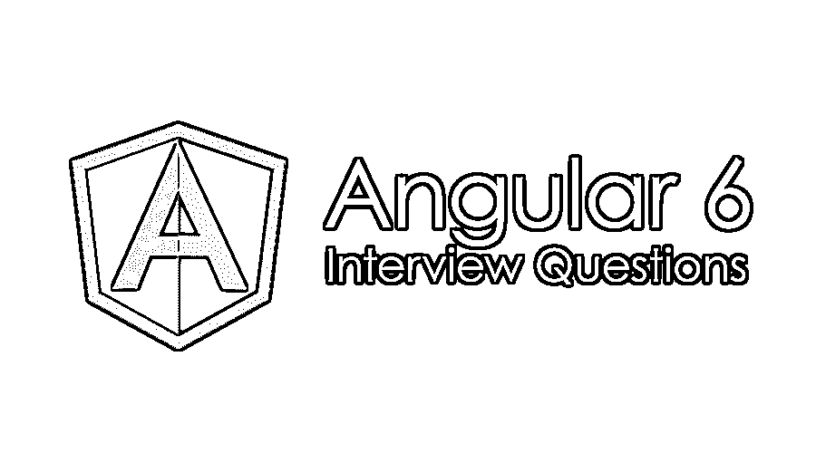

# 有角度的 6 个面试问题

> 原文：<https://www.educba.com/angular-6-interview-questions/>




## Angular 6 问答介绍

Angular 是流行的开源框架之一，用于开发基于 web 应用的前端，由 Google 的 Angular 团队提供支持。Angular 带来了一个新版本的实现 6.0，其中有一些关键的新特性，尤其是 Angular-cli。

现在，如果你正在寻找一份与 Angular 6 相关的工作，那么你需要准备 2022 Angular 6 面试问题。的确，每个面试都因不同的职位而不同。在这里，我们准备了 6 个重要的面试问题和答案，它们将帮助你在面试中取得成功。

<small>网页开发、编程语言、软件测试&其他</small>

在这篇 2022 年的 6 个面试问题的文章中，我们将提出 10 个最重要和最常被问到的 6 个面试问题。这些问题分为以下两部分:

### 第 1 部分-角度 6 面试问题(基础)

这第一部分涵盖了基本的 6 个面试问题和答案。

#### Q1。提供 angular 6 的 ng 模块中的“声明”、“提供者”和“导入”之间的代码片段的一些适当的例子。

**答:**
请在下面找到对申报、供应商和进口的解释:

*   **声明**:这是 Angular 的关键特性之一，用于当前模块的单个指令到当前模块的其他指令的可用品种组件或管道。如果有人愿意在当前模块中使用来自其他指令的相同声明组件，那么声明应该需要正确完成。
*   **导入:**帮助导入当前模块中的其他模块组件的可用性。
*   **提供者:**它帮助 DI 识别和理解使用服务和价值。

#### Q2。用一个恰当的例子详细解释 angular JS 6 版本中“constructor”和“ngoninit”之间的真正区别？

**答案:**
这是面试中问的基本有棱角的 6 个面试问题。请在下面找到关于 angular JS 的构造器和 ngonint 的详细解释:

*   **Constructor** : Constructor 是任何特定类或对象的默认声明之一，每次实例化任何类时都可以调用它，也保证了子类和不同实例变量字段的正确初始化。
*   **Ngonint** :这是 Angular 使用的第一个初始化方法之一，在 [angular](https://www.educba.com/angular-commands/) 生命周期的第一个组成部分中提到。这主要表明 angular 已经正确地创建了所有需要的组件。这不是必须使用的，而是使用的最佳实践。

#### Q3。在 Angular 5 中开发的应用程序工作正常，还没有发现任何问题。那么为什么我们计划将我们的应用程序升级到 Angular 6，Angular JS 的这个新版本引入了哪些新功能。详细解释一下？

**答:**
棱角 6 与[棱角 5](https://www.educba.com/angular-5-interview-questions/) 相比有了品种升级，详情请见下面的讲解:

*   **Angular 的元素:**Angular 6 中引入的关键特性之一，其中 Angular 的一些元素可以是一个 wrap，并表示为 web 组件之一。主要用途是相同的组件可以很容易地用于非角度项目，因为该组件可以被视为一个普通的 web 组件。
*   **名为 Ivy 的新渲染引擎:**有助于提高应用程序性能，尤其是在提高速度和减小应用程序大小方面。
*   **名为 tree shakable 的新提供者:**注册提供者的新方式之一，在@ Injectable()内添加一些新的属性名 providedIn。
*   **rxjs 6:**Angular 6 使用的更新库之一。
*   **ElementRef:** ElementRef 可以在 Angular 6 的情况下单独定义，不需要总是使用原生元素属性。
*   **动画:** Angular 6 版本引入了一个新特性，叫做动画生成器。
*   在 Angular 6 中，我们也可以在运行时使用 I18n，而不需要总是构建。

让我们转到下一个有角度的 6 个面试问题

#### Q4。详细解释在 Angular JS 中使用 renderer 方法的原因，而我们可以通过使用一些原生元素方法来轻松处理相同的问题。有使用这种设备的设备吗？请解释一下？

**答:**
Angular 可以假设一个平台，浏览器用于渲染细节，从该平台取数据。现在，如果 angular 要使用 Angular DOM 的一些本地元素，那么这些元素只能用于相同 DOM 环境的应用程序。在 angular 6 中，有一个新类叫做 Render2，它帮助准备本地元素，比如 web 组件元素，这样它就可以在任何地方使用，避免了 DOM 依赖。

#### Q5。详细解释一下编译器所使用的角形，叫做 AOT(提前)？

**答案:**
AOT 代表提前。angular 使用它在构建过程中预编译所有 angular 组件和可用模板。AOT 总是比其他人推出基于角度的应用。

### 第 2 部分-角度 6 面试问题(高级)

现在让我们来看看进阶的 Angular 6 面试问题。

#### Q6。在 Angular 中使用的一个非常流行的键是 Zone，请详细解释一下。

**答:**
ngZone 只不过是一个名为 Zone.js 的 JS 文件的包装器。这是一个关键库，用于创建一些关于使用各种异步函数的上下文，使它们能够被正确跟踪。角度总是依赖于用于检测变化的区域。

#### Q7。Angular JS developer 有时会计划频繁使用延迟加载模块。详细解释为什么需要使用它以及它如何直接影响？

**回答:**
不知何故开发者需要一些功能模块的惰性加载，那么他们就可以很容易地使用 [Angular JS](https://www.educba.com/uses-of-angular-js/) 的路由配置中一个叫做 loadChildren 的关键属性。当应用程序的规模与日俱增时，开发人员通常会使用它。所以使用相同的效用:

*   将根据应用程序的需求加载预期的模块。
*   应用程序启动总是比平时快。

让我们转到下一个有角度的 6 个面试问题

#### Q8。详细解释为 Angular JS 中的指令和组件设计的生命周期，特别是为新引入的版本 6.0？

**答:**
以下生命周期通常遵循 Angular JS 的组件和指令:

*   构造器
*   恩贡昌斯
*   nhOnInit
*   ngDoCheck
*   恩贡德斯特罗伊
*   ngAfterContentInit(仅用于组件)
*   ngAfterContentChecked(仅用于组件)
*   ngAfterViewInit(仅用于组件)
*   ngAfterViewChecked(仅用于组件)

#### Q9。是否可以从已准备好的已定义模板引用中包含一个嵌入式视图？如果是，请作出同样的解释。

**答案:**
这是面试中被问得最多的棱角分明的 6 个面试问题。可以使用 createdEmbeddedView 方法创建嵌入式视图，并可以通过使用 TemplateRef 的特定实用程序轻松地将其附加到可用的 DOM。

```
@Component({
selector: 'app-root',
template: `
<ng-template #template let-name='example'><div>{{…}}</ng-template>
})
export class ApplicationComponent implements AfterViewChecked {
@ViewChild('template1', { read: TemplateRef }) _template: TemplateRef<…>;
constructor() { }
ngAfterViewChecked() {
this.vc.createEmbeddedView(this._template1, {example: '….'});
}
}
```

#### Q10。如果有人愿意详细解释 angular 的确切路线变化，那么他们如何做到这一点？

**回答:**
在 Angular 6 中有一个名为 Rx event 的选项，需要订阅路由器的特定实例。事情可以通过以下方法完成:

```
class SomeClass{
Constructor(private route : Router){
route.subscribe((val) => ……)
}
}
```

### 推荐文章

这是 Angular 6 面试问答列表的指南。这里我们列出了最有用的 10 组面试问题，这样求职者就能轻松应对面试。您也可以阅读以下文章，了解更多信息——

1.  [目标 C 面试问题](https://www.educba.com/objective-c-interview-questions/)
2.  [线程面试问题](https://www.educba.com/threading-interview-questions/)
3.  [测试面试问题](https://www.educba.com/testing-interview-questions/)
4.  [PLC 面试问题](https://www.educba.com/plc-interview-questions/)


