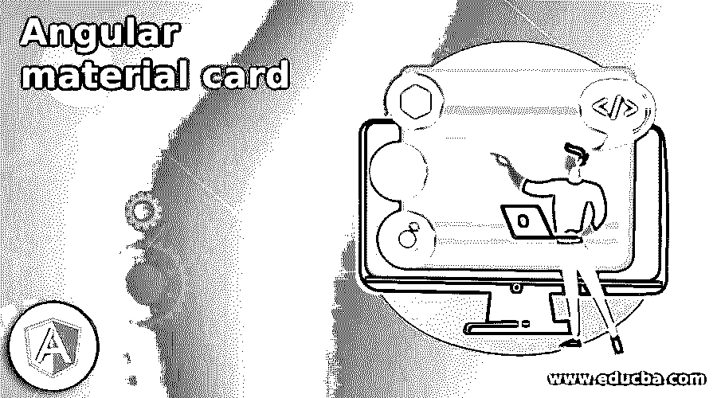
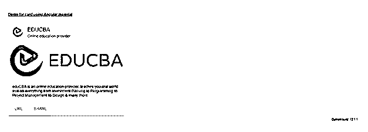

# 角形材料卡片

> 原文：<https://www.educba.com/angular-material-card/>

## 角材卡介绍

棱角分明的材料也为我们提供了一个主要的东西，那就是卡片，它用来在卡片上显示我们的文字、照片、图像，所以基本上，它用来显示容器内的内容，这对于用户来说更具展示性。Material 内置了一个库，可用于在我们的应用程序中构建卡。为了使用素材库中的卡片，我们需要对应用程序进行更改和一些配置，然后我们可以在应用程序中使用它来显示我们的图像、照片和文本。此外，我们可以在其中执行一个操作。在本教程的下一节，我们将详细了解移植和配置，以便更好地理解。

**语法**

<small>网页开发、编程语言、软件测试&其他</small>

正如我们所知，为了在应用程序中使用它，我们必须进行配置，然后使用素材库提供的内置标签和指令，让我们仔细看看它，以便更好地理解，见下文；

`<mat-card>your content</mat-card>`

正如你在上面的语法中所看到的，我们在这里使用了“mat-card ”,我们可以用它来表示我们在卡容器中的文本或内容。让我们来看看练习语法；

**例如:**

`<mat-card> My Text </mat-card>`

### 如何在有角的材料中使用卡片？

在 Angular material 中，我们有一个卡库或模块，可以让我们为自己创建卡，在其中我们可以根据需要放置内容，在这一部分中，我们还将进一步了解我们需要进行的配置，以便在我们的应用程序中实现这一功能。为了更好地理解和清楚起见，

1) MatCardModule:这是素材库中卡片的主模块，我们必须将此模块放置或呈现在应用程序中，以便将卡片放入购物车，否则它会给我们一个错误。首先，我们将把它导入到我们的根模块或者任何我们想要使用它的子模块中。请参考下面的代码，以便在您的应用程序中使用它，见下文；

**例如:**

`import {MatCardModule} from '@angular/material/card';`

从上面的代码行可以看出，我们正在尝试使用“MatCardModule”，这个模块为我们提供了各种选项来设计具有不同组件的卡，让我们更仔细地了解它们的细节，见下文；

1.  a) mat-card-title:该标签用于提供卡片的标题。
2.  b) mat-card-subtitle:该标签用于提供卡片的子标题。
3.  c) mat-card-content:该标签用于为卡提供内容。
4.  d) mat-card-actions:该标签用于提供卡片上的动作。
5.  e) mat-card-footer:该标签用于为卡片提供页脚。

2) mat-card:它是选择器，用于在将上述语句导入到根文件后使用材料创建卡片，我们可以使用它在 UI 上显示我们的卡片。

**例如:**

`<mat-card> some content </mat-card>`

现在，让我们从需要采取的步骤开始，以便为初学者初步加强我们的角材料项目，见下文；

1)首先安装 angular CLI，它使我们能够下载项目所需的包和库。您可以通过在命令上键入以下命令来下载它，请确保您已经安装了 node，见下文；

**例如:**

npm install -g @angular/cli)上述命令将在我们的系统中全局安装 cli，因此我们可以在需要时全局使用它。

3)现在，在这一步中，我们将尝试从头开始创建新的 angular 项目，该项目将不是我们稍后必须通过在项目中安装材料依赖项来添加的材料项目。所以只需在你的命令提示符下执行下面的命令，然后按回车键，见下文；

**例如:**

`ng new your project name
>> ng new my-first-project`

该命令将创建名为 my-first-project 的项目，您可以使用提到的任何名称创建您的项目。

4)只是为了确保尝试下面提到的一个命令来将所有需要的库安装到我们的项目中，

**例如:**

`npm install`

5)现在，您可以通过键入下面提到的简单命令来测试和运行您的项目。这只是为了确保我们在正确的轨道上，我们的项目已经创建，没有任何错误或缺陷。

**例如:**

`ng serve`

6)进入浏览器，尝试使用以下 URL 运行应用程序:

**例如:**

`http://localhps:4200`

默认情况下，angular project 在端口 4200 上运行，如果需要，您可以根据需要进行更改。

7)现在一切都设置好了，我们有了我们的 angular 项目，现在我们只要在命令提示符下运行下面的命令，就可以将素材库添加到我们的项目中；

**例如:**

`ng add @angular/material`

### 例子

**1) demo.card.component.ts 代码:**

`import {Component} from '@angular/core';
/**
* @title Card demo using material
*/
@Component({
selector: 'card-demo',
templateUrl: 'demo.card.component.html',
styleUrls: ['demo.card.component.css'],
})
export class DemoMaterial {}`

**2)demo.card.component.html 代码:**

`<h5><u><i>Demo for card using Angular material</i></u></h5>
<mat-card class="example-card">
<mat-card-header>

<mat-card-title>EDUCBA</mat-card-title>
<mat-card-subtitle>Online education provider</mat-card-subtitle>
</mat-card-header>

<mat-card-content>

`

eduCBA 是一个在线教育提供商，教你从投资银行到编程到项目管理到设计等各方面的真实技能。

`

</mat-card-content>
<mat-card-actions>
<button mat-stroked-button color="accent">LIKE</button>
<button mat-stroked-button color="accent">SHARE</button>
</mat-card-actions>
</mat-card>`

**3)index.html 代码:**

`<!DOCTYPE html>
<html lang="en">
<head>
<meta charset="utf-8">
<meta name="viewport" content="width=device-width, initial-scale=1.0">
<link href="https://fonts.googleapis.com/icon?family=Material+Icons&display=block" rel="stylesheet">
<title>Card demo using material</title>
</head>
<body class="mat-app-background">
<card-demo>Loading..</card-demo>
Current build: 12.1.1
</body>
</html>`

**4) module.tc 代码:**

`import {NgModule} from '@angular/core';
import {MatCardModule} from '@angular/material/card';
@NgModule({
exports: [
MatCardModule,
] })
export class MaterialCardDemo {}`

**5) demo.card.component.css 代码:**

`.example-header-image {
background-image: url('https://lh5.googleusercontent.com/p/AF1QipN4k7WvGz9Dqg7xEssSjMpCLjkOPwOQbFDUl5sj=w203-h201-k-no');
}`

**输出:**

### 结论-角形材料卡

通过使用这个，我们可以直接把我们的内容放在卡片里面，同时 material 为我们提供了默认的样式和设计，这使得它对用户来说更有吸引力。开发人员也很容易使用、操作和维护它。

### 推荐文章

这是一个有角度的材料卡指南。这里我们详细讨论植入和配置，以便更好地理解。您也可以看看以下文章，了解更多信息–

1.  [有棱角的材料图标](https://www.educba.com/angular-material-icons/)
2.  [角度 7 特征](https://www.educba.com/angular-7-features/)
3.  [角度 7 形式验证](https://www.educba.com/angular-7-form-validations/)
4.  [角的 ng 模型](https://www.educba.com/angularjs-ng-model/)

