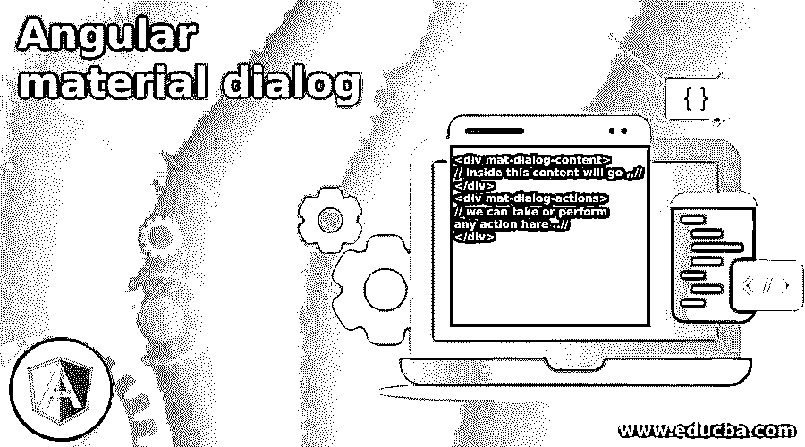
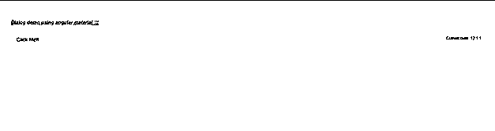
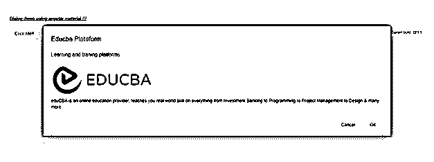

# 角度材料对话框

> 原文：<https://www.educba.com/angular-material-dialog/>




## “角度材质”对话框介绍

Angular material 为我们提供了一个对话框，可以作为弹出窗口显示给用户，询问需要采取的行动。它基本上用作确认对话框，接受用户的是或否。但是我们可以把它们用于任何不同的目的，比如你想向用户展示一个小的功能或者一个注册表单。Material 为我们提供了一个内置模块，可以在我们的应用程序中轻松快速地创建这种类型的对话框。Material 也提供了默认的样式和动画，为了使用这个对话框，我们需要在应用程序中导入必要的包，并使用模板上的特定标签来查看或创建使用 material library 的对话框。在本教程的下一节中，我们将看到它的详细实现，以便更清楚和理解。

<small>网页开发、编程语言、软件测试&其他</small>

**语法:**

在这一节中，我们将看到在我们的应用程序中使用对话框的语法，我们将在教程的下一节中看到正确的配置。让我们仔细看看语法，以便更好地理解(见下文);

```
<div mat-dialog-content>
// inside this content will go ,,//
</div>
<div mat-dialog-actions>
// we can take or perform any action here ..//
</div>
```

正如你在上面的语法中看到的，我们正在尝试使用“mat-dialog-content”来创建我们的对话框。我们将在教程的下一节看到完整的实践示例，以便更好地理解实现。

### 对话框如何在有角度的材料中工作？

到目前为止，我们已经知道对话框可以直接在应用程序中创建。在本节中，我们将更仔细地了解使用素材库创建对话框所需的全部步骤和配置，我们将使用素材库的内置模块和 material framework 提供的指令。下面我们开始看；

1) MatDialogModule:这是一个由素材库提供的模块，可用于在应用程序中创建对话框，它必须存在于根模块或任何子模块中才能使用，否则我们将得到一个错误，对话框将不可见。作为参考，遵循下面的代码，并将其放在根模块中，见下文；

**例如:**

```
import {MatDialogModule} from '@angular/material/dialog';
```

2) mat-dialog-close:这将有助于关闭当前对话框。下面是要使用的语法；

**例如:**

```
<mat-dialog-close></mat-dialog-close>
```

3) mat-dialog-title:用于显示对话框的标题。参见下面的参考代码:

**例如:**

```
<mat-dialog-title></mat-dialog-title>
```

4) mat-dialog-content:这包含对话框的内容，下面是在代码中使用它的语法:

**例如:**

```
<mat-dialog-content></mat-dialog-content>
```

以下是步骤角和材料项目的必要步骤，遵循入门；

*   Angular CLI 到位很重要，它使我们能够轻松快速地完成我们的 Angular 项目。我们可以在命令提示符下键入下面的命令行，它将为我们全局安装 CLI

**例如:**

```
npm install -g @angular/cli)
```

3)在第三步中，我们现在可以通过在下面的命令中键入来创建角度项目，我们应该按照我们想要的来命名我们的角度项目。该命令将从' ng new '开始，在此之后我们可以给自己的项目命名，下面是参考命令；

**语法:**

```
ng new your project name
```

**例如:**

```
ng new my-first-project
```

我们可以在任何目录下创建这个项目，在成功完成命令后，你会看到在提到的路径下创建了一个文件夹。

4)现在，我们将通过运行下面的命令来安装 angular 项目的所有必需的依赖项，因此这将为我们安装所有必需的包和依赖项。我们可以在项目的后期使用它来创建我们的组件。

例如:

```
npm install
```

5)现在我们已经准备好启动我们的 angular 应用程序，我们可以通过在本地使用默认端口 4200 运行它来查看默认实现。在命令提示符下运行下面的命令以查看更改；

例如:

```
ng serve
```

6)我们现在可以通过以下 URL 访问我们的 angular 应用程序:

例如:

```
http://localhps:4200
```

7)但是到目前为止，我们还没有 angular 项目中的 angular 材料，因为我们需要安装并执行另一个命令，这将依次安装我们应用程序中的所有材料包和模块

例如:

```
ng add @angular/material
```

这就是我们准备使用素材库的应用程序。

### 例子

1)index.html 电码:

```
<!DOCTYPE html>
<html lang="en">
<head>
<meta charset="utf-8">
<meta name="viewport" content="width=device-width, initial-scale=1.0">
<link href="https://fonts.googleapis.com/icon?family=Material+Icons&display=block" rel="stylesheet">
<title>Dialog demo material</title>
</head>
<body class="mat-app-background">
<dialog-demo>Loading ..</dialog-demo>
Current build: 12.1.1
</body>
</html>
```

2)模块. ts 代码:

```
import {NgModule} from '@angular/core';
import {MatDialogModule} from '@angular/material/dialog';
@NgModule({
exports: [
MatDialogModule,
]
})
export class DialogMaterialDemo {}
```

3) demo.dialog.component.ts 代码:

```
import {Component} from '@angular/core';
import {MatDialog} from '@angular/material/dialog';
/**
* @title Demo Dialog
*/
@Component({
selector: 'dialog-demo',
templateUrl: 'demo.dialog.component.html',
})
export class DemoDialogComponen {
constructor(public dialog: MatDialog) {}
openDialog() {
const dialogRef = this.dialog.open(DialogContent);
dialogRef.afterClosed().subscribe(result => {
console.log(`Dialog result: ${result}`);
});
}
}
@Component({
selector: 'dialog-content-demo',
templateUrl: 'demo.dialog.component.dialog-content.html',
})
export class DialogContent {}
```

4)demo.dialog.component.html 电码:

```
<h5><u><i>Dialog demo using angular material !!!</i></u></h5>
<button mat-stroked-button (click)="openDialog()">Click Me!!</button>
```

5)demo.dialog.component.dialog-content.html 电码:

```
<h2 mat-dialog-title>Educba Plateform</h2>
<mat-dialog-content class="mat-typography">
<h3>Learning and traning platforms</h3>

<p>
eduCBA is an online education provider, teaches you real-world skills in everything from Investment Banking to Programming to Project Management to Design & many more.
</p>
</mat-dialog-content>
<mat-dialog-actions align="end">
<button mat-button mat-dialog-close>Cancel</button>
<button mat-button [mat-dialog-close]="true" cdkFocusInitial>Ok</button>
</mat-dialog-actions>
```

**输出:**

**之前点击:**




**点击后:**




### 结论

通过使用它，我们可以很容易地创建对话框，并执行它的动作，为此它提供了“mat-dialog-actions”。这个材质对话框提供了默认的样式和动画，看起来更有吸引力和用户友好。它易于开发人员维护、理解和操作。

### 推荐文章

这是一个有角度的材料对话框的指南。在这里，我们将讨论 dialog 如何在角度材质中工作，以及示例和输出。您也可以看看以下文章，了解更多信息–

1.  [有棱角的材料图标](https://www.educba.com/angular-material-icons/)
2.  [角度 7 特征](https://www.educba.com/angular-7-features/)
3.  [AngularJS ng 级](https://www.educba.com/angularjs-ng-class/)
4.  [角度日期过滤器](https://www.educba.com/angularjs-date-filter/)


