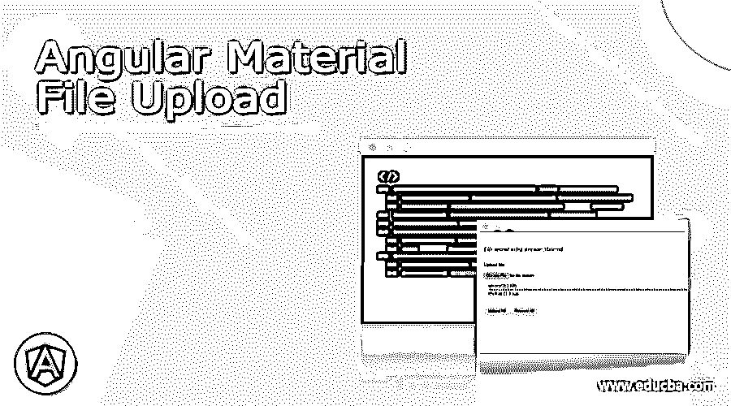
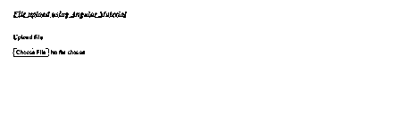
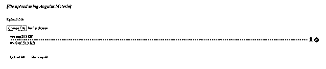

# 角度材料文件上传

> 原文：<https://www.educba.com/angular-material-file-upload/>




## 角度材料文件上传的定义

在 Angular material 中，我们还可以使用其不同的文件上传组件来创建我们自己的文件上传组件。此外，材料还为我们提供了一个模块，可用于上传单个或多个文件。为此，我们必须在我们的 angular 应用程序中安装这个依赖项，方法是通过命令提示符执行简单的步骤。当我们希望用户上传他们的文档以便保存或验证它们时，文件上传是有用的，例如，如果我们有一个雇员，并且我们希望验证该雇员的文档。在这种情况下，我们可以使用材料文件上传模块在一个 o 中实现这一功能。如果我们试图实现自己的功能，这将需要一些时间，而且我们需要编写这么多代码才能运行它，因此通过使用材料文件上传模块，我们不必编写这么多代码，它会根据材料进行处理。我们可以简单地安装和使用它。在本教程的下一节中，我们将更仔细地研究内部工作和一步一步的实现，以便更清楚和理解。

**语法:**

<small>网页开发、编程语言、软件测试&其他</small>

正如我们已经知道的，我们可以使用材料文件上传模块，以便在我们的应用程序中创建文件上传功能，让我们仔细看看它的语法，见下文；

```
<mat-file-upload-queue
[fileAlias]="''"
[httpUrl]="URL">
<mat-file-upload*ngFor=""></mat-file-upload>
</mat-file-upload-queue>
```

正如您在上述语法中所看到的，我们正在尝试使用“mat-file-upload-queue”和“mat-file-upload”标签创建文件上传，这些标签将由材料设计的文件上传模块提供。我们可以直接使用这些标签来上传我们的文件或多个文件(如果有的话)。

### 文件上传在 Angular material 中是如何工作的？

为了使用材料文件上传，我们必须为此安装外部依赖关系。它没有提供实质性的默认依赖，我们必须通过执行一些命令来显式地安装它。在本教程中，我们将仔细看看安装素材文件上传所需的步骤，但在此之前，我们将详细了解它的主要组件是什么；我们开始吧

1) MatFileUploadModule:我们必须将这个包导入到我们的根模块文件或任何我们想要创建文件上传的子模块文件中。作为参考，请查看以下代码，这些代码需要放在应用程序的根 module.ts 文件中；

**例如:**

```
import { MatFileUploadModule } from 'angular-material-fileupload';
```

2) mat-file-upload-queue:我们有这个标签来上传多个文件。在这个标签中，我们可以使用文件上传标签。它还为我们提供了一些更多的属性，如下所示:

a) fileAlias:这个属性可以用来给我们的文件命名，作为文件的别名。httpUrl:这是一个 Url，我们希望在这里发布我们的多部分数据。

3)我们还可以通过使用我们已经安装的该文件上传模块的不同属性来创建拖放文件上传。

现在，我们将看到设置文件上传所需的步骤以及 angular 应用程序中的材料。我们将从头看到我们如何做到这一点，按照下面提到的设置，最后你将有必要的依赖在适当的地方让我们开始；

1)第一步是安装全局 cli，以简化我们的工作。按照以下步骤安装它

**例如:**

```
npm install -g @angular/cli
```

现在它可以通过命令提示符在我们系统的任何地方使用。

2)第二步是安装角度项目，即通过执行以下命令来确定角度项目；

**例如:**

```
ng new your project name
>> ng new my-first-project
```

您可以提供任何来代替“我的第一个项目”

3)现在只需安装依赖项，如果没有，它将在您的 angular 应用程序中创建一个名为“节点模块”的新文件夹

**例如:**

```
npm install
```

4)一切设置，现在我们可以运行我们的应用程序，以查看变化，首先它出现了默认的角度页面。

**例如:**

```
ng serve
```

5)在本地主机上运行应用程序，端口 4200 是 angular 应用程序的默认端口。我们可以随时改变它。

**例如:**

```
http://localhps:4200
```

6)现在使用以下命令将角度材料依赖性添加到角度项目中；

**例如:**

```
ng add @angular/material
```

7)现在我们可以在我们的应用程序中安装由 material design 提供的文件上传模块，以便在我们的应用程序中使用文件上传组件，让我们开始吧；

**例如:**

```
npm i angular-material-fileupload
```

执行这个命令，并开始在应用程序中使用它的组件。

### 例子

**1)index.html 代码:**

```
<link href="https://fonts.googleapis.com/icon?family=Material+Icons"
rel="stylesheet">
<my-file>loading..</my-file>
```

**2)demo-file . component . ts 代码:**

```
import { Input, Component, ViewChild } from '@angular/core';
import { HttpClient, HttpEventType, HttpHeaders, HttpParams } from '@angular/common/http';
import { MatFileUploadQueue } from 'angular-material-fileupload';
@Component({
selector: 'my-file',
templateUrl: './demo-file.compoenent.html',
styleUrls: ['./demo-file.compoenent.css']
})
export class DemoFileComponent {
@ViewChild(MatFileUploadQueue) queue: MatFileUploadQueue;
public uploadEvent($event: any) {
console.log(JSON.stringify($event));
}
}
```

**3)demo-file.compoenent.html 代码:**

```
<h3><u><i>File upload using Angular Material </i></u></h3>
<br>
<label for="singleFile"> Upload file </label><br/><br/>
<input id="singleFile" type="file" [fileUploadInputFor]= "fileUploadQueue"/>
<br>
<mat-file-upload-queue #fileUploadQueue
[fileAlias]="'file'"
[httpUrl]="'http://localhost:8180/jax-rs-jersey-application-sample'">
<mat-file-upload [file]="file" [id]="i" *ngFor="let file of fileUploadQueue.files; let i = index"></mat-file-upload>
</mat-file-upload-queue>
```

**4) module.ts 代码:**

```
import { NgModule } from '@angular/core';
import { BrowserModule } from '@angular/platform-browser';
import { FormsModule } from '@angular/forms';
// import compoenent
import { DemoFileComponent } from './demo-file.compoenent';
import { MatFileUploadModule } from 'angular-material-fileupload';
@NgModule({
imports: [ BrowserModule, FormsModule,
MatFileUploadModule ],
declarations: [ DemoFileComponent ],
bootstrap: [ DemoFileComponent ]
})
export class DemoModule { }
```

**输出:**

**文件上传前:**




**文件上传后:**




### 结论

使用文件上传模块很容易创建文件上传，否则我们需要写很多行代码。要正确地实现这一点，请遵循文章中提到的上述步骤。它易于操作，易于理解，也易于开发人员维护。

### 推荐文章

这是一个角度材料文件上传的指南。在这里，我们讨论的定义，语法，文件上传如何在角材料？代码实现示例。您也可以看看以下文章，了解更多信息–

1.  [角度 ng-包含](https://www.educba.com/angularjs-ng-include/)
2.  [有棱角的材料图标](https://www.educba.com/angular-material-icons/)
3.  [角度范围](https://www.educba.com/scope-in-angularjs/)
4.  [角度 CLI](https://www.educba.com/angular-cli/)


