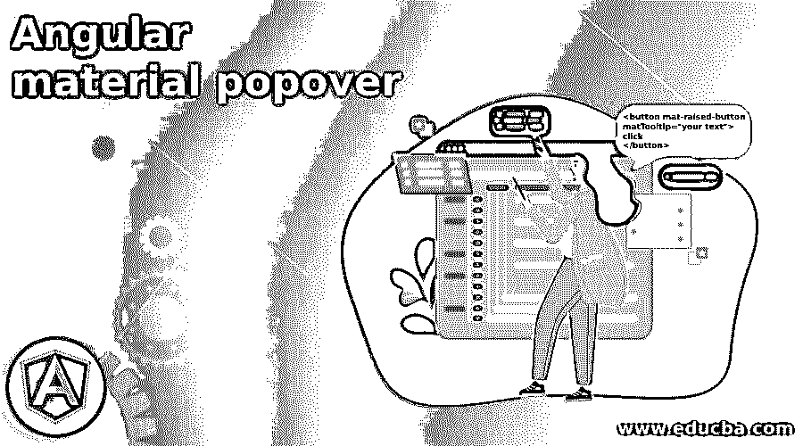
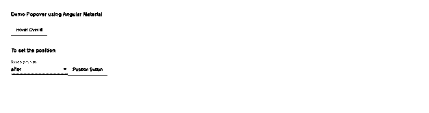

# 角状材料凸起

> 原文：<https://www.educba.com/angular-material-popover/>




## 角形材料缓冲器介绍

Popover 基本上是一个工具提示，当我们悬停在任何文本元素或按钮上时就会显示出来，它可以是任何东西。此外，我们可以在这个弹出窗口上显示我们的文本或标题，这个弹出窗口也称为角状材料的工具提示。该材料为我们提供了一个构建库和模块，可以直接用于在 angular material 中创建弹出窗口或工具提示。它非常易于使用、维护和实现。当我们想向用户显示任何特定的简短信息时，这是非常有用的，他们也考虑向用户提供一个提示。当用户在文本、按钮或元素上移动时，我们可以显示它们，并要求它们在此之后执行任何操作。在本教程的下一节中，我们将看到如何使用现有的 martial 模块在 martial 应用程序中轻松快速地实现 popover。

**语法:**

<small>网页开发、编程语言、软件测试&其他</small>

因为我们将使用构建模块中的材料在应用程序中创建我们的第一个弹出窗口或工具提示，但在此之前，让我们更仔细地看看语法，以便正确地使用它，让我们开始看下面；

```
<button mat-raised-button
matTooltip="your text">
click
</button>
```

正如你在上面的语法中看到的，我们正在尝试使用“matTooltip ”,当我们试图点击或悬停在按钮元素上时，它可以帮助我们显示文本。为了使用这个属性，我们需要在模块文件中添加所需的依赖和包，详细内容我们将在下一篇文章中看到。

### popover 在有角的物质中是如何工作的？

到目前为止，我们已经知道，我们可以使用工具提示来代替 popover，这有助于我们在鼠标悬停或点击时显示文本。我们可以用它来向用户显示额外的信息。它很容易被开发者使用和实现。在这一节中，我们将看到如何使用素材库在 angular 应用程序中进行配置，下面让我们开始看看；

**1) MatTooltipModule:** 该模块需要导入到根模块或我们想要实现该功能的任何子模块中。请参考下面的代码附件，并粘贴在你的应用程序的根模块文件见下文；

**例如:**

```
import {MatTooltipModule} from '@angular/material/tooltip';
```

2) MatTooltip: 这是我们可以在任何文本或按钮中使用的指令，帮助我们在悬停时显示文本，我们也可以直接在任何元素上使用它。此外，我们已经附上了一个参考代码，这将有助于您显示悬停文本见下文；

**例如:**

```
Selector: [matTooltip]
Exported as: matTooltip
```

这个指令附带了许多属性，下面描述了其中一些属性；

1.  a)位置:通过这个，我们可以定义我们的 popover 的位置。
2.  b)显示延迟:显示被调用后的默认延迟。
3.  c)消息:用于在工具提示或弹出窗口上显示消息。

现在，我们将看到从头开始设置一个材质项目需要采取哪些步骤，您也可以通过在命令提示符下运行最后一个点命令，在 angular 项目中安装素材库，让我们从下面的步骤开始:

1)这是帮助我们为应用程序安装 Angular CLI 的第一步，我们可以使用下面的命令下载它。此外，这将帮助我们运行我们的项目，构建它，等等。遵循以下代码

**例如:**

```
npm install -g @angular/cli
```

2)一旦安装了 CLI，我们就可以开始创建 angular 应用程序，为此我们必须遵循以下命令。这个命令将帮助我们从头开始创建角度项目，但它不包含单独的军事；

**例如:**

```
ng new your project name
```

```
>> ng new my-first-project
```

适合您项目名称'我第一个项目'

3)现在是在项目中安装所需依赖项的时候了，只需运行下面的命令，以便在我们的项目中安装 npm 模块包，

**例如:**

```
npm install
```

4)通过执行以下命令运行应用程序；

**例如:**

```
ng serve
```

5)下面的 URL 上会出现变化，因为我们知道 angular 应用的默认端口是 4200，只要在浏览器上运行就能看到变化；

**例如:**

```
http://localhps:4200
```

6)在项目内部安装素材库，并开始在应用程序内部实现 popover

**例如:**

```
ng add @angular/material
```

### 例子

**1)index.html 代码:**

```
<link href="https://fonts.googleapis.com/icon?family=Material+Icons" rel="stylesheet">
<div class="mat-app-background basic-container">
<demo-popover>loading ..</demo-popover>
</div>
```

**2)demo-popover . componenet . ts 代码:**

```
import {Component} from '@angular/core';
import {TooltipPosition} from '@angular/material';
import {FormControl} from '@angular/forms';
@Component({
selector: 'demo-popover',
templateUrl: 'demo-popover.componenet.html'
})
export class DemoPopover {
posotionDemo: TooltipPosition[] = ['after', 'before', 'above', 'below', 'left', 'right'];
position = new FormControl(this.posotionDemo[0]);
}
```

**3)demo-popover.componenet.html 代码:**

```
<h4>Demo Popover using Angular Material</h4>
<button mat-raised-button
matTooltip="Hi !! I am popover !!!"
aria-label="Basic popover !!">
Hover Over !!
</button>
<br/>
<br/>
<h4> To set the position </h4>
<mat-form-field class="example-user-input">
<mat-select placeholder="Tooltip position" [formControl]="position">
<mat-option *ngFor="let po of posotionDemo" [value]="po">
{{po}}
</mat-option>
</mat-select>
</mat-form-field>
<button mat-raised-button
matTooltip=" Position setting Demo !!"
[matTooltipPosition]="position.value"
aria-label=" Label for position !!">
Position Button
</button>
```

**4)模式. ts 代码:**

```
import {NgModule} from '@angular/core';
import {FormsModule, ReactiveFormsModule} from '@angular/forms';
import {
MatTooltipModule,
} from '@angular/material';
import {BrowserModule} from '@angular/platform-browser';
import {platformBrowserDynamic} from '@angular/platform-browser-dynamic';
import {BrowserAnimationsModule} from '@angular/platform-browser/animations';
import {BasicTooltip} from './app/tooltip/basictooltip';
@NgModule({
exports: [
MatTooltipModule,
]
})
export class DemoModule {}
```

**输出:**




换个位置看看效果。

### 结论

正如我们所知，popovers 非常容易创建，并向用户显示一些关于功能的额外信息。此外，可以在 angular 应用程序中使用一个材料工具提示模块轻松地创建它，该工具提示模块易于使用，易于阅读和维护，也便于开发人员使用。

### 推荐文章

这是一个有角度的材料弹出指南。在这里，我们讨论了 popover 如何在有角度的材料中工作，以及示例和输出。您也可以看看以下文章，了解更多信息–

1.  [角度范围](https://www.educba.com/scope-in-angularjs/)
2.  [有棱角的材料图标](https://www.educba.com/angular-material-icons/)
3.  [角度 CLI](https://www.educba.com/angular-cli/)
4.  [角的 ng 模型](https://www.educba.com/angularjs-ng-model/)


