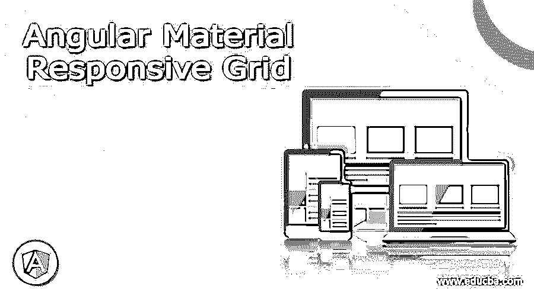

# 角状材料响应栅格

> 原文：<https://www.educba.com/angular-material-responsive-grid/>




## 角状材料响应网格的定义

在 Angular material 中，我们有一个用于创建二维列表视图的网格布局。另外，在素材库中，我们有一个网格列表模块，它有助于在 angular 中创建网格布局。为了在我们的应用程序中使用和实现这一点，我们必须在我们的项目中进行一些更改和配置，它也应该是响应性的，这意味着当屏幕大小改变时，它应该是相同的并可以自动调整，假设我们有不同类型的屏幕大小可供笔记本电脑、平板电脑和移动屏幕使用，因此它应该对所有屏幕大小都有响应，并且在不同屏幕大小上运行时不应该受到干扰或改变其行为。这可以很容易地通过使用素材库的网格列表模块来实现，在本教程的下一节中，我们将详细了解如何为初学者在不同屏幕尺寸上运行实践示例。

### 句法

为了在我们的项目中实现这一点，我们将利用材料模块的“网格列表”模块。在这一节我们将看到创建它的详细语法，用素材库给出的标准语法，让我们开始看下面；

<small>网页开发、编程语言、软件测试&其他</small>

```
<mat-grid-list>
<mat-grid-tile> text </mat-grid-tile>
<mat-grid-tile> text </mat-grid-tile>
<mat-grid-tile> text </mat-grid-tile>
<mat-grid-tile> text </mat-grid-tile>
</mat-grid-list>
```

上面你可以看到使用素材库的某些响应式网格的基本语法，为了更好地理解，我们将在教程的下一节中进行详细的理解，但是现在我们正在使用“mat-grid-list”和“mat-grid-tile”在材料中创建我们的响应式网格布局。

### 角状材料中的响应网格是如何工作的？

正如我们已经知道的，在素材库中，我们有一个网格列表模块，可以帮助我们为我们的应用程序创建网格布局，通过使用它，我们可以很容易地创建一个二维视图来表示我们在屏幕上的项目，如果谈到响应网格布局，我们只需对现有的网格语法进行一些更改，它将对所有屏幕尺寸做出响应，我们可以通过使用 google developer 的工具来测试我们的解决方案，该工具可以帮助我们提供所有不同类型的屏幕尺寸。让我们从我们需要做的配置开始，以便看到素材库的网格模块，接着是角度材料的项目步骤，见下文；

1) MatGridListModule:这是一个由素材库提供的模块，用于在我们的应用程序中创建网格布局，如果我们想在我们的应用程序中使用它，那么我们必须将这个包导入到我们的应用程序根模块或任何想要使用它的子模块中。参考见下面的代码，这将有助于我们在应用程序中导入这个包见下文；

**例如:**

```
import {MatGridListModule} from '@angular/material/grid-list';
```

2) mat-grid-list:在这之后，我们有了这个扇区，它可以用来在 UI 上创建网格布局，在这里我们可以为我们的布局指定列和行，它有几个属性，为了更清楚起见，下面将提到这些属性。

a) cols:网格中已有的列数。

b)行高:设置行高。

3) mat-grid-tile:这个选择器用于在网格中表示我们的列，它也有下面提到的一些属性；

a) colspan:网格将接受的列。

b) rowspan:网格将占据的行数。

让我们为初学者从头开始创建角度材质项目；

1)首先，我们将安装 Angular CLI，这将有助于我们以后管理 Angular 项目。执行以下命令；

**例如:**

```
npm install -g @angular/cli
```

2)在这之后我们可以使用下面的命令创建项目，这里也提到了项目名称；

**例如:**

```
ng new your project name
```

```
>> ng new my-first-project
```

3)现在是时候通过执行下面的命令来安装所需的依赖项了；

**例如:**

```
npm install
```

4)一旦成功安装了依赖项，我们现在可以通过执行以下命令来启动服务器；

**例如:**

```
ng serve
```

5)使用下面的 URL 运行项目:它在默认端口 4200 上运行

**例如:**

http://localhps:4200

7)最后一步是安装素材库，一旦创建了 angular 项目，我们就可以向其添加素材库。执行下面的命令，它将为我们安装物料依赖关系，

**例如:**

```
ng add @angular/material
```

成功安装后，我们现在可以使用素材库中的网格模块了。

### 例子

展示如何使用网格来提高响应能力的示例。

**1)index.html 代码:**

```
<app-grid-responsive>loading ..</app-grid-responsive>
```

2)demo . grid . component . ts 代码:

```
import { Component, OnInit, VERSION, ViewChild } from '@angular/core';
@Component({
selector: 'app-grid-responsive',
templateUrl: './demo.grid.compoent.html',
styleUrls: ['./demo.grid.compoent.css']
})
export class DemoGridComponent implements OnInit {
mybreakpoint: number;
constructor() { }
ngOnInit() {
this.mybreakpoint = (window.innerWidth <= 600) ? 1 : 6;
}
handleSize(event) {
this.mybreakpoint = (event.target.innerWidth <= 600) ? 1 : 6;
}
}
```

**3)demo.grid.compoent.html 代码:**

```
<mat-toolbar color="primary" layout="fill">
<div> Responsive Grid Demo using Angular Material !! </div>
</mat-toolbar>
<mat-card>
<mat-card-content>
<div fxLayout="row" fxLayoutAlign="center center" fxLayoutGap="6px">
<div></div>
<br/>

</div>
</mat-card-content>
</mat-card>
<mat-grid-list [cols]="mybreakpoint" rowHeight="4:0.5" (window:resize)="handleSize($event)">
<mat-grid-tile>Grid One</mat-grid-tile>
<mat-grid-tile>Grid Two</mat-grid-tile>
<mat-grid-tile>Grid Three</mat-grid-tile>
<mat-grid-tile>Grid Four</mat-grid-tile>
<mat-grid-tile>Grid Five</mat-grid-tile>
<mat-grid-tile>Grid Six</mat-grid-tile>
<mat-grid-tile>Grid Seven</mat-grid-tile>
</mat-grid-list>
```

**4) module.ts 代码:**

```
import { NgModule } from '@angular/core';
import { BrowserModule } from '@angular/platform-browser';
import { MatToolbarModule, MatCardModule, MatGridListModule } from '@angular/material';
@NgModule({
imports: [ MatGridListModule ],
declarations: [ DemoGridComponent ],
bootstrap: [ DemoGridComponent ],
providers: []
})
export class ApGridpModule { }
```

**输出:**


### 结论

到目前为止，我们已经看到了在素材库中配置网格布局的步骤。按照上面的步骤，使它工作，也需要很少的变化，使其响应，因为它是由素材库处理得很好，也易于使用，处理，由开发人员维护。

### 推荐文章

这是一个有角度的材料响应网格的指南。在这里我们讨论定义，如何响应网格工作在角材料？和代码实现的示例，以便更好地理解。您也可以看看以下文章，了解更多信息–

1.  [棱角分明的材质颜色](https://www.educba.com/angular-material-color/)
2.  [有角度的材料进度条](https://www.educba.com/angular-material-progress-bar/)
3.  [角状材料搜索栏](https://www.educba.com/angular-material-search-bar/)
4.  [角度 ng-包含](https://www.educba.com/angularjs-ng-include/)

 `


`