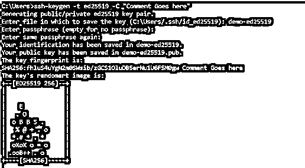
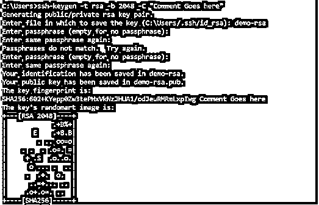

# GitLab add SSH 密钥

> 原文：<https://www.educba.com/gitlab-add-ssh-key/>

## GitLab 添加 SSH 密钥的定义

Gitlab add SSH key 定义为向 Gitlab 服务器添加 SSH 密钥的方法，Gitlab 通过该方法与 Git 进行安全通信。Git 和 Gitlab 之间的分布式版本是 Git，开发人员可以在本地工作，并发布本地完成的开发。更改可以“推”到服务器，在本例中是 Gitlab。通过使用 SSH 密钥来认证远程服务器(Gitlab ),不需要每次都使用用户名和密码来进行认证。在本文中，我们将通过构成集成的各种元素来研究 Gitlab 和 SSH 密钥的各个方面。

### 什么是 GitLab add SSH key？

既然我们已经知道了 SSH 和 Gitlab 如何连接的基本定义，那么现在是时候对 Gitlab 中 SSH 的细节进行细化了。首先，我们需要理解在 Gitlab 中使用 SSH 的先决条件。以下是需要记住的几点:

<small>网页开发、编程语言、软件测试&其他</small>

需要 OpenSSH 客户端，通常预装在 Windows、macOS、Linux 版本的操作系统中。用户需要 6.5 或更高版本的 SSH。任何早期版本的 SSH 都包含 MD5 签名，这在当今世界都不被认为是安全的。为了了解系统中的 ssh 版本，可以执行 ssh -V 命令。

一旦满足了先决条件，我们还需要检查在操作系统的相应目录中是否存在现有的 SSH 密钥 pir。因为这个可以去。ssh/ directory 并查找相应的 ssh 密钥。万一子目录。ssh/不存在，要么是我们查看了错误的主目录，要么是我们之前没有使用过 ssh。在后一种情况下，我们将遵循下面段落中提到的后续步骤！

### 如何生成 GitLab add SSH key？

现在，在这一节中，我们将看一下为上面讨论的两种类型的 SSH 密钥生成 SSH 密钥对，即 ED25519 和 RSA。对于 DSA 和 ECDSA，由于这两种工具要么已经贬值，要么已经不再广泛使用，因此出于本文的原则原因，我们将跳过它们。

*   第一步:需要打开操作系统中的终端。
*   第 2 步:这里，我们需要输入 ssh-keygen -t 命令，后跟 ssh 密钥类型和密钥文件的注释。下面我们将分别演示这两个 SSH 密钥。

o For ed 25519:ssh-keygen-t ed 25519-C“此处显示注释”

o 对于 RSA: ssh-keygen -t rsa -b 2048 -C“注释在此处”

*   第 3 步:输入上述命令后，我们需要按 enter 键，post 将要求输入一个包含密钥的文件名。
*   第四步:Post 按回车键下一步之后，会提示用户输入一个释义(两次)。
*   第 5 步:在输入密码，然后重新输入，一个人需要按下回车键，后将显示一个确认，并将包含文件将被存储在哪里的信息。

### 向 GitLab 添加您的 SSH 密钥

现在我们已经了解了如何为 Gitlab 创建 SSH 密钥，我们需要将密钥复制到 Gitlab 帐户中。这些步骤是:

*   第一步:需要从<filename>复制文件的内容。pub 文件，方法是使用命令行工具。cat (Windows)，xclip (Linux)，tr (macOS)。</filename>
*   步骤 2:既然文件的内容已经被复制，我们现在必须登录到我们的 Gitlab 帐户。
*   第三步:需要选择右上角的头像，然后点击首选项。
*   第 4 步:左侧栏包含选项 SSH 密钥，现在需要选择。
*   第 5 步:这里，需要粘贴从第 1 步复制的文件内容。文件中的内容以 ssh- <key type="">开始，以我们在创建 ssh 密钥时传递的注释结束。</key>
*   第 6 步:在标题框中，需要输入描述，这将唯一地表示机器的类型，这将有助于以后轻松地管理事情。可以选择在“过期时间”框中输入过期日期。
*   第 7 步:最后一个需要点击添加键来完成程序！

### Gitlab 中支持的 SSH 密钥类型

现在有许多 SSH 密钥，但是 Gitlab 只能识别其中的一小部分，它们是:

1.ED25519 SSH 密钥:这种类型的密钥是在 OpenSSH 6.5 中作为椭圆曲线签名方案引入的，它比 ECDSA 和 DSA 等其他现有密钥具有更好的安全性和更好的性能。这个 SSH 密钥的 USP 是速度和不间断运行时间。

2.RSA SSH 密钥:在安全性方面不如 ED25519，但 RSA 提供了所有算法的最佳兼容性。因此，为了执行该工作，密钥大小要大得多，以提供所需的安全性。

3.DSA SSH 密钥:类似于 RSA 的模式，使用不同于 RSA 的算法。这种类型的密钥在 Gitlab 11.0 中是贬值的。

4.ECDSA SSH Keys:扩展为椭圆曲线数字签名算法，是 OpenSSH 5.7 中引入的传统 SSH 密钥之一，它明确认为 ED25519 在技术上更胜一筹，因此必须成为首选。

**生成 SSH 密钥对(截图)**

ED25519 的屏幕截图:

RSA 的屏幕截图:

### 结论

通过这篇文章，我们了解了在 Gitlab 帐户中添加 SSH 密钥的各个方面，以及在 Gitlab 中生成或使用任何 SSH 密钥之前需要遵循的先决条件和重要的待办事项！

### 推荐文章

这是一个 GitLab 添加 SSH 密钥的指南。这里我们讨论一下定义，什么是 GitLab add SSH key，为了更好的理解 GitLab 中支持的 SSH key 类型。您也可以看看以下文章，了解更多信息–

1.  [GitLab 替代方案](https://www.educba.com/gitlab-alternative/)
2.  [什么是 GitLab](https://www.educba.com/what-is-gitlab/)
3.  [GitLab vs 吉拉](https://www.educba.com/gitlab-vs-jira/)
4.  [Gitlab CI vs Jenkins](https://www.educba.com/gitlab-ci-vs-jenkins/)

