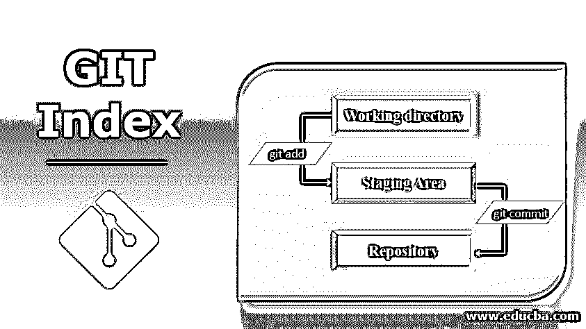
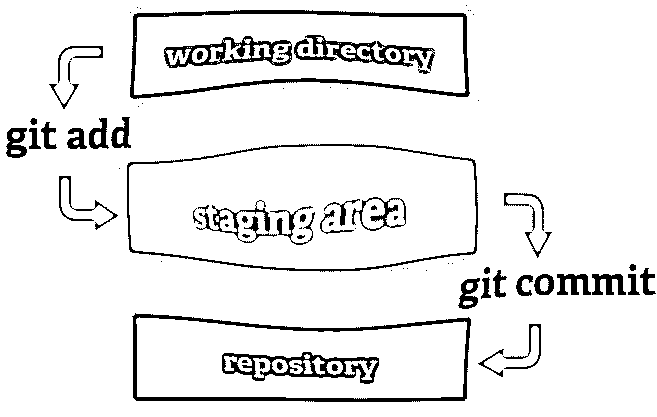
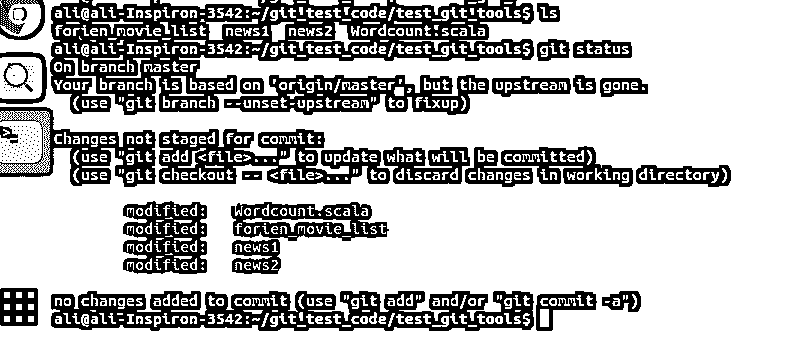
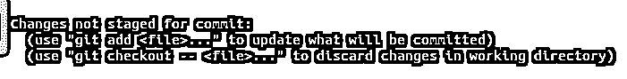
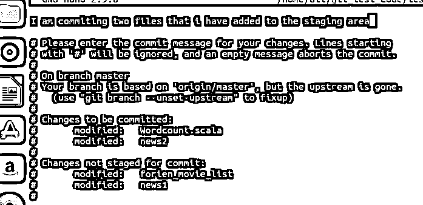
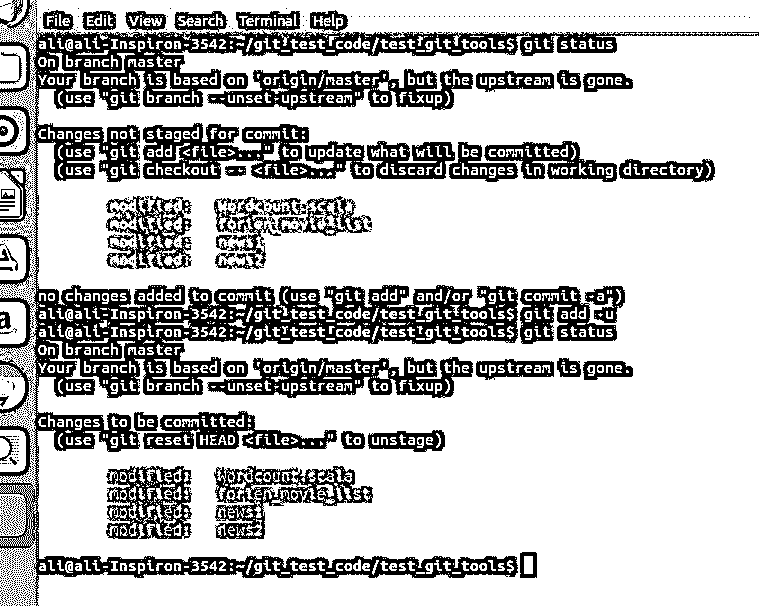
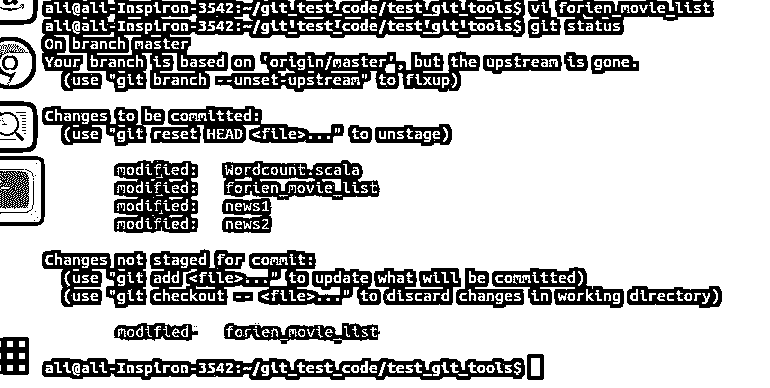
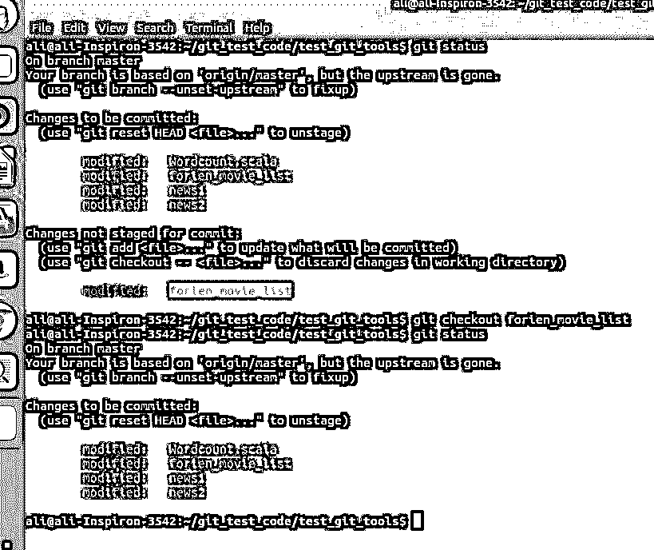
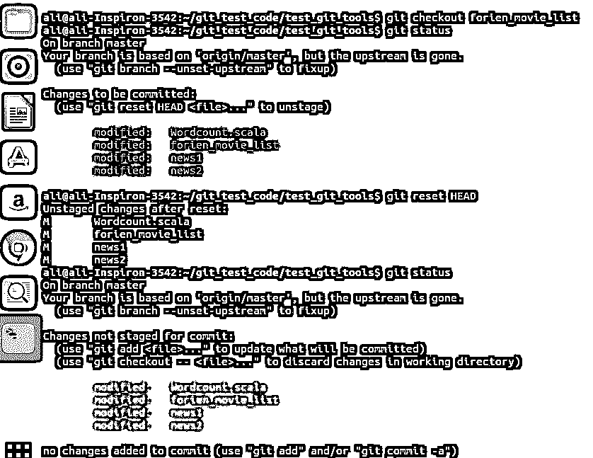
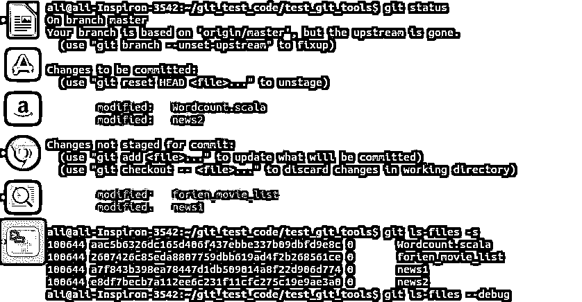

# GIT Index

> 原文：<https://www.educba.com/git-index/>

## Git 索引简介

GIT 是程序员中最常用的分布式版本控制器 DVCS 之一，因为它的动态特性和巨大的工具可用性来处理版本。众所周知，这是 Git 有史以来第一个添加的特性。顾名思义，就像一本书的任何内容一样，它也维护分段的更改，或者我们可以说使用 git add 索引发送到分段的更改。

用技术术语来说，Git Index 将维护 Tree(在 Unix 中可以与目录结构或文件夹相关)和 blob(可以与目录内的文件和其他关联内容相关)Git 对象。

<small>网页开发、编程语言、软件测试&其他</small>

在 git DVCS 中，我们将源代码放在服务器上，作为中央存储库，但除此之外，我们还将它作为本地副本，或者我们可以称之为工作机器上的本地存储库。因此，即使在服务器级别出现故障，我们也可以在恢复时将本地工作副本镜像回服务器。所以基本上，当我们在一个分支上工作时，提交我们的更改，它会将更改发送到本地回购。我们需要使用 PUSH 将更改发送到服务器 repo。GIT 索引介于本地回购和工作目录之间，它决定哪些内容需要发送到本地回购，事实上，它决定哪些内容需要发送到中央回购。

### GIT 指数详解

请参考下面的图片，以获得更详细的想法。

这里的存储库是指本地回购或本地拷贝。从上面的图片下面是推论:

1.  当我们开始处理一个现有的文件，或者创建并添加一个新文件并保存它们时，git 会跟踪它们并将它们标记为未跟踪的文件。我们可以在下面的截图中清楚地看到它们。我在 test_git_tools 分支中总共有四个文件，如果我给 git status，我可以看到所有文件都处于修改状态。

2.  如果您观察上面的截图，它为我们提供了两个选项，事实上，我们的 git 在暗示它已经跟踪了工作目录中的更改，但是这取决于我们是否想要通过使用“git add -u”将它发送到登台区来强烈跟踪它，或者通过使用“git checkout”来放弃更改并离开跟踪。

3.  一旦我们将文件添加到暂存区域，而不是在我们申请提交时，则暂存的更改将仅转到本地存储库。未分级的更改仍然存在。
4.  一旦我们将内容添加到本地回购，我们就可以将更改提交到服务器回购。

上面的示例截图显示有两个文件被索引并提交。剩余的两个文件被跟踪但未转移，因此未提交。但是为什么我们需要暂存或索引呢？不能，我们就直接把未分期的变更发给本地回购？

是的，我们可以绕过暂存，直接将未暂存的文件提交给 repo，但是这样做实际上会扭曲版本控制系统的目的。这在小项目或增强项目中可能是可行的，但是在新项目中这样做会导致麻烦。

索引是项目开发中最关键的阶段之一。当我们试图开发一个项目时，我们基本上是在编码模块上准备一个算法，并准备一个代码草案，其中有些方面我们不确定，需要进一步评估。此外，你可以决定添加一些额外的功能，或者我们可以添加某些优化，等等。在这些情况下，我们不想完全丢弃我们开发的东西。通过索引开发的代码，我们可以始终跟踪暂存文件和未暂存的相同文件之间的差异，并清楚地了解不同版本的更多想法。让我们看看下面的截图。从上面的截图中，我们可以看到所有红色标记的文件都没有被跟踪。我将该文件添加到 staging，这会将颜色指示器变为绿色，如下所示。

现在，我将为 ien_movie_list 文件的登台文件添加一个电影名称，并执行 git 状态。它看起来像下面这样:

我们可以看到，我们有两个版本的 orien_movie_list 文件，一个已建立索引，另一个未建立索引。我们有一个非常有用的索引工具叫做 difftool，通过用 g it 配置它，我们可以用它来跟踪文件的两个版本的变化。

现在让程序员决定他不希望保留新的变更，也不希望它被登台。然后，他可以使用 checkout 来丢弃未暂存的更改，而不是 git add 命令。

从上面可以清楚地看到红色的修改过的文件已经被丢弃。您也可以通过查看文件内容来验证这一点。

现在，类似于程序员将他的内容添加到登台区的方式，如果需要，他也可以抢他们的风头。基本上，索引通过将控制权交给开发人员，为开发人员提供了大量处理代码的机会。为了实现抢风头，流行的工具使用了复位命令。

从上面可以看到，我们索引的文件(绿色)已经再次添加到未暂存区域。在这里，我使用了 HEAD with reset 命令，该命令表明添加到暂存区的最新内容将被重置(在这里，我之前使用了四个文件进行索引，因此它们是未更改的(红色))。

git 还有一个 ls-files 选项，它将列出索引中的文件。在索引中，基本上，完整的树和 blob 信息将是可用的。因此，当您向 stage 添加内容时，它会开始密切监视该文件。我们可以通过–debug 命令和 ls 文件看到这一点。在下面的屏幕截图中，我们可以看到暂存区中有两个文件，还有两个文件未暂存。现在，当我给 git ls-files -s 时，它将给出树中所有可用的 blob(四个文件),如下所示。但是我们只向临时区域添加了两个文件，其中两个可以使用–debug 来验证这一点。

我们可以从下面的截图中看到哪些文件被 ctime、mtime、dev 等的值登台了。

当我们处理 Git DVCS 时，Git 索引是最重要的方面。有很多可用的命令和工具，我在本文中使用了其中的一些来玩索引，对于一个严肃的开发人员来说，这简直是太棒了。

### 推荐文章

这是一个 Git 索引指南。在这里，我们借助相应的屏幕截图来讨论 GIT 索引的基本概念和详细解释。您还可以浏览我们推荐的其他文章——

1.  [Git 是什么？](https://www.educba.com/what-is-git/)
2.  [Git 生命周期](https://www.educba.com/git-life-cycle/)
3.  [Git 术语](https://www.educba.com/git-terminology/)
4.  [Git 存储库设置](https://www.educba.com/git-repository-setup/)

