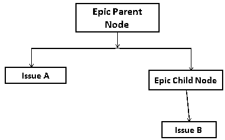
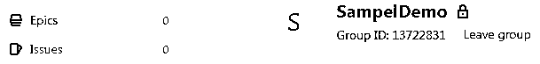
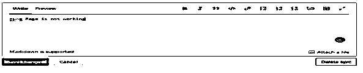
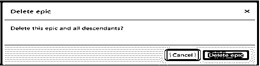

# GitLab epics

> 原文：<https://www.educba.com/gitlab-epics/>

## GitLab 史诗的定义

Gitlab 向用户提供不同类型的功能，其中 epic 是 GitLab 提供的功能之一。基本上，epics 归入敏捷，它只是用户故事的集合，用于提供关于用户流的信息，包含许多特性。所以主要是 GitLab 中的史诗有什么用？。这个问题的答案是，与问题相关的所有信息，如标题、描述以及我们可以根据我们的要求附加多个不同的子问题，这意味着我们可以保持层次结构。

### 什么是 GitLab 史诗？

术语“史诗”通常与敏捷技术联系在一起。在敏捷中，史诗是描绘更大客户流的客户故事的分类，通常包含许多元素。总而言之，GitLab 在这里有什么意义？在这里，传奇包含一个标题和描述，类似于一个问题，并允许您附加各种年轻人的问题，以展示指挥链。因此，史诗是一个组件，它允许你通过关注分享一个主题的问题的集合，跨越活动和成就，更有成效地处理一系列冒险。

<small>网页开发、编程语言、软件测试&其他</small>

这对 UX 小组的影响是，我们终于有了一个富有成效的方法来准备、跟踪和执行一个具体相关问题的聚会。以工会征集页面为例。仅这一项，我们就发现了 50 多个与 UX 升级相关的问题！每一个问题，单独来看，只解决了一个更大的画面的一部分。图例将允许我们描述整个页面的目标，并协调与该工作相关的问题。

### Gitlab Epics 项目

史诗提供了一种解决问题的方法，并处理了一系列共享一个基本主题的问题和子故事。尽管智能收集，史诗授权项目主管执行更高层次的安排和汇编指南。基本上，在一个史诗般的项目中，我们可以考虑以下不同的要点。

1.我们可以使用 epic 项目制造问题:

该团队成员得到了客户的反馈，即在分散的选项卡中创建和关联问题令人失望。这些额外的进步打乱了工作流程，不符合在指南上有效重复的最佳方式的假设。随着个人满意度的提高，客户现在可以快速重复涉及更大史诗的问题。因此，通过将问题与故事联系起来，客户将不再“丢失”问题，即使他们忽略了将问题与故事联系起来。这个元素节省了小组的时间，并且有助于联系和安排。

2.项目进展路线图:

这是 epic 项目中的另一个重要点，因为如果我们知道项目的路线图，那么我们可以很容易地识别或跟踪问题和相应的日期。当我们提出问题时，可能很难理解具体是什么问题，以及解决该问题需要什么和多少。因此，epics 项目为组织提供了这样一种功能，以增加他们的可见性，这样团队就可以根据路线图工作。

3.查看路线图层次结构:

这是 epic 项目的另一个功能，在这个功能中，我们可以看到问题的详细结构，或者我们可以说 epic，这意味着我们可以显示每个问题的树形结构以及所有细节。借助于这种树结构，我们可以访问根 epics 以获得更多的细节，因此我们可以很容易地分析根子句。

### 史诗和问题

现在我们来谈谈 Gitlab 中的史诗和问题如下。

epic 充当问题的父级，epic 可能包含一个或多个子 epic，如下图所示。

当问题在企业和成就中共享一个主题时，您可以通过使用 epics 来监督它们。同样，你也可以给孩子讲故事，分配开始和结束的日期，这样你就可以直观地看到进度。

### 史诗的优势

此时，您的团队正在处理一个庞大的元素，其中包括在一次聚会中就各种任务中的各种问题进行的大量对话。

*   当收集问题的工作被指定开始和结束时遵循。
*   它用于在更高层次上了解问题的想法和范围。

### Gitlab epics 权限问题

现在我们来看看 GitLab 可能会出现哪些不同的权限问题如下。
1。Epic 在 GitLab 中分配不同组的问题时遇到问题。
2。没有父母的允许，我们不能给这些问题分配史诗。
3。基本上，史诗与项目相关，所以我们没有权限在那里添加问题。
4。在 epics 项目中，我们还需要考虑可见性水平。

### 创造一部史诗

现在我们来看看如何在 GitLab 中创建一个史诗，如下图。

首先，我们需要创建一个组，所以我在这里创建 SampelDemo 组，如下图所示。

我们可以在左侧看到史诗选项，只需点击史诗按钮，我们将获得一个新的标签，如下图所示。

现在，单击“new epic”按钮，填写所需的信息，即标题、描述、开始日期和结束日期，如下图所示。

因此，在这里，我们还可以根据需要为组添加标签。

### Gitlab 删除史诗

现在我们来看看如何在 GitLab 中删除史诗，如下图。

在这里，我们已经创造了一部史诗。我们只需要点击编辑按钮，如下图所示。但我们必须得到许可才能删除史诗。

我们可以看到右侧有一个“删除史诗”按钮，我们只需单击“删除史诗”按钮。删除 epic 后，我们得到了如下的弹出消息，如下面的截图所示。

它询问你是否可以删除史诗和所有后代，如果你想删除，然后点击删除史诗按钮。

### Gitlab epics 功能

1.Gitlab 提供了史诗板，我们可以跟踪和查看史诗。
2。它提供了代码审查功能。
3。它还以连续的方式提供集成和部署工具。
4。它还为用户提供服务台。
5。我们可以管理问题、错误、和公告板。

### 结论

我们希望从这篇文章中你能更多地了解 GitLab 史诗。从上面的文章中，我们已经领会了吉特拉卜史诗的基本思想，我们也看到了吉特拉卜史诗的表现形式。从这篇文章中，我们了解了如何以及何时使用 GitLab Epics。

### 推荐文章

这是 GitLab 史诗指南。这里我们讨论一下定义，什么是 GitLab epics，Gitlab Epics 项目的例子，以便更好的理解。您也可以看看以下文章，了解更多信息–

1.  [GitHub 克隆](https://www.educba.com/github-clone/)
2.  github vs SVN
3.  [GitHub 替代品](https://www.educba.com/github-alternatives/)
4.  [GitHub 命令](https://www.educba.com/github-commands/)

