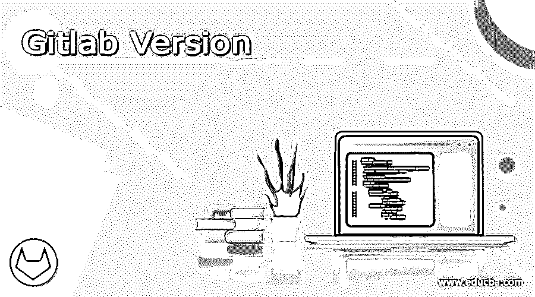

# Gitlab 版本

> 原文：<https://www.educba.com/gitlab-version/>

## Gitlab 版本介绍

一个基于互联网的 DevOps 生命周期工具被称为 Gitlab，它在一个存储库的帮助下帮助持续集成和开发，在这个存储库中，问题跟踪通过管道和开源特性持续进行。它是用 Ruby、Go 和 JavaScript 编写的，它帮助开发人员直接在 Gitlab 中完成从项目规划到发布的所有项目任务。项目用于跟踪代码和管理代码库。这些项目可以是公共的，也可以是私人的，或者可以在一个成员团体中进行。免费的存储库用于在项目中进行任何更改。

### 版本

*   Gitlab 虚拟机和 VMware 映像的首次发布是在 2011 年 10 月。2011 年 11 月，Gitlab Pronto 发布，它具有仪表板、项目活动、网络图以及评论等功能，并在新的设计功能中改进了 wall。它提供了两个分支 master 和 pronto，pronto 拥有所有的新特性。到目前为止，Gitlab 被称为 gitosis，2011 年 12 月发布的版本 2 见证了 gitolite 在项目 wiki、工作流管理、合并请求、提交、用户配置文件、用户标签和文件标签列表方面的变化。浏览以树的形式给出，界面的可用性得到了提高。
*   2012 年 1 月发布了 2.1 版，包含存储库和项目选项卡，随后在 2012 年 2 月发布了 2.2 版，改进了可用性和提交之间的比较，其中显示子模块以便于访问。3 月份的下一个版本更新见证了合并请求的变化以及 2.3 版本中对 MySQL 的支持。提供了一个搜索页面，并根据推送命令启动了合并请求的自动关闭。4 月发布了 2.4 版，通过系统中的大提交处理和响应布局，帮助阻止用户进行任何未经授权的活动。随着 5 月份 2.5 版本的发布，电子邮件可以在后台发送，漏洞也可以很容易地修复。用户界面也进行了更改，以便于访问。
*   2012 年 10 月的版本 3 见证了 web editor 的变化，增加了系统中的 API 支持和文件浏览，以及项目组和重构。这个版本还提供了 Postgres 支持。接下来是 3.1，它为合并请求和图像比较提供了持续的集成。第 4 版于 2012 年 12 月发布，增加了新的项目、用户名、所有者、群组目录以及项目从一个用户到另一个用户的转移。5.3 于 2013 年 6 月发布，修复了一些错误以及存储库图表、代码片段，并使用改进的安全功能重命名了存储库。此外，更多的 API 被添加到 Gitlab 中，以提高应用程序的可用性。
*   Gitlab 6 于 2013 年 8 月发布，有许多重大变化，如登录页面、改进的组、任何组之间的合并请求以及用户界面改进。6.2 看到公共项目页面和用户配置文件以及管理页面。6.7 发布了 markdown、表情符号和探索新选项的链接。我们现在可以将存储库导入 Gitlab，Slack 和 Gemnasium 已经集成。第 7 版看到了将图像添加到存储库中的选项和权限更改，由于安全性的原因，开发人员和管理员拥有不同的权限。这也有助于提高性能。为了修复错误和提高安全性，发布了几个版本的 7，但主要的突破发生在版本 8.0。
*   8.0 版本于 2015 年 9 月发布，允许人们创建代码并一起审查代码，同时进行更改和部署。性能的提升和更少的磁盘空间让 Gitlab 受到了每个开发者的喜爱。在这个版本中可以直接看到项目和测试代码的状态。所有用户界面特性都进行了更改和修改，以提高应用程序的性能。为应用程序提供了简单的上传和 HTTP 支持。8.1 提供了更多的集成支持，8 的其他版本也进行了错误修复和安全改进。8.8 更多的是关于管道和 git 模板来帮助开发者合并不同的项目。8.14 版本附带了时间跟踪和聊天命令，在项目中进行更改时可以添加一些评论。
*   Gitlab 9.0 于 2017 年 3 月发布，改进了可用性和设计，其中我们有项目导航和子组。这些小组有助于团队成员的项目工作与代码协作的集成。随后是不同的补丁发布和 web 应用程序监控。有各种项目模板、失败 CI 作业的自动化，以及针对不同 Gitlab 9.0 版本的各种安全更新。
*   10.0 版本带有群组发布板、自动开发和错误修复。许多补丁发布和安全修复发生在版本 10 的各个版本中。2018 年版本 11 发布了管道级别的安全更新。到那时，Gitlab 已经被许多开发者使用，因此安全性在各个层面都得到了提高。我们可以在管道级和代码合并级搜索代码。11.5 版中出现了功能标志、合并请求审查和操作仪表板。这个版本中包含了 Kubernetes 和错误跟踪。12.0 版本看到了管道图、各种项目的合并请求依赖关系，以及同一用户的各种项目的并行合并序列。
*   Gitlab 13 发布了路线图、PHP 支持、负载性能测试和警报管理。此版本引入了移动应用程序，并在应用程序中使用了通用包注册和维护模式。此版本中引入了管道编辑器和 DORA 指标。版本 14 于 2021 年发布，能够构建和共享舵图，并直接从项目连接 git 存储库。我们还可以在项目本身中为页面响应者创建升级策略。

随着所有版本的发布，Gitlab 使得几乎所有的开发人员都可以构建任何应用程序并与世界上的任何人共享。这款应用帮助开发者从应用中提升自己，改正错误。这也通过持续集成和部署项目节省了时间。

<small>网页开发、编程语言、软件测试&其他</small>

### 推荐文章

这是一个 Gitlab 版本的指南。这里我们讨论一下 Gitlab 版本的简介、列表，以便更好的理解。您也可以看看以下文章，了解更多信息–

1.  [GitLab 替代方案](https://www.educba.com/gitlab-alternative/)
2.  [Pro Tools 版本](https://www.educba.com/pro-tools-version/)
3.  [PowerPoint 版本](https://www.educba.com/powerpoint-version/)
4.  [Joomla 版本](https://www.educba.com/joomla-version/)

