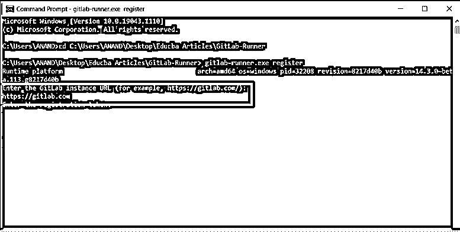

# GitLab 安装

> 原文：<https://www.educba.com/gitlab-installation/>

## GitLab 安装简介

GIThub 和 GITlab 是非常相似的软件类型，两者之间唯一的区别是软件使用的功能级别和生命周期类型。GITLAB 基本上是 GIT 基于 devops 的版本。GITlab 提供 GIT 存储库管理器、持续集成支持、问题跟踪系统和部署管道。GITLAB 的主要优势是它是开源的。这是 GITLAB 系统的强大优势。Dmitriy Zaporozhets 和 Valery Sizov 是参与 GITLAB 开发过程的开发人员。

### 如何创建 GitLab 安装？

GITLAB 是在云上实例化的系统，创建安装的过程有些不同。该过程包括将本地 GITLAB 代码更改绑定到安装在互联网上的系统。这使得 GITlab 成为在涉及代码更改时使用的更优越的系统。更具体地说，GITLAB 代码更改和存储库功能在一个大的方法上得到支持，即特定的 Android、Python、c++、crystal、dart、flask、Django、elixir 等。是受支持的各种代码库项目之一。

<small>网页开发、编程语言、软件测试&其他</small>

除此之外，从所涉及的操作系统的角度来看，GITLAB 支持的扩展是至关重要的。这意味着从 GITLAB 的角度来看，可以支持一个大的、非常不同的操作系统集。这是使用 GITLAB 系统和专门从本地系统挂载的最大优势之一。除了这些认知之外，要考虑的另一个因素是所涉及的不同 GITLAB 项目的能力。具体来说，GITlab 系统支持的主要操作系统是 Windows、Linux 等。

### 预申请人

安装 GITLAB 软件的先决条件将在下一节讨论，

1)了解什么是 gitlab，不同的 gitlab 技术以及与 gitlab 相关的各种操作。用于安装的操作系统中的任何人。一些首选选项是 Windows、Linux 和 Mac。
3)安装需要 GITLAB exec 软件。

### Windows 上的 GitLab 安装

1) GITLAB runner 是用于使用 GITLAB 的软件。GITLAB 系统的安装过程主要通过 GITLAB 系统来完成。这是用于连接 GITlab 系统和所用系统的关键软件之一。

2)GITLAB runner 的 exe 版本可以从下面给出的链接下载，使用下面给出的链接，考虑相应系统使用的 windows 版本，并从这里下载相应版本的 git lab。GITLAB 需要这样下载。下载的 GITLAB 系统将关联到用户的下载文件夹。GITLAB 系统的整个下载页面的链接如下所示，

`https://docs.gitlab.com/runner/install/bleeding-edge.html#download-any-other-tagged-release`

3)必须在桌面的某个特定位置创建一个名为 Gitlab runner 的文件夹。创建此文件夹的位置将进一步用于设置流道。

4)从访问的角度来看，确保对该特定文件夹的访问被设置为受限。对文件夹保持无限制允许其他用户特许使用代码或替换代码。因此，设置权限是一个关键的方面。

5)将下载文件的名称改为 Gitlab-Runner.exe。这是为了确保 exe 文件对于将要运行的 register 命令是可见的。所以，这是报告商店的理想意图。这可以通过 exe 文件重命名过程来实现。

6)打开 windows 命令提示符。这是另一个关键步骤，安装步骤将从这里开始执行。此步骤旨在打开要从中执行的目标文件。

7)在 windows 命令提示符下改变位置指向新创建的文件夹的位置。这可以通过 windows 命令提示符中的更改目录命令来完成。下面分享了相同的示例命令，

Cd Gitlab-runner/

在上面给出的命令中，CD 指的是更改目录命令的缩写。这意味着将要打开的目录或要处理的目录移出。更改目录命令基本上来自 Linux 目录，目的是在 Linux 类环境中转移用户目录。我们需要记住，目录涉及命令级项目，因为更具体地说，Linux 本身是一个命令级执行环境。

8)接下来在现在指向新创建的文件夹的位置，我们需要运行下面的命令，

gitlab-runner.exe 注册

该命令用于注册转轮。注册运行者的过程意味着将当前运行者与 GITLAB 的一个或多个实例绑定。

9)在执行注册 gitlab runner 的 gitlab runner 命令时，下一个请求项将是 gitlab 的实例 url。当请求 gitlab 的实例 url 时，必须提到下面的 url。

https://gitlab.com

10)接下来，gitlab 将请求注册码。在这里，必须输入跑步者的注册代码。

11)最后，这里必须提到对转轮和相关代码的描述。

12)现在运动员开始起跑。

`concurrent = 1
check_interval = 0
[[runners]] name = "Hello "
url = "https://gitlab.com"
token = "40jfu47774n4n29cae4d7"
executor = "docker"
[runners.docker] tls_verify = false
image = "alpine:latest"
privileged = false
disable_cache = false
volumes = ["/cache"] shm_size = 0
[runners.cache]`

### 结论

上述文章清楚地解释了如何使用 GITLAB 系统，GITLAB 系统和基于 GITHUB 的系统之间有什么比较，还提到了 GITLAB 安装是如何进行的，还讨论了构建系统的基本先决条件。此外，还讨论了安装中涉及的详细步骤列表。

### 推荐文章

这是 GitLab 安装指南。在这里我们讨论一下 GitLab 的介绍和如何创建安装？为了更好的理解。您也可以看看以下文章，了解更多信息–

1.  [GitLab 替代方案](https://www.educba.com/gitlab-alternative/)
2.  [什么是 GitLab](https://www.educba.com/what-is-gitlab/)
3.  [GitLab vs GitHub](https://www.educba.com/gitlab-vs-github/)
4.  [GitLab vs 吉拉](https://www.educba.com/gitlab-vs-jira/)

