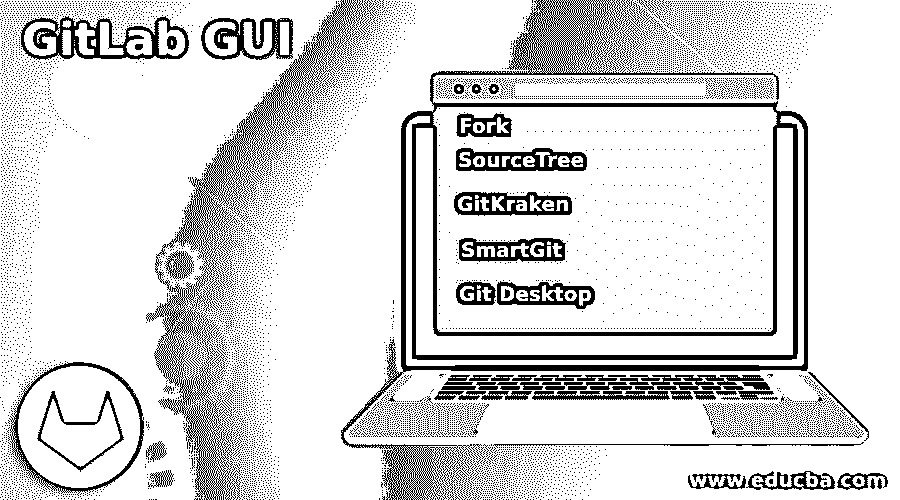
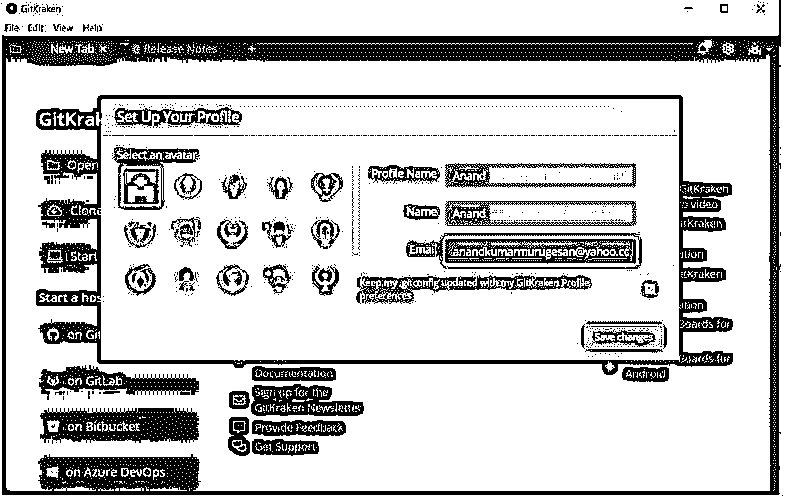
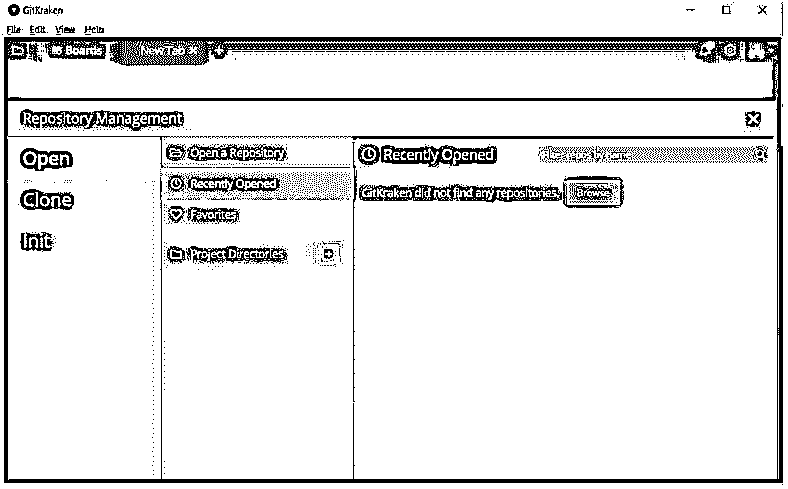
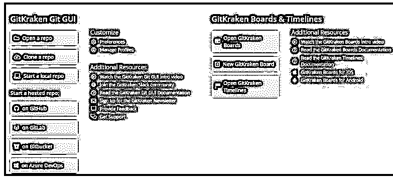

# GitLab GUI

> 原文：<https://www.educba.com/gitlab-gui/>

## 

## GitLab GUI 简介

以下文章提供了 GitLab GUI 的概要。基本上，GUI 是一个虚拟的用户友好界面，通过它，客户端和其他用户可以顺利地与系统连接。这些 GUI 有助于以复杂的方式将客户端与基础系统连接起来。这种类型的连接允许用户以更好的方式选择和使用 GUI 界面。GIT lab 还通过各种基于 GIT lab 的 GUI 支持其流程。这些图形用户界面为 Gitlab 系统带来了很大的灵活性，包括代码分段和其他相关流程。

### 如何使用 GIT GUI？

在了解如何使用基于 GIT 的 GUI 之前，让我们看看市场上主要的 GIT GUI 服务。

#### 1.叉

Fork 是市场上最著名的 GIT lab GUI 之一。它支持基于 Mac 和 Windows 的系统。它有助于解决与合并级别冲突相关的问题。这些解决方案是通过合并冲突解决程序设置和合并冲突帮助程序设置提出的。这就是 fork 如何帮助简化 GIT 合并过程的。有一个与 FORK 相关联的特定视图，称为责备视图，它将保存与。

<small>网页开发、编程语言、软件测试&其他</small>

#### 2.sourcetree(资源分区)

SourceTree 是市场上另一个非常著名的基于 git 的 GUI 服务。这是一个开源位客户端，这意味着它可以用于免费服务。同样，SourceTree 特别支持 Windows 和 Mac 系统。虽然这特别停留在描述方面，但可以提及的是，市场的关键操作系统可以由 SourceTree 总体支持。这是一个简单的系统，有助于以一种非常灵活的方式可视化和管理我们的代码库。

#### 3.基特克拉肯

GitKraken 是专门为基于 windows 的系统设计的 GUI 客户端，是 GIT 级 GUI 服务的另一个关键系统。它可以被认为是目前市场上顶级的 GIT GUI 客户端，因为除了它提供的支持之外，它还有能力支持主题级。GitKraken 有免费版、专业版和企业版，根据 GIT kraken 的版本，它所选择的功能有很大的不同。

#### 4.SmartGit

这是 GIT 客户端的一个图形级别，它支持多种类型的元素。SmartGit 允许对 Bigbucket、GitHub、GitLab 等各种方式的产品级存储库支持。它支持多种类型的元素，如 MacOS、Windows 甚至基于 Linux 的系统。主要优势还包括命令行 GIT 客户端、图形级合并、SSH 客户端，GIT 流还允许对文件进行比较，甚至可以执行文件合并。和 GitKraken 一样，SmartGit 也有两种版本，免费版和付费版

#### 5\. Git Desktop

这是工作流程的最简化版本。从开发的角度来看，它使得这个过程变得非常简单。它允许复杂地使用语法级别的高亮显示。这就是 GIT 桌面如何帮助简化 GIT 合并过程的。有一个与 GIT 相关联的特定视图，称为责备视图，它将保存与。

我们注意到了市场上最著名的 GIT 图形用户界面，在如何使用这个图形用户界面方面，这个过程涉及到获得完美的图形用户界面，它非常符合您所选择的需求。接下来，转到该 GUI 的产品页面，验证其条款和条件，然后下载相关产品。接下来，除了下载之外，设置产品特性以匹配 GUI 参数，这个过程有助于将 GUI 连接到所涉及的实际 GIT 代码。

以下是可以通过 GIT GUI 服务实现的一些关键流程:

*   执行 GIT 合并
*   将请求拉至 GIT 实验室
*   使用 GIT lab 重建基础
*   GIT 实验室项目的检验和准备过程

### GIT GUI 的创建

下面给出了连接 GIT lab 片段和 GIT GUI 的各种过程。这个过程假设我们已经在 GIT 中创建了一个存储库。让我们考虑一下 GITKRAKEN 的安装和连接设置。

*   从其官网下载 GitKraken 软件。

下载免费的 Git 客户端–Windows、Mac、Linux | GitKraken

*   下载产品后，确保将产品安装到本地系统上。
*   产品安装完成后，打开已安装的产品。
*   登录屏幕将出现在 GIT kraken 界面上。
*   确保通过您的 GIT hub 帐户登录 GITKraken。这是非常重要的一步，因为这次登录会自动将用户使用的 GIT hub 的所有存储库与新下载的 GITKraken 软件关联起来。
*   登录完成后，配置文件设置页面如下所示。

*   下一步是从本地系统添加特定的存储库，或者利用 GIT 中已经关联的存储库，以防与该存储库相关联的任何更改。下面是添加首选项的快照。

*   相应的存储库将被添加，从这里开始，存储库的定制屏幕将出现。从这里开始，用户可以选择继续进行与 GIT 流程相关的操作。

### 结论–git lab GUI

上面的文章展示了 GIT GUI 的作用，它展示了市场上可用的主要 GUI 以及如何使用这些 GUI。此外，它还提到了如何通过 GITKraken GUI 创建基于 GIT hub 的存储库。

### 推荐文章

这是一个 GitLab GUI 的指南。这里我们讨论一下入门，如何使用 GIT GUI？以及创建 GIT GUI 以便更好地理解。您也可以看看以下文章，了解更多信息–

1.  [GitLab 替代方案](https://www.educba.com/gitlab-alternative/)
2.  [什么是 GitLab](https://www.educba.com/what-is-gitlab/)
3.  [服务器类型](https://www.educba.com/server-types/)
4.  [ShareX 替代方案](https://www.educba.com/sharex-alternative/)

