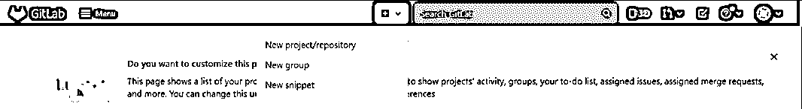
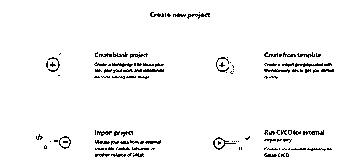
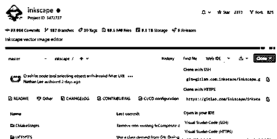
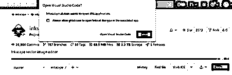

# GitLab 知识库

> 原文：<https://www.educba.com/gitlab-repository/>

## GitLab 资源库简介

Gitlab repository 被定义为 Gitlab 中的一个中心位置，在这里存储、管理和使用与正在处理的用例相关的代码集合，并且可以在协作工作方面用于各种应用程序，或者将代码库下载到另一个团队或小组。共享的代码会受到作为功能构建或错误修复的一部分所需的更改的影响，并分别通过使用版本控制进行跟踪。在正常的用例中，每个项目都有自己相应的存储库，在本文中，我们将在 Gitlab 中查看存储库的不同方面，并深入每个单独的元素。

### 什么是 GitLab 存储库？

到目前为止，我们已经将 Gitlab repository 的概念理解为存储、编辑和管理项目代码的中心位置。从 Gitlab 库的角度来看，有许多元素，即。创建存储库、向存储库添加文件、向存储库提交更改、克隆存储库。关于它们中的每一个，我们将在本文中详细讨论它们，并理解其中的利基思想。值得注意的一点是，Gitlab 允许存储库的最大大小为 10 GB，尽管对单个文件的大小没有限制，但要记住存储库的大小限制为 10 GB。

<small>网页开发、编程语言、软件测试&其他</small>

### 创建 GitLab 存储库

这是 Gitlab 资源库的第一个要素，没有它，资源库的概念就不存在，这个要素就是资源库的创建。有两种方法可以创建存储库，它们是:

1.  通过创建一个项目
2.  通过现有项目的工作

在下一段中，我们将查看创建 Gitlab 存储库的步骤，但在此之前，让我们先关注与创建存储库同等重要的其他几个要素。按照这些方法，我们可以维护和管理存储库。许多要素中的第一个是:

#### 将文件添加到存储库中

文件可以在各种场景下添加到存储库中，即创建项目时和项目创建后。当需要在创建项目后向存储库添加文件时，可以使用 web 编辑器，也可以使用命令行来完成。

#### 向存储库提交变更

一旦文件被添加到存储库中，下一步就是提交更改。提交变更是捕获项目阶段性变更的快照，被认为是项目的“安全”版本，除非明确要求，否则永远不会更改。提交更改后，用户可以执行诸如触发 CI/CD 管道之类的任务，或者交叉链接问题并将请求合并到提交中。它还可以用于挑选，这对于撤销任何更改非常有用。

#### 仓库克隆

Gitlab 中的存储库概念支持的另一个重要的实用工具是克隆存储库的想法。在下一段中，我们将深入了解如何克隆 Gitlab 存储库的细节。

### 如何创建和克隆 GitLab 存储库？

**通过创建项目来创建 Gitlab 存储库**:

1.  打开 Gitlab web UI，转到顶栏上的图标(就在搜索栏旁边，标为。
2.  单击图标并选择“新建项目/存储库”选项。
3.  将有多种选择，即。

*   创建空白项目:这就像一块空白的石板，一切都要从头开始。
*   从模板创建:存在多个模板，这使得开发人员在 Gitlab 中构建一些重复的东西更加简单，这样就不必重新发明轮子。
*   导入项目:
*   为外部存储库运行 CI/CD:

其中前 3 个可用于根据需要创建任何项目。

4.  需要根据上一步的选择填写所需的详细信息。

**在 Apple Xcode 中克隆存储库的步骤(适用于包含以下内容的项目。xcodeproj 或。xcworkspace)** :

1.  打开 Gitlab UI，进入项目的概述页面。
2.  需要单击一个名为 Clone 的可点击按钮。
3.  一旦出现提示，用户必须选择 Xcode。
4.  项目被克隆到电脑中，电脑会提示用户打开 Xcode。

**通过 Visual Studio 代码在 Gitlab 中克隆一个库**:

1.  打开 Gitlab UI，进入项目的概述页面。
2.  需要单击一个名为 Clone 的可点击按钮。
3.  一旦出现提示，用户必须选择用 Visual Studio 代码克隆。该选项存在于 HTTPS 或 SSH 方法中。
4.  在此之后，必须选择用于克隆项目的文件夹。

**通过 web UI 克隆存储库的步骤**:

1.  打开 Gitlab web UI。
2.  搜索并找到需要克隆的项目。
3.  有很多按钮，其中一个会以蓝色突出显示，命名为克隆。
4.  会有很多选择，即。用 SSH 克隆，用 HTTPS 克隆，Visual Studio Code (SSH)，Visual Studio Code (HTTPS)，在上面可以选择任何人来完成任务。前两个表示通过 CLI 进行克隆，后两个在单击时会打开 Visual Studio 代码应用程序。

**GitLab 库示例(截图)**

**通过 web UI 创建 Gitlab 存储库**

**通过 web UI 克隆 Gitlab 项目(通过打开应用程序)**

### 结论

通过这篇文章，我们已经了解了 Gitlab 存储库元素的各个方面，包括创建存储库所涉及的各个步骤。不仅如此，我们还看了关于在 Gitlab 中创建和克隆存储库的其他元素的简介和截图。

### 推荐文章

这是 GitLab 知识库的指南。在这里，我们讨论了 Gitlab 存储库元素的各个方面，包括各个步骤。您也可以看看以下文章，了解更多信息–

1.  [GitLab 替代方案](https://www.educba.com/gitlab-alternative/)
2.  [捷普斯特替代方案](https://www.educba.com/jhipster-alternatives/)
3.  [什么是 GitLab](https://www.educba.com/what-is-gitlab/)
4.  [捷普斯特替代方案](https://www.educba.com/jhipster-alternatives/)

