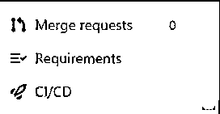
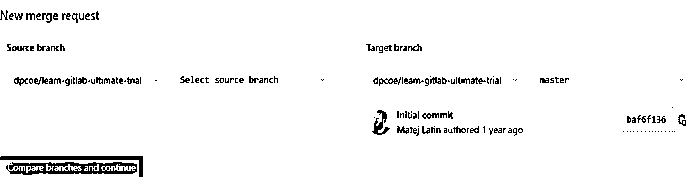
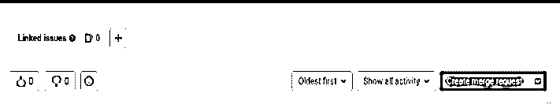

# gitlab 合并请求

> 原文：<https://www.educba.com/gitllab-merge-request/>

## GitlLab 合并请求的定义

Gitlab 向用户提供不同种类的功能，其中合并请求是 GitLab 提供的功能之一。基本上，GitLab merge request 是用来验证或者我们可以说它是用来检查一个分支中源代码的变化。通常 GitLab 合并请求会存储关于代码的所有详细信息，因为在打开合并请求后，我们可以看到合并请求前代码的所有更改，它还包括合并请求的描述、代码的内联审查以及代码和管道的所有更改等。

### 什么是 GitLab 合并请求？

合并请求(MR)是 GitLab 作为代码协同工作和重现控制的前提。当在基于 Git 的阶段工作时，您可以利用扩展过程来协作编写代码。一个库由它的缺省分支构成，缺省分支包含代码库的重要重现，从缺省分支中，您可以创建次要分支，也称为包含分支，以提出对代码库的更改，而无需将它们直接引入代码库的重要变体中。当与其他人一起工作时，延伸是特别重要的，不要在没有更早的审计、测试和认可的情况下，将变更直接推到默认的分支。

<small>网页开发、编程语言、软件测试&其他</small>

当您创建另一个组件分支、更改文档并将其推送到 GitLab 时，您可以选择创建一个合并需求，这基本上是一个将一个分支合并到另一个分支的请求。您将您的级数添加到的分支称为源分支，而您请求将您的级数混合到的分支称为目标分支。目标分支可以是默认分支，也可以是其他分支，这取决于您选择的风扇系统。

### 合并请求的步骤

现在让我们看看创建合并请求的不同步骤，如下所示。有不同的方法来合并请求，如下所示。
使用合并请求列表创建合并请求。
1。首先，我们需要选择菜单，在菜单中找到你想要的项目名称。
2。选择项目菜单后，我们需要选择合并请求命令。
3。在 GitLab 中，窗口在左侧菜单中选择一个新的合并请求。
4。之后，我们需要选择目标分支和源
5。在下一步中，我们需要填充必填字段，并根据您的要求创建合并请求。

下面的屏幕截图显示了如下的合并请求菜单。

选择合并请求后，我们可以看到下面的表格，并填写所需的详细信息，如下图所示。

现在让我们来看看第二种创建合并请求的方法，使用如下的问题。

如果您的推进工作流程要求每个合并分支都有一个问题，您可以直接从该问题开始创建一个分支，以加快周期。新的分支，以及随后的合并需求，将与此问题分开。一旦合并，工会征集关闭问题。您可以在问题描述下方看到一个创建合并请求下拉列表。

如果出现以下情况，创建混合需求按钮不会显示:

*   现在存在一个名称与相似的分支。
*   截至目前，该分支机构存在合并需求。
*   你的事业有一个正常的分叉关系。

要显示这个按钮，一个可能的解决方法是消除您的企业的 fork 关系。撤离后，分叉关系无法重新建立。这个项目目前不能选择获得或发送合并的招标到源项目或不同的分支。下面的屏幕截图显示了如下创建合并请求。

第三种方式，我们可以使用 fork 来创建合并请求，如下所示。

1.首先，我们需要选择我们想要的项目。
2。在选择了项目之后，我们需要选择分叉的存储库。
3。从左侧菜单中选择合并请求并创建新的合并请求。
4。选择源分支的下拉列表，并选择分叉的存储库作为源分支。
5。从目标分支下拉列表中，我们需要选择目标分支存储库。
6。之后，我们需要选择比较分支并继续按钮。
7。最后，我们需要提交合并请求。

### 删除合并请求

现在让我们看看如何删除合并请求，如下所示。

基本上，Gitlab 建议我们关闭合并请求而不是删除，因为删除后我们不能撤销合并请求。要删除合并请求，我们需要遵循如下相同的步骤。

1.首先，我们需要以用户身份登录 Gitlab，您的角色必须是项目所有者。如果您的角色不同，则我们无法执行删除合并请求。
2。在第二步中，我们需要选择合并请求选项，并选择编辑选项。
3。之后，我们需要滚动页面并选择删除合并请求选项。
下面的屏幕截图显示了如下的删除合并请求。

### 合并请求工作流

现在让我们看看合并请求的工作流程，以便更好地理解。

基本上，Gitlab 中的合并请求有两个工作流，如下所示。

#### 1.具有受保护分支的工作流:

在受保护的分支流中，每个人都在一个类似的 GitLab 项目中工作。

任务维护者得到维护者的工作，普通的设计者得到开发人员的工作。

维护人员将最终分支标记为“安全的”。

设计师将突出分支推给项目，并进行混合请求，以探索其元素分支，并将其融合到一个确定的分支中。

当然，只有从事维护工作的客户才能将变更融合到受保护的分支中。

**受保护流程的优势:**

*   它需要更少的集群。
*   开发人员需要单一的远程存储库。

保护流的缺点:

在这个工作流程中，我们需要为每个项目手动设置。

#### 2.带有分叉的工作流:

在这个工作流中，开发人员可以创建指定项目的分支，并且可以将特性分支推入分支。如果我们需要变更，那么我们需要创建合并请求。

**fork 工作流的优势:**

在这个工作流程中，我们自动获得所需的访问权限，这里我们还需要一些手动设置。

**fork 工作流的缺点:**

我们需要为项目保持我们的 fork 最新，所以我们需要 Gitlab 的更高级的技能。

### 结论

我们希望从这篇文章中你能更多地了解 Gitlab 合并请求。从上面的文章中，我们已经理解了 Gitlab 合并请求的基本思想，我们也看到了 Gitlab 合并请求的表示。从本文中，我们了解了如何以及何时使用 Gitlab 合并请求。

### 推荐文章

这是 GitLab 合并请求指南。这里我们讨论定义，什么是 GitLab 合并请求？，合并请求的步骤，以便更好地理解。您也可以看看以下文章，了解更多信息–

1.  [GitLab 替代方案](https://www.educba.com/gitlab-alternative/)
2.  [GitLab vs 吉拉](https://www.educba.com/gitlab-vs-jira/)
3.  [GitLab vs GitHub](https://www.educba.com/gitlab-vs-github/)
4.  [Gitlab CI vs Jenkins](https://www.educba.com/gitlab-ci-vs-jenkins/)

