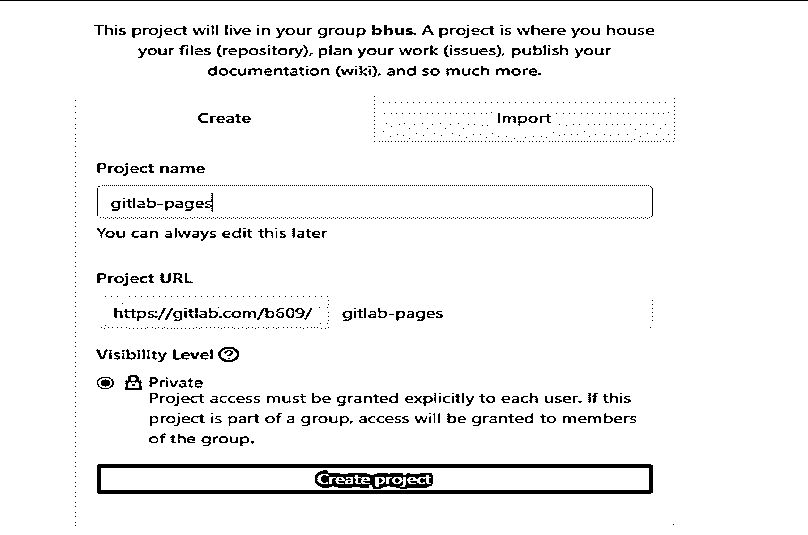
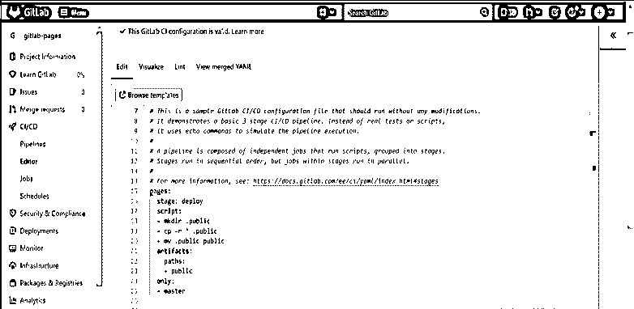
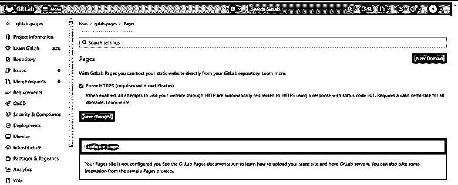
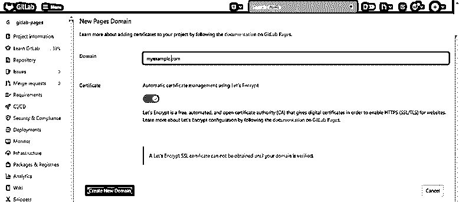
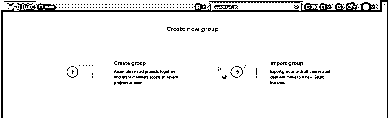
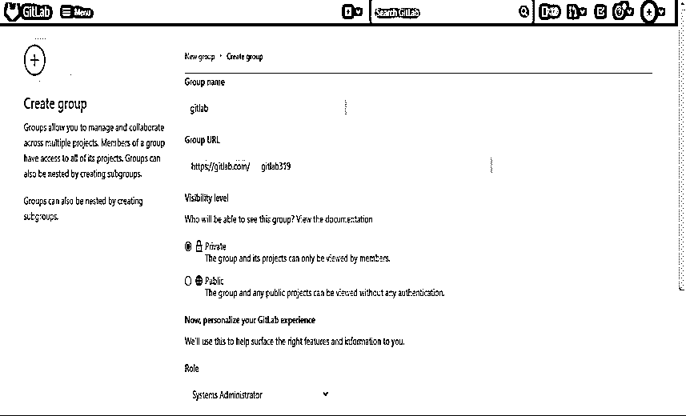
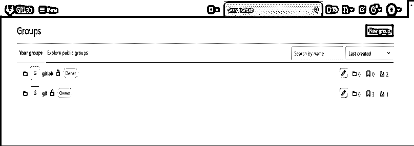

# GitLab 页面

> 原文：<https://www.educba.com/gitlab-pages/>

## GitLab 页面的定义

Gitlab 网页用于直接使用 gitlab 从资源库发布我们的静态网站，我们可以使用 gitlab 网页到任何个人网站。我们也可以将它用于商业网站，我们可以使用 HTML 或 SSG(静态站点生成器)和 gitlab 页面来发布我们的网站。我们正在为我们的项目、用户帐户和组创建网站，创建网站后，我们可以在自己的 gitlab 实例中托管我们的网站。我们还可以连接我们自己的 TLS 证书和我们在 gitlab 页面中使用的域。

### 什么是 GitLab 页面？

*   发布我们的网站使用网页，我们需要使用像雨果，竖琴，六角等 SSG。我们也可以在 GitLab 上发布用 JavaScript、HTML 或 CSS 编写的网站。
*   GitLab 页面基本上不支持服务器端的动态处理，要支持动态处理我们需要 php 或者 asp。
*   正如我们所知，它使用了 daemon gitlab 页面，HTTP 服务器是用 GO 语言编写的，它将支持自定义域和证书。
*   公布网站是很重要的。

### 创建一个静态网站

*   我们可以创建一个静态网站。下面是创建一个静态网站的步骤。

#### 1)创建一个新项目

*   首先，我们需要创建一个新项目。我们已经将项目名称创建为 gitlab-pages。
*   要在我们的仪表板上创建新项目，请单击“新建”按钮创建新项目。
*   点击新建项目后设置项目的路径。我们设定了一条道路

`https://gitlab.com/b609/ gitlab-pages`

<small>网页开发、编程语言、软件测试&其他</small>

*   将隐私设置为公共，这样任何人都可以访问我们的项目。我们也可以将隐私设置为私人，这样只有一个人可以访问项目。

#### 2)添加配置文件–

*   创建项目后，第二步是添加配置文件。我们必须编辑。gitlab-ci.yaml 文件。
*   我们正在创建普通的 HTML 网站，所以我们需要添加以下代码。gitlab-ci.yaml 文件。
*   要在配置文件中添加代码，我们需要先单击 CI/CD，然后打开它，我们需要编辑。gitlab-ci.yaml 文件。
*   在改变了文件的内容之后，我们需要提交我们已经改变的所有改变。
*   下面的代码是创建页面的工作名称，它告诉运行部署我们的网站。

**代码:**

`pages: -- crating job of pages
stage: deploy -- Deploy stage of gitlab pages
script: -- Start script section
- mkdir .public -- Create public directory
- cp -r * .public -- Copy public directory.
- mv .public public -- move public directory.
artifacts: -- Start of artifact section
paths: -- Parameter of artifact section.
- public -- Parameter of artifact section
only:
- master`

#### 3)上传我们的网站内容-

*   在配置文件中添加代码后，下一步是将内容推入远程项目。
*   在用静态生成器使用 GitLab 页面的时候，我们不需要上传目录。
*   如果假设我们已经上传了目录，它将在构建项目时显示重复的内容。

#### 4)添加我们的自定义域–

*   添加网站内容后的第四步是添加自定义域。我们可以建立一个新的域名如下。
*   首先点击设置，设置选项卡打开后点击页面。在页面中选择新域，为我们的项目创建一个新域。

*   打开页面后，点击“新域”选项卡，为我们的网站创建一个新域。

*   在上面的例子中，我们可以看到我们已经创建了一个新的域名 myexample.com。
*   我们可以为一个项目或网站创建多个域名。
*   如果假设我们有自己的 SSL 证书密钥，我们也可以在创建新域时添加相同的密钥。
*   我们还可以在创建新域时启用 https 安全连接到我们的项目。
    开始使用 gitlab 页面
    基本上有两种方法可以开始使用 gitlab 页面。第一种方法是使用现有项目，第二种方法是创建一个新项目。
    我们可以开始创建一个网站如下。

1)创建。gitlab-ci.yaml 文件——在这一步中，我们需要将 pages site 添加到现有项目中。
2)使用。gitlab-ci.yaml 模板–使用现有模板创建 gitlab 页面。
3)创建新项目–创建新项目以创建 gitlab 页面。
4)使用现有的项目-我们可以使用现有的项目来创建页面。
5)使用项目模板——使用现有模板文件创建一个新项目。
6)域名——我们需要创建我们网站的域名。我们可以为我们的项目创建单个或多个域名。
7) SSL 和 TLS 证书–我们需要向我们为项目创建的域名添加一个 SSL 或 TLS 证书。设置重定向——我们需要设置 https 重定向来打开下一页。静态和动态网站——我们可以使用静态网站创建 gitlab 网页。我们的项目也需要 SSG。

### 用户或组页面

在 GitLab 中，我们可以利用小组来管理我们的项目。我们可以管理组来管理我们项目的安全特权。如果假设我们已经授予某个人访问该组的权限，那么他可以访问所有项目。
使用群组，我们可以与群组中的所有成员交流。
我们可以创建如下群组。

*   下面我们要创建的组名为 gitlab。

菜单->组->创建新组

*   创建组后，我们可以看到 gitlab 组已创建。

*   我们还可以将用户添加到组中，我们可以在创建组时或稍后添加用户。

### 结论

GitLab 页面用于直接使用 GitLab 从存储库中发布我们的静态网站。我们可以将 gitlab 网页用于任何个人网站。基本上 gitlab 页面不支持服务器端的动态处理，要支持动态处理我们需要 php 或 asp。

### 推荐文章

这是 GitLab 页面的指南。这里我们讨论一下定义，什么是 GitLab 页面？，如何创建 GitLab 页面？为了更好的理解。您也可以看看以下文章，了解更多信息–

1.  [GitLab 替代方案](https://www.educba.com/gitlab-alternative/)
2.  [GitLab vs 吉拉](https://www.educba.com/gitlab-vs-jira/)
3.  [GitLab vs GitHub](https://www.educba.com/gitlab-vs-github/)
4.  [Gitlab CI vs Jenkins](https://www.educba.com/gitlab-ci-vs-jenkins/)

