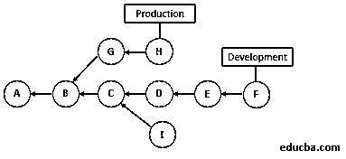
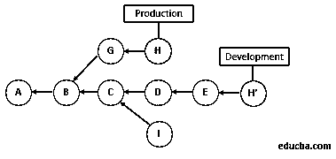
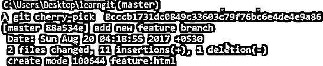

# GIT 樱桃采摘

> 原文：<https://www.educba.com/git-cherry-pick/>


## GIT 精选简介

下面的文章提供了 GIT Cherry-pick 的概要。许多程序员在世界的不同角落从事相同的软件开发。那么如何管理代码呢？他们会如何让别人明白自己做了哪些改变？如何提交代码并维护不同的版本？怎么合并代码？

为了解决这些问题，GIT 进入了开发领域。GIT 是一个优秀的源代码管理[SCM]和分布式版本控制系统。GIT 是由开发 Linux 内核的人 Linux Torvald 创建的。显然，它是一个开源工具，每个程序员都可以在世界任何地方为构建一个软件做出贡献。GIT 有很多特性。它可能有多个分支。开发人员可以在本地系统中创建自己的分支后编写代码，并将其与主分支或远程 GIT 存储库的其他分支合并。

<small>网页开发、编程语言、软件测试&其他</small>

### 什么是 GIT Cherry-pick？

想象一下，项目工作正在继续写一个关于手机历史和发展的剧本。因此，许多人都在从事同一个项目，并且都在独立工作。不过，最后大家的剧本还是会编在一起的。现在，成员 A 正在写苹果手机，突然意识到它可以更好。因此，他将此事告知了参与同一项目的其他团队成员。另一名成员 X 告诉他，他正在 Android 手机上写一个脚本，并要求成员 A 看看。

然后成员 A 查看了队友的剧本，发现有些部分是相同的，只是做了一些完美的修改。因此，他精选了这些修改，并将其粘贴到自己的脚本中。这和 cherry-pick 在 GIT 中所说的软件编码行业的事情是一样的。Git-cherry-pick 是一个强大的 Git 命令，cherry-pick 是一个从一个分支获取提交并将其应用到其他分支的过程。简而言之，开发人员可以在多个分支提交他们的代码。现在，一个开发人员应该在分支 A 中提交他的代码；然而，他错误地提交了 B 分支中的代码。此时，精选可以将提交切换回正确的分支。

在 Unix 系统中使用下面的命令[来了解 git-cherry-pick 的不同选项。](https://www.educba.com/what-is-unix/)

**代码:**

```
$man git-cherry-pick
```

精选命令的语法。

**语法:**

```
git cherry-pick [–edit] [-n] [-m parent-number] [-x] <commit>
```

### 当我们使用 GIT Cherry-pick。

Git-cherry-pick 是一个有用的工具；然而，这并不是最佳实践。

Git-cherry-pick 可用于以下场景:

*   为了在不同的分支中意外地进行提交时使其正确
*   首选传统合并
*   在现有提交中应用更改
*   重复提交
*   错误修复

### GIT Cherry-pick 如何工作？

在生产环境中的代码中发现了一个缺陷，需要实施修复。一旦实现了变更，并且修复了缺陷，现在是时候将代码变更带回开发环境中了，这样缺陷就不会在未来的生产环境中反复出现。

第一个选项是一个简单的 git 合并，如果可行的话，这是一个理想的解决方案。然而，其他的变更是在生产环境中完成的，在合并时这些变更不能被带回开发环境。在这种情况下，精选是正确的选择。

樱桃选择带来了承诺，这是作出了错误修复而已。它不会选择其他提交。

下面是一个例子:

**图 1:** G 和 H 是生产分支提交。a 到 F 开发分支提交。在生产部门发现问题。在 H 提交中开发了一个修复，它需要在开发分支中应用，但不要求应用提交 G。




**图 2:** 现在提交 H 是在开发分支上精选的，结果提交是 H’。提交 G 变更不包括在开发分支中。




### 如何用 GIT Cherry-pick 举例？

假设我们有两个分支[master 和 new _ feature][用于查看分支的命令-git branch]


我们错误地在 new_feature 分支中进行了提交[突出显示]。[用于查看提交日志的命令-git 日志]

但是，它应该只在主分支中。首先，在记事本中复制突出显示的 SHA。

****

**** 

现在我们将使用 git-cherry-pick 命令将这个提交转移到主分支；但是，在此之前，我们需要切换到主分支【用于切换分支的命令——git check out**<**branch name**>**


[command used git**–**cherry**–**pick **<**commit id**>**] [the same SHA should be paste which was copied to notepad earlier with git cherry-pick command]




现在我们可以看到相同的提交在主分支中可用[command used-git log]

### 要记住的重要事情

在团队工作中，使用 cherry-pick 需要记住三件事。

******1。标准化提交消息:**** 如果我们从公共分支中挑选，最好使用标准化提交消息和-x。**

 ****代码:**

```
git cherry-pick -x <commit-hash>
```

这样可以避免将来合并冲突。

****2。复制笔记:**** 有时，一些精选的笔记被记录下来，当我们运行精选时，笔记没有被复制。所以，还是用起来比较好。

**代码:**

```
git notes copy <from-commit-hash> <to-commit-hash>
```

****3。C**** ****herry-pick 多个提交，当它们仅仅是线性的时候:**** 我们想要像 G，H[图 1]一样挑选多个提交，如果它们是线性的，那么只使用下面的命令。

**代码:**

```
git cherry-pick G^..H
```

### 结论

假设我们想从一个不同的分支获取一个特定的提交，并应用到当前分支；以下是推荐的步骤。

*   首先找到需要挑选的提交散列。
*   转到目标分支。

**代码:**

```
git cherry-pick -x <commit-hash>
```

*   如果发生冲突，解决冲突。如果原始提交中有注释，则需要复制这些注释。

**代码:**

```
git notes copy <original-commit-hash> <new-commit-hash>
```

### 推荐文章

这是一个指南 GIT 樱桃采摘。在这里，我们讨论它的工作以及如何使用 git cherry-pick 的例子，以便更好地理解。您也可以阅读以下文章，了解更多信息——

1.  [去工具](https://www.educba.com/git-tools/)
2.  [Git 术语](https://www.educba.com/git-terminology/)
3.  [Git Checkout Tag](https://www.educba.com/git-checkout-tag/)
4.  [什么是 Git 分支？](https://www.educba.com/what-is-git-branch/)


**